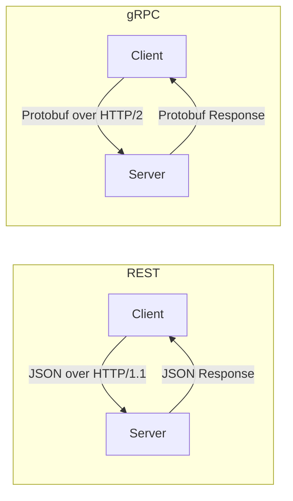

# How to Build a gRPC Service in Python and Deploy to Azure Container Apps

Author: [nawazdhandala](https://www.github.com/nawazdhandala)

Tags: gRPC, Python, Azure, Container Apps, Microservices, Docker, API

Description: Build a gRPC service in Python and deploy it to Azure Container Apps for high-performance inter-service communication.

---

REST APIs are everywhere, and for good reason - they are simple, well-understood, and work with any HTTP client. But when you need high-performance communication between services, REST starts showing its limitations. JSON serialization is slow compared to binary formats. HTTP/1.1 lacks multiplexing. And without a schema, API contracts drift silently. gRPC solves all of these. It uses Protocol Buffers for fast binary serialization, HTTP/2 for multiplexed connections, and enforces contracts through `.proto` files. Python has excellent gRPC support through the `grpcio` library, and Azure Container Apps can host gRPC services with proper HTTP/2 support.

This guide builds a gRPC service in Python and deploys it to Azure Container Apps.

## How gRPC Differs from REST



gRPC is typically 5-10x faster than REST for the same payload due to binary serialization and HTTP/2 connection reuse. It also supports streaming - server-side, client-side, and bidirectional - which REST cannot do natively.

## Prerequisites

- Python 3.11 or later
- Docker installed
- Azure CLI with the containerapp extension
- Azure account
- Basic Protocol Buffers knowledge

## Project Setup

```bash
# Create the project
mkdir grpc-azure-demo && cd grpc-azure-demo
python -m venv venv
source venv/bin/activate

# Install gRPC dependencies
pip install grpcio grpcio-tools grpcio-reflection protobuf
```

## Defining the Protocol Buffer Schema

Create the `.proto` file that defines your service contract:

```protobuf
// protos/inventory.proto - Service definition for an inventory management system
syntax = "proto3";

package inventory;

// The inventory management service
service InventoryService {
  // Get a single product by ID
  rpc GetProduct (GetProductRequest) returns (Product);

  // List products with optional filtering
  rpc ListProducts (ListProductsRequest) returns (ListProductsResponse);

  // Create a new product
  rpc CreateProduct (CreateProductRequest) returns (Product);

  // Update product stock
  rpc UpdateStock (UpdateStockRequest) returns (Product);

  // Stream stock level changes in real time
  rpc WatchStockChanges (WatchStockRequest) returns (stream StockUpdate);

  // Bulk import products via client streaming
  rpc BulkImport (stream CreateProductRequest) returns (BulkImportResponse);
}

// Request and response messages

message GetProductRequest {
  string id = 1;
}

message ListProductsRequest {
  string category = 1;       // Filter by category (empty for all)
  int32 page = 2;            // Page number (1-based)
  int32 page_size = 3;       // Items per page
  bool in_stock_only = 4;    // Only show items with stock > 0
}

message ListProductsResponse {
  repeated Product products = 1;
  int32 total_count = 2;
  int32 page = 3;
  int32 page_size = 4;
}

message CreateProductRequest {
  string name = 1;
  string sku = 2;
  string category = 3;
  double price = 4;
  int32 stock_quantity = 5;
  string description = 6;
}

message UpdateStockRequest {
  string id = 1;
  int32 quantity_change = 2;  // Positive to add, negative to remove
  string reason = 3;          // Reason for the stock change
}

message WatchStockRequest {
  string category = 1;       // Watch a specific category (empty for all)
  int32 threshold = 2;       // Only notify when stock falls below this level
}

message StockUpdate {
  string product_id = 1;
  string product_name = 2;
  int32 old_quantity = 3;
  int32 new_quantity = 4;
  string reason = 5;
  string timestamp = 6;
}

message BulkImportResponse {
  int32 imported_count = 1;
  int32 failed_count = 2;
  repeated string errors = 3;
}

message Product {
  string id = 1;
  string name = 2;
  string sku = 3;
  string category = 4;
  double price = 5;
  int32 stock_quantity = 6;
  string description = 7;
  string created_at = 8;
  string updated_at = 9;
}
```

Generate the Python code from the proto file:

```bash
# Generate Python gRPC code
python -m grpc_tools.protoc \
  -I protos \
  --python_out=generated \
  --pyi_out=generated \
  --grpc_python_out=generated \
  protos/inventory.proto
```

This generates `inventory_pb2.py` (message classes), `inventory_pb2.pyi` (type stubs), and `inventory_pb2_grpc.py` (service stubs).

## Implementing the gRPC Server

```python
# server.py - gRPC server implementation
import grpc
from concurrent import futures
from datetime import datetime, timezone
import uuid
import asyncio
import time
import logging

from generated import inventory_pb2
from generated import inventory_pb2_grpc
from grpc_reflection.v1alpha import reflection

logging.basicConfig(level=logging.INFO)
logger = logging.getLogger(__name__)

# In-memory product store (use a database in production)
products = {}
stock_watchers = []


def seed_data():
    """Populate initial product data."""
    sample_products = [
        ("Widget A", "WDG-001", "Widgets", 9.99, 100, "Standard widget"),
        ("Widget B", "WDG-002", "Widgets", 14.99, 50, "Premium widget"),
        ("Gadget X", "GDG-001", "Gadgets", 29.99, 75, "Multi-purpose gadget"),
        ("Tool Y", "TL-001", "Tools", 49.99, 30, "Professional grade tool"),
    ]
    now = datetime.now(timezone.utc).isoformat()

    for name, sku, category, price, stock, desc in sample_products:
        pid = str(uuid.uuid4())
        products[pid] = inventory_pb2.Product(
            id=pid, name=name, sku=sku, category=category,
            price=price, stock_quantity=stock, description=desc,
            created_at=now, updated_at=now,
        )


class InventoryServicer(inventory_pb2_grpc.InventoryServiceServicer):
    """Implementation of the InventoryService gRPC service."""

    def GetProduct(self, request, context):
        """Return a single product by ID."""
        product = products.get(request.id)
        if not product:
            context.set_code(grpc.StatusCode.NOT_FOUND)
            context.set_details(f"Product {request.id} not found")
            return inventory_pb2.Product()

        logger.info(f"GetProduct: {product.name}")
        return product

    def ListProducts(self, request, context):
        """Return a filtered and paginated list of products."""
        filtered = list(products.values())

        # Apply filters
        if request.category:
            filtered = [p for p in filtered if p.category == request.category]
        if request.in_stock_only:
            filtered = [p for p in filtered if p.stock_quantity > 0]

        total = len(filtered)

        # Apply pagination
        page = max(request.page, 1)
        page_size = min(max(request.page_size, 1), 100)
        start = (page - 1) * page_size
        end = start + page_size
        paginated = filtered[start:end]

        return inventory_pb2.ListProductsResponse(
            products=paginated,
            total_count=total,
            page=page,
            page_size=page_size,
        )

    def CreateProduct(self, request, context):
        """Create a new product."""
        # Check for duplicate SKU
        for p in products.values():
            if p.sku == request.sku:
                context.set_code(grpc.StatusCode.ALREADY_EXISTS)
                context.set_details(f"Product with SKU {request.sku} already exists")
                return inventory_pb2.Product()

        now = datetime.now(timezone.utc).isoformat()
        product = inventory_pb2.Product(
            id=str(uuid.uuid4()),
            name=request.name,
            sku=request.sku,
            category=request.category,
            price=request.price,
            stock_quantity=request.stock_quantity,
            description=request.description,
            created_at=now,
            updated_at=now,
        )

        products[product.id] = product
        logger.info(f"Created product: {product.name} ({product.sku})")
        return product

    def UpdateStock(self, request, context):
        """Update product stock and notify watchers."""
        product = products.get(request.id)
        if not product:
            context.set_code(grpc.StatusCode.NOT_FOUND)
            context.set_details(f"Product {request.id} not found")
            return inventory_pb2.Product()

        old_quantity = product.stock_quantity
        new_quantity = old_quantity + request.quantity_change

        if new_quantity < 0:
            context.set_code(grpc.StatusCode.FAILED_PRECONDITION)
            context.set_details("Insufficient stock")
            return inventory_pb2.Product()

        # Create updated product (protobuf messages are immutable)
        now = datetime.now(timezone.utc).isoformat()
        updated = inventory_pb2.Product(
            id=product.id, name=product.name, sku=product.sku,
            category=product.category, price=product.price,
            stock_quantity=new_quantity, description=product.description,
            created_at=product.created_at, updated_at=now,
        )
        products[product.id] = updated

        # Notify stock watchers
        update = inventory_pb2.StockUpdate(
            product_id=product.id,
            product_name=product.name,
            old_quantity=old_quantity,
            new_quantity=new_quantity,
            reason=request.reason,
            timestamp=now,
        )

        for watcher in stock_watchers:
            watcher.append(update)

        logger.info(
            f"Stock updated: {product.name} {old_quantity} -> {new_quantity} ({request.reason})"
        )
        return updated

    def WatchStockChanges(self, request, context):
        """Stream stock level changes to the client."""
        watcher_queue = []
        stock_watchers.append(watcher_queue)

        logger.info(f"New stock watcher connected (category: {request.category or 'all'})")

        try:
            while context.is_active():
                if watcher_queue:
                    update = watcher_queue.pop(0)
                    # Apply category filter if specified
                    if request.category:
                        product = products.get(update.product_id)
                        if product and product.category != request.category:
                            continue
                    # Apply threshold filter
                    if request.threshold > 0 and update.new_quantity >= request.threshold:
                        continue
                    yield update
                else:
                    time.sleep(0.5)
        finally:
            stock_watchers.remove(watcher_queue)
            logger.info("Stock watcher disconnected")

    def BulkImport(self, request_iterator, context):
        """Import multiple products via client streaming."""
        imported = 0
        failed = 0
        errors = []

        for request in request_iterator:
            try:
                # Reuse CreateProduct logic
                product = self.CreateProduct(request, context)
                if product.id:
                    imported += 1
                else:
                    failed += 1
                    errors.append(f"Failed to import {request.sku}")
            except Exception as e:
                failed += 1
                errors.append(f"Error importing {request.sku}: {str(e)}")

        logger.info(f"Bulk import complete: {imported} imported, {failed} failed")
        return inventory_pb2.BulkImportResponse(
            imported_count=imported,
            failed_count=failed,
            errors=errors,
        )


def serve():
    """Start the gRPC server."""
    server = grpc.server(
        futures.ThreadPoolExecutor(max_workers=10),
        options=[
            # Set maximum message sizes
            ('grpc.max_send_message_length', 50 * 1024 * 1024),
            ('grpc.max_receive_message_length', 50 * 1024 * 1024),
        ],
    )

    # Register the service
    inventory_pb2_grpc.add_InventoryServiceServicer_to_server(
        InventoryServicer(), server
    )

    # Enable server reflection for debugging tools
    service_names = (
        inventory_pb2.DESCRIPTOR.services_by_name['InventoryService'].full_name,
        reflection.SERVICE_NAME,
    )
    reflection.enable_server_reflection(service_names, server)

    # Seed initial data
    seed_data()

    # Listen on all interfaces (important for containers)
    port = 50051
    server.add_insecure_port(f'[::]:{port}')
    server.start()
    logger.info(f"gRPC server started on port {port}")

    # Block until shutdown
    server.wait_for_termination()


if __name__ == '__main__':
    serve()
```

## Creating the Dockerfile

```dockerfile
# Dockerfile - Multi-stage build for the gRPC service
FROM python:3.11-slim AS builder

WORKDIR /app

# Install dependencies
COPY requirements.txt .
RUN pip install --no-cache-dir -r requirements.txt

# Copy proto files and generate code
COPY protos/ protos/
RUN mkdir -p generated && \
    python -m grpc_tools.protoc \
    -I protos \
    --python_out=generated \
    --pyi_out=generated \
    --grpc_python_out=generated \
    protos/inventory.proto && \
    touch generated/__init__.py

# Production stage
FROM python:3.11-slim

WORKDIR /app

# Copy installed packages from builder
COPY --from=builder /usr/local/lib/python3.11/site-packages /usr/local/lib/python3.11/site-packages
COPY --from=builder /usr/local/bin /usr/local/bin

# Copy generated code and server
COPY --from=builder /app/generated ./generated
COPY server.py .

# Run as non-root user
RUN useradd -m appuser
USER appuser

# Expose the gRPC port
EXPOSE 50051

# Start the server
CMD ["python", "server.py"]
```

Create `requirements.txt`:

```
grpcio==1.60.0
grpcio-tools==1.60.0
grpcio-reflection==1.60.0
protobuf==4.25.1
```

## Deploying to Azure Container Apps

```bash
# Install the container apps extension
az extension add --name containerapp --upgrade

# Create resources
az group create --name grpc-demo-rg --location eastus

az containerapp env create \
  --name grpc-env \
  --resource-group grpc-demo-rg \
  --location eastus

# Create a container registry
az acr create \
  --name grpcdemoregistry \
  --resource-group grpc-demo-rg \
  --sku Basic \
  --admin-enabled true

# Build and push the image
az acr login --name grpcdemoregistry
docker build -t grpcdemoregistry.azurecr.io/grpc-inventory:latest .
docker push grpcdemoregistry.azurecr.io/grpc-inventory:latest

# Get ACR credentials
ACR_PASSWORD=$(az acr credential show --name grpcdemoregistry --query "passwords[0].value" --output tsv)

# Create the Container App with HTTP/2 transport
az containerapp create \
  --name grpc-inventory-service \
  --resource-group grpc-demo-rg \
  --environment grpc-env \
  --image grpcdemoregistry.azurecr.io/grpc-inventory:latest \
  --registry-server grpcdemoregistry.azurecr.io \
  --registry-username grpcdemoregistry \
  --registry-password "$ACR_PASSWORD" \
  --target-port 50051 \
  --ingress external \
  --transport http2 \
  --min-replicas 1 \
  --max-replicas 5 \
  --cpu 0.5 \
  --memory 1.0Gi
```

The key setting is `--transport http2`. Without this, Azure Container Apps defaults to HTTP/1.1, which does not support gRPC.

## Building a gRPC Client

```python
# client.py - gRPC client for testing
import grpc
from generated import inventory_pb2
from generated import inventory_pb2_grpc


def run():
    # Connect to the gRPC service
    channel = grpc.insecure_channel('localhost:50051')
    stub = inventory_pb2_grpc.InventoryServiceStub(channel)

    # List all products
    response = stub.ListProducts(
        inventory_pb2.ListProductsRequest(page=1, page_size=10)
    )
    print(f"Found {response.total_count} products:")
    for product in response.products:
        print(f"  {product.name} - ${product.price} ({product.stock_quantity} in stock)")

    # Create a new product
    new_product = stub.CreateProduct(
        inventory_pb2.CreateProductRequest(
            name="Super Gadget",
            sku="SG-001",
            category="Gadgets",
            price=99.99,
            stock_quantity=25,
            description="The ultimate gadget",
        )
    )
    print(f"\nCreated: {new_product.name} (ID: {new_product.id})")


if __name__ == '__main__':
    run()
```

## Wrapping Up

gRPC with Python and Azure Container Apps gives you high-performance inter-service communication in a managed environment. Protocol Buffers enforce API contracts between services, HTTP/2 provides efficient multiplexed connections, and Azure Container Apps handles scaling and HTTPS termination. The server reflection feature makes it easy to explore the API during development, and the streaming support enables real-time data flows that REST cannot match. For microservice architectures where services communicate frequently and latency matters, gRPC is a significant upgrade over REST.
