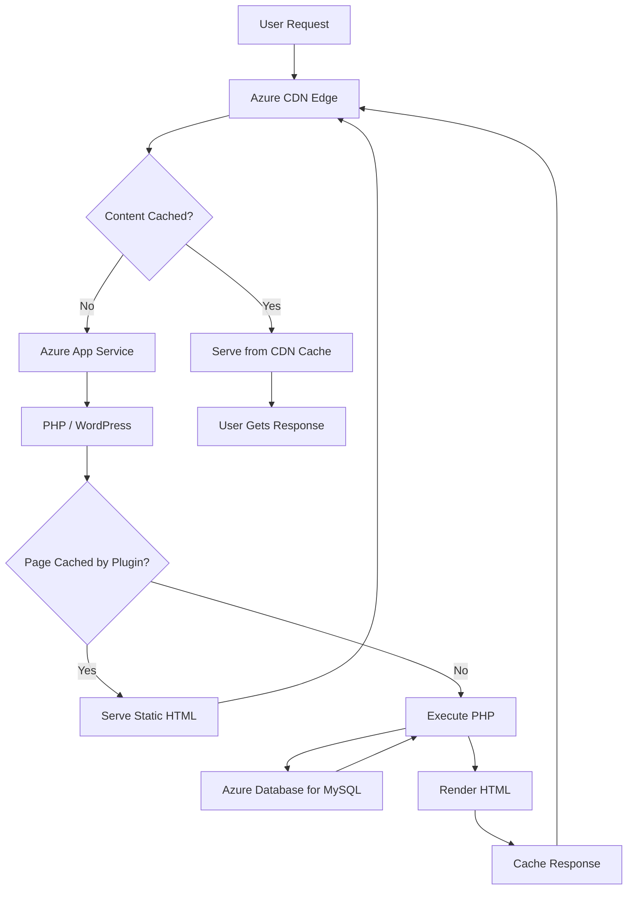

# How to Deploy a High-Performance WordPress Site on Azure App Service with Azure CDN

Author: [nawazdhandala](https://www.github.com/nawazdhandala)

Tags: Azure, WordPress, App Service, CDN, Performance, Web Hosting

Description: Deploy a fast WordPress site on Azure App Service and accelerate it with Azure CDN for global content delivery and optimal page load times.

---

WordPress powers a huge percentage of the web, but it is not exactly known for blazing performance out of the box. A stock WordPress installation on a basic hosting plan can easily take 3-5 seconds to render a page. By deploying WordPress on Azure App Service and putting Azure CDN in front of it, you can cut that down significantly - often under a second for cached content.

This guide covers the full setup: deploying WordPress on App Service, configuring the database, setting up Azure CDN, and tuning everything for performance.

## Creating the App Service Plan

Azure App Service runs your WordPress PHP application in a managed environment. You do not need to manage the underlying server, patching, or scaling.

```bash
# Create a resource group
az group create --name rg-wordpress --location eastus

# Create an App Service plan (B2 is a good starting point for WordPress)
az appservice plan create \
  --name plan-wordpress \
  --resource-group rg-wordpress \
  --location eastus \
  --sku B2 \
  --is-linux

# Create the web app with PHP 8.2 runtime
az webapp create \
  --name my-wordpress-site \
  --resource-group rg-wordpress \
  --plan plan-wordpress \
  --runtime "PHP:8.2"
```

I recommend at least a B2 plan for WordPress. The B1 plan works for testing, but WordPress with a caching plugin and a moderate traffic load needs at least 2 cores and 3.5 GB of RAM.

## Setting Up the Database

WordPress needs MySQL. Azure Database for MySQL Flexible Server is the managed option that works well here.

```bash
# Create a MySQL Flexible Server
az mysql flexible-server create \
  --name wp-mysql-server \
  --resource-group rg-wordpress \
  --location eastus \
  --admin-user wpadmin \
  --admin-password 'YourStr0ngPassw0rd!' \
  --sku-name Standard_B1ms \
  --tier Burstable \
  --storage-size 32 \
  --version 8.0

# Create the WordPress database
az mysql flexible-server db create \
  --resource-group rg-wordpress \
  --server-name wp-mysql-server \
  --database-name wordpress

# Allow Azure services to connect (needed for App Service)
az mysql flexible-server firewall-rule create \
  --resource-group rg-wordpress \
  --name wp-mysql-server \
  --rule-name AllowAzureServices \
  --start-ip-address 0.0.0.0 \
  --end-ip-address 0.0.0.0
```

## Deploying WordPress

There are several ways to get WordPress onto App Service. The simplest is to use the built-in WordPress on App Service offering from the Azure Marketplace. But if you want more control, you can deploy manually.

Download WordPress and deploy it via Git or ZIP deploy.

```bash
# Download WordPress
curl -O https://wordpress.org/latest.tar.gz
tar -xzf latest.tar.gz

# Create wp-config.php with Azure MySQL connection details
cp wordpress/wp-config-sample.php wordpress/wp-config.php
```

Edit the wp-config.php to use your Azure MySQL connection details.

```php
// wp-config.php - Database settings for Azure MySQL
define('DB_NAME', 'wordpress');
define('DB_USER', 'wpadmin');
define('DB_PASSWORD', 'YourStr0ngPassw0rd!');
define('DB_HOST', 'wp-mysql-server.mysql.database.azure.com');
define('DB_CHARSET', 'utf8mb4');
define('DB_COLLATE', '');

// Use SSL for MySQL connections on Azure
define('MYSQL_CLIENT_FLAGS', MYSQLI_CLIENT_SSL);

// Force HTTPS since we will use CDN with HTTPS
define('FORCE_SSL_ADMIN', true);

// If behind a reverse proxy (CDN), trust the forwarded headers
if (isset($_SERVER['HTTP_X_FORWARDED_PROTO']) &&
    $_SERVER['HTTP_X_FORWARDED_PROTO'] === 'https') {
    $_SERVER['HTTPS'] = 'on';
}
```

Deploy via ZIP.

```bash
# Create a ZIP file of the WordPress directory
cd wordpress && zip -r ../wordpress.zip . && cd ..

# Deploy to App Service
az webapp deploy \
  --resource-group rg-wordpress \
  --name my-wordpress-site \
  --src-path wordpress.zip \
  --type zip
```

## Configuring Azure CDN

Now let us put Azure CDN in front of the App Service to cache static assets and accelerate page delivery worldwide.

```bash
# Create a CDN profile (Standard Microsoft tier is cost-effective)
az cdn profile create \
  --name cdn-wordpress \
  --resource-group rg-wordpress \
  --location eastus \
  --sku Standard_Microsoft

# Create a CDN endpoint pointing to your App Service
az cdn endpoint create \
  --name wp-cdn-endpoint \
  --resource-group rg-wordpress \
  --profile-name cdn-wordpress \
  --origin my-wordpress-site.azurewebsites.net \
  --origin-host-header my-wordpress-site.azurewebsites.net \
  --enable-compression true \
  --content-types-to-compress "text/html" "text/css" "application/javascript" "text/javascript" "application/json" "image/svg+xml"
```

The CDN endpoint URL will be something like `wp-cdn-endpoint.azureedge.net`. You can also configure a custom domain.

```bash
# Add a custom domain to the CDN endpoint
az cdn custom-domain create \
  --name www \
  --resource-group rg-wordpress \
  --profile-name cdn-wordpress \
  --endpoint-name wp-cdn-endpoint \
  --hostname www.yourdomain.com

# Enable HTTPS on the custom domain
az cdn custom-domain enable-https \
  --name www \
  --resource-group rg-wordpress \
  --profile-name cdn-wordpress \
  --endpoint-name wp-cdn-endpoint
```

## Configuring CDN Caching Rules

By default, CDN respects the cache headers from your origin (App Service). WordPress does not send great cache headers by default, so you should configure caching rules on the CDN.

```bash
# Set global caching rules - cache everything for 1 day by default
az cdn endpoint rule add \
  --resource-group rg-wordpress \
  --profile-name cdn-wordpress \
  --endpoint-name wp-cdn-endpoint \
  --order 1 \
  --rule-name "CacheStaticAssets" \
  --match-variable UrlFileExtension \
  --operator Contains \
  --match-values "css" "js" "jpg" "jpeg" "png" "gif" "svg" "woff" "woff2" "ttf" \
  --action-name CacheExpiration \
  --cache-behavior Override \
  --cache-duration "7.00:00:00"
```

For dynamic pages, you want shorter cache durations or bypass caching entirely for logged-in users.

## Installing a Caching Plugin

On the WordPress side, install a caching plugin like WP Super Cache or W3 Total Cache. These plugins generate static HTML files for your pages, which the CDN can then serve without hitting PHP at all.

In your wp-config.php, add the page cache configuration.

```php
// Enable WordPress page caching
define('WP_CACHE', true);

// Increase PHP memory limit for better performance
define('WP_MEMORY_LIMIT', '256M');
define('WP_MAX_MEMORY_LIMIT', '512M');
```

## Performance Architecture

Here is how the full stack works together.



With this architecture, most requests are served directly from the CDN edge location closest to the user. Cache misses go to App Service, where the caching plugin often serves a static HTML file without touching the database. Only truly dynamic requests (logged-in users, admin pages, form submissions) hit PHP and MySQL.

## App Service Configuration Tweaks

Add some application settings to optimize PHP on App Service.

```bash
# Configure PHP settings for WordPress performance
az webapp config appsettings set \
  --name my-wordpress-site \
  --resource-group rg-wordpress \
  --settings \
    PHP_INI_SCAN_DIR="/usr/local/etc/php/conf.d:/home/site/ini" \
    WEBSITE_DYNAMIC_CACHE=0

# Enable HTTP/2
az webapp config set \
  --name my-wordpress-site \
  --resource-group rg-wordpress \
  --http20-enabled true \
  --min-tls-version 1.2
```

Create a custom PHP ini file for performance tuning.

```ini
; /home/site/ini/settings.ini
; OPcache settings for WordPress performance
opcache.enable=1
opcache.memory_consumption=256
opcache.max_accelerated_files=10000
opcache.validate_timestamps=0
opcache.revalidate_freq=0

; Increase upload limits
upload_max_filesize=64M
post_max_size=64M
max_execution_time=120
memory_limit=256M
```

## Monitoring Performance

Use Azure Application Insights to monitor your WordPress performance. You can track page load times, database query performance, and CDN hit rates.

The CDN analytics in the Azure portal show you cache hit ratios, bandwidth savings, and geographic distribution of requests. Aim for a CDN cache hit ratio above 80% for a content-heavy WordPress site.

## Scaling for Traffic Spikes

App Service makes scaling straightforward. Enable autoscaling to handle traffic spikes.

```bash
# Enable autoscaling based on CPU usage
az monitor autoscale create \
  --resource-group rg-wordpress \
  --resource plan-wordpress \
  --resource-type Microsoft.Web/serverfarms \
  --name wp-autoscale \
  --min-count 1 \
  --max-count 5 \
  --count 1

# Add a scale-out rule when CPU exceeds 70%
az monitor autoscale rule create \
  --resource-group rg-wordpress \
  --autoscale-name wp-autoscale \
  --condition "Percentage CPU > 70 avg 5m" \
  --scale out 1
```

## Wrapping Up

Azure App Service with CDN gives you a WordPress hosting setup that rivals dedicated WordPress hosting platforms. The CDN handles global distribution and static asset caching, the caching plugin generates static HTML to minimize PHP execution, and App Service provides managed scaling. The result is a WordPress site that loads fast worldwide without the operational overhead of managing your own servers. For most WordPress sites, this architecture handles traffic well into the hundreds of thousands of monthly visitors without breaking a sweat.
