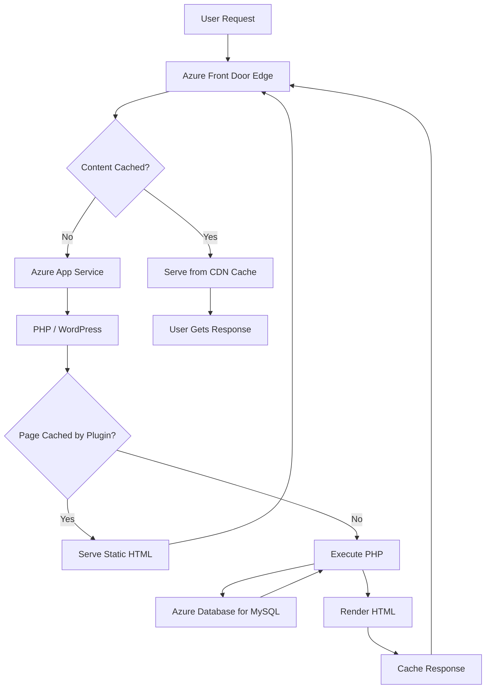

# How to Deploy a High-Performance WordPress Site on Azure App Service

Author: [nawazdhandala](https://www.github.com/nawazdhandala)

Tags: Azure, WordPress, App Service, CDN, Performance, Web Hosting

Description: Deploy a fast WordPress site on Azure App Service and accelerate it with Azure CDN for global content delivery and optimal page load times.

---

WordPress powers a huge percentage of the web, but it is not exactly known for blazing performance out of the box. A stock WordPress installation on a basic hosting plan can easily take 3-5 seconds to render a page. By deploying WordPress on Azure App Service and putting Azure Front Door in front of it as the CDN layer, you can cut that down significantly - often under a second for cached content.

This guide covers the full setup: deploying WordPress on App Service, configuring the database, setting up Azure Front Door, and tuning everything for performance.

## Creating the App Service Plan

Azure App Service runs your WordPress PHP application in a managed environment. You do not need to manage the underlying server, patching, or scaling.

```bash
# Create a resource group

az group create --name rg-wordpress --location eastus

# Create an App Service plan (S2 is a good starting point for WordPress with autoscale)
az appservice plan create \
  --name plan-wordpress \
  --resource-group rg-wordpress \
  --location eastus \
  --sku S2 \
  --is-linux

# Create the web app with PHP 8.2 runtime
az webapp create \
  --name my-wordpress-site \
  --resource-group rg-wordpress \
  --plan plan-wordpress \
  --runtime "PHP:8.2"
```

I recommend at least an S2 plan for WordPress if you want autoscale. The S1 plan works for testing, but WordPress with a caching plugin and a moderate traffic load needs at least 2 cores and 3.5 GB of RAM.

## Setting Up the Database

WordPress needs MySQL. Azure Database for MySQL Flexible Server is the managed option that works well here.

```bash
# Create a MySQL Flexible Server
az mysql flexible-server create \
  --name wp-mysql-server \
  --resource-group rg-wordpress \
  --location eastus \
  --admin-user wpadmin \
  --admin-password 'YourStr0ngPassw0rd!' \
  --sku-name Standard_B1ms \
  --tier Burstable \
  --storage-size 32 \
  --version 8.0

# Create the WordPress database
az mysql flexible-server db create \
  --resource-group rg-wordpress \
  --server-name wp-mysql-server \
  --database-name wordpress

# Allow Azure services to connect for this public-access example
az mysql flexible-server firewall-rule create \
  --resource-group rg-wordpress \
  --name wp-mysql-server \
  --rule-name AllowAzureServices \
  --start-ip-address 0.0.0.0 \
  --end-ip-address 0.0.0.0
```

## Deploying WordPress

There are several ways to get WordPress onto App Service. The simplest is to use the built-in WordPress on App Service offering from the Azure Marketplace. But if you want more control, you can deploy manually.

Download WordPress and deploy it via Git or ZIP deploy.

```bash
# Download WordPress
curl -O https://wordpress.org/latest.tar.gz
tar -xzf latest.tar.gz

# Create wp-config.php with Azure MySQL connection details
cp wordpress/wp-config-sample.php wordpress/wp-config.php
```

Edit the wp-config.php to use your Azure MySQL connection details.

```php
// wp-config.php - Database settings for Azure MySQL
define('DB_NAME', 'wordpress');
define('DB_USER', 'wpadmin');
define('DB_PASSWORD', 'YourStr0ngPassw0rd!');
define('DB_HOST', 'wp-mysql-server.mysql.database.azure.com');
define('DB_CHARSET', 'utf8mb4');
define('DB_COLLATE', '');

// Use SSL for MySQL connections on Azure
define('MYSQL_CLIENT_FLAGS', MYSQLI_CLIENT_SSL);

// Force HTTPS since we will use CDN with HTTPS
define('FORCE_SSL_ADMIN', true);

// If behind a reverse proxy (CDN), trust the forwarded headers
if (isset($_SERVER['HTTP_X_FORWARDED_PROTO']) &&
    $_SERVER['HTTP_X_FORWARDED_PROTO'] === 'https') {
    $_SERVER['HTTPS'] = 'on';
}
```

Deploy via ZIP.

```bash
# Create a ZIP file of the WordPress directory
cd wordpress && zip -r ../wordpress.zip . && cd ..

# Deploy to App Service
az webapp deploy \
  --resource-group rg-wordpress \
  --name my-wordpress-site \
  --src-path wordpress.zip \
  --type zip
```

## Configuring Azure Front Door

Now let us put Azure Front Door in front of the App Service to cache static assets and accelerate page delivery worldwide. Azure CDN Standard from Microsoft (classic) is on a retirement path, so Azure Front Door is the current Microsoft CDN service to use for new deployments.

```bash
# Create an Azure Front Door Standard profile
az afd profile create \
  --profile-name afd-wordpress \
  --resource-group rg-wordpress \
  --sku Standard_AzureFrontDoor

# Create a Front Door endpoint
az afd endpoint create \
  --endpoint-name wp-frontdoor-endpoint \
  --resource-group rg-wordpress \
  --profile-name afd-wordpress \
  --enabled-state Enabled

# Create an origin group and add the App Service as the origin
az afd origin-group create \
  --origin-group-name wordpress-origin-group \
  --resource-group rg-wordpress \
  --profile-name afd-wordpress \
  --probe-request-type GET \
  --probe-protocol Https \
  --probe-interval-in-seconds 60 \
  --probe-path /

az afd origin create \
  --origin-name wordpress-app \
  --resource-group rg-wordpress \
  --profile-name afd-wordpress \
  --origin-group-name wordpress-origin-group \
  --host-name my-wordpress-site.azurewebsites.net \
  --origin-host-header my-wordpress-site.azurewebsites.net \
  --priority 1 \
  --weight 1000 \
  --enabled-state Enabled \
  --http-port 80 \
  --https-port 443

# Create a route with caching and compression enabled
az afd route create \
  --route-name wordpress-route \
  --resource-group rg-wordpress \
  --profile-name afd-wordpress \
  --endpoint-name wp-frontdoor-endpoint \
  --origin-group wordpress-origin-group \
  --supported-protocols Http Https \
  --forwarding-protocol HttpsOnly \
  --https-redirect Enabled \
  --link-to-default-domain Enabled \
  --enable-caching true \
  --enable-compression true \
  --query-string-caching-behavior IgnoreQueryString \
  --content-types-to-compress "text/html" "text/css" "application/javascript" "text/javascript" "application/json" "image/svg+xml"
```

The Front Door endpoint URL will be something like `wp-frontdoor-endpoint-<hash>.z01.azurefd.net`. You can also configure a custom domain.

```bash
# Add a custom domain to the Front Door profile with a managed certificate
az afd custom-domain create \
  --custom-domain-name www \
  --resource-group rg-wordpress \
  --profile-name afd-wordpress \
  --host-name www.yourdomain.com \
  --minimum-tls-version TLS12 \
  --certificate-type ManagedCertificate

# Associate the custom domain with the route after DNS validation
az afd route update \
  --route-name wordpress-route \
  --resource-group rg-wordpress \
  --profile-name afd-wordpress \
  --endpoint-name wp-frontdoor-endpoint \
  --custom-domains www
```

## Configuring CDN Caching Rules

Azure Front Door respects the cache headers from your origin (App Service). WordPress does not send great cache headers by default, so start by enabling caching on the route and use a caching plugin or response header rules to set appropriate TTLs for static assets.

```bash
# Enable caching on the route and compress common text responses
az afd route update \
  --resource-group rg-wordpress \
  --profile-name afd-wordpress \
  --endpoint-name wp-frontdoor-endpoint \
  --route-name wordpress-route \
  --enable-caching true \
  --enable-compression true \
  --query-string-caching-behavior IgnoreQueryString \
  --content-types-to-compress "text/html" "text/css" "application/javascript" "text/javascript" "application/json" "image/svg+xml"
```

For dynamic pages, you want shorter cache durations or bypass caching entirely for logged-in users.

## Installing a Caching Plugin

On the WordPress side, install a caching plugin like WP Super Cache or W3 Total Cache. These plugins generate static HTML files for your pages, which the CDN can then serve without hitting PHP at all.

In your wp-config.php, add the page cache configuration.

```php
// Enable WordPress page caching
define('WP_CACHE', true);

// Increase PHP memory limit for better performance
define('WP_MEMORY_LIMIT', '256M');
define('WP_MAX_MEMORY_LIMIT', '512M');
```

## Performance Architecture

Here is how the full stack works together.


```mermaid
flowchart TD
    A[User Request] --> B[Azure Front Door Edge]
    B --> C{Content Cached?}
    C -->|Yes| D[Serve from CDN Cache]
    C -->|No| E[Azure App Service]
    E --> F[PHP / WordPress]
    F --> G{Page Cached by Plugin?}
    G -->|Yes| H[Serve Static HTML]
    G -->|No| I[Execute PHP]
    I --> J[Azure Database for MySQL]
    J --> I
    I --> K[Render HTML]
    K --> L[Cache Response]
    L --> B
    D --> M[User Gets Response]
    H --> B
```

With this architecture, most cacheable requests are served directly from the Front Door edge location closest to the user. Cache misses go to App Service, where the caching plugin often serves a static HTML file without touching the database. Only truly dynamic requests (logged-in users, admin pages, form submissions) hit PHP and MySQL.

## App Service Configuration Tweaks

Add some application settings to optimize PHP on App Service.

```bash
# Configure PHP settings for WordPress performance
az webapp config appsettings set \
  --name my-wordpress-site \
  --resource-group rg-wordpress \
  --settings \
    PHP_INI_SCAN_DIR="/usr/local/etc/php/conf.d:/home/site/ini" \
    WEBSITE_DYNAMIC_CACHE=2

# Enable HTTP/2
az webapp config set \
  --name my-wordpress-site \
  --resource-group rg-wordpress \
  --http20-enabled true \
  --min-tls-version 1.2
```

Create a custom PHP ini file for performance tuning.

```ini
; /home/site/ini/settings.ini
; OPcache settings for WordPress performance
opcache.enable=1
opcache.memory_consumption=256
opcache.max_accelerated_files=10000
opcache.validate_timestamps=0
opcache.revalidate_freq=0

; Increase upload limits
upload_max_filesize=64M
post_max_size=64M
max_execution_time=120
memory_limit=256M
```

## Monitoring Performance

Use Azure Application Insights to monitor your WordPress performance. You can track request performance and failures, and add WordPress-specific instrumentation if you need database query details.

Azure Front Door metrics in Azure Monitor show cache hit ratio, request count, latency, and geographic distribution of requests. Aim for a cache hit ratio above 80% for a content-heavy WordPress site.

## Scaling for Traffic Spikes

App Service makes scaling straightforward. Enable autoscaling to handle traffic spikes.

```bash
# Enable autoscaling based on CPU usage
az monitor autoscale create \
  --resource-group rg-wordpress \
  --resource plan-wordpress \
  --resource-type Microsoft.Web/serverfarms \
  --name wp-autoscale \
  --min-count 1 \
  --max-count 5 \
  --count 1

# Add a scale-out rule when CPU exceeds 70%
az monitor autoscale rule create \
  --resource-group rg-wordpress \
  --autoscale-name wp-autoscale \
  --condition "Percentage CPU > 70 avg 5m" \
  --scale out 1
```

## Wrapping Up

Azure App Service with Azure Front Door gives you a WordPress hosting setup that rivals dedicated WordPress hosting platforms. Front Door handles global distribution and static asset caching, the caching plugin generates static HTML to minimize PHP execution, and App Service provides managed scaling. The result is a WordPress site that loads fast worldwide without the operational overhead of managing your own servers. For most WordPress sites, this architecture handles traffic well into the hundreds of thousands of monthly visitors without breaking a sweat.
