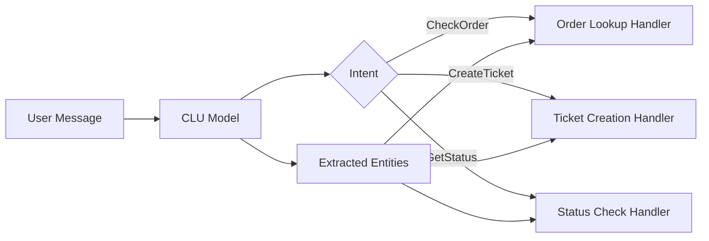

# How to Add Natural Language Understanding to Azure Bot Service with CLU

Author: [nawazdhandala](https://www.github.com/nawazdhandala)

Tags: Azure Bot Service, CLU, Conversational Language Understanding, NLU, Azure AI Language, Intent Recognition, Entity Extraction

Description: Learn how to integrate Conversational Language Understanding (CLU) with Azure Bot Service to recognize user intents and extract entities from messages.

---

When you build a chatbot, you quickly realize that users never phrase things the same way. One person types "show me my orders," another says "I want to check my order history," and a third writes "what did I buy last month?" All three mean the same thing, but pattern matching and keyword detection alone cannot handle this kind of variability reliably.

Conversational Language Understanding (CLU) is Microsoft's successor to LUIS (Language Understanding Intelligent Service) for intent recognition and entity extraction. It is part of Azure AI Language and provides a modern, more accurate alternative for understanding what users want when they send a message to your bot.

In this guide, I will walk through creating a CLU model, training it, and integrating it with an Azure Bot Service bot to route conversations based on recognized intents.

## What CLU Does

CLU handles two core tasks:

1. **Intent recognition**: Determining what the user wants to do. For example, "check my order" maps to a `CheckOrder` intent.
2. **Entity extraction**: Pulling out specific pieces of information from the message. For example, "check order 12345" extracts `12345` as an `OrderNumber` entity.

Your bot uses the recognized intent to decide which handler to invoke, and the extracted entities provide the parameters needed to fulfill the request.



## Prerequisites

- An Azure subscription
- An Azure AI Language resource (which includes CLU)
- An existing Azure Bot Service bot (or you can create one as part of this guide)
- Python 3.9+ with the Bot Framework SDK installed

## Step 1: Create an Azure AI Language Resource

Go to the Azure portal and create a new "Language" resource (under Azure AI services). Choose a pricing tier - the free tier allows 5,000 text records per month, which is plenty for development.

Note the endpoint URL and key after creation.

## Step 2: Create a CLU Project

Open Language Studio at https://language.cognitive.azure.com. Sign in with your Azure credentials and select your Language resource.

Click "Conversational Language Understanding" to create a new project. Give it a name like "SupportBotCLU" and set the primary language to English.

## Step 3: Define Intents

Intents represent the different things users want to do. For a support bot, you might define:

- **CheckOrderStatus**: User wants to know the status of an order
- **CreateSupportTicket**: User wants to file a support ticket
- **GetProductInfo**: User wants information about a product
- **CancelOrder**: User wants to cancel an order
- **Greeting**: User is saying hello
- **None**: Fallback intent for unrecognized messages

In Language Studio, add each intent and provide training utterances. Aim for at least 10-15 utterances per intent. Here are examples for `CheckOrderStatus`:

- "What is the status of my order?"
- "Where is my order 12345?"
- "Track my order"
- "Has my order shipped yet?"
- "Can you check on order number 98765?"
- "I want to know when my order will arrive"
- "Check order status"
- "My order hasn't arrived, what's going on?"
- "Is order 55555 still processing?"
- "When will my order be delivered?"

## Step 4: Define Entities

Entities represent the data values that users mention in their messages. Define the following entities:

- **OrderNumber**: A learned entity that captures order identifiers
- **ProductName**: A learned entity for product names
- **Priority**: A list entity with values like "high," "medium," "low"

For learned entities, label them in your training utterances. In the utterance "Where is my order 12345?", highlight "12345" and tag it as `OrderNumber`. Do this for every utterance that contains an entity value.

For list entities, define the possible values and their synonyms. For example, the Priority entity might have:

| Value | Synonyms |
|-------|----------|
| high | urgent, critical, asap |
| medium | normal, standard |
| low | minor, not urgent |

## Step 5: Train and Evaluate the Model

Click "Train" in Language Studio. Give your training job a name and select the training mode. "Standard" training provides better accuracy than "Advanced" for most scenarios.

After training completes, review the evaluation metrics:

- **Precision**: Of the intents the model predicted, how many were correct?
- **Recall**: Of the actual intents in the test data, how many did the model find?
- **F1 score**: The harmonic mean of precision and recall

If any intent has poor performance, add more diverse training utterances and retrain.

## Step 6: Deploy the Model

Once you are satisfied with the evaluation results, deploy the model. In Language Studio, go to "Deploy model," select your trained model, and create a deployment. Name it something like "production."

## Step 7: Integrate CLU with Your Bot

Now connect the CLU model to your bot. Install the Azure AI Language SDK:

```bash
# Install the Azure AI Language client library
pip install azure-ai-language-conversations
```

Create a CLU recognizer class that your bot will use:

```python
# clu_recognizer.py - Wrapper for CLU predictions
from azure.ai.language.conversations import ConversationAnalysisClient
from azure.core.credentials import AzureKeyCredential

class CLURecognizer:
    """Handles intent and entity recognition using CLU."""

    def __init__(self, endpoint, key, project_name, deployment_name):
        # Initialize the CLU client with credentials
        self.client = ConversationAnalysisClient(
            endpoint=endpoint,
            credential=AzureKeyCredential(key)
        )
        self.project_name = project_name
        self.deployment_name = deployment_name

    def recognize(self, text: str) -> dict:
        """
        Send text to CLU and get back the top intent and entities.
        Returns a dict with 'intent', 'confidence', and 'entities' keys.
        """
        # Build the request payload
        request = {
            "kind": "Conversation",
            "analysisInput": {
                "conversationItem": {
                    "id": "1",
                    "text": text,
                    "participantId": "user"
                }
            },
            "parameters": {
                "projectName": self.project_name,
                "deploymentName": self.deployment_name,
                "verbose": True
            }
        }

        # Call the CLU API
        response = self.client.analyze_conversation(request)

        # Extract the prediction results
        prediction = response["result"]["prediction"]
        top_intent = prediction["topIntent"]
        confidence = 0.0

        # Find the confidence score for the top intent
        for intent in prediction["intents"]:
            if intent["category"] == top_intent:
                confidence = intent["confidenceScore"]
                break

        # Extract entities into a simple dictionary
        entities = {}
        for entity in prediction.get("entities", []):
            category = entity["category"]
            value = entity["text"]
            # Handle multiple entities of the same type
            if category in entities:
                if isinstance(entities[category], list):
                    entities[category].append(value)
                else:
                    entities[category] = [entities[category], value]
            else:
                entities[category] = value

        return {
            "intent": top_intent,
            "confidence": confidence,
            "entities": entities
        }
```

## Step 8: Update the Bot to Use CLU

Modify your bot's message handler to use the CLU recognizer for routing:

```python
# bot.py - Bot that uses CLU for intent-based routing
from botbuilder.core import ActivityHandler, TurnContext
from clu_recognizer import CLURecognizer

class SupportBot(ActivityHandler):
    def __init__(self):
        # Initialize the CLU recognizer
        self.recognizer = CLURecognizer(
            endpoint="https://your-language-resource.cognitiveservices.azure.com/",
            key="your-api-key",
            project_name="SupportBotCLU",
            deployment_name="production"
        )

        # Minimum confidence threshold for acting on an intent
        self.confidence_threshold = 0.7

    async def on_message_activity(self, turn_context: TurnContext):
        """Route messages based on CLU intent recognition."""
        user_text = turn_context.activity.text

        # Get intent and entities from CLU
        result = self.recognizer.recognize(user_text)
        intent = result["intent"]
        confidence = result["confidence"]
        entities = result["entities"]

        # Only act on the intent if confidence is above threshold
        if confidence < self.confidence_threshold:
            await turn_context.send_activity(
                "I'm not sure I understood that. Could you rephrase your question?"
            )
            return

        # Route to the appropriate handler based on intent
        if intent == "CheckOrderStatus":
            await self._handle_check_order(turn_context, entities)
        elif intent == "CreateSupportTicket":
            await self._handle_create_ticket(turn_context, entities)
        elif intent == "GetProductInfo":
            await self._handle_product_info(turn_context, entities)
        elif intent == "CancelOrder":
            await self._handle_cancel_order(turn_context, entities)
        elif intent == "Greeting":
            await turn_context.send_activity(
                "Hello! How can I help you today?"
            )
        else:
            await turn_context.send_activity(
                "I'm not sure how to help with that. "
                "I can check order status, create support tickets, "
                "or provide product information."
            )

    async def _handle_check_order(self, turn_context, entities):
        """Handle the CheckOrderStatus intent."""
        order_number = entities.get("OrderNumber")
        if order_number:
            # Look up the order and respond
            await turn_context.send_activity(
                f"Let me check on order {order_number} for you... "
                f"Order {order_number} is currently in transit "
                f"and expected to arrive by Friday."
            )
        else:
            # Ask for the missing order number
            await turn_context.send_activity(
                "I'd be happy to check your order status. "
                "What is your order number?"
            )

    async def _handle_create_ticket(self, turn_context, entities):
        """Handle the CreateSupportTicket intent."""
        priority = entities.get("Priority", "medium")
        await turn_context.send_activity(
            f"I'll create a {priority} priority support ticket for you. "
            f"Can you describe the issue you are experiencing?"
        )

    async def _handle_product_info(self, turn_context, entities):
        """Handle the GetProductInfo intent."""
        product = entities.get("ProductName")
        if product:
            await turn_context.send_activity(
                f"Here is what I know about {product}..."
            )
        else:
            await turn_context.send_activity(
                "Which product would you like to know about?"
            )

    async def _handle_cancel_order(self, turn_context, entities):
        """Handle the CancelOrder intent."""
        order_number = entities.get("OrderNumber")
        if order_number:
            await turn_context.send_activity(
                f"I can help you cancel order {order_number}. "
                f"Please confirm you want to proceed with the cancellation."
            )
        else:
            await turn_context.send_activity(
                "Which order would you like to cancel? "
                "Please provide the order number."
            )
```

## Testing and Iteration

After integration, test thoroughly with messages that are not in your training data. Pay attention to:

- Messages that are phrased very differently from training utterances
- Ambiguous messages that could match multiple intents
- Messages with misspellings or informal language
- Messages that contain entities in unexpected positions

Use the test panel in Language Studio to quickly evaluate individual utterances without going through the bot. When you find misclassifications, add those utterances to the training data and retrain.

## Summary

CLU brings structured intent recognition and entity extraction to your Azure Bot Service bot. Unlike pure LLM-based approaches where the model interprets every message freely, CLU gives you deterministic routing based on trained intents. This is valuable when you need predictable behavior - when a user says "cancel my order," you want the cancellation flow to trigger every time, not a free-form AI response. The combination of CLU for routing and Azure OpenAI for generating natural responses within each handler gives you the best of both worlds.
