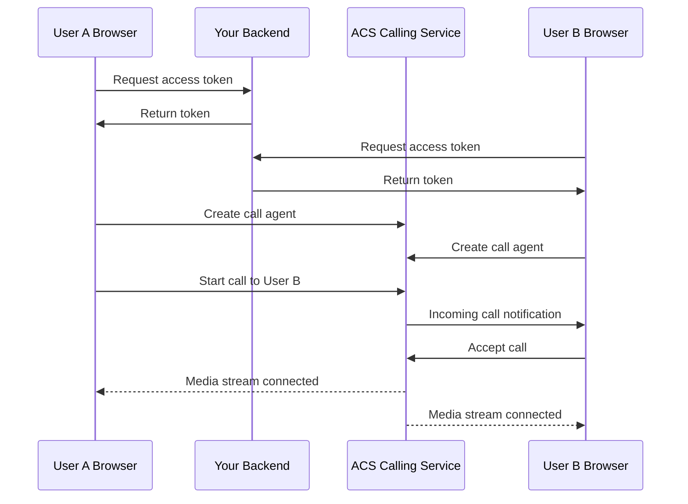

# How to Add Voice and Video Calling to a Web App Using Azure Communication Services Calling SDK

Author: [nawazdhandala](https://www.github.com/nawazdhandala)

Tags: Azure Communication Services, Voice Calling, Video Calling, WebRTC, Calling SDK, Real-Time Communication, JavaScript

Description: A practical guide to adding voice and video calling capabilities to a web application using the Azure Communication Services Calling SDK.

---

Adding voice and video calling to a web application used to require deep expertise in WebRTC, SRTP, ICE candidates, STUN/TURN servers, and a dozen other protocols. Azure Communication Services (ACS) abstracts all of that into a high-level SDK. You create a call, join a call, toggle video, mute audio, and the SDK handles the underlying media negotiation and transport. The result is a calling experience comparable to Teams or Zoom, embedded directly in your application.

This guide walks through building a web-based calling application with the ACS Calling SDK, covering both voice and video scenarios.

## Prerequisites

- An Azure Communication Services resource
- A modern browser that supports WebRTC (Chrome, Firefox, Edge, Safari)
- Node.js 18+ for the token backend
- The ACS Calling SDK npm package

```bash
npm install @azure/communication-calling @azure/communication-common
```

## Architecture

The calling flow involves your backend (for token management), the ACS service (for call signaling and media routing), and the client browsers (for rendering media).



## Step 1: Token Service (Backend)

Reuse the identity service pattern from the chat guide, but request the `voip` scope instead of (or in addition to) `chat`.

```javascript
// server.js - Token service for calling
const express = require('express');
const { CommunicationIdentityClient } = require('@azure/communication-identity');

const app = express();
app.use(express.json());
app.use(express.static('public'));

const connectionString = 'endpoint=https://my-acs-resource.communication.azure.com/;accesskey=...';
const identityClient = new CommunicationIdentityClient(connectionString);

const userStore = new Map();

app.post('/api/token', async (req, res) => {
    const { userId } = req.body;

    let user;
    if (userStore.has(userId)) {
        user = userStore.get(userId);
        const tokenResponse = await identityClient.getToken(
            { communicationUserId: user.communicationUserId },
            ['voip']
        );
        return res.json({
            token: tokenResponse.token,
            userId: user.communicationUserId
        });
    }

    // Create new identity with voip token
    const result = await identityClient.createUserAndToken(['voip']);
    userStore.set(userId, result.user);

    res.json({
        token: result.token,
        userId: result.user.communicationUserId
    });
});

app.listen(3001, () => console.log('Token server on port 3001'));
```

## Step 2: Initialize the Call Agent

The CallAgent is the main entry point for making and receiving calls.

```javascript
// calling-app.js - Initialize the ACS Calling SDK
const { CallClient } = require('@azure/communication-calling');
const { AzureCommunicationTokenCredential } = require('@azure/communication-common');

let callClient;
let callAgent;
let deviceManager;
let currentCall;

async function initializeCalling(displayName) {
    // Get a token from the backend
    const response = await fetch('/api/token', {
        method: 'POST',
        headers: { 'Content-Type': 'application/json' },
        body: JSON.stringify({ userId: displayName })
    });
    const { token, userId } = await response.json();

    // Create the call client
    callClient = new CallClient();

    // Create a token credential
    const tokenCredential = new AzureCommunicationTokenCredential(token);

    // Create the call agent
    callAgent = await callClient.createCallAgent(tokenCredential, {
        displayName: displayName
    });

    // Get the device manager for camera and microphone access
    deviceManager = await callClient.getDeviceManager();

    // Request device permissions
    await deviceManager.askDevicePermission({ audio: true, video: true });

    console.log('Calling initialized. User ID:', userId);

    // Listen for incoming calls
    callAgent.on('incomingCall', handleIncomingCall);

    return { callAgent, userId };
}
```

## Step 3: Make an Outgoing Call

```javascript
async function startCall(calleeId, withVideo = false) {
    // Build the call options
    const callOptions = {
        audioOptions: { muted: false }
    };

    // If video is requested, get the camera stream
    if (withVideo) {
        const cameras = await deviceManager.getCameras();
        if (cameras.length > 0) {
            const localVideoStream = new LocalVideoStream(cameras[0]);
            callOptions.videoOptions = {
                localVideoStreams: [localVideoStream]
            };

            // Render the local video preview
            renderLocalVideo(localVideoStream);
        }
    }

    // Start the call
    currentCall = callAgent.startCall(
        [{ communicationUserId: calleeId }],
        callOptions
    );

    console.log('Call started. Call ID:', currentCall.id);

    // Set up call event handlers
    setupCallEventHandlers(currentCall);

    return currentCall;
}

async function startGroupCall(participantIds, withVideo = false) {
    // Create a group call with multiple participants
    const participants = participantIds.map(function (id) {
        return { communicationUserId: id };
    });

    const callOptions = {
        audioOptions: { muted: false }
    };

    if (withVideo) {
        const cameras = await deviceManager.getCameras();
        if (cameras.length > 0) {
            const localVideoStream = new LocalVideoStream(cameras[0]);
            callOptions.videoOptions = {
                localVideoStreams: [localVideoStream]
            };
            renderLocalVideo(localVideoStream);
        }
    }

    currentCall = callAgent.startCall(participants, callOptions);
    setupCallEventHandlers(currentCall);

    return currentCall;
}
```

## Step 4: Handle Incoming Calls

```javascript
function handleIncomingCall(incomingCallEvent) {
    const incomingCall = incomingCallEvent.incomingCall;

    console.log('Incoming call from:', incomingCall.callerInfo.displayName);

    // Show an incoming call UI to the user
    showIncomingCallUI({
        callerName: incomingCall.callerInfo.displayName,
        onAccept: async function (withVideo) {
            // Accept the call
            const callOptions = {
                audioOptions: { muted: false }
            };

            if (withVideo) {
                const cameras = await deviceManager.getCameras();
                if (cameras.length > 0) {
                    const localVideoStream = new LocalVideoStream(cameras[0]);
                    callOptions.videoOptions = {
                        localVideoStreams: [localVideoStream]
                    };
                    renderLocalVideo(localVideoStream);
                }
            }

            currentCall = await incomingCall.accept(callOptions);
            setupCallEventHandlers(currentCall);
        },
        onReject: function () {
            incomingCall.reject();
        }
    });
}
```

## Step 5: Manage Call State and Events

```javascript
function setupCallEventHandlers(call) {
    // Call state changes
    call.on('stateChanged', function () {
        console.log('Call state:', call.state);
        updateCallUI(call.state);

        // States: Connecting, Ringing, Connected, LocalHold, Disconnecting, Disconnected
        if (call.state === 'Disconnected') {
            console.log('Call ended. Reason:', call.callEndReason?.code);
            cleanup();
        }
    });

    // Remote participants joined or left
    call.on('remoteParticipantsUpdated', function (event) {
        // Handle new participants
        event.added.forEach(function (participant) {
            console.log('Participant joined:', participant.displayName);
            setupRemoteParticipant(participant);
        });

        // Handle participants who left
        event.removed.forEach(function (participant) {
            console.log('Participant left:', participant.displayName);
            removeRemoteVideoElement(participant.identifier.communicationUserId);
        });
    });

    // Handle remote participants already in the call
    call.remoteParticipants.forEach(function (participant) {
        setupRemoteParticipant(participant);
    });
}

function setupRemoteParticipant(participant) {
    // Listen for video streams from this participant
    participant.on('videoStreamsUpdated', function (event) {
        event.added.forEach(function (stream) {
            console.log('Remote video stream added');
            renderRemoteVideo(stream, participant.identifier.communicationUserId);
        });

        event.removed.forEach(function (stream) {
            console.log('Remote video stream removed');
            removeRemoteVideoElement(participant.identifier.communicationUserId);
        });
    });

    // Render existing video streams
    participant.videoStreams.forEach(function (stream) {
        if (stream.isAvailable) {
            renderRemoteVideo(stream, participant.identifier.communicationUserId);
        }
    });
}
```

## Step 6: Render Video Streams

```javascript
// Import the video renderer
const { VideoStreamRenderer } = require('@azure/communication-calling');

async function renderLocalVideo(localVideoStream) {
    const renderer = new VideoStreamRenderer(localVideoStream);
    const view = await renderer.createView({
        scalingMode: 'Crop',
        isMirrored: true  // Mirror local video (like looking in a mirror)
    });

    // Attach the video element to the DOM
    const localVideoContainer = document.getElementById('local-video');
    localVideoContainer.innerHTML = '';
    localVideoContainer.appendChild(view.target);
}

async function renderRemoteVideo(remoteVideoStream, participantId) {
    // Wait for the stream to become available
    if (!remoteVideoStream.isAvailable) {
        remoteVideoStream.on('isAvailableChanged', async function () {
            if (remoteVideoStream.isAvailable) {
                await doRender(remoteVideoStream, participantId);
            }
        });
        return;
    }

    await doRender(remoteVideoStream, participantId);
}

async function doRender(stream, participantId) {
    const renderer = new VideoStreamRenderer(stream);
    const view = await renderer.createView({ scalingMode: 'Crop' });

    // Create or find the container for this participant
    let container = document.getElementById(`remote-${participantId}`);
    if (!container) {
        container = document.createElement('div');
        container.id = `remote-${participantId}`;
        container.className = 'remote-video';
        document.getElementById('remote-videos').appendChild(container);
    }

    container.innerHTML = '';
    container.appendChild(view.target);
}
```

## Step 7: Call Controls

Implement the standard call controls users expect.

```javascript
// Mute and unmute audio
async function toggleMute() {
    if (!currentCall) return;

    if (currentCall.isMuted) {
        await currentCall.unmute();
        console.log('Unmuted');
    } else {
        await currentCall.mute();
        console.log('Muted');
    }
}

// Toggle video on and off
async function toggleVideo() {
    if (!currentCall) return;

    const localVideoStreams = currentCall.localVideoStreams;

    if (localVideoStreams.length > 0) {
        // Video is on - turn it off
        await currentCall.stopVideo(localVideoStreams[0]);
        document.getElementById('local-video').innerHTML = '';
        console.log('Video stopped');
    } else {
        // Video is off - turn it on
        const cameras = await deviceManager.getCameras();
        if (cameras.length > 0) {
            const localVideoStream = new LocalVideoStream(cameras[0]);
            await currentCall.startVideo(localVideoStream);
            renderLocalVideo(localVideoStream);
            console.log('Video started');
        }
    }
}

// Switch camera (for devices with multiple cameras)
async function switchCamera() {
    const cameras = await deviceManager.getCameras();
    if (cameras.length < 2) return;

    const currentStream = currentCall.localVideoStreams[0];
    if (!currentStream) return;

    // Find the next camera
    const currentCameraId = currentStream.source.id;
    const nextCamera = cameras.find(function (cam) {
        return cam.id !== currentCameraId;
    }) || cameras[0];

    // Switch to the next camera
    await currentStream.switchSource(nextCamera);
    console.log('Switched to camera:', nextCamera.name);
}

// End the call
async function hangUp() {
    if (currentCall) {
        await currentCall.hangUp();
        console.log('Call ended');
    }
}

// Hold and resume
async function toggleHold() {
    if (!currentCall) return;

    if (currentCall.state === 'LocalHold') {
        await currentCall.resume();
    } else {
        await currentCall.hold();
    }
}
```

## Device Selection

Let users choose their preferred microphone, speaker, and camera.

```javascript
async function getAvailableDevices() {
    const cameras = await deviceManager.getCameras();
    const microphones = await deviceManager.getMicrophones();
    const speakers = await deviceManager.getSpeakers();

    return {
        cameras: cameras.map(function (c) { return { id: c.id, name: c.name }; }),
        microphones: microphones.map(function (m) { return { id: m.id, name: m.name }; }),
        speakers: speakers.map(function (s) { return { id: s.id, name: s.name }; })
    };
}

async function selectMicrophone(deviceId) {
    const microphones = await deviceManager.getMicrophones();
    const selected = microphones.find(function (m) { return m.id === deviceId; });
    if (selected) {
        await deviceManager.selectMicrophone(selected);
    }
}

async function selectSpeaker(deviceId) {
    const speakers = await deviceManager.getSpeakers();
    const selected = speakers.find(function (s) { return s.id === deviceId; });
    if (selected) {
        await deviceManager.selectSpeaker(selected);
    }
}
```

## Wrapping Up

The Azure Communication Services Calling SDK turns what would be months of WebRTC development into a manageable integration project. The SDK handles all the complex media negotiation, codec selection, and network traversal behind simple method calls like `startCall`, `accept`, `mute`, and `startVideo`. Start with a basic 1:1 voice call to get the integration working, then add video, and finally group calling. The event-driven architecture makes it straightforward to build responsive UIs that show call state changes, participant joins and leaves, and video stream availability in real time.
