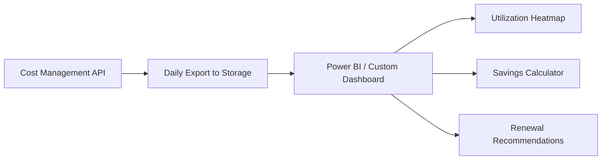

# How to Analyze Azure Reserved Instance Utilization in Azure Cost Management

Author: [nawazdhandala](https://www.github.com/nawazdhandala)

Tags: Azure Cost Management, Reserved Instances, Cost Optimization, FinOps, Azure Cloud, Reservations, Cloud Billing

Description: Learn how to analyze Azure Reserved Instance utilization to maximize savings, identify underused reservations, and make data-driven purchasing decisions.

---

Azure Reserved Instances (RIs) can save you 30-70% compared to pay-as-you-go pricing. But those savings only materialize if the reservations are actually being used. An unused or underutilized reservation is worse than no reservation at all - you are paying upfront for capacity you are not consuming.

Azure Cost Management provides tools to track reservation utilization, identify waste, and make smarter purchasing decisions. This guide covers how to analyze your RI portfolio effectively.

## How Azure Reservations Work

When you purchase a reservation, you commit to paying for a specific resource type (VM size, SQL Database tier, etc.) for 1 or 3 years. In exchange, you get a significant discount compared to pay-as-you-go rates.

The reservation is applied automatically to matching resources. If you buy a reservation for 10 Standard_D4s_v3 VMs, any D4s_v3 VMs running in the reservation's scope get the discounted rate. If only 7 VMs are running, the remaining 3 reservations go unused and you lose money on them.

Key terms:

- **Utilization**: The percentage of reserved capacity that is actually being consumed
- **Savings**: The difference between what you would have paid at pay-as-you-go rates and what you paid with the reservation
- **Unused reservation**: Reserved capacity that has no matching resource running

## Step 1: View Reservation Utilization in the Portal

Navigate to Azure Cost Management > Reservations to see your reservation portfolio.

The overview shows:

- Total reservations owned
- Average utilization across all reservations
- Total savings achieved
- Reservations with low utilization (flagged for attention)

Click on an individual reservation to see its detailed utilization over time, including daily and hourly breakdowns.

## Step 2: Query Reservation Data with the API

For a comprehensive analysis, use the Cost Management API to pull reservation utilization data programmatically:

```bash
# Get reservation utilization summary for the last 30 days
curl -X GET "https://management.azure.com/providers/Microsoft.Billing/billingAccounts/<billing-account-id>/providers/Microsoft.Consumption/reservationSummaries?grain=daily&startDate=2024-02-01&endDate=2024-03-01&api-version=2023-05-01" \
  -H "Authorization: Bearer $TOKEN" \
  -H "Content-Type: application/json"
```

The response includes daily utilization percentages, reserved quantity, used quantity, and the specific resources consuming the reservation.

## Step 3: Analyze Utilization Patterns

Build a script to process reservation utilization data and identify problems:

```python
import requests
from datetime import datetime, timedelta

def get_reservation_utilization(token, billing_account_id, days=30):
    """Fetch reservation utilization data for analysis."""
    end_date = datetime.now().strftime('%Y-%m-%d')
    start_date = (datetime.now() - timedelta(days=days)).strftime('%Y-%m-%d')

    url = (
        f"https://management.azure.com/providers/Microsoft.Billing/"
        f"billingAccounts/{billing_account_id}/providers/"
        f"Microsoft.Consumption/reservationSummaries"
        f"?grain=daily&startDate={start_date}&endDate={end_date}"
        f"&api-version=2023-05-01"
    )

    headers = {
        'Authorization': f'Bearer {token}',
        'Content-Type': 'application/json'
    }

    response = requests.get(url, headers=headers)
    return response.json()


def analyze_utilization(data):
    """Identify underutilized reservations."""
    reservations = {}

    for item in data.get('value', []):
        props = item.get('properties', {})
        res_id = props.get('reservationOrderId', 'unknown')
        utilization = props.get('avgUtilizationPercentage', 0)
        sku = props.get('skuName', 'unknown')

        if res_id not in reservations:
            reservations[res_id] = {
                'sku': sku,
                'utilization_points': [],
                'reserved_hours': 0,
                'used_hours': 0
            }

        reservations[res_id]['utilization_points'].append(utilization)
        reservations[res_id]['reserved_hours'] += props.get('reservedHours', 0)
        reservations[res_id]['used_hours'] += props.get('usedHours', 0)

    # Calculate average utilization and flag underutilized reservations
    results = []
    for res_id, data in reservations.items():
        avg_util = sum(data['utilization_points']) / len(data['utilization_points'])
        waste_hours = data['reserved_hours'] - data['used_hours']

        results.append({
            'reservation_id': res_id,
            'sku': data['sku'],
            'avg_utilization': round(avg_util, 1),
            'waste_hours': round(waste_hours, 1),
            'status': 'OK' if avg_util >= 80 else 'LOW' if avg_util >= 50 else 'CRITICAL'
        })

    return sorted(results, key=lambda x: x['avg_utilization'])
```

## Step 4: Build a Utilization Dashboard

Use KQL queries in Log Analytics or Azure Workbooks to visualize reservation utilization:

```kql
// Reservation utilization trend from the AdvisorResources table
AdvisorResources
| where type == "microsoft.advisor/recommendations"
| where properties.category == "Cost"
| where properties.shortDescription.solution contains "reservation"
| extend
    Savings = todouble(properties.extendedProperties.savingsAmount),
    SKU = tostring(properties.extendedProperties.sku),
    Region = tostring(properties.extendedProperties.region)
| project TimeGenerated, SKU, Region, Savings
```

For a more detailed view, use the Cost Management data export to track utilization over time. Schedule a daily export and visualize in Power BI:



## Step 5: Identify Common Utilization Problems

**VM right-sizing changed**: You bought reservations for D4s_v3 VMs, but the team right-sized them down to D2s_v3. The D4 reservations are now partially unused.

Fix: Azure supports instance size flexibility within the same VM series. A D4s_v3 reservation can cover two D2s_v3 VMs. Check if flexibility is enabled on your reservations.

```bash
# Check reservation properties including instance flexibility
az reservations reservation show \
  --reservation-order-id <order-id> \
  --reservation-id <reservation-id> \
  --query "properties.appliedScopeType"
```

**Workloads decommissioned**: The project that needed those VMs was shut down, but the reservation is still active.

Fix: You can exchange reservations for a different type or return them (with an early termination fee). Use the Cost Management portal to initiate an exchange.

**Wrong scope**: The reservation is scoped to a specific subscription, but the matching VMs were moved to a different subscription.

Fix: Change the reservation scope to "Shared" so it applies across all subscriptions in the billing account.

```bash
# Update reservation scope to shared
az reservations reservation update \
  --reservation-order-id <order-id> \
  --reservation-id <reservation-id> \
  --applied-scope-type Shared
```

**Dev/test environments shutting down**: VMs in development environments are stopped during nights and weekends, but the reservation covers 24/7.

Fix: Move dev/test workloads to pay-as-you-go or use auto-shutdown policies that account for reservation coverage windows.

## Step 6: Use Azure Advisor Recommendations

Azure Advisor analyzes your reservation utilization and provides recommendations:

```bash
# Get reservation-related Advisor recommendations
az advisor recommendation list \
  --category Cost \
  --query "[?contains(shortDescription.solution, 'reservation')]" \
  --output table
```

Advisor provides two types of reservation recommendations:

- **Buy recommendations**: Based on your usage patterns, suggests new reservations that would save money
- **Utilization alerts**: Flags existing reservations with low utilization

## Step 7: Plan Reservation Purchases

Before buying new reservations, analyze your usage patterns to find candidates:

```python
def find_reservation_candidates(cost_data, min_hours_per_day=20):
    """Find resources that run consistently enough to benefit from reservations."""
    candidates = {}

    for row in cost_data:
        resource_type = row['MeterCategory']
        sku = row['MeterSubCategory']
        usage_hours = row['Quantity']
        date = row['Date']

        key = f"{resource_type}|{sku}"
        if key not in candidates:
            candidates[key] = {
                'resource_type': resource_type,
                'sku': sku,
                'daily_hours': [],
                'total_cost': 0
            }

        candidates[key]['daily_hours'].append(usage_hours)
        candidates[key]['total_cost'] += row['Cost']

    # Filter for resources that run consistently
    recommendations = []
    for key, data in candidates.items():
        avg_daily_hours = sum(data['daily_hours']) / len(data['daily_hours'])
        min_daily_hours = min(data['daily_hours'])

        # Only recommend reservation if usage is consistent
        if min_daily_hours >= min_hours_per_day:
            annual_payg_cost = data['total_cost'] * 12
            estimated_ri_savings = annual_payg_cost * 0.40  # Assume 40% savings

            recommendations.append({
                'sku': data['sku'],
                'avg_daily_hours': round(avg_daily_hours, 1),
                'min_daily_hours': round(min_daily_hours, 1),
                'annual_payg_cost': round(annual_payg_cost, 2),
                'estimated_annual_savings': round(estimated_ri_savings, 2)
            })

    return sorted(recommendations, key=lambda x: -x['estimated_annual_savings'])
```

## Step 8: Set Up Utilization Alerts

Create alerts that notify you when reservation utilization drops below acceptable levels:

```bash
# Create a budget alert for reservation underutilization
# This uses the Azure Advisor alert mechanism
az monitor metrics alert create \
  --name "reservation-utilization-low" \
  --resource-group myRG \
  --scopes "/providers/Microsoft.Billing/billingAccounts/<billing-account-id>" \
  --condition "avg ReservationUtilizationPercentage < 80" \
  --window-size 1d \
  --evaluation-frequency 1d \
  --severity 3 \
  --action-group "/subscriptions/<sub-id>/resourceGroups/myRG/providers/Microsoft.Insights/actionGroups/FinOpsTeam"
```

## Reporting Cadence

Establish a regular review cadence:

- **Weekly**: Quick check on utilization percentages. Flag anything below 80%.
- **Monthly**: Detailed analysis including savings achieved, waste identified, and exchange opportunities.
- **Quarterly**: Strategic review of reservation portfolio. Decide on new purchases, exchanges, and renewals.

Include these metrics in your monthly report:

- Overall reservation utilization percentage
- Total savings from reservations (vs. pay-as-you-go)
- Total waste from unused reservations
- Reservations expiring in the next 90 days (renewal decisions needed)
- New purchase recommendations from Advisor

## Summary

Azure Reserved Instances are one of the most impactful cost optimization tools, but only when utilization is high. Monitor utilization regularly through the Cost Management portal, API, and Advisor. Address underutilization by adjusting scopes, exchanging for better-fitting reservations, or enabling instance size flexibility. Make data-driven purchase decisions by analyzing usage patterns before committing. The goal is to keep average utilization above 80% across your reservation portfolio.
