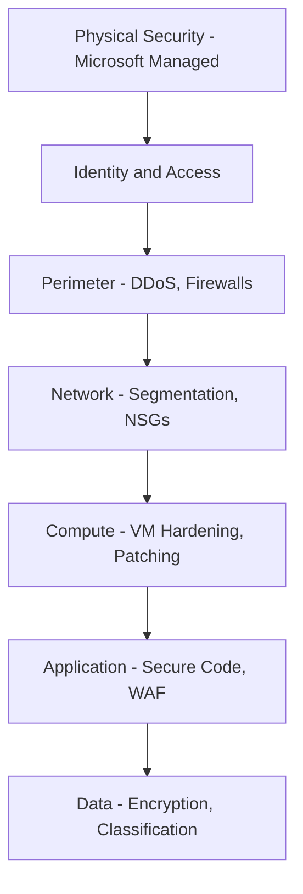

# How to Apply Defense in Depth Security Principles Across Azure Resources

Author: [nawazdhandala](https://www.github.com/nawazdhandala)

Tags: Azure, Security, Defense in Depth, Cloud Security, Network Security, Identity

Description: Learn how to apply defense in depth security principles across Azure resources using multiple layers of protection from identity to data encryption.

---

Defense in depth is not a new concept. Military strategists have used layered defenses for centuries. The idea is straightforward: if one layer fails, the next one catches the threat. In cloud security, this translates to building multiple independent security controls so that no single point of failure can compromise your environment.

Azure provides tools at every layer of the stack. This post covers how to use them together to build a genuinely resilient security posture.

## The Layers of Defense in Depth

Think of defense in depth as concentric rings around your data. Each ring represents a different type of security control:



Microsoft handles the physical security layer. You are responsible for everything from identity through data. Let us walk through each layer.

## Layer 1: Identity and Access

Identity is the outermost layer you control. If an attacker gets valid credentials, the other layers need to hold up.

Start with these fundamentals in Azure AD:

**Multi-factor authentication** should be enabled for every account. Period. Use Conditional Access policies rather than per-user MFA settings because policies give you more granular control.

**Privileged Identity Management (PIM)** eliminates standing admin privileges. Instead of having accounts with permanent Global Admin or Contributor roles, users activate roles on demand with time limits and approval workflows.

**Identity Protection** uses machine learning to detect risky sign-in patterns. Configure it to automatically block high-risk sign-ins and force password resets for compromised accounts.

```bash
# Example: List all role assignments to audit for excessive privileges
az role assignment list \
  --scope "/subscriptions/<sub-id>" \
  --output table \
  --query "[].{Principal:principalName, Role:roleDefinitionName, Scope:scope}"
```

Review role assignments quarterly. Remove any that are no longer needed. Every unnecessary permission is attack surface you do not need.

## Layer 2: Perimeter

The perimeter layer protects against large-scale attacks targeting your public-facing endpoints.

**Azure DDoS Protection Standard** provides advanced mitigation for volumetric, protocol, and application-layer attacks. It integrates with Application Gateway and public IPs to automatically detect and mitigate DDoS attacks.

**Azure Firewall** acts as a centralized network security appliance. Deploy it in a hub virtual network and route all traffic through it. Azure Firewall supports application rules (FQDN filtering), network rules (IP-based filtering), and threat intelligence-based filtering.

```bash
# Create Azure Firewall in the hub VNet
az network firewall create \
  --resource-group hub-rg \
  --name central-firewall \
  --location eastus \
  --vnet-name hub-vnet

# Create a firewall policy with threat intelligence filtering enabled
az network firewall policy create \
  --resource-group hub-rg \
  --name fw-policy \
  --threat-intel-mode Deny
```

**Azure Front Door** with its built-in Web Application Firewall gives you global load balancing with DDoS protection and OWASP rule sets at the edge. This stops common web attacks before they ever reach your application.

## Layer 3: Network

Inside your perimeter, network segmentation limits lateral movement. If an attacker compromises one workload, good segmentation prevents them from reaching others.

**Virtual Network segmentation** is the foundation. Create separate VNets or subnets for different tiers (web, application, data) and workload types (production, development, management).

**Network Security Groups** filter traffic at the subnet and NIC level. Write rules that follow the principle of least privilege - only allow traffic that is explicitly needed.

```bash
# Create an NSG rule allowing only HTTPS from the web tier to the app tier
az network nsg rule create \
  --resource-group app-rg \
  --nsg-name app-tier-nsg \
  --name AllowWebToApp \
  --priority 100 \
  --direction Inbound \
  --access Allow \
  --protocol Tcp \
  --source-address-prefixes 10.1.1.0/24 \
  --destination-port-ranges 443
```

**Private Endpoints** bring Azure PaaS services into your virtual network. Instead of your application connecting to Azure SQL over the public internet, traffic flows over a private IP address within your VNet. This eliminates an entire class of exposure.

**Azure Bastion** removes the need to expose RDP or SSH ports on VMs. Users connect through the Azure portal with TLS, and the VM never needs a public IP address.

## Layer 4: Compute

Your virtual machines and containers need their own protections.

**Microsoft Defender for Servers** provides endpoint detection and response, vulnerability assessment, and just-in-time VM access. JIT access keeps management ports closed by default and opens them only when an authorized user requests access, for a limited time, from a specific IP.

**Azure Update Management** keeps operating systems patched. Configure maintenance windows and automatic patching schedules. Unpatched systems are one of the most common entry points for attackers.

For container workloads, use **Microsoft Defender for Containers** to scan images for vulnerabilities and monitor runtime behavior. Run containers with the minimum required privileges and use read-only root filesystems where possible.

```bash
# Enable just-in-time VM access through Defender for Cloud
# This keeps SSH/RDP ports closed until an authorized request is made
az security jit-policy create \
  --resource-group prod-rg \
  --location eastus \
  --name default \
  --virtual-machines '[{
    "id": "/subscriptions/<sub-id>/resourceGroups/prod-rg/providers/Microsoft.Compute/virtualMachines/prod-vm",
    "ports": [{"number": 22, "protocol": "TCP", "allowedSourceAddressPrefix": "*", "maxRequestAccessDuration": "PT3H"}]
  }]'
```

## Layer 5: Application

Applications are where your business logic runs, and they often contain vulnerabilities that infrastructure controls cannot catch.

**Azure Web Application Firewall (WAF)** protects against OWASP Top 10 vulnerabilities including SQL injection, cross-site scripting, and request smuggling. Deploy WAF on Application Gateway or Front Door.

**Azure API Management** provides a gateway for your APIs with built-in rate limiting, authentication, and request validation. This prevents API abuse and ensures that only authorized clients can call your services.

At the code level, use **Azure DevOps** or **GitHub Advanced Security** to scan for vulnerabilities in your dependencies and secrets in your code. Shift security left by catching issues before they reach production.

Managed identities eliminate the need for credentials in your application code. Instead of storing a database connection string with a password, your application authenticates to Azure SQL using its managed identity.

```bash
# Assign a system-assigned managed identity to a web app
az webapp identity assign \
  --resource-group app-rg \
  --name my-web-app

# Grant the managed identity access to a Key Vault
az keyvault set-policy \
  --name my-keyvault \
  --object-id <managed-identity-principal-id> \
  --secret-permissions get list
```

## Layer 6: Data

Data is ultimately what you are protecting. Even if every other layer is breached, encryption and access controls on the data itself provide a last line of defense.

**Encryption at rest** is enabled by default for most Azure services using Microsoft-managed keys. For sensitive workloads, use customer-managed keys stored in Azure Key Vault. This gives you control over key rotation and the ability to revoke access.

**Encryption in transit** means enforcing TLS 1.2+ on all connections. Disable older TLS versions on your storage accounts, databases, and app services.

**Azure Information Protection** and **Microsoft Purview** provide data classification and labeling. Classify your data so that sensitive information gets additional protections automatically.

**Azure SQL Database** offers row-level security, dynamic data masking, and Always Encrypted. These features protect data even from database administrators.

## Monitoring Across All Layers

Defense in depth is only effective if you can see what is happening at each layer. Centralize your security monitoring with these tools:

- **Microsoft Defender for Cloud** provides a unified security posture view across all layers
- **Microsoft Sentinel** collects logs from every layer and uses analytics rules to detect threats
- **Azure Monitor** and **Log Analytics** aggregate operational and security logs

Create alerts for security-relevant events at every layer. A sign-in from an unusual location (identity layer), a new NSG rule allowing broad access (network layer), and a large data export (data layer) should all trigger notifications.

## Putting It All Together

The power of defense in depth comes from the independence of each layer. An attacker who steals credentials (bypassing the identity layer) still faces network segmentation, compute hardening, application-level controls, and data encryption.

No single layer is perfect. Network segmentation can be misconfigured. Patches can be delayed. WAF rules can have gaps. But the probability of an attacker successfully penetrating all layers simultaneously is dramatically lower than penetrating any single one.

Review each layer regularly. Run penetration tests that probe multiple layers. Use Microsoft Defender for Cloud's Secure Score to track your progress and identify the highest-impact improvements.

Defense in depth is not about buying more products. It is about applying the right controls at the right layers, monitoring them continuously, and treating security as an ongoing practice rather than a checkbox exercise.
