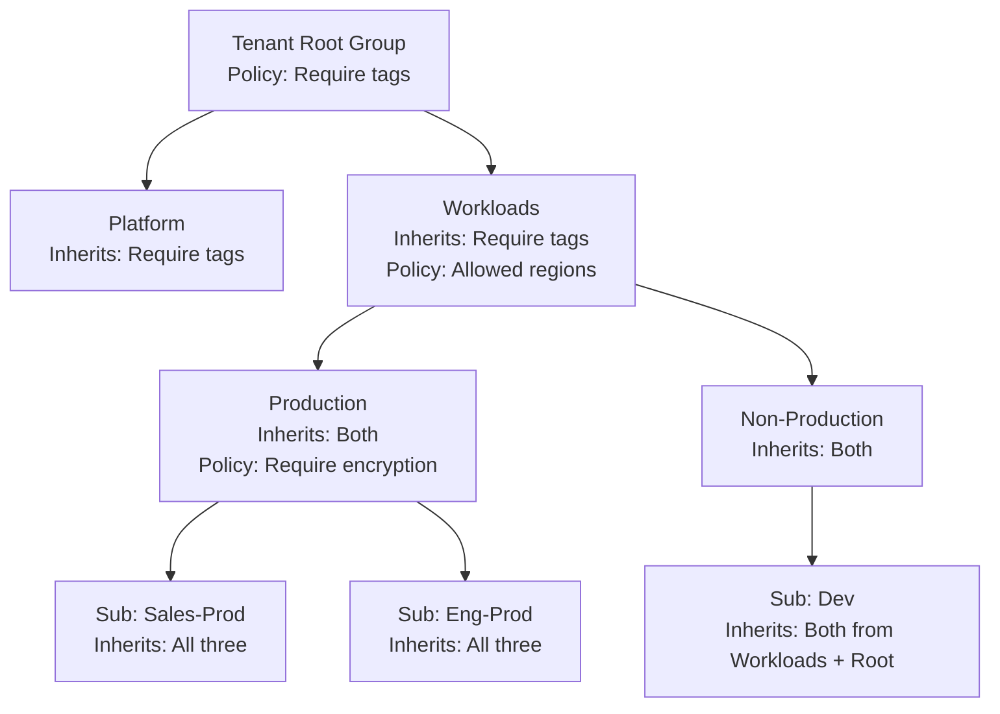

# How to Assign Azure Policy at the Management Group Level for Governance at Scale

Author: [nawazdhandala](https://www.github.com/nawazdhandala)

Tags: Azure, Azure Policy, Management Groups, Governance, Compliance, Security, Enterprise

Description: Learn how to assign Azure Policy at the management group level so governance rules apply automatically across all subscriptions in your hierarchy.

---

Assigning Azure Policy at the subscription level works fine when you have two or three subscriptions. But when you have fifty subscriptions organized into management groups, assigning the same policy to each one individually is tedious and error-prone. The real power of Azure Policy comes when you assign policies at the management group level - they automatically apply to every subscription and resource beneath that group, including subscriptions added in the future.

In this post, I will walk through how to assign policies at management groups, how inheritance works, the difference between policies and initiatives, and practical examples of governance rules you should implement.

## How Policy Inheritance Works

When you assign a policy at a management group, it flows down through the hierarchy:



Key rules:
- A resource is evaluated against all policies assigned at every level above it
- If multiple policies conflict, the most restrictive one wins (deny beats allow)
- Policies assigned at a higher level cannot be overridden at a lower level
- New subscriptions added to a management group automatically inherit all policies

## Assigning a Built-in Policy at a Management Group

Azure has hundreds of built-in policies covering security, compliance, cost management, and operational best practices. Let me start with a common one: requiring a specific tag on all resource groups.

### Through the Portal

1. Go to "Policy" in the Azure portal
2. Click "Assignments" in the left menu
3. Click "Assign policy"
4. For Scope, click the selector and choose your management group (e.g., "Workloads")
5. Under Policy definition, search for "Require a tag on resource groups"
6. Set the tag name parameter (e.g., "CostCenter")
7. Set the effect to "Deny" (prevents creation of resource groups without the tag)
8. Click "Review + create"

### Through the CLI

```bash
# Assign a built-in policy at the management group level
# This policy requires all resource groups to have a CostCenter tag
az policy assignment create \
  --name "require-costcenter-tag" \
  --display-name "Require CostCenter tag on resource groups" \
  --policy "/providers/Microsoft.Authorization/policyDefinitions/96670d01-0a4d-4649-9c89-2d3abc0a5025" \
  --scope "/providers/Microsoft.Management/managementGroups/Workloads" \
  --params '{"tagName": {"value": "CostCenter"}}' \
  --enforcement-mode Default
```

The `--scope` parameter is the management group's resource ID. The format is always `/providers/Microsoft.Management/managementGroups/<group-name>`.

### Through ARM Template

```json
{
  "$schema": "https://schema.management.azure.com/schemas/2019-08-01/managementGroupDeploymentTemplate.json#",
  "contentVersion": "1.0.0.0",
  "resources": [
    {
      "type": "Microsoft.Authorization/policyAssignments",
      "apiVersion": "2022-06-01",
      "name": "require-costcenter-tag",
      "properties": {
        "displayName": "Require CostCenter tag on resource groups",
        "policyDefinitionId": "/providers/Microsoft.Authorization/policyDefinitions/96670d01-0a4d-4649-9c89-2d3abc0a5025",
        "parameters": {
          "tagName": {
            "value": "CostCenter"
          }
        },
        "enforcementMode": "Default"
      }
    }
  ]
}
```

Deploy with:

```bash
# Deploy the policy assignment at the management group level
az deployment mg create \
  --management-group-id Workloads \
  --location eastus \
  --template-file policy-assignment.json
```

## Using Policy Initiatives (Policy Sets)

An initiative groups multiple related policies into a single assignable unit. This is the recommended approach for governance at scale because it reduces the number of assignments to manage.

### Assigning a Built-in Initiative

Microsoft provides several built-in initiatives. A commonly used one is "Azure Security Benchmark," which includes over 200 policies covering security best practices.

```bash
# Assign the Azure Security Benchmark initiative at a management group
az policy assignment create \
  --name "azure-security-benchmark" \
  --display-name "Azure Security Benchmark" \
  --policy-set-definition "/providers/Microsoft.Authorization/policySetDefinitions/1f3afdf9-d0c9-4c3d-847f-89da613e70a8" \
  --scope "/providers/Microsoft.Management/managementGroups/Workloads" \
  --enforcement-mode Default \
  --identity-type SystemAssigned \
  --location eastus
```

The `--identity-type SystemAssigned` creates a managed identity for the policy assignment. This is required for policies that use the "DeployIfNotExists" or "Modify" effects, as those need permissions to make changes to resources.

### Creating a Custom Initiative

For your organization's specific governance requirements, create a custom initiative:

```json
{
  "properties": {
    "displayName": "Organization Governance Standards",
    "description": "Custom governance policies for our organization",
    "policyDefinitions": [
      {
        "policyDefinitionId": "/providers/Microsoft.Authorization/policyDefinitions/96670d01-0a4d-4649-9c89-2d3abc0a5025",
        "parameters": {
          "tagName": { "value": "CostCenter" }
        }
      },
      {
        "policyDefinitionId": "/providers/Microsoft.Authorization/policyDefinitions/1e30110a-5ceb-460c-a204-c1c3969c6d62",
        "parameters": {
          "tagName": { "value": "Environment" }
        }
      },
      {
        "policyDefinitionId": "/providers/Microsoft.Authorization/policyDefinitions/e56962a6-4747-49cd-b67b-bf8b01975c4c",
        "parameters": {
          "listOfAllowedLocations": {
            "value": ["eastus", "eastus2", "westus2", "westeurope"]
          }
        }
      }
    ]
  }
}
```

```bash
# Create the custom initiative at the management group level
az policy set-definition create \
  --name "org-governance-standards" \
  --display-name "Organization Governance Standards" \
  --definitions '[
    {"policyDefinitionId": "/providers/Microsoft.Authorization/policyDefinitions/96670d01-0a4d-4649-9c89-2d3abc0a5025", "parameters": {"tagName": {"value": "CostCenter"}}},
    {"policyDefinitionId": "/providers/Microsoft.Authorization/policyDefinitions/e56962a6-4747-49cd-b67b-bf8b01975c4c", "parameters": {"listOfAllowedLocations": {"value": ["eastus", "eastus2", "westus2"]}}}
  ]' \
  --management-group "Workloads"

# Assign the custom initiative
az policy assignment create \
  --name "org-governance" \
  --display-name "Organization Governance Standards" \
  --policy-set-definition "org-governance-standards" \
  --scope "/providers/Microsoft.Management/managementGroups/Workloads"
```

## Practical Policy Assignments by Management Group Level

Here is a recommended policy structure that maps to the enterprise-scale management group hierarchy:

### Tenant Root Group (Apply Sparingly)

- Allowed locations (restrict to approved regions)
- Audit resources without tags

### Platform Management Group

- Deny public IP addresses (platform resources should not be internet-facing)
- Require diagnostic settings on all resources
- Require encryption at rest

### Production Management Group

- Deny deletion of resource locks
- Require Azure Backup on VMs
- Require TLS 1.2 minimum
- Deny B-series VMs (prevent use of burstable VMs in production)

### Non-Production Management Group

- Append Environment=NonProduction tag
- Allowed VM sizes (restrict to smaller, cheaper sizes)
- Deny premium storage (cost control)

### Sandbox Management Group

- Budget limit per subscription
- Deny certain resource types (e.g., no ExpressRoute circuits)
- Auto-shutdown VMs at 7 PM

## Enforcement Modes

Policy assignments support two enforcement modes:

**Default** - the policy is fully enforced. Deny effects block non-compliant resource creation.

**DoNotEnforce** - the policy evaluates compliance but does not block anything. This is useful for:
- Rolling out new policies gradually (audit first, enforce later)
- Testing policy effects before turning them on
- Reporting on compliance without impacting teams

```bash
# Assign a policy in audit mode first
az policy assignment create \
  --name "require-encryption-audit" \
  --display-name "Require encryption (audit only)" \
  --policy "/providers/Microsoft.Authorization/policyDefinitions/..." \
  --scope "/providers/Microsoft.Management/managementGroups/Workloads" \
  --enforcement-mode DoNotEnforce
```

After reviewing the compliance results and giving teams time to remediate, switch to enforcement:

```bash
# Update to enforcement mode
az policy assignment update \
  --name "require-encryption-audit" \
  --scope "/providers/Microsoft.Management/managementGroups/Workloads" \
  --enforcement-mode Default
```

## Checking Compliance

After assigning policies, monitor compliance from the Policy dashboard:

```bash
# Get compliance summary for a management group
az policy state summarize \
  --management-group "Workloads" \
  --query "value[0].results" \
  --output table
```

This shows you how many resources are compliant, non-compliant, and exempt across all policies assigned to that management group and its descendants.

## Exemptions

Sometimes a specific subscription or resource legitimately cannot comply with a policy. Instead of removing the policy (which affects everything), create an exemption:

```bash
# Create a policy exemption for a specific subscription
az policy exemption create \
  --name "legacy-app-encryption-exempt" \
  --policy-assignment "/providers/Microsoft.Management/managementGroups/Production/providers/Microsoft.Authorization/policyAssignments/require-encryption" \
  --scope "/subscriptions/<legacy-sub-id>" \
  --exemption-category Waiver \
  --description "Legacy application cannot support encryption. Migration planned for Q3 2026." \
  --expires-on "2026-09-30"
```

Exemptions should always have an expiration date and a documented reason.

## Wrapping Up

Assigning Azure Policy at the management group level is the most scalable way to enforce governance across your Azure environment. Policies applied at a management group automatically cover all current and future subscriptions beneath it, eliminating the need to manage assignments one subscription at a time. Start with audit-mode assignments to understand your current compliance posture, give teams time to remediate, and then switch to enforcement. Use initiatives to group related policies, and document exemptions with expiration dates so they do not become permanent workarounds.
