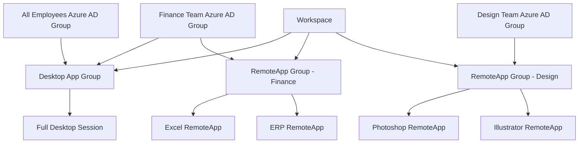

# How to Assign Users and Groups to Application Groups in Azure Virtual Desktop Workspaces

Author: [nawazdhandala](https://www.github.com/nawazdhandala)

Tags: Azure, Virtual Desktop, Application Groups, RBAC, User Management, Workspace, Access Control

Description: Learn how to assign users and groups to application groups in Azure Virtual Desktop workspaces to control who can access desktops and published applications.

---

Azure Virtual Desktop does not work on an "everyone gets everything" model. You control exactly who can access which desktops and applications through a combination of application groups, workspaces, and role assignments. A finance team might need full desktops with Excel and their ERP system, while developers need a desktop with Visual Studio. Marketing gets published RemoteApps for their design tools. Each group of users sees only what they are authorized to use.

This guide covers the access control model in Azure Virtual Desktop and walks through assigning users and groups to application groups within workspaces.

## Understanding the Access Model

The access control hierarchy in AVD has four layers:



1. **Host Pool** - The collection of VMs. Users do not connect to the host pool directly.
2. **Application Groups** - Define what is available (a full desktop or specific apps). Application groups belong to a host pool.
3. **Workspace** - Groups application groups together into a feed that users can discover.
4. **Role Assignments** - Determine which users or groups can access each application group.

A host pool can have one Desktop application group and multiple RemoteApp application groups. Users assigned to the Desktop group get a full Windows desktop. Users assigned to a RemoteApp group see only the published applications.

Important rule: a user cannot be assigned to both the Desktop application group and a RemoteApp application group on the same host pool. It is one or the other.

## Prerequisites

- An Azure Virtual Desktop deployment with at least one host pool.
- At least one application group (Desktop or RemoteApp) created.
- A workspace with the application group(s) associated.
- Azure AD users or groups to assign.

## Step 1: Create Application Groups

If you have not already created application groups, set them up.

### Desktop Application Group

A Desktop application group is created automatically with every host pool. Check if one exists.

```bash
# List application groups for your host pool
az desktopvirtualization applicationgroup list \
  --resource-group myResourceGroup \
  --output table
```

If you need to create one manually:

```bash
# Create a Desktop application group
az desktopvirtualization applicationgroup create \
  --resource-group myResourceGroup \
  --name avd-desktop-ag \
  --host-pool-arm-path "/subscriptions/<sub-id>/resourceGroups/myResourceGroup/providers/Microsoft.DesktopVirtualization/hostpools/avd-pooled-hp" \
  --application-group-type Desktop \
  --location eastus \
  --friendly-name "Full Desktop"
```

### RemoteApp Application Group

RemoteApp groups let you publish individual applications that appear in the user's local Start menu or taskbar.

```bash
# Create a RemoteApp application group
az desktopvirtualization applicationgroup create \
  --resource-group myResourceGroup \
  --name avd-finance-apps-ag \
  --host-pool-arm-path "/subscriptions/<sub-id>/resourceGroups/myResourceGroup/providers/Microsoft.DesktopVirtualization/hostpools/avd-pooled-hp" \
  --application-group-type RemoteApp \
  --location eastus \
  --friendly-name "Finance Applications"
```

### Add Applications to RemoteApp Group

Publish specific applications within the RemoteApp group.

```bash
# Add Excel as a published application
az desktopvirtualization application create \
  --resource-group myResourceGroup \
  --application-group-name avd-finance-apps-ag \
  --name Excel \
  --friendly-name "Microsoft Excel" \
  --file-path "C:\Program Files\Microsoft Office\root\Office16\EXCEL.EXE" \
  --icon-path "C:\Program Files\Microsoft Office\root\Office16\EXCEL.EXE" \
  --icon-index 0 \
  --command-line-setting DoNotAllow \
  --show-in-portal true

# Add the ERP application
az desktopvirtualization application create \
  --resource-group myResourceGroup \
  --application-group-name avd-finance-apps-ag \
  --name ERPClient \
  --friendly-name "ERP System" \
  --file-path "C:\Program Files\ERPVendor\ERPClient.exe" \
  --icon-path "C:\Program Files\ERPVendor\ERPClient.exe" \
  --icon-index 0 \
  --command-line-setting DoNotAllow \
  --show-in-portal true
```

## Step 2: Associate Application Groups with a Workspace

Application groups must be associated with a workspace for users to discover them.

```bash
# Create a workspace if you do not have one
az desktopvirtualization workspace create \
  --resource-group myResourceGroup \
  --name avd-workspace \
  --location eastus \
  --friendly-name "Company Virtual Desktop"

# Associate multiple application groups with the workspace
az desktopvirtualization workspace update \
  --resource-group myResourceGroup \
  --name avd-workspace \
  --application-group-references \
    "/subscriptions/<sub-id>/resourceGroups/myResourceGroup/providers/Microsoft.DesktopVirtualization/applicationgroups/avd-desktop-ag" \
    "/subscriptions/<sub-id>/resourceGroups/myResourceGroup/providers/Microsoft.DesktopVirtualization/applicationgroups/avd-finance-apps-ag"
```

## Step 3: Assign Individual Users

Assign users to application groups using Azure RBAC. The required role is `Desktop Virtualization User`.

```bash
# Assign a single user to the Desktop application group
az role assignment create \
  --assignee "john.smith@company.com" \
  --role "Desktop Virtualization User" \
  --scope "/subscriptions/<sub-id>/resourceGroups/myResourceGroup/providers/Microsoft.DesktopVirtualization/applicationgroups/avd-desktop-ag"
```

Verify the assignment:

```bash
# List role assignments for an application group
az role assignment list \
  --scope "/subscriptions/<sub-id>/resourceGroups/myResourceGroup/providers/Microsoft.DesktopVirtualization/applicationgroups/avd-desktop-ag" \
  --output table
```

## Step 4: Assign Azure AD Groups

For larger deployments, assigning Azure AD groups is far more manageable than individual users.

```bash
# First, get the Azure AD group's object ID
GROUP_ID=$(az ad group show --group "Finance Team" --query "id" --output tsv)

# Assign the group to the Finance applications group
az role assignment create \
  --assignee-object-id "$GROUP_ID" \
  --assignee-principal-type Group \
  --role "Desktop Virtualization User" \
  --scope "/subscriptions/<sub-id>/resourceGroups/myResourceGroup/providers/Microsoft.DesktopVirtualization/applicationgroups/avd-finance-apps-ag"

# Assign the same group to the Desktop application group
az role assignment create \
  --assignee-object-id "$GROUP_ID" \
  --assignee-principal-type Group \
  --role "Desktop Virtualization User" \
  --scope "/subscriptions/<sub-id>/resourceGroups/myResourceGroup/providers/Microsoft.DesktopVirtualization/applicationgroups/avd-desktop-ag"
```

Using groups lets you manage access through Azure AD group membership rather than modifying AVD role assignments every time someone joins or leaves the team.

## Step 5: Set Up Multiple Application Groups for Different Teams

A common pattern is creating separate RemoteApp groups for different departments.

```bash
# Create application groups for different departments
az desktopvirtualization applicationgroup create \
  --resource-group myResourceGroup \
  --name avd-design-apps-ag \
  --host-pool-arm-path "/subscriptions/<sub-id>/resourceGroups/myResourceGroup/providers/Microsoft.DesktopVirtualization/hostpools/avd-pooled-hp" \
  --application-group-type RemoteApp \
  --location eastus \
  --friendly-name "Design Applications"

az desktopvirtualization applicationgroup create \
  --resource-group myResourceGroup \
  --name avd-dev-apps-ag \
  --host-pool-arm-path "/subscriptions/<sub-id>/resourceGroups/myResourceGroup/providers/Microsoft.DesktopVirtualization/hostpools/avd-pooled-hp" \
  --application-group-type RemoteApp \
  --location eastus \
  --friendly-name "Developer Tools"

# Add apps to each group
az desktopvirtualization application create \
  --resource-group myResourceGroup \
  --application-group-name avd-design-apps-ag \
  --name Photoshop \
  --friendly-name "Adobe Photoshop" \
  --file-path "C:\Program Files\Adobe\Adobe Photoshop 2024\Photoshop.exe" \
  --command-line-setting DoNotAllow \
  --show-in-portal true

az desktopvirtualization application create \
  --resource-group myResourceGroup \
  --application-group-name avd-dev-apps-ag \
  --name VSCode \
  --friendly-name "Visual Studio Code" \
  --file-path "C:\Program Files\Microsoft VS Code\Code.exe" \
  --command-line-setting DoNotAllow \
  --show-in-portal true

# Associate all groups with the workspace
az desktopvirtualization workspace update \
  --resource-group myResourceGroup \
  --name avd-workspace \
  --application-group-references \
    "/subscriptions/<sub-id>/resourceGroups/myResourceGroup/providers/Microsoft.DesktopVirtualization/applicationgroups/avd-desktop-ag" \
    "/subscriptions/<sub-id>/resourceGroups/myResourceGroup/providers/Microsoft.DesktopVirtualization/applicationgroups/avd-finance-apps-ag" \
    "/subscriptions/<sub-id>/resourceGroups/myResourceGroup/providers/Microsoft.DesktopVirtualization/applicationgroups/avd-design-apps-ag" \
    "/subscriptions/<sub-id>/resourceGroups/myResourceGroup/providers/Microsoft.DesktopVirtualization/applicationgroups/avd-dev-apps-ag"

# Assign groups
DESIGN_GROUP_ID=$(az ad group show --group "Design Team" --query "id" --output tsv)
DEV_GROUP_ID=$(az ad group show --group "Development Team" --query "id" --output tsv)

az role assignment create \
  --assignee-object-id "$DESIGN_GROUP_ID" \
  --assignee-principal-type Group \
  --role "Desktop Virtualization User" \
  --scope "/subscriptions/<sub-id>/resourceGroups/myResourceGroup/providers/Microsoft.DesktopVirtualization/applicationgroups/avd-design-apps-ag"

az role assignment create \
  --assignee-object-id "$DEV_GROUP_ID" \
  --assignee-principal-type Group \
  --role "Desktop Virtualization User" \
  --scope "/subscriptions/<sub-id>/resourceGroups/myResourceGroup/providers/Microsoft.DesktopVirtualization/applicationgroups/avd-dev-apps-ag"
```

## Step 6: Use Conditional Access Policies

For additional security, apply Azure AD Conditional Access policies to control how users access AVD.

Common policies include:

- Require multi-factor authentication (MFA) for AVD connections.
- Block access from non-compliant devices.
- Require managed devices for full desktop access but allow RemoteApps from any device.
- Restrict access to specific geographic locations.

Configure these in Azure AD > Security > Conditional Access. Target the "Azure Virtual Desktop" cloud app.

## Step 7: Verify User Access

After configuring everything, verify what a specific user can access.

```bash
# List all role assignments for a specific user across all application groups
az role assignment list \
  --assignee "john.smith@company.com" \
  --query "[?roleDefinitionName=='Desktop Virtualization User']" \
  --output table
```

Have the user connect through the AVD web client at `https://client.wvd.microsoft.com/arm/webclient` or the Windows Desktop client. They should see only the workspaces and applications they have been assigned.

## Managing Access at Scale

For organizations with hundreds of users, use automation to manage assignments.

```powershell
# PowerShell script to sync AVD access from a CSV file
# CSV format: UserPrincipalName,ApplicationGroupName
$assignments = Import-Csv "C:\AVD\user-assignments.csv"

foreach ($assignment in $assignments) {
    $scope = "/subscriptions/$subId/resourceGroups/myResourceGroup/providers/Microsoft.DesktopVirtualization/applicationgroups/$($assignment.ApplicationGroupName)"

    # Check if assignment already exists
    $existing = az role assignment list --assignee $assignment.UserPrincipalName --scope $scope --query "[?roleDefinitionName=='Desktop Virtualization User']" | ConvertFrom-Json

    if ($existing.Count -eq 0) {
        az role assignment create `
          --assignee $assignment.UserPrincipalName `
          --role "Desktop Virtualization User" `
          --scope $scope
        Write-Host "Assigned $($assignment.UserPrincipalName) to $($assignment.ApplicationGroupName)"
    } else {
        Write-Host "Already assigned: $($assignment.UserPrincipalName) to $($assignment.ApplicationGroupName)"
    }
}
```

## Common Mistakes

**Assigning users to both Desktop and RemoteApp groups on the same host pool**: This is not supported. Users get the Desktop application group if assigned to both, and the RemoteApp applications are hidden.

**Forgetting to associate the application group with a workspace**: Users cannot discover application groups that are not in a workspace. The assignments work, but the user sees nothing in their feed.

**Not refreshing the client feed**: After making assignment changes, users may need to manually refresh their AVD client feed (or wait for the automatic refresh interval, typically 6 hours).

**Using direct user assignments instead of groups**: This works but does not scale. When someone leaves the finance team, you need to manually remove their AVD assignment. With Azure AD groups, removing them from the group automatically revokes access.

## Summary

Access control in Azure Virtual Desktop revolves around application groups and RBAC role assignments. The `Desktop Virtualization User` role at the application group scope is what grants access. By using Azure AD groups for assignments and organizing applications into logical application groups per department or function, you create a manageable access model that scales. The key is planning your application group structure upfront - which users need full desktops versus published apps, and how to group applications by business function. Once the structure is in place, onboarding a new user is as simple as adding them to the right Azure AD group.
