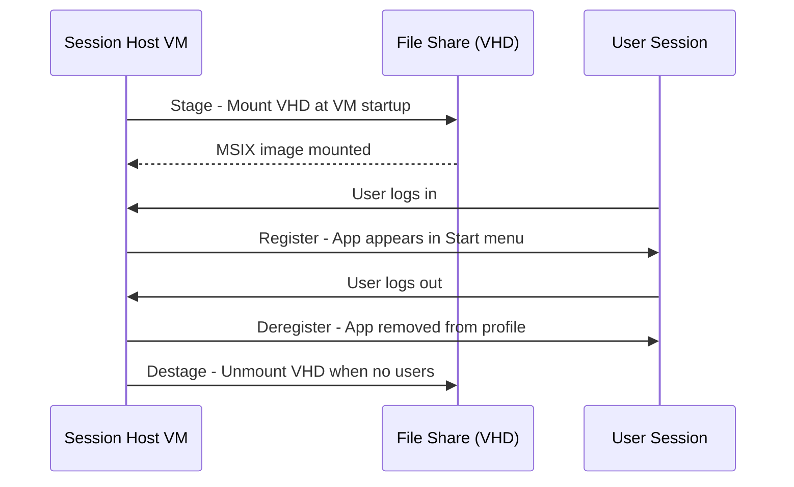

# How to Attach MSIX App Packages to Azure Virtual Desktop Session Hosts

Author: [nawazdhandala](https://www.github.com/nawazdhandala)

Tags: Azure, Virtual Desktop, MSIX, App Attach, Application Delivery, VDI, Windows

Description: Learn how to use MSIX app attach to deliver applications to Azure Virtual Desktop session hosts without installing them directly on the VM images.

---

Managing applications on Azure Virtual Desktop session hosts has a fundamental tension: you want a consistent, clean base image, but users need different applications. Traditionally, you either install everything on the image (making it large and hard to maintain) or use App-V or similar technologies. MSIX app attach offers a cleaner approach - applications are packaged in MSIX format, stored on a file share, and dynamically attached to session hosts at login. The apps appear installed, but they are not baked into the image.

This guide covers the full workflow: creating MSIX packages, setting up the file share, and configuring app attach in Azure Virtual Desktop.

## How MSIX App Attach Works

MSIX app attach uses a virtual disk (VHD, VHDX, or CIM) containing the MSIX package. At different stages of the user session, the app attach process performs four operations:

1. **Stage** - The VHD is mounted on the session host and the MSIX package is registered with the OS. This happens when the VM starts.
2. **Register** - The package is registered for the specific user at login. The application appears in the Start menu and file associations are configured.
3. **Deregister** - When the user logs out, the package is deregistered from their profile.
4. **Destage** - When the last user logs out (or the VM shuts down), the VHD is unmounted.



This means applications are never installed on the base image, making image management simpler. You update an app by replacing the MSIX package on the share - no image rebuilds needed.

## Prerequisites

- An Azure Virtual Desktop host pool with session hosts running Windows 11 Enterprise multi-session (21H2 or later).
- An Azure Files share or SMB share accessible from session hosts.
- The MSIX Packaging Tool (available from the Microsoft Store).
- A test application to package.
- Session hosts must have certificates that match the MSIX package signing certificate.

## Step 1: Create the MSIX Package

If your application is not already in MSIX format, convert it using the MSIX Packaging Tool.

1. Install the MSIX Packaging Tool from the Microsoft Store.
2. Launch it and select "Application package."
3. Choose "Create your package on this computer" (or use a clean VM for best results).
4. Select the installer for your application (EXE or MSI).
5. Provide package information:
   - **Package name**: com.company.applicationname
   - **Publisher**: CN=YourCompany
   - **Version**: 1.0.0.0
6. Run through the installation wizard.
7. The tool captures all changes and produces an MSIX package.

For automated packaging, use the MSIX Packaging Tool command line.

```powershell
# Convert an MSI installer to MSIX format using the command line tool
MsixPackagingTool.exe create-package `
  --template "C:\Packaging\conversion-template.xml"
```

The conversion template XML defines the input installer and output settings:

```xml
<?xml version="1.0" encoding="utf-8"?>
<MsixPackagingToolTemplate>
  <Installer Path="C:\Installers\MyApp-Setup.msi" />
  <PackageInformation
    PackageName="com.company.myapp"
    PackageDisplayName="My Application"
    PublisherName="CN=MyCompany"
    PublisherDisplayName="My Company"
    Version="1.0.0.0" />
  <SaveLocation PackagePath="C:\Output\MyApp.msix" />
</MsixPackagingToolTemplate>
```

## Step 2: Sign the Package

MSIX packages must be signed with a code signing certificate. For testing, create a self-signed certificate. For production, use a certificate from a trusted CA.

```powershell
# Create a self-signed certificate for MSIX signing (testing only)
$cert = New-SelfSignedCertificate `
  -Type Custom `
  -Subject "CN=MyCompany, O=MyCompany, C=US" `
  -KeyUsage DigitalSignature `
  -FriendlyName "MSIX Signing Certificate" `
  -CertStoreLocation "Cert:\CurrentUser\My" `
  -TextExtension @("2.5.29.37={text}1.3.6.1.5.5.7.3.3")

# Export the certificate for distribution to session hosts
Export-Certificate -Cert $cert -FilePath "C:\Certs\MSIXSigning.cer"

# Sign the MSIX package
# Requires the Windows SDK SignTool
& "C:\Program Files (x86)\Windows Kits\10\bin\10.0.22621.0\x64\signtool.exe" sign `
  /fd SHA256 `
  /a `
  /f "C:\Certs\MSIXSigning.pfx" `
  /p "certificate-password" `
  "C:\Output\MyApp.msix"
```

Install the signing certificate on all session hosts. For self-signed certificates, install it in the "Trusted People" certificate store.

```powershell
# Install the signing certificate on each session host
# Run this via GPO or a custom script extension
Import-Certificate -FilePath "\\share\certs\MSIXSigning.cer" -CertStoreLocation "Cert:\LocalMachine\TrustedPeople"
```

## Step 3: Create the VHD Image

Convert the MSIX package into a VHD image that can be mounted by app attach.

```powershell
# Create a new VHD for the MSIX package
$vhdPath = "C:\AppAttach\MyApp.vhdx"
$msixPath = "C:\Output\MyApp.msix"
$vhdSize = 500MB

# Create and mount a new VHDX
New-VHD -SizeBytes $vhdSize -Path $vhdPath -Dynamic
$disk = Mount-VHD -Path $vhdPath -Passthru
$diskNumber = $disk.DiskNumber

# Initialize the disk and create a partition
Initialize-Disk -Number $diskNumber -PartitionStyle GPT
$partition = New-Partition -DiskNumber $diskNumber -UseMaximumSize -AssignDriveLetter
Format-Volume -Partition $partition -FileSystem NTFS -NewFileSystemLabel "MSIXAppAttach" -Confirm:$false

# Get the drive letter
$driveLetter = $partition.DriveLetter

# Create the parent directory for MSIX
$msixDest = "$($driveLetter):\MSIXPackages"
New-Item -Path $msixDest -ItemType Directory

# Use msixmgr.exe to unpack the MSIX into the VHD
# Download msixmgr.exe from Microsoft
& "C:\Tools\msixmgr\x64\msixmgr.exe" -Unpack `
  -packagePath $msixPath `
  -destination "$msixDest\MyApp" `
  -applyacls

# Dismount the VHD
Dismount-VHD -Path $vhdPath
```

## Step 4: Upload to the File Share

Copy the VHD image to a file share accessible by all session hosts.

```bash
# Upload the VHD to the Azure Files share used for app attach
az storage file upload \
  --account-name avdappstorage \
  --share-name msix-packages \
  --source "C:\AppAttach\MyApp.vhdx" \
  --path "MyApp.vhdx"
```

The file share needs to grant session hosts read access. If you are using the same Azure Files share as FSLogix, create a separate share for app attach packages.

```bash
# Create a dedicated share for MSIX packages
az storage share-rm create \
  --resource-group myResourceGroup \
  --storage-account avdappstorage \
  --name msix-packages \
  --quota 256
```

Assign permissions so session host computer accounts can read the share.

## Step 5: Add the MSIX Package to Azure Virtual Desktop

In the Azure portal, configure app attach for your host pool.

1. Navigate to Azure Virtual Desktop > Host pools > your host pool.
2. Under Manage, click "MSIX packages."
3. Click "Add."
4. Enter the image path: `\\avdappstorage.file.core.windows.net\msix-packages\MyApp.vhdx`
5. Select the MSIX package from the discovered list.
6. Configure:
   - **Registration type**: On-demand (registers when user logs in) or Blocking (registers at stage time)
   - **State**: Active
   - **Display name**: My Application
7. Click Add.

Using the CLI:

```bash
# Add the MSIX package to the host pool
az desktopvirtualization msix-package create \
  --resource-group myResourceGroup \
  --host-pool-name avd-pooled-hp \
  --msix-package-full-name "com.company.myapp_1.0.0.0_x64__abcdef123456" \
  --display-name "My Application" \
  --image-path "\\\\avdappstorage.file.core.windows.net\\msix-packages\\MyApp.vhdx" \
  --is-active true \
  --is-regular-registration true \
  --package-application "[{\"appId\": \"MyApp\", \"description\": \"My Application\", \"appUserModelId\": \"com.company.myapp\", \"friendlyName\": \"My Application\", \"iconImageName\": \"MyApp.png\"}]"
```

## Step 6: Publish the Application

Create a RemoteApp application group that references the MSIX package, or add the app to an existing application group.

```bash
# Create a RemoteApp application group if you do not have one
az desktopvirtualization applicationgroup create \
  --resource-group myResourceGroup \
  --name avd-remoteapp-ag \
  --host-pool-arm-path "/subscriptions/<sub-id>/resourceGroups/myResourceGroup/providers/Microsoft.DesktopVirtualization/hostpools/avd-pooled-hp" \
  --application-group-type RemoteApp \
  --location eastus

# Add the MSIX app to the application group
az desktopvirtualization application create \
  --resource-group myResourceGroup \
  --application-group-name avd-remoteapp-ag \
  --name MyApplication \
  --friendly-name "My Application" \
  --msix-package-family-name "com.company.myapp_abcdef123456" \
  --msix-package-application-id "MyApp" \
  --command-line-setting DoNotAllow \
  --show-in-portal true
```

## Step 7: Test and Verify

Log in to a session host and verify the application appears and launches correctly.

```powershell
# On a session host, check mounted MSIX packages
Get-AppxPackage | Where-Object { $_.Name -like "*myapp*" }

# Check the app attach staging status
Get-CimInstance -ClassName Win32_Volume | Where-Object { $_.Label -like "*MSIX*" }

# View app attach event logs for troubleshooting
Get-WinEvent -LogName "Microsoft-Windows-AppXDeploymentServer/Operational" -MaxEvents 20 | Format-List
```

## Updating Applications

One of the biggest advantages of app attach is simplified updates. To update an application:

1. Create a new MSIX package with an incremented version number.
2. Create a new VHD image with the updated package.
3. Upload it to the file share.
4. Update the MSIX package configuration in the host pool to point to the new VHD.
5. Users get the updated application at their next login - no image rebuilds.

## Troubleshooting Common Issues

**App does not appear after login**: Check that the signing certificate is installed in the Trusted People store on the session host. Also verify the file share is accessible and the VHD path is correct.

**Staging fails**: Check that the session host has access to the file share. Test SMB connectivity from the session host using `Test-Path "\\share\path"`.

**Certificate trust errors**: If using a self-signed certificate, it must be in `Cert:\LocalMachine\TrustedPeople`. If using an enterprise CA, the CA chain must be trusted.

**Slow app launch**: The first launch after staging may be slower as the package initializes. Subsequent launches should be fast.

## Summary

MSIX app attach separates application delivery from image management in Azure Virtual Desktop. Applications live on a file share as VHD images and are dynamically attached to session hosts when needed. This means you can maintain a lean base image and deliver applications independently, update apps without rebuilding images, and assign different apps to different user groups. The setup involves packaging applications as MSIX, expanding them into VHD images, hosting them on a file share, and configuring the host pool to use them. The result is a more flexible and maintainable AVD environment.
