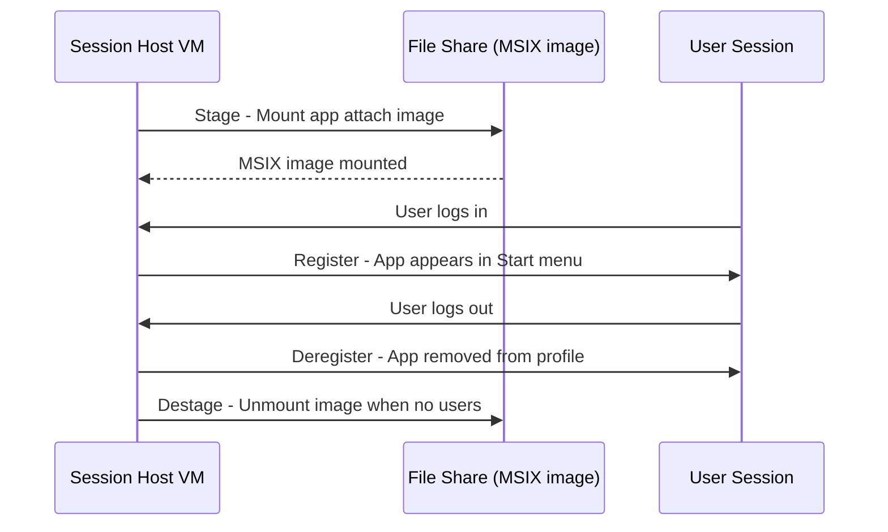

# How to Attach MSIX App Packages to Azure Virtual Desktop Session Hosts

Author: [nawazdhandala](https://www.github.com/nawazdhandala)

Tags: Azure, Virtual Desktop, MSIX, App Attach, Application Delivery, VDI, Window

Description: Learn how to use MSIX app attach to deliver applications to Azure Virtual Desktop session hosts without installing them directly on the VM images.

---

Managing applications on Azure Virtual Desktop session hosts has a fundamental tension: you want a consistent, clean base image, but users need different applications. Traditionally, you either install everything on the image (making it large and hard to maintain) or use App-V or similar technologies. MSIX app attach offers a cleaner approach - applications are packaged in MSIX format, stored on a file share, and dynamically attached to session hosts at login. The apps appear installed, but they are not baked into the image.

This guide covers the full workflow: creating MSIX packages, setting up the file share, and configuring app attach in Azure Virtual Desktop.

## How MSIX App Attach Works

MSIX app attach uses a virtual disk (VHD, VHDX, or CIM) containing the MSIX package. At different stages of the user session, the app attach process performs four operations:

1. **Stage** - The disk image is mounted on the session host from the file share when the application is needed for an assigned user session.
2. **Register** - The package is registered for the specific user at login. The application appears in the Start menu and file associations are configured.
3. **Deregister** - When the user logs out, the package is deregistered from their profile.
4. **Destage** - When the last user logs out (or the VM shuts down), the VHD is unmounted.


```mermaid
sequenceDiagram
    participant VM as Session Host VM
    participant Share as File Share (MSIX image)
    participant User as User Session

    VM->>Share: Stage - Mount app attach image
    Share-->>VM: MSIX image mounted
    User->>VM: User logs in
    VM->>User: Register - App appears in Start menu
    User->>VM: User logs out
    VM->>User: Deregister - App removed from profile
    VM->>Share: Destage - Unmount image when no users
```

This means applications are never installed on the base image, making image management simpler. You update an app by creating a new MSIX image and updating the app attach package configuration - no image rebuilds needed.

## Prerequisites

- An Azure Virtual Desktop host pool with session hosts running a supported Windows client or server operating system.
- An Azure Files share or SMB share accessible from session hosts. The file share should be in the same Azure region as the session hosts.
- The MSIX Packaging Tool (available from the Microsoft Store).
- The Az.DesktopVirtualization PowerShell module version 4.2.1 or later.
- A test application to package.
- Session hosts must have certificates that match the MSIX package signing certificate.

## Step 1: Create the MSIX Package

If your application is not already in MSIX format, convert it using the MSIX Packaging Tool.

1. Install the MSIX Packaging Tool from the Microsoft Store.
2. Launch it and select "Application package."
3. Choose "Create your package on this computer" (or use a clean VM for best results).
4. Select the installer for your application (EXE or MSI).
5. Provide package information:
   - **Package name**: com.company.applicationname
   - **Publisher**: CN=YourCompany
   - **Version**: 1.0.0.0
6. Run through the installation wizard.
7. The tool captures all changes and produces an MSIX package.

For automated packaging, use the MSIX Packaging Tool command line.

```powershell
# Convert an MSI installer to MSIX format using the command line tool

MsixPackagingTool.exe create-package `
  --template "C:\Packaging\conversion-template.xml"
```

The conversion template XML defines the input installer and output settings:

```xml
<?xml version="1.0" encoding="utf-8"?>
<MsixPackagingToolTemplate
    xmlns="http://schemas.microsoft.com/appx/msixpackagingtool/template/2018">
  <SaveLocation PackagePath="C:\Output\MyApp.msix" />
  <Installer Path="C:\Installers\MyApp-Setup.msi" />
  <PackageInformation
    PackageName="com.company.myapp"
    PackageDisplayName="My Application"
    PublisherName="CN=MyCompany"
    PublisherDisplayName="My Company"
    Version="1.0.0.0" />
</MsixPackagingToolTemplate>
```

## Step 2: Sign the Package

MSIX packages must be signed with a code signing certificate. For testing, create a self-signed certificate. For production, use a certificate from a trusted CA.

```powershell
# Create a self-signed certificate for MSIX signing (testing only)
$cert = New-SelfSignedCertificate `
  -Type Custom `
  -Subject "CN=MyCompany" `
  -KeyUsage DigitalSignature `
  -FriendlyName "MSIX Signing Certificate" `
  -CertStoreLocation "Cert:\CurrentUser\My" `
  -TextExtension @("2.5.29.37={text}1.3.6.1.5.5.7.3.3")

# Export the public certificate for distribution to session hosts
New-Item -Path "C:\Certs" -ItemType Directory -Force
Export-Certificate -Cert $cert -FilePath "C:\Certs\MSIXSigning.cer"

# Export the certificate with the private key for signing
$password = ConvertTo-SecureString -String "certificate-password" -Force -AsPlainText
Export-PfxCertificate -Cert $cert -FilePath "C:\Certs\MSIXSigning.pfx" -Password $password

# Sign the MSIX package
# Requires the Windows SDK SignTool
& "C:\Program Files (x86)\Windows Kits\10\bin\10.0.22621.0\x64\signtool.exe" sign `
  /fd SHA256 `
  /a `
  /f "C:\Certs\MSIXSigning.pfx" `
  /p "certificate-password" `
  "C:\Output\MyApp.msix"
```

Install the signing certificate on all session hosts. For self-signed certificates, install it in the "Trusted People" certificate store.

```powershell
# Install the signing certificate on each session host
# Run this via GPO or a custom script extension
Import-Certificate -FilePath "\\share\certs\MSIXSigning.cer" -CertStoreLocation "Cert:\LocalMachine\TrustedPeople"
```

## Step 3: Create the VHDX Image

Convert the MSIX package into a VHDX image that can be mounted by app attach.

```powershell
# Create a new VHDX app attach image from the MSIX package
$msixPath = "C:\Output\MyApp.msix"
$vhdPath = "C:\AppAttach\MyApp.vhdx"
New-Item -Path "C:\AppAttach" -ItemType Directory -Force

# Use msixmgr.exe to create the VHDX and unpack the MSIX into it
& "C:\Tools\msixmgr\x64\msixmgr.exe" -Unpack `
  -packagePath $msixPath `
  -destination $vhdPath `
  -applyACLs `
  -create `
  -fileType vhdx `
  -rootDirectory apps
```

## Step 4: Upload to the File Share

Copy the VHDX image to a file share accessible by all session hosts.

```bash
# Upload the VHDX to the Azure Files share used for app attach
az storage file upload \
  --account-name avdappstorage \
  --share-name msix-packages \
  --source "C:\AppAttach\MyApp.vhdx" \
  --path "MyApp.vhdx"
```

The file share needs to grant session hosts read access. If you are using the same Azure Files share as FSLogix, create a separate share for app attach packages.

```bash
# Create a dedicated share for MSIX packages
az storage share-rm create \
  --resource-group myResourceGroup \
  --storage-account avdappstorage \
  --name msix-packages \
  --quota 256
```

Assign permissions so session host computer accounts can read the share.

## Step 5: Add the MSIX Package to Azure Virtual Desktop

In the Azure portal, configure app attach for your host pool.

1. Navigate to Azure Virtual Desktop > App Attach.
2. Click "Create."
3. Select the subscription, resource group, host pool, and region.
4. Enter the image path: `\\avdappstorage.file.core.windows.net\msix-packages\MyApp.vhdx`
5. Select the MSIX package from the image.
6. Configure:
   - **Registration type**: On-demand (partial registration at sign-in, full registration when the user starts the app) or Register at log on
   - **State**: Active
   - **Display name**: My Application
7. Assign the package to the host pool and to the users or groups that should receive the app.
8. Click Add.

Using PowerShell:

```powershell
# Add the MSIX image as an App Attach package
Import-Module Az.DesktopVirtualization

$imagePath = "\\avdappstorage.file.core.windows.net\msix-packages\MyApp.vhdx"
$app = Import-AzWvdAppAttachPackageInfo `
  -HostPoolName "avd-pooled-hp" `
  -ResourceGroupName "myResourceGroup" `
  -Path $imagePath

New-AzWvdAppAttachPackage `
  -Name "MyApp" `
  -ResourceGroupName "myResourceGroup" `
  -Location "eastus" `
  -FailHealthCheckOnStagingFailure "NeedsAssistance" `
  -ImageIsRegularRegistration $false `
  -ImageDisplayName "My Application" `
  -ImageIsActive $true `
  -AppAttachPackage $app

# Assign the package to the host pool
$hostPoolId = (Get-AzWvdHostPool | Where-Object { $_.Name -eq "avd-pooled-hp" }).Id
Update-AzWvdAppAttachPackage `
  -Name "MyApp" `
  -ResourceGroupName "myResourceGroup" `
  -Location "eastus" `
  -HostPoolReference @($hostPoolId)
```

## Step 6: Publish the Application

Create a RemoteApp application group that references the MSIX package, or add the app to an existing application group.

```powershell
# Create a RemoteApp application group if you do not have one
New-AzWvdApplicationGroup `
  -ResourceGroupName "myResourceGroup" `
  -Name "avd-remoteapp-ag" `
  -Location "eastus" `
  -FriendlyName "Remote Apps" `
  -Description "RemoteApp application group" `
  -HostPoolArmPath "/subscriptions/<sub-id>/resourceGroups/myResourceGroup/providers/Microsoft.DesktopVirtualization/hostPools/avd-pooled-hp" `
  -ApplicationGroupType "RemoteApp" `
  -ShowInFeed

# Add the MSIX app to the application group
New-AzWvdApplication `
  -ResourceGroupName "myResourceGroup" `
  -GroupName "avd-remoteapp-ag" `
  -Name "MyApplication" `
  -ApplicationType "MsixApplication" `
  -MsixPackageFamilyName $app.ImagePackageFamilyName `
  -MsixPackageApplicationId "MyApp" `
  -CommandLineSetting "DoNotAllow"
```

## Step 7: Test and Verify

Log in to a session host and verify the application appears and launches correctly.

```powershell
# On a session host, check mounted MSIX packages
Get-AppxPackage | Where-Object { $_.Name -like "*myapp*" }

# Check the app attach staging status
Get-CimInstance -ClassName Win32_Volume | Where-Object { $_.Label -like "*MSIX*" }

# View app attach event logs for troubleshooting
Get-WinEvent -LogName "Microsoft-Windows-AppXDeploymentServer/Operational" -MaxEvents 20 | Format-List
```

## Updating Applications

One of the biggest advantages of app attach is simplified updates. To update an application:

1. Create a new MSIX package with an incremented version number.
2. Create a new MSIX image with the updated package.
3. Upload it to the file share.
4. Update the app attach package configuration to point to the new image.
5. Users get the updated application at their next login - no image rebuilds.

## Troubleshooting Common Issues

**App does not appear after login**: Check that the signing certificate is installed in the Trusted People store on the session host. Also verify the file share is accessible and the image path is correct.

**Staging fails**: Check that the session host has access to the file share. Test SMB connectivity from the session host using `Test-Path "\\share\path"`.

**Certificate trust errors**: If using a self-signed certificate, it must be in `Cert:\LocalMachine\TrustedPeople`. If using an enterprise CA, the CA chain must be trusted.

**Slow app launch**: The first launch after staging may be slower as the package initializes. Subsequent launches should be fast.

## Summary

MSIX app attach separates application delivery from image management in Azure Virtual Desktop. Applications live on a file share as app attach images and are dynamically attached to session hosts when needed. This means you can maintain a lean base image and deliver applications independently, update apps without rebuilding images, and assign different apps to different user groups. The setup involves packaging applications as MSIX, expanding them into app attach images, hosting them on a file share, and configuring the host pool to use them. The result is a more flexible and maintainable AVD environment.
