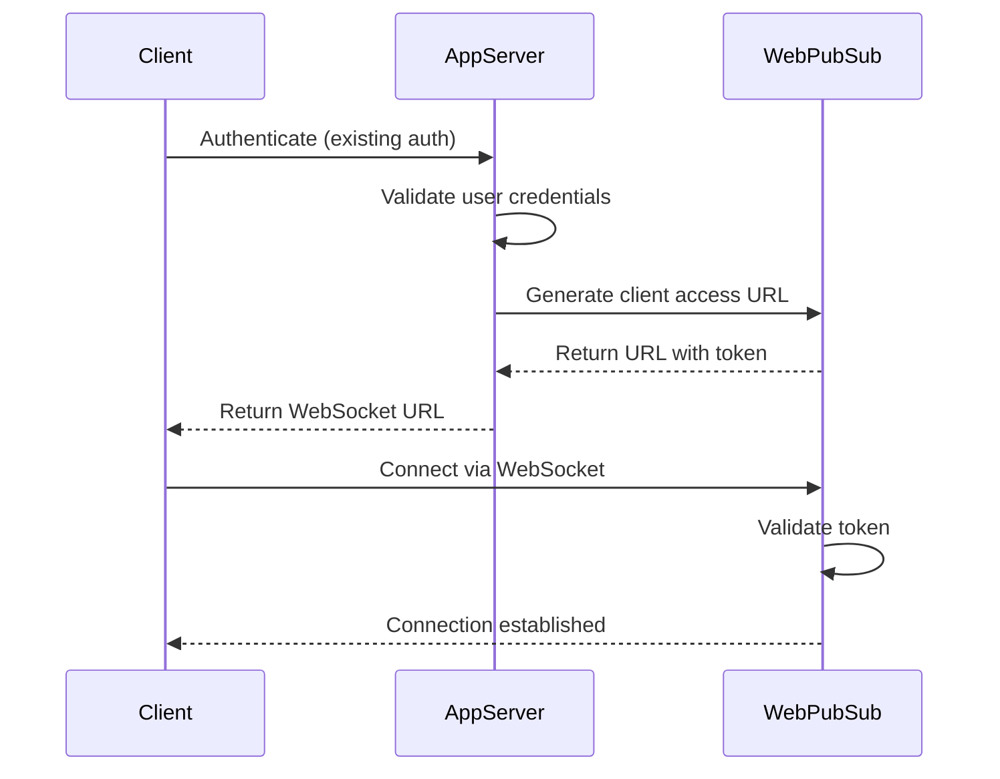

# How to Authenticate Clients in Azure Web PubSub with Access Tokens

Author: [nawazdhandala](https://www.github.com/nawazdhandala)

Tags: Azure, Web PubSub, Authentication, Access Tokens, Security, WebSocket, Identity

Description: Understand how to authenticate WebSocket clients in Azure Web PubSub using access tokens, custom claims, and role-based permissions.

---

When you expose WebSocket connections to clients, authentication is not optional. Without proper authentication, anyone who discovers your Web PubSub endpoint can connect and potentially receive sensitive data or send malicious messages. Azure Web PubSub handles authentication through access tokens that are embedded in the WebSocket connection URL. Your server generates these tokens, and the Web PubSub service validates them when clients connect.

In this post, I will cover how the token-based authentication works in Azure Web PubSub, how to generate tokens with different permission levels, and how to integrate this with your existing authentication system.

## How Web PubSub Authentication Works

The authentication flow follows a straightforward pattern:

1. The client authenticates with your application server using your existing auth mechanism (session cookies, JWT tokens, OAuth, whatever you already use).
2. Your server calls the Web PubSub SDK to generate a client access URL, which includes an embedded JWT token.
3. The client uses this URL to open a WebSocket connection to Azure Web PubSub.
4. The Web PubSub service validates the token and establishes the connection.



The token itself is a JWT that contains claims about the user, their permissions, and an expiration time. The Web PubSub service signs and verifies these tokens, so clients cannot forge them.

## Generating Access Tokens

The simplest way to generate tokens is through the server SDK. Here is a basic example.

```javascript
// token-server.js - Express server that issues Web PubSub access tokens
const express = require('express');
const { WebPubSubServiceClient } = require('@azure/web-pubsub');

const app = express();
const connectionString = process.env.WEBPUBSUB_CONNECTION_STRING;
const hubName = 'chat';
const serviceClient = new WebPubSubServiceClient(connectionString, hubName);

// Middleware that validates your application's own auth (simplified here)
function requireAuth(req, res, next) {
  const authHeader = req.headers.authorization;
  if (!authHeader) {
    return res.status(401).json({ error: 'Authentication required' });
  }
  // In production, verify the JWT or session token here
  req.userId = 'user-from-your-auth-system';
  next();
}

// Endpoint to get a WebSocket access URL
app.get('/api/ws-token', requireAuth, async (req, res) => {
  try {
    // Generate a token tied to the authenticated user
    const tokenResponse = await serviceClient.getClientAccessUrl({
      userId: req.userId,
      expirationTimeInMinutes: 60 // Token valid for 1 hour
    });

    res.json({ url: tokenResponse.url });
  } catch (err) {
    console.error('Failed to generate token:', err);
    res.status(500).json({ error: 'Failed to generate WebSocket token' });
  }
});

app.listen(3000, () => console.log('Token server running on port 3000'));
```

The `userId` parameter is important. It ties the WebSocket connection to a specific user in your system. When your server wants to send a message to a particular user later, it can reference this user ID.

## Token Permissions with Roles

Not every client should have the same permissions. A read-only dashboard should not be able to send messages. A moderator should be able to join any group. Web PubSub uses roles to control what a client can do after connecting.

Here are the available roles:

- `webpubsub.joinLeaveGroup` - Client can join and leave groups
- `webpubsub.sendToGroup` - Client can send messages to groups
- `webpubsub.joinLeaveGroup.<group-name>` - Client can join/leave a specific group only
- `webpubsub.sendToGroup.<group-name>` - Client can send to a specific group only

```javascript
// Generate tokens with different permission levels based on user role
async function generateToken(userId, userRole) {
  let roles = [];

  if (userRole === 'viewer') {
    // Viewers can only receive messages, no send or group permissions
    roles = [];
  } else if (userRole === 'participant') {
    // Participants can join groups and send messages within them
    roles = ['webpubsub.joinLeaveGroup', 'webpubsub.sendToGroup'];
  } else if (userRole === 'moderator') {
    // Moderators get full group access
    roles = ['webpubsub.joinLeaveGroup', 'webpubsub.sendToGroup'];
  }

  const tokenResponse = await serviceClient.getClientAccessUrl({
    userId: userId,
    roles: roles,
    expirationTimeInMinutes: 60
  });

  return tokenResponse.url;
}
```

For finer control, you can scope permissions to specific groups. This is useful when a user should only participate in certain channels.

```javascript
// Restrict a user to only join and send to their team's group
async function generateTeamToken(userId, teamId) {
  const groupName = `team-${teamId}`;

  const tokenResponse = await serviceClient.getClientAccessUrl({
    userId: userId,
    roles: [
      `webpubsub.joinLeaveGroup.${groupName}`,
      `webpubsub.sendToGroup.${groupName}`
    ],
    expirationTimeInMinutes: 60
  });

  return tokenResponse.url;
}
```

## Token Expiration and Renewal

Tokens expire. The default expiration is 60 minutes, and you can set it anywhere from 1 minute to 24 hours. When a token expires, the WebSocket connection is terminated by the service. Your client needs to handle this gracefully.

```javascript
// client-with-renewal.js - Client that handles token expiration and reconnection
class PubSubClient {
  constructor(tokenEndpoint) {
    this.tokenEndpoint = tokenEndpoint;
    this.ws = null;
    this.onMessage = null;
  }

  async connect() {
    // Fetch a fresh token from your server
    const res = await fetch(this.tokenEndpoint, {
      headers: { 'Authorization': `Bearer ${getAppToken()}` }
    });
    const { url } = await res.json();

    this.ws = new WebSocket(url);

    this.ws.onopen = () => {
      console.log('Connected');
    };

    this.ws.onmessage = (event) => {
      if (this.onMessage) {
        this.onMessage(JSON.parse(event.data));
      }
    };

    this.ws.onclose = (event) => {
      console.log('Connection closed, code:', event.code);
      // Code 1008 indicates a policy violation, which includes expired tokens
      // Reconnect with a fresh token after a short delay
      setTimeout(() => this.connect(), 2000);
    };
  }
}
```

A smarter approach is to proactively renew the token before it expires. If your token has a 60-minute lifetime, start the renewal process at the 50-minute mark.

```javascript
// Schedule token renewal before expiration
function scheduleRenewal(expirationMinutes) {
  // Renew at 80% of the token lifetime
  const renewalDelay = expirationMinutes * 60 * 1000 * 0.8;

  setTimeout(async () => {
    console.log('Proactively renewing token...');
    // Close the current connection and reconnect with a fresh token
    if (this.ws) {
      this.ws.close();
    }
    await this.connect();
  }, renewalDelay);
}
```

## Using the Connect Event Handler for Server-Side Validation

For additional security, you can use the `connect` event handler to perform server-side validation when a client connects. This gives you a chance to inspect the connection request and reject it if needed.

```javascript
// connect-handler.js - Express endpoint that handles the connect event
const express = require('express');
const app = express();
app.use(express.json());

// This endpoint is called by Web PubSub when a client tries to connect
app.post('/api/pubsub/connect', (req, res) => {
  const event = req.body;

  // The userId from the token is available in the event
  const userId = event.userId;
  const connectionId = event.connectionId;

  console.log(`User ${userId} attempting to connect (${connectionId})`);

  // Perform additional validation
  if (isUserBanned(userId)) {
    // Return an error response to reject the connection
    return res.status(401).json({
      code: 'Unauthorized',
      errorMessage: 'User is banned'
    });
  }

  // Accept the connection and optionally assign groups or roles
  res.json({
    userId: userId,
    groups: ['general'], // Auto-join the user to the general group
    roles: ['webpubsub.sendToGroup.general']
  });
});
```

This two-layer approach - token-based authentication plus server-side connect validation - gives you defense in depth. Even if a token is valid, you can still reject the connection based on real-time business logic.

## Integrating with Azure Active Directory

If your application uses Azure Active Directory (Azure AD) for authentication, you can pass the user's Azure AD identity through to Web PubSub.

```javascript
// aad-integration.js - Using Azure AD identity with Web PubSub tokens
app.get('/api/ws-token', requireAzureAdAuth, async (req, res) => {
  // req.user comes from your Azure AD middleware (e.g., passport-azure-ad)
  const azureAdUser = req.user;

  const tokenResponse = await serviceClient.getClientAccessUrl({
    userId: azureAdUser.oid, // Use the Azure AD object ID as the user ID
    expirationTimeInMinutes: 60,
    roles: getRolesForUser(azureAdUser) // Map Azure AD roles to Web PubSub roles
  });

  res.json({ url: tokenResponse.url });
});

// Map Azure AD group memberships to Web PubSub permissions
function getRolesForUser(user) {
  const roles = [];

  if (user.groups.includes('admins')) {
    roles.push('webpubsub.joinLeaveGroup', 'webpubsub.sendToGroup');
  } else {
    // Regular users can only join and send to their department group
    const dept = user.department.toLowerCase();
    roles.push(
      `webpubsub.joinLeaveGroup.${dept}`,
      `webpubsub.sendToGroup.${dept}`
    );
  }

  return roles;
}
```

## Security Best Practices

Here are some things to keep in mind when implementing authentication for Web PubSub:

- **Keep token lifetimes short.** Use the shortest lifetime that makes sense for your use case. One hour is reasonable for most applications.
- **Always use HTTPS** for your token endpoint. The access URL contains a bearer token, and transmitting it over HTTP exposes it to interception.
- **Validate on both sides.** Use token authentication for the initial connection and the connect event handler for additional server-side checks.
- **Scope permissions tightly.** Give clients the minimum set of roles they need. Do not give `sendToGroup` to clients that only need to receive messages.
- **Rotate your connection strings** periodically. If a connection string is compromised, regenerate it immediately in the Azure portal.

## Wrapping Up

Authentication in Azure Web PubSub is built around JWT access tokens that your server generates using the SDK. The tokens carry user identity, permissions, and expiration information. Combined with the connect event handler for server-side validation, you get a flexible authentication system that integrates with whatever identity provider you already use. Keep your tokens short-lived, scope your permissions tightly, and handle reconnection gracefully, and your real-time application will be both secure and reliable.
