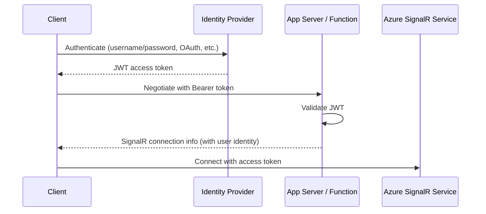

# How to Authenticate Users in Azure SignalR Service with JWT Tokens

Author: [nawazdhandala](https://www.github.com/nawazdhandala)

Tags: Azure, SignalR, JWT, Authentication, Security, Real-Time

Description: Learn how to authenticate users connecting to Azure SignalR Service using JWT tokens for secure real-time communication.

---

Real-time connections without authentication are a recipe for trouble. Any client that can reach your SignalR endpoint can connect, receive messages, and potentially send them. In production, you need to verify who is connecting and ensure they only receive messages they are authorized to see. JWT tokens are the standard way to handle this, and Azure SignalR Service supports them in both Default and Serverless modes.

In this post, I will walk through the authentication flow for both modes, show how to extract user identity from tokens, and cover the patterns that keep your real-time connections secure.

## Authentication Flow Overview

The authentication flow for SignalR differs between Default and Serverless modes, but the core concept is the same: the client obtains a JWT token from your identity provider, includes it in the SignalR connection request, and the server validates it before allowing the connection.



## Default Mode: ASP.NET Core Authentication

In Default mode, your ASP.NET Core application handles the negotiation and hub method invocations. You can use the standard ASP.NET Core authentication middleware to validate JWT tokens.

First, configure JWT authentication in your application:

```csharp
// Program.cs - Configure JWT authentication for SignalR
var builder = WebApplication.CreateBuilder(args);

// Add JWT Bearer authentication
builder.Services.AddAuthentication(JwtBearerDefaults.AuthenticationScheme)
    .AddJwtBearer(options =>
    {
        options.Authority = "https://login.microsoftonline.com/YOUR_TENANT_ID/v2.0";
        options.Audience = "api://your-api-client-id";

        // SignalR sends the token as a query parameter for WebSocket connections
        // This event handler extracts it and sets it as the bearer token
        options.Events = new JwtBearerEvents
        {
            OnMessageReceived = context =>
            {
                // For WebSocket requests, the token comes as a query parameter
                // because WebSocket does not support custom headers
                var accessToken = context.Request.Query["access_token"];
                var path = context.HttpContext.Request.Path;

                if (!string.IsNullOrEmpty(accessToken) && path.StartsWithSegments("/hub"))
                {
                    context.Token = accessToken;
                }
                return Task.CompletedTask;
            }
        };
    });

builder.Services.AddAuthorization();
builder.Services.AddSignalR().AddAzureSignalR();

var app = builder.Build();

app.UseAuthentication();
app.UseAuthorization();

// Require authentication for the hub endpoint
app.MapHub<NotificationHub>("/hub/notifications")
    .RequireAuthorization();

app.Run();
```

The critical piece is the `OnMessageReceived` event handler. WebSocket connections cannot include custom HTTP headers, so the SignalR client sends the JWT token as a query parameter named `access_token`. The event handler moves it to the authentication context so the standard JWT validation middleware can process it.

## Accessing User Identity in Hub Methods

Once authentication is configured, you can access the authenticated user's identity in your hub methods:

```csharp
// Hub with authenticated user access
// Only authenticated users can invoke these methods
[Authorize]
public class NotificationHub : Hub
{
    public override async Task OnConnectedAsync()
    {
        // Access the authenticated user's claims
        var userId = Context.UserIdentifier; // Maps to NameIdentifier claim by default
        var email = Context.User?.FindFirst("email")?.Value;
        var name = Context.User?.FindFirst("name")?.Value;

        // Add user to their personal group
        await Groups.AddToGroupAsync(Context.ConnectionId, $"user-{userId}");

        // Add user to role-based groups
        if (Context.User?.IsInRole("admin") == true)
        {
            await Groups.AddToGroupAsync(Context.ConnectionId, "admins");
        }

        await base.OnConnectedAsync();
    }

    // Only users with the 'admin' role can invoke this method
    [Authorize(Roles = "admin")]
    public async Task SendAdminAlert(string message)
    {
        await Clients.Group("admins").SendAsync("adminAlert", message);
    }

    // Any authenticated user can send a message
    public async Task SendMessage(string message)
    {
        var sender = Context.User?.FindFirst("name")?.Value ?? "Unknown";
        await Clients.All.SendAsync("newMessage", sender, message);
    }
}
```

The `Context.UserIdentifier` property is set from the `NameIdentifier` claim by default. You can customize this by implementing `IUserIdProvider`:

```csharp
// Custom user ID provider that uses the email claim instead of NameIdentifier
public class EmailBasedUserIdProvider : IUserIdProvider
{
    public string GetUserId(HubConnectionContext connection)
    {
        return connection.User?.FindFirst("email")?.Value;
    }
}

// Register it in Program.cs
builder.Services.AddSingleton<IUserIdProvider, EmailBasedUserIdProvider>();
```

## Serverless Mode: Function-Level Authentication

In Serverless mode with Azure Functions, authentication happens in the negotiate function. The negotiate function validates the JWT token and passes the user identity to SignalR Service.

```typescript
// Negotiate function with JWT validation
// Extracts user identity from the Authorization header
import { app, HttpRequest, HttpResponseInit, input, InvocationContext } from "@azure/functions";
import * as jwt from "jsonwebtoken";
import * as jwksClient from "jwks-rsa";

const signalRInput = input.generic({
    type: "signalRConnectionInfo",
    name: "connectionInfo",
    hubName: "notifications",
    // Use the validated user ID from the request processing
    userId: "{userId}"
});

app.http("negotiate", {
    methods: ["POST"],
    authLevel: "anonymous",
    extraInputs: [signalRInput],
    handler: async (request: HttpRequest, context: InvocationContext): Promise<HttpResponseInit> => {
        // Extract and validate the JWT token
        const authHeader = request.headers.get("Authorization");
        if (!authHeader || !authHeader.startsWith("Bearer ")) {
            return { status: 401, body: "Missing or invalid Authorization header" };
        }

        const token = authHeader.substring(7);

        try {
            // Validate the token (simplified - use a proper JWT validation library)
            const decoded = await validateToken(token);

            // Pass the user ID to the SignalR connection info binding
            // The binding uses this to associate the connection with the user
            const connectionInfo = context.extraInputs.get(signalRInput);

            return {
                jsonBody: connectionInfo
            };
        } catch (error) {
            return { status: 401, body: "Invalid token" };
        }
    }
});
```

For Azure Functions with App Service Authentication (Easy Auth) enabled, the user identity is automatically available in the request headers:

```typescript
// Negotiate with Easy Auth - user identity is provided automatically
// When App Service Authentication is enabled, Azure validates the token
const signalRInput = input.generic({
    type: "signalRConnectionInfo",
    name: "connectionInfo",
    hubName: "notifications",
    // Easy Auth provides the user ID in this header
    userId: "{headers.x-ms-client-principal-id}"
});
```

This is the simplest approach because Azure App Service handles all the token validation for you.

## Client-Side Token Handling

On the client side, include the token in the connection setup:

```javascript
// Get the JWT token from your authentication flow
const token = await getAccessToken();

// Connect to SignalR with the token
const connection = new signalR.HubConnectionBuilder()
    .withUrl("/hub/notifications", {
        // For Default mode: token sent as query parameter
        accessTokenFactory: () => token
    })
    .withAutomaticReconnect()
    .build();

await connection.start();
```

For Serverless mode, pass the token to the negotiate endpoint:

```javascript
// For Serverless mode: pass the token to the negotiate endpoint
const token = await getAccessToken();

const connection = new signalR.HubConnectionBuilder()
    .withUrl("/api", {
        accessTokenFactory: () => token
    })
    .withAutomaticReconnect()
    .build();

await connection.start();
```

The `accessTokenFactory` is a function (not a value) because it gets called on every connection attempt and reconnection. This is important for token refresh - if the token expires and the connection needs to reconnect, the factory should return a fresh token:

```javascript
// Access token factory with automatic refresh
const connection = new signalR.HubConnectionBuilder()
    .withUrl("/hub/notifications", {
        accessTokenFactory: async () => {
            // Check if current token is expired or about to expire
            const currentToken = getStoredToken();
            if (isTokenExpiringSoon(currentToken)) {
                // Refresh the token
                const newToken = await refreshAccessToken();
                storeToken(newToken);
                return newToken;
            }
            return currentToken;
        }
    })
    .withAutomaticReconnect()
    .build();
```

## Authorization Patterns

Beyond just authenticating connections, you often need to authorize specific actions. Here are common patterns.

**Role-based hub methods**: Use the `[Authorize(Roles = "...")]` attribute on hub methods (Default mode):

```csharp
// Different authorization levels for different hub methods
[Authorize]
public class DataHub : Hub
{
    // Any authenticated user can read
    public async Task<List<Item>> GetItems()
    {
        var userId = Context.UserIdentifier;
        return await _itemService.GetItemsForUser(userId);
    }

    // Only admins can delete
    [Authorize(Roles = "admin")]
    public async Task DeleteItem(string itemId)
    {
        await _itemService.DeleteItem(itemId);
        await Clients.All.SendAsync("itemDeleted", itemId);
    }
}
```

**Group-based authorization**: Add users to groups based on their claims and send messages to specific groups:

```csharp
// Add users to authorization-based groups on connection
public override async Task OnConnectedAsync()
{
    var roles = Context.User?.Claims
        .Where(c => c.Type == ClaimTypes.Role)
        .Select(c => c.Value) ?? Enumerable.Empty<string>();

    foreach (var role in roles)
    {
        await Groups.AddToGroupAsync(Context.ConnectionId, $"role-{role}");
    }

    var tenantId = Context.User?.FindFirst("tenant_id")?.Value;
    if (!string.IsNullOrEmpty(tenantId))
    {
        await Groups.AddToGroupAsync(Context.ConnectionId, $"tenant-{tenantId}");
    }

    await base.OnConnectedAsync();
}
```

## Token Expiration and Connection Lifetime

JWT tokens expire, but SignalR connections are long-lived. There is an important distinction:

- The token is validated when the connection is established (during negotiation).
- Once connected, the WebSocket connection persists even after the token expires.
- If the connection drops and reconnects, the token is re-validated.

This means a user with a revoked token keeps their existing connection until it drops. To handle this, you can:

1. Set short token expiration times (5-15 minutes) to limit exposure
2. Implement server-side connection termination for revoked users
3. Use the `accessTokenFactory` on the client to always provide fresh tokens on reconnect

## Security Best Practices

A few things to keep in mind for production:

- Always use HTTPS/WSS for SignalR connections. Never transmit tokens over unencrypted connections.
- Keep tokens out of URL query parameters in logs. Configure your logging to redact `access_token` parameters.
- Validate the audience and issuer claims to prevent token confusion attacks.
- Implement token refresh on the client so connections can survive token expiration.
- Consider using short-lived tokens (5-15 minutes) to reduce the window for token theft.

## Summary

Authenticating Azure SignalR Service connections with JWT tokens follows a familiar pattern: validate the token during negotiation, extract the user identity, and use that identity for authorization decisions. In Default mode, ASP.NET Core middleware handles validation. In Serverless mode, your negotiate function or App Service Authentication handles it. On the client, the `accessTokenFactory` provides tokens for initial connections and reconnections. The key is to handle token refresh properly so that long-lived WebSocket connections can survive token expiration without interrupting the user experience.
