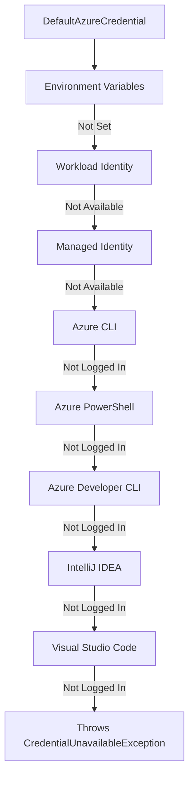

# How to Authenticate with Azure Services Using azure-identity SDK in Java

Author: [nawazdhandala](https://www.github.com/nawazdhandala)

Tags: Azure Identity, Java SDK, Authentication, Azure AD, Managed Identity, Service Principal, Azure Security

Description: Learn how to authenticate with Azure services using the azure-identity SDK in Java, covering DefaultAzureCredential, managed identities, and service principals.

---

Authentication is the first thing you need to figure out when working with Azure services. The `azure-identity` SDK for Java provides a unified way to authenticate with any Azure service that supports Azure Active Directory (now Microsoft Entra ID). Instead of managing connection strings and API keys, you use token-based authentication with the same code across development, staging, and production environments.

In this post, we will explore the different credential types available in the azure-identity SDK, how `DefaultAzureCredential` works, and how to authenticate with various Azure services from a Java application.

## Why Token-Based Authentication?

Connection strings and API keys are the quick and dirty way to authenticate. They work, but they come with problems:

- Keys need to be rotated manually
- Keys stored in configuration files can leak through source control
- There is no audit trail of who or what used a key
- Keys do not expire automatically

Azure AD token-based authentication solves all of these issues. Tokens are short-lived, automatically rotated, and tied to a specific identity. You can see exactly which identities accessed which resources in the Azure AD audit logs. Managed identities eliminate secrets entirely because Azure handles the token acquisition behind the scenes.

## Setting Up the Project

Create a new Maven project and add the azure-identity dependency.

```xml
<!-- pom.xml dependencies -->
<dependencies>
    <!-- Azure Identity SDK for authentication -->
    <dependency>
        <groupId>com.azure</groupId>
        <artifactId>azure-identity</artifactId>
        <version>1.11.1</version>
    </dependency>

    <!-- Azure Key Vault to demonstrate authenticated access -->
    <dependency>
        <groupId>com.azure</groupId>
        <artifactId>azure-security-keyvault-secrets</artifactId>
        <version>4.8.0</version>
    </dependency>

    <!-- Azure Blob Storage to demonstrate authenticated access -->
    <dependency>
        <groupId>com.azure</groupId>
        <artifactId>azure-storage-blob</artifactId>
        <version>12.25.0</version>
    </dependency>
</dependencies>
```

## Understanding DefaultAzureCredential

The `DefaultAzureCredential` class is the recommended starting point. It tries multiple authentication methods in a specific order and uses the first one that succeeds. This means the same code works on your development machine, in a CI/CD pipeline, and in production on Azure.

```java
import com.azure.identity.DefaultAzureCredential;
import com.azure.identity.DefaultAzureCredentialBuilder;

// Create the default credential - it tries multiple methods automatically
DefaultAzureCredential credential = new DefaultAzureCredentialBuilder().build();
```

Here is the order in which it tries to authenticate:



In production on an Azure VM or App Service with a managed identity enabled, it picks up the managed identity automatically. On your development machine, it uses your Azure CLI login. You do not change any code between environments.

## Authenticating with Managed Identity

Managed identities are the gold standard for authenticating Azure services. There are two types:

- **System-assigned**: Tied to a specific Azure resource. When the resource is deleted, the identity is deleted.
- **User-assigned**: Independent of any resource. Can be shared across multiple resources.

```java
import com.azure.identity.ManagedIdentityCredential;
import com.azure.identity.ManagedIdentityCredentialBuilder;

// System-assigned managed identity (no client ID needed)
ManagedIdentityCredential systemAssigned = new ManagedIdentityCredentialBuilder()
    .build();

// User-assigned managed identity (specify the client ID)
ManagedIdentityCredential userAssigned = new ManagedIdentityCredentialBuilder()
    .clientId("your-managed-identity-client-id")
    .build();
```

To use managed identity, enable it on your Azure resource (App Service, VM, Container App, etc.) and grant it the appropriate role on the target resource.

```bash
# Enable system-assigned managed identity on an App Service
az webapp identity assign --name my-java-app --resource-group my-rg

# Grant the identity access to a Key Vault
az keyvault set-policy \
  --name my-keyvault \
  --object-id <principal-id-from-previous-command> \
  --secret-permissions get list
```

## Authenticating with a Service Principal

For CI/CD pipelines or applications running outside Azure, you can use a service principal with a client secret or certificate.

```java
import com.azure.identity.ClientSecretCredential;
import com.azure.identity.ClientSecretCredentialBuilder;

// Authenticate using a service principal with a client secret
ClientSecretCredential credential = new ClientSecretCredentialBuilder()
    .tenantId("your-tenant-id")
    .clientId("your-client-id")
    .clientSecret("your-client-secret")
    .build();
```

For better security, use a certificate instead of a secret.

```java
import com.azure.identity.ClientCertificateCredential;
import com.azure.identity.ClientCertificateCredentialBuilder;

// Authenticate using a service principal with a certificate
ClientCertificateCredential certCredential = new ClientCertificateCredentialBuilder()
    .tenantId("your-tenant-id")
    .clientId("your-client-id")
    .pemCertificate("/path/to/certificate.pem")  // Path to your PEM or PFX file
    .build();
```

## Using Credentials with Azure Services

Once you have a credential, you pass it to any Azure SDK client. Here are examples with Key Vault and Blob Storage.

### Accessing Key Vault Secrets

```java
import com.azure.identity.DefaultAzureCredential;
import com.azure.identity.DefaultAzureCredentialBuilder;
import com.azure.security.keyvault.secrets.SecretClient;
import com.azure.security.keyvault.secrets.SecretClientBuilder;
import com.azure.security.keyvault.secrets.models.KeyVaultSecret;

public class KeyVaultExample {
    public static void main(String[] args) {
        // Create the credential
        DefaultAzureCredential credential = new DefaultAzureCredentialBuilder().build();

        // Build the Key Vault client with the credential
        SecretClient secretClient = new SecretClientBuilder()
            .vaultUrl("https://my-keyvault.vault.azure.net")
            .credential(credential)
            .buildClient();

        // Retrieve a secret
        KeyVaultSecret secret = secretClient.getSecret("database-password");
        System.out.println("Secret value: " + secret.getValue());

        // Set a new secret
        secretClient.setSecret("api-key", "my-secret-value");
        System.out.println("Secret created successfully");
    }
}
```

### Accessing Blob Storage

```java
import com.azure.identity.DefaultAzureCredential;
import com.azure.identity.DefaultAzureCredentialBuilder;
import com.azure.storage.blob.BlobContainerClient;
import com.azure.storage.blob.BlobServiceClient;
import com.azure.storage.blob.BlobServiceClientBuilder;

public class BlobStorageExample {
    public static void main(String[] args) {
        DefaultAzureCredential credential = new DefaultAzureCredentialBuilder().build();

        // Build the Blob Storage client with the credential
        BlobServiceClient blobServiceClient = new BlobServiceClientBuilder()
            .endpoint("https://mystorageaccount.blob.core.windows.net")
            .credential(credential)
            .buildClient();

        // List all containers
        blobServiceClient.listBlobContainers().forEach(container -> {
            System.out.println("Container: " + container.getName());
        });

        // Access a specific container
        BlobContainerClient containerClient = blobServiceClient
            .getBlobContainerClient("my-container");

        // List blobs in the container
        containerClient.listBlobs().forEach(blob -> {
            System.out.println("Blob: " + blob.getName());
        });
    }
}
```

## Customizing DefaultAzureCredential

You can exclude certain credential types or configure specific options.

```java
import com.azure.identity.DefaultAzureCredential;
import com.azure.identity.DefaultAzureCredentialBuilder;

// Customize which credential types are tried
DefaultAzureCredential credential = new DefaultAzureCredentialBuilder()
    .excludeEnvironmentCredential()       // Skip environment variables
    .excludeAzureCliCredential()          // Skip Azure CLI
    .managedIdentityClientId("client-id") // Specify which managed identity to use
    .build();
```

You can also chain credentials manually if you need more control.

```java
import com.azure.identity.ChainedTokenCredential;
import com.azure.identity.ChainedTokenCredentialBuilder;
import com.azure.identity.ManagedIdentityCredentialBuilder;
import com.azure.identity.AzureCliCredentialBuilder;

// Try managed identity first, fall back to Azure CLI
ChainedTokenCredential credential = new ChainedTokenCredentialBuilder()
    .addFirst(new ManagedIdentityCredentialBuilder().build())
    .addLast(new AzureCliCredentialBuilder().build())
    .build();
```

## Development Workflow

During development, the easiest way to authenticate is through the Azure CLI.

```bash
# Login to Azure
az login

# Set your subscription
az account set --subscription "your-subscription-id"
```

After logging in, `DefaultAzureCredential` picks up your CLI session automatically. No secrets in your code, no environment variables to set.

## Environment Variables for CI/CD

For CI/CD pipelines, set these environment variables and `DefaultAzureCredential` will use them:

```bash
# Required for service principal authentication via environment
export AZURE_TENANT_ID="your-tenant-id"
export AZURE_CLIENT_ID="your-client-id"
export AZURE_CLIENT_SECRET="your-client-secret"
```

In GitHub Actions, store these as secrets and inject them into your workflow.

```yaml
# .github/workflows/deploy.yml
env:
  AZURE_TENANT_ID: ${{ secrets.AZURE_TENANT_ID }}
  AZURE_CLIENT_ID: ${{ secrets.AZURE_CLIENT_ID }}
  AZURE_CLIENT_SECRET: ${{ secrets.AZURE_CLIENT_SECRET }}
```

## Error Handling

When authentication fails, the SDK provides helpful error messages. Wrap your credential usage in try-catch blocks to handle failures gracefully.

```java
import com.azure.identity.CredentialUnavailableException;

try {
    DefaultAzureCredential credential = new DefaultAzureCredentialBuilder().build();

    SecretClient secretClient = new SecretClientBuilder()
        .vaultUrl("https://my-keyvault.vault.azure.net")
        .credential(credential)
        .buildClient();

    KeyVaultSecret secret = secretClient.getSecret("my-secret");
} catch (CredentialUnavailableException e) {
    // No credential could authenticate
    System.err.println("Authentication failed: " + e.getMessage());
    System.err.println("Make sure you are logged in via 'az login' or running on Azure with managed identity");
} catch (Exception e) {
    // Other errors (network, permissions, etc.)
    System.err.println("Error: " + e.getMessage());
}
```

## Wrapping Up

The azure-identity SDK for Java makes authentication with Azure services consistent and secure. Use `DefaultAzureCredential` for the simplest setup that works everywhere. Use managed identities in production to eliminate secrets entirely. Use service principals for CI/CD pipelines. The key takeaway is that your application code stays the same across all environments - the credential chain handles the differences automatically. Stop hard-coding connection strings and start using proper identity-based authentication.
