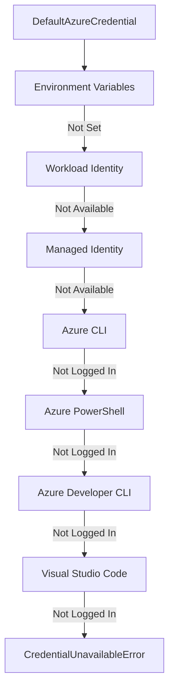

# How to Authenticate with Azure Using @azure/identity SDK in Node.js

Author: [nawazdhandala](https://www.github.com/nawazdhandala)

Tags: Azure Identity, Node.js, Authentication, Azure AD, Managed Identity, TypeScript, Azure SDK

Description: Learn how to authenticate with Azure services using the @azure/identity SDK in Node.js for secure, token-based access without hard-coded credentials.

---

Every Azure SDK client needs credentials. The `@azure/identity` package for Node.js provides a unified authentication experience across all Azure services. Whether your application runs locally during development, in a CI/CD pipeline, or in production on Azure, the same code handles authentication. You do not need to manage tokens manually, rotate secrets, or write different auth logic for different environments.

In this post, we will explore the `@azure/identity` SDK, understand how `DefaultAzureCredential` works, and see how to use it with various Azure services from a Node.js application.

## Installing the Package

Install the identity package along with any Azure service SDK you plan to use.

```bash
# Install the core identity package
npm install @azure/identity

# Install Azure service SDKs you need
npm install @azure/keyvault-secrets
npm install @azure/storage-blob
npm install @azure/service-bus
```

## Understanding DefaultAzureCredential

`DefaultAzureCredential` tries multiple authentication methods in order and uses the first one that works. This is the recommended credential for most applications because it adapts to your environment automatically.

```javascript
const { DefaultAzureCredential } = require("@azure/identity");

// Create the credential - it automatically detects your environment
const credential = new DefaultAzureCredential();
```

The credential chain tries these methods in order:



On your development machine, it picks up your Azure CLI login. In production on Azure App Service or Container Apps with managed identity enabled, it uses the managed identity. No code changes needed.

## Using the Credential with Azure Key Vault

Here is how to read secrets from Azure Key Vault using the identity SDK.

```javascript
const { DefaultAzureCredential } = require("@azure/identity");
const { SecretClient } = require("@azure/keyvault-secrets");

async function getSecrets() {
    // Create the credential
    const credential = new DefaultAzureCredential();

    // Create the Key Vault client with the credential
    const vaultUrl = "https://my-keyvault.vault.azure.net";
    const client = new SecretClient(vaultUrl, credential);

    // Retrieve a secret
    const secret = await client.getSecret("database-password");
    console.log(`Secret value: ${secret.value}`);

    // List all secrets (names only, not values)
    for await (const secretProperties of client.listPropertiesOfSecrets()) {
        console.log(`Secret name: ${secretProperties.name}`);
    }
}

getSecrets().catch(console.error);
```

## Using the Credential with Blob Storage

```javascript
const { DefaultAzureCredential } = require("@azure/identity");
const { BlobServiceClient } = require("@azure/storage-blob");

async function listContainers() {
    const credential = new DefaultAzureCredential();

    // Build the Blob Service client with the credential
    const blobServiceClient = new BlobServiceClient(
        "https://mystorageaccount.blob.core.windows.net",
        credential
    );

    // List all containers in the storage account
    console.log("Containers:");
    for await (const container of blobServiceClient.listContainers()) {
        console.log(`  - ${container.name}`);
    }

    // Access a specific container
    const containerClient = blobServiceClient.getContainerClient("my-container");

    // List blobs in the container
    console.log("\nBlobs:");
    for await (const blob of containerClient.listBlobsFlat()) {
        console.log(`  - ${blob.name} (${blob.properties.contentLength} bytes)`);
    }
}

listContainers().catch(console.error);
```

## Managed Identity Authentication

Managed identities are the recommended approach for production. They eliminate secrets entirely because Azure handles token acquisition behind the scenes.

```javascript
const { ManagedIdentityCredential } = require("@azure/identity");

// System-assigned managed identity (no client ID needed)
const systemAssigned = new ManagedIdentityCredential();

// User-assigned managed identity (specify the client ID)
const userAssigned = new ManagedIdentityCredential("your-managed-identity-client-id");
```

Enable managed identity on your Azure resource:

```bash
# Enable on App Service
az webapp identity assign --name my-node-app --resource-group my-rg

# Enable on Container Apps
az containerapp identity assign --name my-container-app \
  --resource-group my-rg --system-assigned

# Grant access to Key Vault
az keyvault set-policy --name my-keyvault \
  --object-id <principal-id> \
  --secret-permissions get list
```

## Service Principal Authentication

For CI/CD pipelines or applications running outside Azure, use a service principal.

```javascript
const { ClientSecretCredential } = require("@azure/identity");

// Authenticate with a client secret
const credential = new ClientSecretCredential(
    "your-tenant-id",
    "your-client-id",
    "your-client-secret"
);
```

For better security, use a certificate instead.

```javascript
const { ClientCertificateCredential } = require("@azure/identity");

// Authenticate with a certificate
const credential = new ClientCertificateCredential(
    "your-tenant-id",
    "your-client-id",
    "/path/to/certificate.pem"
);
```

## Chaining Credentials

If you need precise control over which credentials are tried, use `ChainedTokenCredential`.

```javascript
const {
    ChainedTokenCredential,
    ManagedIdentityCredential,
    AzureCliCredential
} = require("@azure/identity");

// Try managed identity first, fall back to Azure CLI
const credential = new ChainedTokenCredential(
    new ManagedIdentityCredential(),
    new AzureCliCredential()
);
```

This is useful when you want to exclude certain credential types that might cause delays. For example, if you know your app will never use Azure PowerShell, do not include it in the chain.

## Using with Express.js

Here is a complete Express.js example that uses Azure Identity to access multiple services.

```javascript
const express = require("express");
const { DefaultAzureCredential } = require("@azure/identity");
const { SecretClient } = require("@azure/keyvault-secrets");
const { BlobServiceClient } = require("@azure/storage-blob");

const app = express();

// Create the credential once and reuse it
const credential = new DefaultAzureCredential();

// Create clients for Azure services
const secretClient = new SecretClient(
    "https://my-keyvault.vault.azure.net",
    credential
);

const blobServiceClient = new BlobServiceClient(
    "https://mystorageaccount.blob.core.windows.net",
    credential
);

// Endpoint that reads a secret from Key Vault
app.get("/api/config/:key", async (req, res) => {
    try {
        const secret = await secretClient.getSecret(req.params.key);
        // Never return secret values in a real API - this is just for demo
        res.json({ name: secret.name, exists: true });
    } catch (error) {
        if (error.code === "SecretNotFound") {
            return res.status(404).json({ error: "Secret not found" });
        }
        console.error("Error reading secret:", error.message);
        res.status(500).json({ error: "Internal server error" });
    }
});

// Endpoint that lists blobs in a container
app.get("/api/files/:container", async (req, res) => {
    try {
        const containerClient = blobServiceClient.getContainerClient(req.params.container);
        const files = [];

        for await (const blob of containerClient.listBlobsFlat()) {
            files.push({
                name: blob.name,
                size: blob.properties.contentLength,
                lastModified: blob.properties.lastModified
            });
        }

        res.json(files);
    } catch (error) {
        console.error("Error listing blobs:", error.message);
        res.status(500).json({ error: "Internal server error" });
    }
});

app.listen(3000, () => {
    console.log("Server running on port 3000");
});
```

## Environment Variables for CI/CD

When running in CI/CD, set these environment variables for automatic authentication.

```bash
# Required for service principal authentication
export AZURE_TENANT_ID="your-tenant-id"
export AZURE_CLIENT_ID="your-client-id"
export AZURE_CLIENT_SECRET="your-client-secret"
```

In GitHub Actions:

```yaml
# .github/workflows/deploy.yml
jobs:
  deploy:
    runs-on: ubuntu-latest
    env:
      AZURE_TENANT_ID: ${{ secrets.AZURE_TENANT_ID }}
      AZURE_CLIENT_ID: ${{ secrets.AZURE_CLIENT_ID }}
      AZURE_CLIENT_SECRET: ${{ secrets.AZURE_CLIENT_SECRET }}
    steps:
      - uses: actions/checkout@v4
      - uses: actions/setup-node@v4
        with:
          node-version: '20'
      - run: npm ci
      - run: npm run deploy
```

## Error Handling

Handle authentication errors gracefully so your application provides useful error messages.

```javascript
const { DefaultAzureCredential, CredentialUnavailableError } = require("@azure/identity");

async function authenticateAndAccess() {
    try {
        const credential = new DefaultAzureCredential();
        const client = new SecretClient("https://my-keyvault.vault.azure.net", credential);

        const secret = await client.getSecret("my-secret");
        console.log("Secret retrieved successfully");
    } catch (error) {
        if (error.name === "CredentialUnavailableError") {
            console.error("No credential available. Make sure you are:");
            console.error("  - Logged in via 'az login' for local development");
            console.error("  - Running on Azure with managed identity enabled");
            console.error("  - Have AZURE_TENANT_ID, AZURE_CLIENT_ID, AZURE_CLIENT_SECRET set");
        } else if (error.code === "Forbidden") {
            console.error("Access denied. Check your RBAC role assignments.");
        } else {
            console.error("Unexpected error:", error.message);
        }
    }
}
```

## TypeScript Support

The `@azure/identity` package includes TypeScript type definitions out of the box.

```typescript
import { DefaultAzureCredential, TokenCredential } from "@azure/identity";
import { SecretClient } from "@azure/keyvault-secrets";

// The credential implements the TokenCredential interface
const credential: TokenCredential = new DefaultAzureCredential();

const client = new SecretClient(
    "https://my-keyvault.vault.azure.net",
    credential
);

async function main(): Promise<void> {
    const secret = await client.getSecret("database-password");
    console.log(`Secret: ${secret.name}, Value exists: ${!!secret.value}`);
}

main().catch(console.error);
```

## Wrapping Up

The `@azure/identity` SDK is the foundation for authentication in all Azure SDK packages for Node.js. Use `DefaultAzureCredential` for most scenarios - it works everywhere without code changes. Use managed identities in production to eliminate secrets. Use the Azure CLI during development. And for CI/CD, set the environment variables for service principal authentication. The key principle is the same across all environments: your application code never changes, only the underlying credential source does.
