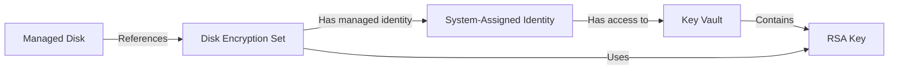

# How to Automate Azure Disk Encryption Set Configuration with Terraform and Key Vault

Author: [nawazdhandala](https://www.github.com/nawazdhandala)

Tags: Azure, Terraform, Disk Encryption, Key Vault, Security, Infrastructure as Code, Compliance

Description: Learn how to automate Azure Disk Encryption Set provisioning with customer-managed keys stored in Key Vault using Terraform for compliance requirements.

---

Azure encrypts managed disks at rest by default using platform-managed keys. For many workloads, that is sufficient. But when compliance requirements demand that you control the encryption keys yourself, you need to set up a Disk Encryption Set (DES) backed by a customer-managed key (CMK) in Azure Key Vault. This gives you control over key rotation, access policies, and the ability to revoke access to encrypted data.

Setting this up manually involves a chain of dependencies: Key Vault, access policies, keys, the Disk Encryption Set, and then role assignments. It is the kind of thing that is tedious to do by hand and easy to get wrong. Terraform handles the dependency chain automatically and gives you a reproducible setup.

## How Disk Encryption Sets Work

A Disk Encryption Set is a resource that binds together a managed identity, a Key Vault key, and the managed disks that use it. When you create a VM with a managed disk that references a DES, Azure uses the key from Key Vault to wrap (encrypt) the data encryption key for that disk.



The critical piece is that the Disk Encryption Set's managed identity must have `Key Vault Crypto Service Encryption User` or equivalent permissions on the Key Vault. Without this, disks cannot be encrypted or decrypted.

## Provider and Variables

```hcl
# Terraform configuration
terraform {
  required_version = ">= 1.5.0"

  required_providers {
    azurerm = {
      source  = "hashicorp/azurerm"
      version = "~> 3.80"
    }
    azuread = {
      source  = "hashicorp/azuread"
      version = "~> 2.45"
    }
  }
}

provider "azurerm" {
  features {
    key_vault {
      purge_soft_delete_on_destroy    = false   # Safer for production
      recover_soft_deleted_key_vaults = true
    }
  }
}

variable "location" {
  type    = string
  default = "eastus2"
}

variable "environment" {
  type    = string
  default = "prod"
}

variable "key_size" {
  type        = number
  default     = 4096
  description = "RSA key size in bits. Use 2048 or 4096."
}

locals {
  name_prefix = "enc-${var.environment}"
  tags = {
    Environment = var.environment
    ManagedBy   = "terraform"
    Purpose     = "disk-encryption"
  }
}

# Get the current client and tenant information
data "azurerm_client_config" "current" {}
```

## Key Vault Setup

The Key Vault needs specific settings for disk encryption. Purge protection must be enabled (this is a hard requirement for DES), and the SKU can be either Standard or Premium. Premium is required if you want HSM-backed keys, but Standard works for software-protected keys.

```hcl
# Resource group
resource "azurerm_resource_group" "encryption" {
  name     = "rg-${local.name_prefix}"
  location = var.location
  tags     = local.tags
}

# Key Vault for storing the customer-managed encryption key
resource "azurerm_key_vault" "encryption" {
  name                = "kv-${local.name_prefix}-${substr(md5(azurerm_resource_group.encryption.id), 0, 8)}"
  location            = azurerm_resource_group.encryption.location
  resource_group_name = azurerm_resource_group.encryption.name
  tenant_id           = data.azurerm_client_config.current.tenant_id

  sku_name = "premium"   # Premium for HSM-backed keys

  # These are REQUIRED for Disk Encryption Sets
  purge_protection_enabled   = true    # Cannot be disabled once enabled
  soft_delete_retention_days = 90

  # Use Azure RBAC instead of access policies
  enable_rbac_authorization = true

  # Network rules - restrict access in production
  network_acls {
    default_action = "Allow"   # Tighten this in production
    bypass         = "AzureServices"
  }

  tags = local.tags
}

# Grant the current user/service principal key management permissions
resource "azurerm_role_assignment" "deployer_key_admin" {
  scope                = azurerm_key_vault.encryption.id
  role_definition_name = "Key Vault Administrator"
  principal_id         = data.azurerm_client_config.current.object_id
}
```

## Creating the Encryption Key

The encryption key is an RSA key stored in Key Vault. For disk encryption, RSA keys are required - EC keys are not supported.

```hcl
# RSA key for disk encryption
resource "azurerm_key_vault_key" "disk_encryption" {
  name         = "disk-encryption-key"
  key_vault_id = azurerm_key_vault.encryption.id
  key_type     = "RSA"
  key_size     = var.key_size

  # Operations the key can perform
  key_opts = [
    "decrypt"
    "encrypt"
    "sign"
    "unwrapKey"
    "verify"
    "wrapKey"
  ]

  # Rotation policy - auto-rotate every 90 days
  rotation_policy {
    automatic {
      time_before_expiry = "P30D"   # Rotate 30 days before expiry
    }
    expire_after         = "P120D"   # Key expires after 120 days
    notify_before_expiry = "P30D"    # Notify 30 days before expiry
  }

  depends_on = [
    azurerm_role_assignment.deployer_key_admin   # Need permissions before creating the key
  ]
}
```

The rotation policy is important for compliance. It tells Key Vault to automatically generate a new version of the key before the current one expires. Disk Encryption Sets automatically pick up the new key version, so there is no manual rotation process.

## The Disk Encryption Set

Now create the Disk Encryption Set that ties everything together.

```hcl
# Disk Encryption Set with system-assigned managed identity
resource "azurerm_disk_encryption_set" "main" {
  name                = "des-${local.name_prefix}"
  resource_group_name = azurerm_resource_group.encryption.name
  location            = azurerm_resource_group.encryption.location
  key_vault_key_id    = azurerm_key_vault_key.disk_encryption.id

  # Auto-rotate to the latest key version
  auto_key_rotation_enabled = true

  # The DES needs a managed identity to access Key Vault
  identity {
    type = "SystemAssigned"
  }

  # Encryption type - EncryptionAtRestWithCustomerKey is the standard choice
  encryption_type = "EncryptionAtRestWithCustomerKey"

  tags = local.tags
}

# Grant the DES managed identity permission to use the Key Vault key
resource "azurerm_role_assignment" "des_crypto_user" {
  scope                = azurerm_key_vault.encryption.id
  role_definition_name = "Key Vault Crypto Service Encryption User"
  principal_id         = azurerm_disk_encryption_set.main.identity[0].principal_id
}
```

The `auto_key_rotation_enabled` setting is a nice feature that was added relatively recently. When the Key Vault key gets a new version (either manually or through the rotation policy), the DES automatically updates to use it. Without this, you would need to manually update the DES after each key rotation.

## Using the Disk Encryption Set with VMs

With the DES created and the permissions in place, you can reference it when creating managed disks and VMs.

```hcl
# Virtual network and subnet for the VM
resource "azurerm_virtual_network" "vm" {
  name                = "vnet-${local.name_prefix}-vms"
  location            = azurerm_resource_group.encryption.location
  resource_group_name = azurerm_resource_group.encryption.name
  address_space       = ["10.0.0.0/16"]
}

resource "azurerm_subnet" "vm" {
  name                 = "snet-vms"
  resource_group_name  = azurerm_resource_group.encryption.name
  virtual_network_name = azurerm_virtual_network.vm.name
  address_prefixes     = ["10.0.1.0/24"]
}

# Network interface for the VM
resource "azurerm_network_interface" "vm" {
  name                = "nic-vm-encrypted"
  location            = azurerm_resource_group.encryption.location
  resource_group_name = azurerm_resource_group.encryption.name

  ip_configuration {
    name                          = "internal"
    subnet_id                     = azurerm_subnet.vm.id
    private_ip_address_allocation = "Dynamic"
  }
}

# VM with customer-managed key encryption on the OS disk
resource "azurerm_linux_virtual_machine" "encrypted" {
  name                = "vm-encrypted-${local.name_prefix}"
  resource_group_name = azurerm_resource_group.encryption.name
  location            = azurerm_resource_group.encryption.location
  size                = "Standard_D2s_v5"

  admin_username = "azureuser"
  admin_ssh_key {
    username   = "azureuser"
    public_key = file("~/.ssh/id_rsa.pub")
  }

  network_interface_ids = [azurerm_network_interface.vm.id]

  os_disk {
    caching                = "ReadWrite"
    storage_account_type   = "Premium_LRS"
    disk_encryption_set_id = azurerm_disk_encryption_set.main.id   # Use CMK encryption
  }

  source_image_reference {
    publisher = "Canonical"
    offer     = "0001-com-ubuntu-server-jammy"
    sku       = "22_04-lts-gen2"
    version   = "latest"
  }

  depends_on = [
    azurerm_role_assignment.des_crypto_user   # Ensure DES has Key Vault access first
  ]
}

# Additional data disk with CMK encryption
resource "azurerm_managed_disk" "data" {
  name                   = "disk-data-encrypted"
  location               = azurerm_resource_group.encryption.location
  resource_group_name    = azurerm_resource_group.encryption.name
  storage_account_type   = "Premium_LRS"
  create_option          = "Empty"
  disk_size_gb           = 256
  disk_encryption_set_id = azurerm_disk_encryption_set.main.id

  tags = local.tags
}

resource "azurerm_virtual_machine_data_disk_attachment" "data" {
  managed_disk_id    = azurerm_managed_disk.data.id
  virtual_machine_id = azurerm_linux_virtual_machine.encrypted.id
  lun                = 0
  caching            = "ReadWrite"
}
```

## Outputs

```hcl
output "disk_encryption_set_id" {
  value       = azurerm_disk_encryption_set.main.id
  description = "The resource ID of the Disk Encryption Set - reference this in VM and disk configurations"
}

output "key_vault_id" {
  value       = azurerm_key_vault.encryption.id
  description = "The Key Vault ID containing the encryption key"
}

output "encryption_key_id" {
  value       = azurerm_key_vault_key.disk_encryption.id
  description = "The current version of the encryption key"
}
```

## Common Pitfalls

A few things that catch people off guard with this setup:

1. **Purge protection cannot be undone.** Once you enable purge protection on a Key Vault, it stays enabled forever for that vault. This is by design for security, but it means you cannot quickly delete and recreate the vault during development.

2. **Dependency ordering matters.** The DES needs the Key Vault key to exist, and the DES managed identity needs Key Vault permissions before any disks can use it. Terraform handles most of this through implicit dependencies, but you may need explicit `depends_on` for role assignments.

3. **Key Vault access mode.** If you use access policies instead of RBAC, the access policy must grant `Get`, `Wrap Key`, and `Unwrap Key` permissions to the DES managed identity.

4. **Cross-region limitations.** A Disk Encryption Set and the disks it encrypts must be in the same region. You cannot use a DES in East US to encrypt a disk in West US.

## Wrapping Up

Automating Azure Disk Encryption Sets with Terraform removes the manual complexity of setting up customer-managed key encryption. The setup involves a Key Vault with purge protection, an RSA encryption key with a rotation policy, the Disk Encryption Set itself, and the RBAC assignments that tie them together. Once in place, every VM and managed disk in your environment can reference the DES for consistent, compliant encryption with keys you control.
