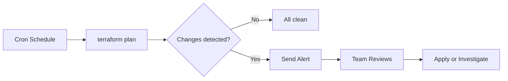

# How to Automate Azure Infrastructure Drift Detection with Terraform Plan in CI/CD Pipelines

Author: [nawazdhandala](https://www.github.com/nawazdhandala)

Tags: Terraform, Azure, Drift Detection, CI/CD, Infrastructure as Code, DevOps, GitHub Actions

Description: Automate Azure infrastructure drift detection by running scheduled Terraform plans in CI/CD pipelines and alerting when reality diverges from code.

---

Infrastructure drift happens when the actual state of your Azure resources diverges from what your Terraform code says they should be. Someone makes a manual change in the portal. An automated script modifies a resource outside of Terraform. A policy remediation task adjusts a configuration. Whatever the cause, drift means your code no longer represents reality, and that is a problem.

The good news is that Terraform already has a built-in mechanism for detecting drift - `terraform plan`. When there are no code changes but the plan shows differences, that is drift. The trick is running this automatically on a schedule and alerting the right people when drift appears.

## The Drift Detection Strategy

The approach is straightforward:

1. Run `terraform plan` on a schedule (daily or more frequently)
2. Parse the plan output to detect changes
3. If changes exist that were not introduced by code, that is drift
4. Alert the team via Slack, email, or a GitHub issue
5. Optionally auto-remediate by running `terraform apply`



I strongly recommend starting with alerting only and not auto-remediation. You want a human in the loop until you are confident that drift is always safe to auto-fix.

## Setting Up the GitHub Actions Workflow

Here is a complete GitHub Actions workflow that runs drift detection on a schedule:

```yaml
# .github/workflows/drift-detection.yml
# Runs terraform plan on a schedule to detect infrastructure drift

name: Infrastructure Drift Detection

on:
  # Run every day at 6 AM UTC
  schedule:
    - cron: '0 6 * * *'
  # Allow manual triggers for testing
  workflow_dispatch:

permissions:
  contents: read
  issues: write        # Needed to create issues for drift alerts
  pull-requests: write # Needed to comment on PRs

env:
  ARM_CLIENT_ID: ${{ secrets.AZURE_CLIENT_ID }}
  ARM_CLIENT_SECRET: ${{ secrets.AZURE_CLIENT_SECRET }}
  ARM_SUBSCRIPTION_ID: ${{ secrets.AZURE_SUBSCRIPTION_ID }}
  ARM_TENANT_ID: ${{ secrets.AZURE_TENANT_ID }}
  TF_VERSION: '1.7.0'

jobs:
  detect-drift:
    name: Detect Drift - ${{ matrix.environment }}
    runs-on: ubuntu-latest

    # Run drift detection for each environment in parallel
    strategy:
      matrix:
        environment: [production, staging]
      fail-fast: false  # Continue checking other environments if one fails

    steps:
      - name: Checkout code
        uses: actions/checkout@v4

      - name: Setup Terraform
        uses: hashicorp/setup-terraform@v3
        with:
          terraform_version: ${{ env.TF_VERSION }}
          terraform_wrapper: false  # Disable wrapper to get raw exit codes

      - name: Terraform Init
        working-directory: environments/${{ matrix.environment }}
        run: terraform init -input=false

      - name: Terraform Plan
        id: plan
        working-directory: environments/${{ matrix.environment }}
        # -detailed-exitcode returns 0 (no changes), 1 (error), 2 (changes detected)
        run: |
          terraform plan -detailed-exitcode -input=false -out=tfplan 2>&1 | tee plan_output.txt
          echo "exit_code=$?" >> $GITHUB_OUTPUT
        continue-on-error: true

      - name: Check for Drift
        id: drift
        run: |
          EXIT_CODE="${{ steps.plan.outputs.exit_code }}"
          if [ "$EXIT_CODE" == "2" ]; then
            echo "drift_detected=true" >> $GITHUB_OUTPUT
            echo "Drift detected in ${{ matrix.environment }}"
          elif [ "$EXIT_CODE" == "1" ]; then
            echo "drift_detected=error" >> $GITHUB_OUTPUT
            echo "Error running plan for ${{ matrix.environment }}"
          else
            echo "drift_detected=false" >> $GITHUB_OUTPUT
            echo "No drift in ${{ matrix.environment }}"
          fi

      - name: Generate Drift Report
        if: steps.drift.outputs.drift_detected == 'true'
        working-directory: environments/${{ matrix.environment }}
        run: |
          # Extract the summary of changes from the plan output
          echo "## Drift Report for ${{ matrix.environment }}" > drift_report.md
          echo "" >> drift_report.md
          echo "Detected at: $(date -u)" >> drift_report.md
          echo "" >> drift_report.md
          echo '```' >> drift_report.md
          # Show only the plan summary, not the full output
          terraform show tfplan -no-color | tail -50 >> drift_report.md
          echo '```' >> drift_report.md

      - name: Create GitHub Issue for Drift
        if: steps.drift.outputs.drift_detected == 'true'
        uses: actions/github-script@v7
        with:
          script: |
            const fs = require('fs');
            const report = fs.readFileSync(
              `environments/${{ matrix.environment }}/drift_report.md`,
              'utf8'
            );

            // Check if an open drift issue already exists
            const existingIssues = await github.rest.issues.listForRepo({
              owner: context.repo.owner,
              repo: context.repo.repo,
              labels: 'infrastructure-drift',
              state: 'open'
            });

            const envIssue = existingIssues.data.find(
              i => i.title.includes('${{ matrix.environment }}')
            );

            if (envIssue) {
              // Update existing issue with new drift report
              await github.rest.issues.createComment({
                owner: context.repo.owner,
                repo: context.repo.repo,
                issue_number: envIssue.number,
                body: report
              });
            } else {
              // Create new issue
              await github.rest.issues.create({
                owner: context.repo.owner,
                repo: context.repo.repo,
                title: `Infrastructure Drift Detected - ${{ matrix.environment }}`,
                body: report,
                labels: ['infrastructure-drift', '${{ matrix.environment }}']
              });
            }

      - name: Send Slack Notification
        if: steps.drift.outputs.drift_detected == 'true'
        uses: slackapi/slack-github-action@v1.25.0
        with:
          payload: |
            {
              "text": "Infrastructure drift detected in ${{ matrix.environment }} environment. Check GitHub Issues for details.",
              "blocks": [
                {
                  "type": "header",
                  "text": {
                    "type": "plain_text",
                    "text": "Infrastructure Drift Alert"
                  }
                },
                {
                  "type": "section",
                  "text": {
                    "type": "mrkdwn",
                    "text": "*Environment:* ${{ matrix.environment }}\n*Repository:* ${{ github.repository }}\n*Detected at:* ${{ github.event.head_commit.timestamp || 'Scheduled run' }}"
                  }
                }
              ]
            }
        env:
          SLACK_WEBHOOK_URL: ${{ secrets.SLACK_WEBHOOK_URL }}
```

## Understanding the Exit Codes

The key to this workflow is `terraform plan -detailed-exitcode`. This flag changes the exit code behavior:

- **Exit code 0**: No changes needed. Your infrastructure matches the code.
- **Exit code 1**: An error occurred. Could be authentication failure, provider issues, or syntax errors.
- **Exit code 2**: Changes detected. This is the drift signal.

Without `-detailed-exitcode`, Terraform always returns 0 for a successful plan regardless of whether changes were detected. That flag is essential.

## Azure DevOps Pipeline Version

If you are using Azure DevOps instead of GitHub Actions, here is the equivalent:

```yaml
# azure-pipelines.yml - Drift detection pipeline for Azure DevOps

trigger: none

schedules:
  - cron: '0 6 * * *'
    displayName: 'Daily drift check'
    branches:
      include:
        - main
    always: true  # Run even if no code changes

pool:
  vmImage: 'ubuntu-latest'

variables:
  - group: terraform-credentials  # Variable group with ARM_ variables

stages:
  - stage: DriftDetection
    jobs:
      - job: CheckDrift
        strategy:
          matrix:
            production:
              environment: production
            staging:
              environment: staging

        steps:
          - task: TerraformInstaller@1
            inputs:
              terraformVersion: '1.7.0'

          - script: terraform init -input=false
            displayName: 'Terraform Init'
            workingDirectory: 'environments/$(environment)'

          - script: |
              # Run plan and capture exit code
              terraform plan -detailed-exitcode -input=false -no-color > plan_output.txt 2>&1
              PLAN_EXIT=$?
              echo "##vso[task.setvariable variable=planExitCode]$PLAN_EXIT"

              if [ $PLAN_EXIT -eq 2 ]; then
                echo "##vso[task.logissue type=warning]Drift detected in $(environment)"
              fi

              # Show plan output in logs regardless
              cat plan_output.txt
              exit 0  # Do not fail the step
            displayName: 'Terraform Plan'
            workingDirectory: 'environments/$(environment)'

          - script: |
              echo "Drift detected. Creating work item..."
            displayName: 'Alert on Drift'
            condition: eq(variables['planExitCode'], '2')
```

## Reducing False Positives

Drift detection is only useful if you trust the alerts. False positives train people to ignore them. Here are some common sources and how to handle them:

**Timestamps and auto-generated fields.** Some Azure resources have fields that change on every read (like `last_modified_date`). Use lifecycle ignore_changes for these:

```hcl
# Ignore fields that Azure auto-updates and would trigger false drift alerts
resource "azurerm_resource_group" "example" {
  name     = "rg-example"
  location = "eastus2"

  lifecycle {
    ignore_changes = [
      tags["LastModified"],  # Auto-updated by Azure Policy
    ]
  }
}
```

**Azure Policy remediation.** If Azure Policy is adding tags or modifying configurations, your Terraform code should include those same settings. Otherwise every drift check will flag them.

**Resource provider API changes.** Sometimes Azure updates an API version and new default fields appear. Upgrading your provider version usually resolves this.

## Drift Remediation

Once you are confident in your detection, you can add an optional remediation step:

```yaml
      # Optional: auto-remediate drift by applying the Terraform plan
      - name: Auto-Remediate Drift
        if: |
          steps.drift.outputs.drift_detected == 'true' &&
          matrix.environment == 'staging'
        working-directory: environments/${{ matrix.environment }}
        run: |
          # Only auto-remediate staging, never production
          terraform apply -auto-approve tfplan
```

I only enable auto-remediation for non-production environments. For production, drift should always be reviewed by a human before correcting it. The manual change might have been an emergency fix that needs to be incorporated into the code rather than reverted.

## Monitoring Drift Over Time

Track your drift metrics to understand patterns. How often does drift occur? Which environments are most affected? Which resource types drift most frequently? This data helps you identify process gaps.

Some teams add a step that posts metrics to Azure Monitor or Datadog:

```bash
# Post drift metric to a monitoring system
if [ "$DRIFT_DETECTED" == "true" ]; then
  RESOURCE_COUNT=$(grep -c "will be" plan_output.txt || true)
  # Send metric: drift.resources.count with environment tag
  curl -X POST "$METRICS_ENDPOINT" \
    -d "{\"metric\": \"drift.resources\", \"value\": $RESOURCE_COUNT, \"tags\": [\"env:$ENVIRONMENT\"]}"
fi
```

## Wrapping Up

Drift detection is one of those practices that seems optional until you get burned by it. A scheduled Terraform plan in your CI/CD pipeline takes less than an hour to set up and gives you continuous assurance that your infrastructure matches your code. Start with daily checks, tune out false positives, and you will catch problems before they escalate into incidents.
