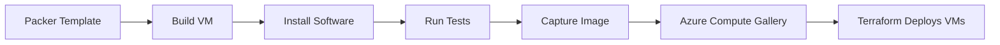

# How to Automate Azure VM Image Building with Packer and Terraform

Author: [nawazdhandala](https://www.github.com/nawazdhandala)

Tags: Packer, Terraform, Azure, VM Images, Automation, Infrastructure as Code, Golden Images

Description: Automate Azure VM image building with HashiCorp Packer and deploy VMs from custom images using Terraform for consistent and reproducible server configurations.

---

Every time you deploy a VM from a stock marketplace image and then run a provisioning script to install software, you are wasting time and introducing risk. The provisioning might fail halfway through, packages might have been updated since last time, or network issues might prevent downloads. Golden images solve this by baking all your software and configuration into a custom VM image that is ready to go the moment it boots.

HashiCorp Packer automates the image building process, and Terraform deploys VMs from those images. Together, they give you a reproducible pipeline: Packer builds the image, publishes it to Azure, and Terraform references it when creating VMs. In this post, I will walk through setting up both tools for a production image pipeline.

## The Image Pipeline

The workflow is:



Packer creates a temporary VM, runs your provisioning scripts, captures the disk as an image, and publishes it to an Azure Compute Gallery (formerly Shared Image Gallery). Terraform then references images from the gallery when deploying VMs.

## Prerequisites

Install both tools:

```bash
# Install Packer
brew install packer   # macOS
# or download from https://www.packer.io/downloads

# Install the Azure plugin for Packer
packer plugins install github.com/hashicorp/azure

# Verify installation
packer version
```

You also need an Azure service principal with permissions to create VMs and manage images:

```bash
# Create a service principal for Packer
az ad sp create-for-rbac \
  --name "sp-packer-image-builder" \
  --role "Contributor" \
  --scopes "/subscriptions/$(az account show --query id -o tsv)"
```

## Creating the Packer Template

Packer uses HCL2 templates (the same syntax as Terraform). Here is a template that builds an Ubuntu image with common server software:

```hcl
# ubuntu-server.pkr.hcl - Packer template for Ubuntu server image

packer {
  required_plugins {
    azure = {
      source  = "github.com/hashicorp/azure"
      version = "~> 2.0"
    }
  }
}

# Variables for the build
variable "subscription_id" {
  type    = string
  default = env("ARM_SUBSCRIPTION_ID")
}

variable "client_id" {
  type    = string
  default = env("ARM_CLIENT_ID")
}

variable "client_secret" {
  type      = string
  sensitive = true
  default   = env("ARM_CLIENT_SECRET")
}

variable "tenant_id" {
  type    = string
  default = env("ARM_TENANT_ID")
}

variable "image_version" {
  type    = string
  default = "1.0.0"
}

variable "location" {
  type    = string
  default = "eastus2"
}

# Source block defines the base image and Azure configuration
source "azure-arm" "ubuntu" {
  # Authentication
  subscription_id = var.subscription_id
  client_id       = var.client_id
  client_secret   = var.client_secret
  tenant_id       = var.tenant_id

  # Base image - Ubuntu 22.04 LTS
  os_type         = "Linux"
  image_publisher = "Canonical"
  image_offer     = "0001-com-ubuntu-server-jammy"
  image_sku       = "22_04-lts"

  # Build VM configuration
  location = var.location
  vm_size  = "Standard_D2s_v5"

  # Publish to Azure Compute Gallery
  shared_image_gallery_destination {
    subscription        = var.subscription_id
    resource_group      = "rg-image-gallery"
    gallery_name        = "gal_company_images"
    image_name          = "ubuntu-server"
    image_version       = var.image_version
    replication_regions = ["eastus2", "westus2"]  # Replicate for HA
    storage_account_type = "Standard_LRS"
  }

  # Temporary resource group for the build process
  build_resource_group_name = "rg-packer-build"

  # Azure tags for the image
  azure_tags = {
    "built-by"   = "packer"
    "os"         = "ubuntu-22.04"
    "version"    = var.image_version
    "build-date" = timestamp()
  }
}

# Build steps
build {
  sources = ["source.azure-arm.ubuntu"]

  # Wait for cloud-init to finish before making changes
  provisioner "shell" {
    inline = [
      "echo 'Waiting for cloud-init to complete...'",
      "cloud-init status --wait"
    ]
  }

  # Update the system and install base packages
  provisioner "shell" {
    inline = [
      "sudo apt-get update -y",
      "sudo apt-get upgrade -y",
      "sudo apt-get install -y curl wget vim htop unzip jq net-tools",
      "sudo apt-get install -y ca-certificates gnupg lsb-release"
    ]
  }

  # Install Docker
  provisioner "shell" {
    inline = [
      "# Add Docker's official GPG key and repository",
      "sudo install -m 0755 -d /etc/apt/keyrings",
      "curl -fsSL https://download.docker.com/linux/ubuntu/gpg | sudo gpg --dearmor -o /etc/apt/keyrings/docker.gpg",
      "sudo chmod a+r /etc/apt/keyrings/docker.gpg",
      "echo \"deb [arch=$(dpkg --print-architecture) signed-by=/etc/apt/keyrings/docker.gpg] https://download.docker.com/linux/ubuntu $(lsb_release -cs) stable\" | sudo tee /etc/apt/sources.list.d/docker.list > /dev/null",
      "sudo apt-get update -y",
      "sudo apt-get install -y docker-ce docker-ce-cli containerd.io docker-compose-plugin",
      "sudo systemctl enable docker"
    ]
  }

  # Install monitoring agents
  provisioner "shell" {
    inline = [
      "# Install the Azure Monitor agent",
      "wget https://aka.ms/InstallAzureMonitorAgentLinux -O install_ama.sh",
      "sudo bash install_ama.sh",
      "rm install_ama.sh"
    ]
  }

  # Copy configuration files
  provisioner "file" {
    source      = "config/sshd_config"
    destination = "/tmp/sshd_config"
  }

  # Apply security hardening
  provisioner "shell" {
    inline = [
      "# Apply hardened SSH configuration",
      "sudo cp /tmp/sshd_config /etc/ssh/sshd_config",
      "sudo chmod 600 /etc/ssh/sshd_config",

      "# Disable root login",
      "sudo sed -i 's/PermitRootLogin yes/PermitRootLogin no/' /etc/ssh/sshd_config",

      "# Configure automatic security updates",
      "sudo apt-get install -y unattended-upgrades",
      "echo 'Unattended-Upgrade::Automatic-Reboot \"false\";' | sudo tee -a /etc/apt/apt.conf.d/50unattended-upgrades",

      "# Configure firewall defaults",
      "sudo ufw default deny incoming",
      "sudo ufw default allow outgoing",
      "sudo ufw allow ssh",
      "sudo ufw --force enable"
    ]
  }

  # Clean up before capture to reduce image size
  provisioner "shell" {
    inline = [
      "sudo apt-get clean",
      "sudo rm -rf /var/lib/apt/lists/*",
      "sudo rm -rf /tmp/*",

      "# Deprovision the VM for generalization",
      "sudo waagent -deprovision+user -force"
    ]
  }
}
```

## Building the Image

Before building, create the Azure Compute Gallery:

```bash
# Create the resource group and gallery
az group create --name rg-image-gallery --location eastus2

az sig create \
  --resource-group rg-image-gallery \
  --gallery-name gal_company_images

# Create the image definition
az sig image-definition create \
  --resource-group rg-image-gallery \
  --gallery-name gal_company_images \
  --gallery-image-definition ubuntu-server \
  --publisher CompanyImages \
  --offer UbuntuServer \
  --sku 22.04-hardened \
  --os-type Linux \
  --os-state Generalized \
  --hyper-v-generation V2

# Create a temporary resource group for Packer builds
az group create --name rg-packer-build --location eastus2
```

Now build the image:

```bash
# Initialize Packer plugins
packer init ubuntu-server.pkr.hcl

# Validate the template
packer validate ubuntu-server.pkr.hcl

# Build the image
packer build -var "image_version=1.0.0" ubuntu-server.pkr.hcl
```

The build takes 10-20 minutes. Packer creates a temporary VM, runs all the provisioning steps, captures the disk, and publishes it to the gallery. The temporary VM is automatically deleted.

## Deploying VMs from the Image with Terraform

Now use Terraform to deploy VMs from the custom image:

```hcl
# main.tf - Deploy VMs from custom Packer-built images

data "azurerm_shared_image_version" "ubuntu" {
  name                = "1.0.0"
  image_name          = "ubuntu-server"
  gallery_name        = "gal_company_images"
  resource_group_name = "rg-image-gallery"
}

resource "azurerm_resource_group" "app" {
  name     = "rg-app-prod"
  location = "eastus2"
}

resource "azurerm_network_interface" "app" {
  count               = 3
  name                = "nic-app-${count.index}"
  location            = azurerm_resource_group.app.location
  resource_group_name = azurerm_resource_group.app.name

  ip_configuration {
    name                          = "internal"
    subnet_id                     = var.subnet_id
    private_ip_address_allocation = "Dynamic"
  }
}

# Deploy VMs from the custom image
resource "azurerm_linux_virtual_machine" "app" {
  count               = 3
  name                = "vm-app-${count.index}"
  location            = azurerm_resource_group.app.location
  resource_group_name = azurerm_resource_group.app.name
  size                = "Standard_D4s_v5"
  admin_username      = var.admin_username

  network_interface_ids = [azurerm_network_interface.app[count.index].id]

  admin_ssh_key {
    username   = var.admin_username
    public_key = var.ssh_public_key
  }

  os_disk {
    caching              = "ReadWrite"
    storage_account_type = "Premium_LRS"
    disk_size_gb         = 128
  }

  # Reference the custom image from the gallery
  source_image_id = data.azurerm_shared_image_version.ubuntu.id

  tags = {
    Environment = "production"
    ImageVersion = "1.0.0"
  }
}
```

## Automating the Pipeline

Combine Packer and Terraform in a CI/CD pipeline:

```yaml
# .github/workflows/image-pipeline.yml
name: VM Image Pipeline

on:
  push:
    paths:
      - 'packer/**'
    branches: [main]
  schedule:
    # Rebuild weekly for latest security patches
    - cron: '0 4 * * 1'

jobs:
  build-image:
    runs-on: ubuntu-latest
    outputs:
      image_version: ${{ steps.version.outputs.version }}

    steps:
      - uses: actions/checkout@v4

      - name: Generate version
        id: version
        run: echo "version=$(date +%Y.%m.%d)" >> $GITHUB_OUTPUT

      - name: Setup Packer
        uses: hashicorp/setup-packer@main

      - name: Init Packer
        run: packer init packer/ubuntu-server.pkr.hcl

      - name: Build Image
        env:
          ARM_CLIENT_ID: ${{ secrets.AZURE_CLIENT_ID }}
          ARM_CLIENT_SECRET: ${{ secrets.AZURE_CLIENT_SECRET }}
          ARM_SUBSCRIPTION_ID: ${{ secrets.AZURE_SUBSCRIPTION_ID }}
          ARM_TENANT_ID: ${{ secrets.AZURE_TENANT_ID }}
        run: |
          packer build \
            -var "image_version=${{ steps.version.outputs.version }}" \
            packer/ubuntu-server.pkr.hcl

  deploy-vms:
    needs: build-image
    runs-on: ubuntu-latest
    if: github.ref == 'refs/heads/main'

    steps:
      - uses: actions/checkout@v4
      - uses: hashicorp/setup-terraform@v3

      - name: Deploy VMs with new image
        env:
          ARM_CLIENT_ID: ${{ secrets.AZURE_CLIENT_ID }}
          ARM_CLIENT_SECRET: ${{ secrets.AZURE_CLIENT_SECRET }}
          ARM_SUBSCRIPTION_ID: ${{ secrets.AZURE_SUBSCRIPTION_ID }}
          ARM_TENANT_ID: ${{ secrets.AZURE_TENANT_ID }}
        run: |
          cd terraform/
          terraform init
          terraform apply -auto-approve \
            -var="image_version=${{ needs.build-image.outputs.image_version }}"
```

## Image Versioning Strategy

Use semantic versioning for your images. I follow this convention:

- **Major version**: OS upgrade (Ubuntu 22.04 to 24.04)
- **Minor version**: Software additions or significant changes (adding Docker, changing security config)
- **Patch version**: Security updates and minor fixes

Alternatively, use date-based versioning (`2026.02.16`) for images that are rebuilt on a schedule.

## Testing Images

Add a test step to your pipeline that boots the image and validates it:

```bash
# Quick smoke test after image build
packer build -var "image_version=test" ubuntu-server.pkr.hcl

# Deploy a test VM from the image
az vm create \
  --resource-group rg-packer-build \
  --name vm-image-test \
  --image "/subscriptions/.../ubuntu-server/versions/test" \
  --admin-username testuser \
  --generate-ssh-keys

# Run validation checks
ssh testuser@$VM_IP "docker --version && ufw status && systemctl is-active docker"

# Clean up test VM
az vm delete --resource-group rg-packer-build --name vm-image-test --yes
```

## Wrapping Up

The combination of Packer for image building and Terraform for VM deployment gives you a reproducible, auditable infrastructure pipeline. Every server starts from a known-good state, provisioning is fast because the software is pre-installed, and you can track exactly which image version is running on each VM. Build images on a schedule to pick up security patches, version them in Azure Compute Gallery, and reference them in Terraform for consistent deployments across your fleet.
