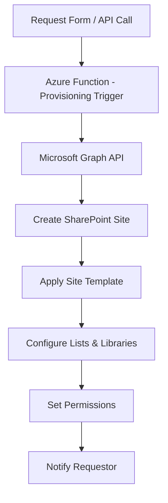

# How to Automate SharePoint Site Provisioning with Azure Functions and Microsoft Graph API

Author: [nawazdhandala](https://www.github.com/nawazdhandala)

Tags: SharePoint, Azure Functions, Microsoft Graph, Site Provisioning, Automation, PowerShell, Azure AD

Description: Automate SharePoint Online site provisioning using Azure Functions and the Microsoft Graph API with custom templates and configurations.

---

Creating SharePoint sites manually is manageable when you do it a few times a month. But when your organization needs sites for every new project, client, department, or event, manual provisioning becomes a bottleneck. Someone submits a request, an admin creates the site, configures the lists, sets up permissions, applies branding, and adds the standard document libraries. That is 30 minutes of repetitive work per site.

Automating this with Azure Functions and the Microsoft Graph API turns a 30-minute manual process into a 30-second automated one. In this guide, I will build a site provisioning pipeline that creates SharePoint sites from templates, configures them with standard lists and libraries, sets up permissions, and applies custom configurations.

## Architecture



A provisioning request comes in (from a form, API call, or Teams bot), triggers the Azure Function, which uses the Graph API to create and configure the site.

## Setting Up Authentication

The Azure Function needs application-level permissions to create SharePoint sites. Register an Azure AD application with the right Graph API permissions:

```bash
# Create the app registration
az ad app create \
  --display-name "SharePoint Site Provisioner" \
  --sign-in-audience "AzureADMyOrg"

# Add Microsoft Graph application permissions
# Sites.FullControl.All - Required for site creation and configuration
# Group.ReadWrite.All - Required for Microsoft 365 group-connected sites
az ad app permission add \
  --id $APP_ID \
  --api 00000003-0000-0000-c000-000000000000 \
  --api-permissions 9492366f-7969-46a4-8d15-ed1a20078fff=Role \
  --api-permissions 62a82d76-70ea-41e2-9197-370581804d09=Role

# Grant admin consent
az ad app permission admin-consent --id $APP_ID

# Create a client secret
az ad app credential reset --id $APP_ID --append
```

## The Provisioning Request Model

Define a clear model for what a provisioning request looks like:

```csharp
// Model representing a site provisioning request
public class SiteProvisioningRequest
{
    // Display name for the new site
    public string SiteName { get; set; }

    // URL-safe alias (used in the site URL)
    public string Alias { get; set; }

    // Description of the site's purpose
    public string Description { get; set; }

    // Template to apply: "project", "team", "department", "client"
    public string Template { get; set; }

    // Email of the person requesting the site
    public string RequestorEmail { get; set; }

    // Owners of the new site (Azure AD user principal names)
    public List<string> Owners { get; set; }

    // Members to add to the site
    public List<string> Members { get; set; }

    // Whether the site should be public or private
    public bool IsPrivate { get; set; } = true;

    // Optional: specific classification label
    public string Classification { get; set; }
}
```

## Building the Provisioning Function

Here is the Azure Function that handles the provisioning workflow:

```csharp
// Azure Function that provisions SharePoint sites based on templates
public class SiteProvisioningFunction
{
    private readonly GraphServiceClient _graphClient;
    private readonly ITemplateService _templateService;
    private readonly ILogger<SiteProvisioningFunction> _logger;

    public SiteProvisioningFunction(
        GraphServiceClient graphClient,
        ITemplateService templateService,
        ILogger<SiteProvisioningFunction> logger)
    {
        _graphClient = graphClient;
        _templateService = templateService;
        _logger = logger;
    }

    [Function("ProvisionSite")]
    public async Task<HttpResponseData> Run(
        [HttpTrigger(AuthorizationLevel.Function, "post")]
        HttpRequestData req)
    {
        var request = await req.ReadFromJsonAsync<SiteProvisioningRequest>();

        if (request == null || string.IsNullOrEmpty(request.SiteName))
        {
            var badResponse = req.CreateResponse(System.Net.HttpStatusCode.BadRequest);
            await badResponse.WriteStringAsync("Invalid provisioning request");
            return badResponse;
        }

        _logger.LogInformation(
            "Starting site provisioning: {SiteName} (Template: {Template})",
            request.SiteName, request.Template);

        try
        {
            // Step 1: Create the Microsoft 365 group (which creates the SharePoint site)
            var group = await CreateGroupAndSiteAsync(request);

            // Step 2: Wait for the SharePoint site to be fully provisioned
            var siteUrl = await WaitForSiteCreationAsync(group.Id);

            // Step 3: Apply the site template (lists, libraries, navigation)
            await _templateService.ApplyTemplateAsync(siteUrl, request.Template);

            // Step 4: Configure permissions beyond the default group membership
            await ConfigurePermissionsAsync(siteUrl, request);

            // Step 5: Notify the requestor
            await NotifyRequestorAsync(request.RequestorEmail, siteUrl, request.SiteName);

            _logger.LogInformation(
                "Site provisioned successfully: {SiteUrl}", siteUrl);

            var response = req.CreateResponse(System.Net.HttpStatusCode.OK);
            await response.WriteAsJsonAsync(new
            {
                siteUrl,
                groupId = group.Id,
                siteName = request.SiteName,
                template = request.Template,
                status = "Provisioned"
            });

            return response;
        }
        catch (Exception ex)
        {
            _logger.LogError(ex, "Failed to provision site: {SiteName}", request.SiteName);

            var errorResponse = req.CreateResponse(System.Net.HttpStatusCode.InternalServerError);
            await errorResponse.WriteAsJsonAsync(new
            {
                error = "Site provisioning failed",
                details = ex.Message
            });

            return errorResponse;
        }
    }

    private async Task<Microsoft.Graph.Models.Group> CreateGroupAndSiteAsync(
        SiteProvisioningRequest request)
    {
        // Create a Microsoft 365 group which automatically provisions a SharePoint site
        var group = new Microsoft.Graph.Models.Group
        {
            DisplayName = request.SiteName,
            Description = request.Description,
            MailNickname = request.Alias,
            MailEnabled = true,
            SecurityEnabled = false,
            GroupTypes = new List<string> { "Unified" },
            Visibility = request.IsPrivate ? "Private" : "Public"
        };

        var createdGroup = await _graphClient.Groups.PostAsync(group);

        // Add owners
        foreach (var ownerUpn in request.Owners)
        {
            var user = await _graphClient.Users[ownerUpn].GetAsync();
            await _graphClient.Groups[createdGroup.Id].Owners.Ref.PostAsync(
                new ReferenceCreate { OdataId = $"https://graph.microsoft.com/v1.0/users/{user.Id}" });
        }

        // Add members
        foreach (var memberUpn in request.Members)
        {
            var user = await _graphClient.Users[memberUpn].GetAsync();
            await _graphClient.Groups[createdGroup.Id].Members.Ref.PostAsync(
                new ReferenceCreate { OdataId = $"https://graph.microsoft.com/v1.0/users/{user.Id}" });
        }

        _logger.LogInformation("Group created: {GroupId}", createdGroup.Id);

        return createdGroup;
    }

    private async Task<string> WaitForSiteCreationAsync(string groupId)
    {
        // SharePoint site creation is asynchronous - poll until it is ready
        var maxAttempts = 30;
        var delayMs = 5000;

        for (int attempt = 0; attempt < maxAttempts; attempt++)
        {
            try
            {
                var site = await _graphClient.Groups[groupId].Sites["root"].GetAsync();
                if (site != null)
                {
                    return site.WebUrl;
                }
            }
            catch
            {
                // Site not ready yet
            }

            await Task.Delay(delayMs);
        }

        throw new TimeoutException("SharePoint site was not provisioned within the expected time");
    }

    private async Task ConfigurePermissionsAsync(
        string siteUrl, SiteProvisioningRequest request)
    {
        // Additional permission configuration beyond group membership
        // For example, setting up unique permissions on specific libraries
        _logger.LogInformation("Permissions configured for {SiteUrl}", siteUrl);
    }

    private async Task NotifyRequestorAsync(
        string email, string siteUrl, string siteName)
    {
        var message = new Message
        {
            Subject = $"Your SharePoint site '{siteName}' is ready",
            Body = new ItemBody
            {
                ContentType = BodyType.Html,
                Content = $"<p>Your SharePoint site has been provisioned.</p>" +
                          $"<p><a href='{siteUrl}'>Open {siteName}</a></p>" +
                          $"<p>The site has been configured with your requested template and permissions.</p>"
            },
            ToRecipients = new List<Recipient>
            {
                new Recipient { EmailAddress = new EmailAddress { Address = email } }
            }
        };

        await _graphClient.Users["provisioner@yourcompany.com"]
            .SendMail.PostAsync(new Microsoft.Graph.Users.Item.SendMail.SendMailPostRequestBody
            {
                Message = message,
                SaveToSentItems = false
            });
    }
}
```

## Site Templates

The template service creates standard lists, libraries, and pages based on the template type:

```csharp
// Service that applies site templates using Microsoft Graph
public class TemplateService : ITemplateService
{
    private readonly GraphServiceClient _graphClient;

    public async Task ApplyTemplateAsync(string siteUrl, string templateName)
    {
        var siteId = await GetSiteIdAsync(siteUrl);

        switch (templateName)
        {
            case "project":
                await ApplyProjectTemplateAsync(siteId);
                break;
            case "client":
                await ApplyClientTemplateAsync(siteId);
                break;
            case "department":
                await ApplyDepartmentTemplateAsync(siteId);
                break;
            default:
                await ApplyDefaultTemplateAsync(siteId);
                break;
        }
    }

    private async Task ApplyProjectTemplateAsync(string siteId)
    {
        // Create a Tasks list for project tracking
        await CreateListAsync(siteId, new ListCreate
        {
            DisplayName = "Project Tasks",
            Template = "genericList",
            Columns = new[]
            {
                new ColumnDefinition { Name = "AssignedTo", Type = "personOrGroup" },
                new ColumnDefinition { Name = "DueDate", Type = "dateTime" },
                new ColumnDefinition { Name = "Priority", Type = "choice",
                    Choices = new[] { "High", "Medium", "Low" } },
                new ColumnDefinition { Name = "Status", Type = "choice",
                    Choices = new[] { "Not Started", "In Progress", "Completed", "Blocked" } },
                new ColumnDefinition { Name = "PercentComplete", Type = "number" }
            }
        });

        // Create a Deliverables document library
        await CreateListAsync(siteId, new ListCreate
        {
            DisplayName = "Deliverables",
            Template = "documentLibrary"
        });

        // Create a Meeting Notes document library
        await CreateListAsync(siteId, new ListCreate
        {
            DisplayName = "Meeting Notes",
            Template = "documentLibrary"
        });

        // Create a Risk Register list
        await CreateListAsync(siteId, new ListCreate
        {
            DisplayName = "Risk Register",
            Template = "genericList",
            Columns = new[]
            {
                new ColumnDefinition { Name = "Impact", Type = "choice",
                    Choices = new[] { "Critical", "High", "Medium", "Low" } },
                new ColumnDefinition { Name = "Probability", Type = "choice",
                    Choices = new[] { "Very Likely", "Likely", "Possible", "Unlikely" } },
                new ColumnDefinition { Name = "Mitigation", Type = "multilineText" },
                new ColumnDefinition { Name = "Owner", Type = "personOrGroup" }
            }
        });
    }

    private async Task ApplyClientTemplateAsync(string siteId)
    {
        // Client-focused template with contracts, communications, and project folders
        await CreateListAsync(siteId, new ListCreate
        {
            DisplayName = "Contracts",
            Template = "documentLibrary"
        });

        await CreateListAsync(siteId, new ListCreate
        {
            DisplayName = "Client Communications",
            Template = "documentLibrary"
        });

        await CreateListAsync(siteId, new ListCreate
        {
            DisplayName = "Contact Directory",
            Template = "genericList",
            Columns = new[]
            {
                new ColumnDefinition { Name = "Role", Type = "text" },
                new ColumnDefinition { Name = "Phone", Type = "text" },
                new ColumnDefinition { Name = "Email", Type = "text" },
                new ColumnDefinition { Name = "Department", Type = "text" }
            }
        });
    }

    private async Task CreateListAsync(string siteId, ListCreate listDef)
    {
        // Create the list or library using Graph API
        var list = new Microsoft.Graph.Models.List
        {
            DisplayName = listDef.DisplayName,
            ListInfo = new ListInfo
            {
                Template = listDef.Template
            }
        };

        await _graphClient.Sites[siteId].Lists.PostAsync(list);
    }

    private async Task<string> GetSiteIdAsync(string siteUrl)
    {
        var uri = new Uri(siteUrl);
        var hostname = uri.Host;
        var sitePath = uri.AbsolutePath;

        var site = await _graphClient.Sites[$"{hostname}:{sitePath}"].GetAsync();
        return site.Id;
    }
}
```

## Triggering Provisioning from a Request Form

Connect a Microsoft Form or Power Apps form to trigger the provisioning:

```json
{
    "type": "object",
    "properties": {
        "siteName": { "type": "string" },
        "alias": { "type": "string" },
        "description": { "type": "string" },
        "template": { "type": "string", "enum": ["project", "client", "department"] },
        "owners": { "type": "array", "items": { "type": "string" } },
        "members": { "type": "array", "items": { "type": "string" } },
        "isPrivate": { "type": "boolean" }
    },
    "required": ["siteName", "alias", "template", "owners"]
}
```

## Wrapping Up

Automating SharePoint site provisioning with Azure Functions and Microsoft Graph removes the manual overhead of creating and configuring sites. The template-based approach ensures consistency across all sites of the same type, and the Graph API gives you full control over lists, libraries, permissions, and membership. Once the automation is in place, users can request a new site through a form and have a fully configured SharePoint site ready in under a minute. The investment in building the provisioning pipeline pays off quickly when you are creating more than a handful of sites per month.
