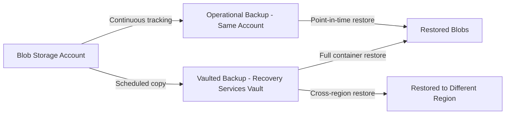

# How to Back Up Azure Blob Storage with Operational and Vaulted Backup Tiers

Author: [nawazdhandala](https://www.github.com/nawazdhandala)

Tags: Azure Backup, Blob Storage, Operational Backup, Vaulted Backup, Data Protection, Point-in-Time Restore, Azure Storage

Description: Learn how to configure Azure Backup for blob storage using both operational and vaulted backup tiers, with point-in-time restore and cross-region protection capabilities.

---

Azure Blob Storage is the backbone of data storage for countless applications. But storing data in blob storage does not inherently protect it from accidental deletion, overwrites, or malicious modifications. Azure's built-in soft delete for blobs helps with accidental deletes, but it does not protect against bulk deletion, storage account compromise, or provide long-term retention.

Azure Backup for blobs offers two backup tiers that complement each other: operational backup (continuous, same-account snapshots) and vaulted backup (periodic, vault-stored copies). This guide covers when to use each and how to set them up.

## Understanding the Two Backup Tiers

### Operational Backup

Operational backup is a continuous, local data protection mechanism. It uses blob versioning and change feed under the hood to track changes and enable point-in-time restore for your blob data.

Key characteristics:
- **Continuous** - No scheduled backup jobs; every change is tracked automatically
- **Local** - Data stays in the same storage account
- **Fast restore** - Point-in-time restore completes quickly because data is local
- **Retention** - Up to 360 days
- **Scope** - Protects all containers in the storage account (you cannot select individual containers)

Use cases: Recovering from accidental deletes, reverting unwanted modifications, undoing bulk operations gone wrong.

### Vaulted Backup

Vaulted backup is a periodic backup that copies blob data to the Recovery Services vault in a different location.

Key characteristics:
- **Scheduled** - Backups run on a schedule (daily or weekly)
- **Offsite** - Data is stored in the vault, separate from the source storage account
- **Cross-region** - With GRS vaults, backup data is replicated to a paired region
- **Long-term retention** - Up to 10 years
- **Container-level** - You can select specific containers to back up

Use cases: Compliance retention, cross-region disaster recovery, protection against storage account deletion or compromise.



## Prerequisites

For operational backup:
- Storage account must be General Purpose v2 or BlobStorage
- Blob versioning must not already be configured with lifecycle management policies that conflict
- The storage account cannot have a read lock

For vaulted backup:
- A Backup vault in the same region as the storage account
- Backup vault must have a managed identity with required permissions on the storage account
- Storage account must not have immutability policies that conflict with backup operations

## Step 1: Set Up Operational Backup

### Create a Backup Vault

Note: Blob backup uses a Backup vault (not a Recovery Services vault). These are different resource types.

```bash
# Create a Backup vault for blob storage protection
az dataprotection backup-vault create \
    --resource-group rg-backup-eastus2 \
    --vault-name bv-blob-eastus2-001 \
    --location eastus2 \
    --type SystemAssigned \
    --storage-setting "[{type:LocallyRedundant,datastore-type:VaultStore}]"
```

### Create an Operational Backup Policy

```bash
# Create an operational backup policy with 30-day retention
# Operational backup is continuous - no schedule needed
az dataprotection backup-policy create \
    --resource-group rg-backup-eastus2 \
    --vault-name bv-blob-eastus2-001 \
    --name policy-blob-operational-30d \
    --policy '{
        "policyRules": [
            {
                "name": "Default",
                "objectType": "AzureRetentionRule",
                "isDefault": true,
                "lifecycles": [
                    {
                        "deleteAfter": {
                            "objectType": "AbsoluteDeleteOption",
                            "duration": "P30D"
                        },
                        "sourceDataStore": {
                            "dataStoreType": "OperationalStore",
                            "objectType": "DataStoreInfoBase"
                        }
                    }
                ]
            }
        ],
        "datasourceTypes": ["Microsoft.Storage/storageAccounts/blobServices"],
        "objectType": "BackupPolicy"
    }'
```

### Grant Permissions and Enable Protection

The Backup vault's managed identity needs the "Storage Account Backup Contributor" role on the storage account:

```bash
# Get the Backup vault's managed identity
VAULT_IDENTITY=$(az dataprotection backup-vault show \
    --resource-group rg-backup-eastus2 \
    --vault-name bv-blob-eastus2-001 \
    --query "identity.principalId" -o tsv)

# Grant the required role on the storage account
az role assignment create \
    --assignee "$VAULT_IDENTITY" \
    --role "Storage Account Backup Contributor" \
    --scope "/subscriptions/<sub-id>/resourceGroups/rg-production/providers/Microsoft.Storage/storageAccounts/stproductioneastus2"

# Configure backup protection
az dataprotection backup-instance create \
    --resource-group rg-backup-eastus2 \
    --vault-name bv-blob-eastus2-001 \
    --backup-instance '{
        "objectType": "BackupInstanceResource",
        "properties": {
            "dataSourceInfo": {
                "resourceID": "/subscriptions/<sub-id>/resourceGroups/rg-production/providers/Microsoft.Storage/storageAccounts/stproductioneastus2",
                "resourceUri": "/subscriptions/<sub-id>/resourceGroups/rg-production/providers/Microsoft.Storage/storageAccounts/stproductioneastus2",
                "datasourceType": "Microsoft.Storage/storageAccounts/blobServices",
                "resourceName": "stproductioneastus2",
                "resourceType": "Microsoft.Storage/storageAccounts",
                "objectType": "Datasource"
            },
            "policyInfo": {
                "policyId": "/subscriptions/<sub-id>/resourceGroups/rg-backup-eastus2/providers/Microsoft.DataProtection/backupVaults/bv-blob-eastus2-001/backupPolicies/policy-blob-operational-30d"
            },
            "objectType": "BackupInstance"
        }
    }'
```

When operational backup is enabled, Azure automatically enables blob versioning, soft delete, and change feed on the storage account. These are required for the continuous point-in-time restore capability.

## Step 2: Restore from Operational Backup

Operational backup supports point-in-time restore for all blobs in the storage account.

```bash
# Restore all containers to a specific point in time
# This restores the entire storage account's blob data to the specified timestamp
az dataprotection backup-instance restore trigger \
    --resource-group rg-backup-eastus2 \
    --vault-name bv-blob-eastus2-001 \
    --backup-instance-name "stproductioneastus2-stproductioneastus2-blob" \
    --restore-request '{
        "objectType": "AzureBlobRestoreRequest",
        "restoreTargetInfo": {
            "objectType": "RestoreTargetInfo",
            "recoveryOption": "FailIfExists",
            "restoreLocation": "eastus2"
        },
        "sourceDataStoreType": "OperationalStore",
        "restoreType": "OriginalLocation",
        "pointInTimeInUTC": "2026-02-15T14:30:00Z"
    }'
```

You can also restore specific blob ranges by specifying container and blob name prefixes, rather than restoring the entire account.

## Step 3: Set Up Vaulted Backup

Vaulted backup provides offsite, long-term protection with container-level granularity.

### Create a Vaulted Backup Policy

```bash
# Create a vaulted backup policy with weekly schedule and 6-month retention
az dataprotection backup-policy create \
    --resource-group rg-backup-eastus2 \
    --vault-name bv-blob-eastus2-001 \
    --name policy-blob-vaulted-6mo \
    --policy '{
        "policyRules": [
            {
                "name": "Default",
                "objectType": "AzureRetentionRule",
                "isDefault": true,
                "lifecycles": [
                    {
                        "deleteAfter": {
                            "objectType": "AbsoluteDeleteOption",
                            "duration": "P180D"
                        },
                        "sourceDataStore": {
                            "dataStoreType": "VaultStore",
                            "objectType": "DataStoreInfoBase"
                        }
                    }
                ]
            },
            {
                "name": "BackupWeekly",
                "objectType": "AzureBackupRule",
                "backupParameters": {
                    "objectType": "AzureBackupParams",
                    "backupType": "Discrete"
                },
                "trigger": {
                    "objectType": "ScheduleBasedTriggerContext",
                    "schedule": {
                        "repeatingTimeIntervals": ["R/2026-02-16T04:00:00+00:00/P1W"]
                    },
                    "taggingCriteria": [
                        {
                            "isDefault": true,
                            "tagInfo": {"tagName": "Default"},
                            "taggingPriority": 99
                        }
                    ]
                },
                "dataStore": {
                    "dataStoreType": "VaultStore",
                    "objectType": "DataStoreInfoBase"
                }
            }
        ],
        "datasourceTypes": ["Microsoft.Storage/storageAccounts/blobServices"],
        "objectType": "BackupPolicy"
    }'
```

### Configure Vaulted Backup for Specific Containers

Unlike operational backup which covers the entire account, vaulted backup lets you select specific containers:

```bash
# Grant additional permissions for vaulted backup
# The vault identity needs read access to the storage account data
az role assignment create \
    --assignee "$VAULT_IDENTITY" \
    --role "Storage Blob Data Reader" \
    --scope "/subscriptions/<sub-id>/resourceGroups/rg-production/providers/Microsoft.Storage/storageAccounts/stproductioneastus2"
```

When configuring the backup instance for vaulted backup, specify the containers you want to protect. This is useful when you only need long-term retention for specific data sets, such as compliance-regulated data in a dedicated container.

## Step 4: Using Both Tiers Together

The best practice is to use both tiers together:

| Scenario | Operational Backup | Vaulted Backup |
|----------|:-:|:-:|
| Accidental file deletion | Fast recovery | Slower but available |
| Bulk accidental operation | Point-in-time restore | Available |
| Storage account compromise | May be affected | Safe in vault |
| Regulatory retention (years) | Max 360 days | Up to 10 years |
| Cross-region protection | No | Yes (with GRS vault) |
| Ransomware recovery | May be affected if attacker has storage access | Protected in vault |

A combined policy gives you:
- Operational backup with 30-day retention for quick recovery from day-to-day issues
- Vaulted backup with weekly schedule and 1-year retention for compliance and disaster recovery

## Monitoring and Cost Management

### Monitor Backup Health

```bash
# Check backup instance status
az dataprotection backup-instance list \
    --resource-group rg-backup-eastus2 \
    --vault-name bv-blob-eastus2-001 \
    --output table

# Check recent backup jobs
az dataprotection job list \
    --resource-group rg-backup-eastus2 \
    --vault-name bv-blob-eastus2-001 \
    --output table
```

### Cost Considerations

**Operational backup costs** include the storage for blob versions and the change feed. The cost depends on your data change rate. If blobs are frequently modified, version storage can grow significantly.

**Vaulted backup costs** include the backup instance fee and vault storage consumed. Vault storage is billed per GB per month.

To manage costs:
- Set operational backup retention to the minimum you need (not the maximum 360 days)
- Use lifecycle management on blob versions to tier older versions to cool or archive storage
- Select only the containers you need for vaulted backup rather than backing up everything

## Wrapping Up

Azure Backup for blob storage gives you two complementary protection mechanisms. Operational backup handles day-to-day data protection with continuous, low-RPO coverage and fast point-in-time restores. Vaulted backup provides the long-term, offsite protection needed for compliance and disaster recovery. Use them together for comprehensive blob data protection, and tailor the retention settings and container selection to match your specific requirements and budget.
