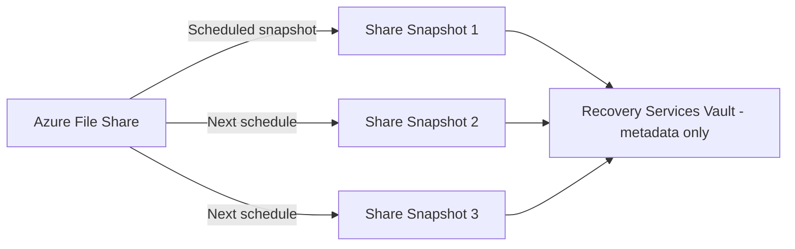

# How to Back Up Azure File Shares Using Azure Backup and Recovery Services Vault

Author: [nawazdhandala](https://www.github.com/nawazdhandala)

Tags: Azure Backup, Azure Files, File Shares, Recovery Services Vault, Snapshots, Data Protection, Cloud Storage

Description: Learn how to configure Azure Backup for Azure File Shares with scheduled snapshots, retention policies, and file-level and share-level restore options.

---

Azure Files is a popular choice for shared storage in the cloud - replacing on-premises file servers, hosting application configuration, or providing shared storage for containers and VMs. But just because your files are in Azure does not mean they are backed up. Azure provides durability through replication (LRS, ZRS, GRS), but replication is not backup. If someone deletes a file or ransomware encrypts your data, replication faithfully copies the damage to all replicas.

Azure Backup integrates directly with Azure Files to provide scheduled snapshots with configurable retention. You can restore entire file shares, individual folders, or single files. This guide walks through the setup and ongoing management.

## How Azure File Share Backup Works

Azure Backup uses Azure Files' native snapshot capability. When a backup runs, it triggers a share snapshot - a read-only, point-in-time copy of the entire file share. These snapshots are incremental at the storage level, meaning only changes since the last snapshot are stored.

The key characteristics:

- **Snapshot-based** - Backups are share snapshots stored alongside the file share
- **Incremental** - Only changed data since the last snapshot is stored
- **Fast restore** - Restoring from a snapshot is nearly instant because data is already in the storage account
- **No data egress** - Backup data stays in the same storage account (no vault transfer for standard tier)
- **File-level restore** - You can restore individual files without restoring the whole share



The Recovery Services vault manages the schedule and retention, but the actual snapshot data lives in the storage account.

## Prerequisites

- An Azure storage account with at least one file share
- A Recovery Services vault in the same region as the storage account
- The storage account must be of a supported type (General Purpose v1, v2, or FileStorage)
- You need Contributor access to both the storage account and the vault

## Step 1: Register the Storage Account with the Vault

Before you can back up file shares, the storage account must be registered with the Recovery Services vault.

1. Open the Recovery Services vault
2. Go to "Backup"
3. Select workload: "Azure" and backup type: "Azure File Share"
4. Select the storage account containing your file shares
5. Azure registers the account with the vault

Using Azure CLI:

```bash
# Register a storage account with the Recovery Services vault
# This allows the vault to manage file share backups in this account
az backup container register \
    --resource-group rg-backup-eastus2 \
    --vault-name rsv-backup-eastus2-001 \
    --backup-management-type AzureStorage \
    --storage-account-name stproductioneastus2

# Verify registration
az backup container list \
    --resource-group rg-backup-eastus2 \
    --vault-name rsv-backup-eastus2-001 \
    --backup-management-type AzureStorage \
    --output table
```

## Step 2: Create a Backup Policy for File Shares

File share backup policies define the snapshot schedule and retention.

### Using the Portal

1. In the vault, go to "Backup policies"
2. Click "Add"
3. Select "Azure File Share"
4. Configure:
   - **Name**: e.g., `policy-fileshare-production`
   - **Schedule**: Daily at a specific time, or multiple times per day
   - **Retention**: Daily, weekly, monthly, yearly

### Using Azure CLI

```bash
# Create a file share backup policy
# Daily snapshots at 10 PM UTC with 30-day retention

az backup policy create \
    --resource-group rg-backup-eastus2 \
    --vault-name rsv-backup-eastus2-001 \
    --name policy-fileshare-production \
    --backup-management-type AzureStorage \
    --policy '{
        "schedulePolicy": {
            "schedulePolicyType": "SimpleSchedulePolicy",
            "scheduleRunFrequency": "Daily",
            "scheduleRunTimes": ["2026-02-16T22:00:00Z"]
        },
        "retentionPolicy": {
            "retentionPolicyType": "LongTermRetentionPolicy",
            "dailySchedule": {
                "retentionTimes": ["2026-02-16T22:00:00Z"],
                "retentionDuration": {
                    "count": 30,
                    "durationType": "Days"
                }
            },
            "weeklySchedule": {
                "daysOfTheWeek": ["Sunday"],
                "retentionTimes": ["2026-02-16T22:00:00Z"],
                "retentionDuration": {
                    "count": 12,
                    "durationType": "Weeks"
                }
            },
            "monthlySchedule": {
                "retentionScheduleFormatType": "Weekly",
                "retentionScheduleWeekly": {
                    "daysOfTheWeek": ["Sunday"],
                    "weeksOfTheMonth": ["First"]
                },
                "retentionTimes": ["2026-02-16T22:00:00Z"],
                "retentionDuration": {
                    "count": 6,
                    "durationType": "Months"
                }
            }
        },
        "timeZone": "UTC"
    }'
```

### Enhanced Backup Policy (Multiple Backups Per Day)

For file shares with frequently changing data, you can configure multiple backups per day using the enhanced policy:

- Every 4 hours
- Every 6 hours
- Every 8 hours
- Every 12 hours

This reduces your RPO from 24 hours to as low as 4 hours.

## Step 3: Enable Backup for File Shares

Apply the policy to your file shares:

```bash
# Enable backup for a specific file share
az backup protection enable-for-azurefileshare \
    --resource-group rg-backup-eastus2 \
    --vault-name rsv-backup-eastus2-001 \
    --storage-account stproductioneastus2 \
    --azure-file-share "shared-documents" \
    --policy-name policy-fileshare-production

# Enable backup for additional file shares
az backup protection enable-for-azurefileshare \
    --resource-group rg-backup-eastus2 \
    --vault-name rsv-backup-eastus2-001 \
    --storage-account stproductioneastus2 \
    --azure-file-share "application-config" \
    --policy-name policy-fileshare-production
```

The first backup snapshot is created according to the schedule, or you can trigger an on-demand backup:

```bash
# Trigger an immediate backup
az backup protection backup-now \
    --resource-group rg-backup-eastus2 \
    --vault-name rsv-backup-eastus2-001 \
    --container-name "StorageContainer;storage;rg-production;stproductioneastus2" \
    --item-name "AzureFileShare;shared-documents" \
    --retain-until 2026-03-18
```

## Step 4: Restore Entire File Shares

If an entire file share is compromised (ransomware, accidental mass delete), restore it from a snapshot.

### Restore to Original Location

This overwrites the current file share with the snapshot contents:

1. In the vault, go to "Backup items" then "Azure File Share"
2. Select the file share
3. Click "Restore Share"
4. Select a recovery point
5. Choose "Original Location"
6. Select overwrite behavior: "Overwrite" or "Skip"
7. Click "Restore"

### Restore to Alternate Location

Create a new file share from the backup - useful when you want to verify the backup before overwriting production:

```bash
# Restore to an alternate file share
# This creates a copy without affecting the original

# List available recovery points
az backup recoverypoint list \
    --resource-group rg-backup-eastus2 \
    --vault-name rsv-backup-eastus2-001 \
    --container-name "StorageContainer;storage;rg-production;stproductioneastus2" \
    --item-name "AzureFileShare;shared-documents" \
    --output table

# Restore to a new file share in the same or different storage account
az backup restore restore-azurefileshare \
    --resource-group rg-backup-eastus2 \
    --vault-name rsv-backup-eastus2-001 \
    --container-name "StorageContainer;storage;rg-production;stproductioneastus2" \
    --item-name "AzureFileShare;shared-documents" \
    --rp-name "recovery-point-id" \
    --resolve-conflict Overwrite \
    --restore-mode AlternateLocation \
    --target-storage-account "/subscriptions/<sub-id>/resourceGroups/rg-production/providers/Microsoft.Storage/storageAccounts/stproductioneastus2" \
    --target-file-share "shared-documents-restored" \
    --target-folder "/"
```

## Step 5: Restore Individual Files and Folders

For surgical restores, you can pick specific files or folders from a recovery point:

1. In the vault, go to the backed-up file share
2. Click "Restore" and select "File Recovery"
3. Select a recovery point
4. Browse or search for the files you need
5. Select files and click "Restore"

You can restore to the original location or an alternate location. Restoring individual files is fast because it only copies the selected items.

This is particularly useful for:
- Recovering accidentally deleted files
- Reverting a file to a previous version
- Extracting a specific configuration file from a point in time

## Snapshot Limits and Cost Considerations

Azure Files allows a maximum of 200 snapshots per file share. Each backup creates one snapshot, so your retention settings must account for this limit.

With daily backups and 30-day retention, you use 30 snapshots. Add weekly (12), monthly (6), and you are at about 48 snapshots. Well within the 200 limit.

If you use the enhanced policy with 4-hour backups and keep them for 5 days, that is 30 snapshots from the enhanced schedule alone. Plan accordingly.

**Snapshot storage cost**: You are billed for the incremental data in each snapshot. If your file share changes very little between snapshots, the cost is minimal. If large portions change frequently, snapshot costs can be significant. Monitor your storage account billing to track this.

## Monitoring and Troubleshooting

### Common Issues

**Backup fails with "Snapshot limit reached"** - You have hit the 200-snapshot limit. Reduce retention or backup frequency. Azure Backup will not delete manually created snapshots, so check for those too.

**Backup fails with "Storage account locked"** - If the storage account has a delete lock, backups may fail when Azure Backup tries to manage snapshots. Ensure the lock allows snapshot operations.

**Restore is slow for large file shares** - Restoring a multi-TB file share takes time. For faster recovery of specific files, use the item-level restore option instead.

### Monitoring with Azure CLI

```bash
# Check backup job status for file shares
az backup job list \
    --resource-group rg-backup-eastus2 \
    --vault-name rsv-backup-eastus2-001 \
    --backup-management-type AzureStorage \
    --output table

# Get detailed information about a specific protected file share
az backup item show \
    --resource-group rg-backup-eastus2 \
    --vault-name rsv-backup-eastus2-001 \
    --container-name "StorageContainer;storage;rg-production;stproductioneastus2" \
    --item-name "AzureFileShare;shared-documents"
```

## Wrapping Up

Azure File Share backup through Azure Backup is the right way to protect your cloud file shares. The snapshot-based approach means backups are fast, restores are nearly instant, and you get granular file-level recovery. Set up a policy that matches your RPO needs, enable protection for all your file shares, and monitor for failures. The incremental nature of snapshots keeps costs manageable, but keep an eye on the 200-snapshot limit and plan your retention accordingly.
