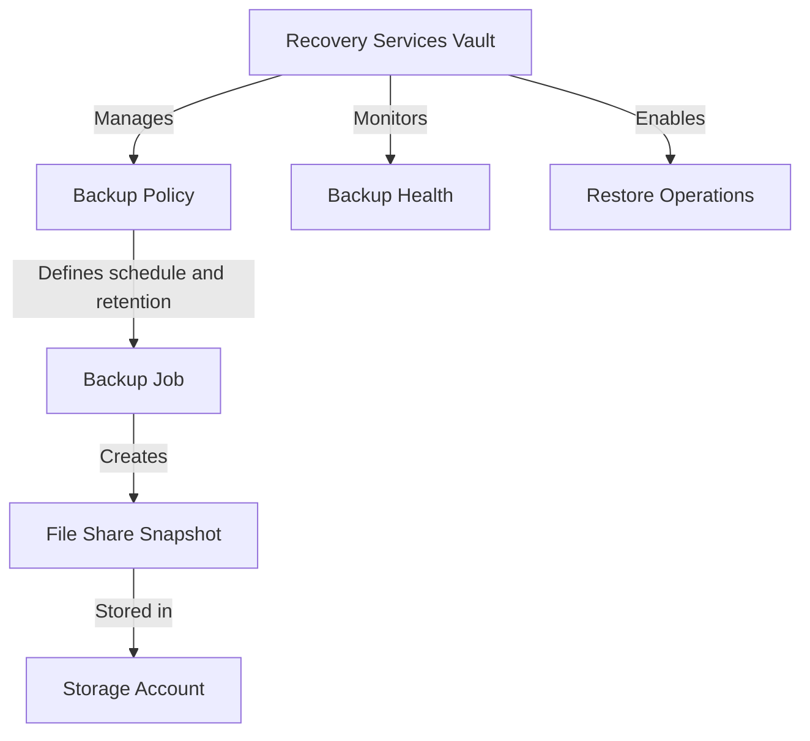

# How to Back Up Azure File Shares Using Azure Backup

Author: [nawazdhandala](https://www.github.com/nawazdhandala)

Tags: Azure, Azure Backup, Azure Files, File Shares, Backup, Disaster Recovery, Data Protection

Description: A detailed guide to configuring Azure Backup for Azure File Shares with automated snapshot management, retention policies, and point-in-time restore capabilities.

---

Azure Backup provides a managed backup solution for Azure File Shares that goes beyond manual snapshots. It handles scheduling, retention, monitoring, and recovery through a unified interface. Under the hood, it uses file share snapshots, but it adds the management layer that makes backups practical at scale.

If you have been manually creating snapshots or writing scripts to automate them, Azure Backup replaces all of that with a built-in, policy-driven approach. Let me walk through the full setup.

## How Azure Backup Works for File Shares

Azure Backup for file shares uses a snapshot-based approach:

1. At your scheduled time, Azure Backup creates a file share snapshot.
2. The snapshot is stored in the same storage account as the file share.
3. Azure Backup manages the retention, deleting old snapshots according to your policy.
4. When you need to restore, Azure Backup handles the recovery from the appropriate snapshot.



Important distinction: the backup data (snapshots) stays in the same storage account. Azure Backup does not copy data to a separate vault location for file share backups (unlike VM backups). This means your backup is not protected against storage account deletion - a point I will address later.

## Prerequisites

- A Recovery Services vault in the same region as the storage account
- An Azure File Share (standard or premium)
- The storage account cannot have a delete lock that prevents snapshot creation
- Appropriate permissions (Backup Contributor role)

## Step 1: Create a Recovery Services Vault

The Recovery Services vault is the management container for your backup configurations:

```bash
# Create a Recovery Services vault
az backup vault create \
  --name myBackupVault \
  --resource-group myresourcegroup \
  --location eastus
```

The vault must be in the same region as the storage account containing your file shares.

## Step 2: Create a Backup Policy

The backup policy defines how often backups run and how long they are retained:

### Using Azure Portal

1. Navigate to your Recovery Services vault.
2. Click "Backup policies" under "Manage."
3. Click "+ Add."
4. Select "Azure File Share" as the policy type.
5. Configure the schedule and retention.

### Using Azure CLI

```bash
# Create a backup policy for Azure File Shares
# This policy runs daily at 2 AM UTC and retains backups for 30 days
az backup policy create \
  --vault-name myBackupVault \
  --resource-group myresourcegroup \
  --name DailyFileSharePolicy \
  --backup-management-type AzureStorage \
  --policy '{
    "schedulePolicy": {
      "schedulePolicyType": "SimpleSchedulePolicy",
      "scheduleRunFrequency": "Daily",
      "scheduleRunTimes": ["2026-02-16T02:00:00Z"]
    },
    "retentionPolicy": {
      "retentionPolicyType": "LongTermRetentionPolicy",
      "dailySchedule": {
        "retentionTimes": ["2026-02-16T02:00:00Z"],
        "retentionDuration": {
          "count": 30,
          "durationType": "Days"
        }
      },
      "weeklySchedule": {
        "daysOfTheWeek": ["Sunday"],
        "retentionTimes": ["2026-02-16T02:00:00Z"],
        "retentionDuration": {
          "count": 12,
          "durationType": "Weeks"
        }
      },
      "monthlySchedule": {
        "retentionScheduleFormatType": "Weekly",
        "retentionScheduleWeekly": {
          "daysOfTheWeek": ["Sunday"],
          "weeksOfTheMonth": ["First"]
        },
        "retentionTimes": ["2026-02-16T02:00:00Z"],
        "retentionDuration": {
          "count": 12,
          "durationType": "Months"
        }
      }
    }
  }'
```

This policy creates:
- Daily backups retained for 30 days
- Weekly backups (Sunday) retained for 12 weeks
- Monthly backups (first Sunday) retained for 12 months

## Step 3: Enable Backup for the File Share

### Azure CLI

```bash
# Register the storage account with the Recovery Services vault
az backup container register \
  --vault-name myBackupVault \
  --resource-group myresourcegroup \
  --backup-management-type AzureStorage \
  --storage-account myfilesaccount

# Enable backup for a specific file share with the policy
az backup protection enable-for-azurefileshare \
  --vault-name myBackupVault \
  --resource-group myresourcegroup \
  --storage-account myfilesaccount \
  --azure-file-share myfileshare \
  --policy-name DailyFileSharePolicy
```

### Azure Portal

1. In the Recovery Services vault, click "Backup."
2. Select "Azure" as the workload location.
3. Select "Azure FileShare" as the backup type.
4. Click "Backup."
5. Select the storage account and file share.
6. Choose or create a backup policy.
7. Click "Enable Backup."

## Step 4: Run an On-Demand Backup

You do not have to wait for the scheduled time. Trigger a backup immediately:

```bash
# Trigger an on-demand backup
az backup protection backup-now \
  --vault-name myBackupVault \
  --resource-group myresourcegroup \
  --container-name "StorageContainer;storage;myresourcegroup;myfilesaccount" \
  --item-name "AzureFileShare;myfileshare" \
  --retain-until "2026-03-16"
```

The `--retain-until` parameter sets when this specific backup expires, independent of the policy retention.

## Monitoring Backup Jobs

### Check Backup Job Status

```bash
# List recent backup jobs
az backup job list \
  --vault-name myBackupVault \
  --resource-group myresourcegroup \
  --output table
```

### Check Backup Item Health

```bash
# Show backup status for a specific file share
az backup item show \
  --vault-name myBackupVault \
  --resource-group myresourcegroup \
  --container-name "StorageContainer;storage;myresourcegroup;myfilesaccount" \
  --name "AzureFileShare;myfileshare"
```

### Set Up Alerts

Configure alerts for backup failures:

```bash
# Create an alert for failed backup jobs
az monitor metrics alert create \
  --name "backup-failure-alert" \
  --resource-group myresourcegroup \
  --scopes "/subscriptions/{sub-id}/resourceGroups/myresourcegroup/providers/Microsoft.RecoveryServices/vaults/myBackupVault" \
  --condition "count BackupHealthEvent > 0" \
  --description "Alert when Azure File Share backup fails"
```

## Restoring from Backup

Azure Backup supports three types of restores:

### Full Share Restore

Restore the entire file share to a point in time. You can restore to the original location (overwriting current data) or to an alternate location.

```bash
# List available recovery points
az backup recoverypoint list \
  --vault-name myBackupVault \
  --resource-group myresourcegroup \
  --container-name "StorageContainer;storage;myresourcegroup;myfilesaccount" \
  --item-name "AzureFileShare;myfileshare" \
  --output table
```

```bash
# Restore the full share to an alternate file share
az backup restore restore-azurefileshare \
  --vault-name myBackupVault \
  --resource-group myresourcegroup \
  --container-name "StorageContainer;storage;myresourcegroup;myfilesaccount" \
  --item-name "AzureFileShare;myfileshare" \
  --rp-name "recovery-point-id" \
  --resolve-conflict Overwrite \
  --restore-mode AlternateLocation \
  --target-storage-account myfilesaccount \
  --target-file-share myfileshare-restored
```

### Item-Level Restore

Restore specific files or folders instead of the entire share:

```bash
# Restore specific files from a recovery point
az backup restore restore-azurefiles \
  --vault-name myBackupVault \
  --resource-group myresourcegroup \
  --container-name "StorageContainer;storage;myresourcegroup;myfilesaccount" \
  --item-name "AzureFileShare;myfileshare" \
  --rp-name "recovery-point-id" \
  --resolve-conflict Overwrite \
  --restore-mode OriginalLocation \
  --source-file-type File \
  --source-file-path "documents/important-report.pdf"
```

To restore a folder:

```bash
# Restore a folder from backup
az backup restore restore-azurefiles \
  --vault-name myBackupVault \
  --resource-group myresourcegroup \
  --container-name "StorageContainer;storage;myresourcegroup;myfilesaccount" \
  --item-name "AzureFileShare;myfileshare" \
  --rp-name "recovery-point-id" \
  --resolve-conflict Overwrite \
  --restore-mode OriginalLocation \
  --source-file-type Directory \
  --source-file-path "documents/project-alpha"
```

### Restore to Alternate Location

When you want to restore to a different file share or storage account:

```bash
# Restore to a different storage account
az backup restore restore-azurefileshare \
  --vault-name myBackupVault \
  --resource-group myresourcegroup \
  --container-name "StorageContainer;storage;myresourcegroup;myfilesaccount" \
  --item-name "AzureFileShare;myfileshare" \
  --rp-name "recovery-point-id" \
  --resolve-conflict Overwrite \
  --restore-mode AlternateLocation \
  --target-storage-account altfilesaccount \
  --target-file-share restored-share \
  --target-folder "restore-2026-02-16"
```

## Managing Backup Retention

### Modifying the Policy

```bash
# Update the retention policy to keep daily backups for 60 days
az backup policy set \
  --vault-name myBackupVault \
  --resource-group myresourcegroup \
  --name DailyFileSharePolicy \
  --policy @updated-policy.json
```

### Stopping Backup

If you no longer need backups for a file share:

```bash
# Stop backup and retain existing data
az backup protection disable \
  --vault-name myBackupVault \
  --resource-group myresourcegroup \
  --container-name "StorageContainer;storage;myresourcegroup;myfilesaccount" \
  --item-name "AzureFileShare;myfileshare" \
  --backup-management-type AzureStorage
```

To stop backup and delete all recovery points:

```bash
# Stop backup and delete all backup data
az backup protection disable \
  --vault-name myBackupVault \
  --resource-group myresourcegroup \
  --container-name "StorageContainer;storage;myresourcegroup;myfilesaccount" \
  --item-name "AzureFileShare;myfileshare" \
  --backup-management-type AzureStorage \
  --delete-backup-data true \
  --yes
```

## Cost Considerations

Azure Backup for file shares costs:

- **Per-protected-instance fee** - A monthly charge for each file share being backed up
- **Snapshot storage** - The incremental storage used by snapshots (billed at the file share's storage rate)

There is no additional vault storage cost because snapshots remain in the source storage account.

## Best Practices

**Use multiple retention tiers.** Daily backups for 30 days, weekly for 12 weeks, and monthly for 12 months gives you good coverage without excessive snapshot accumulation.

**Test restores quarterly.** Do not assume backups work. Restore a few files from each protected share periodically to verify the process.

**Set up email notifications** for backup job failures so you catch issues immediately.

**Consider cross-region redundancy.** Since snapshots are in the same storage account, a storage account failure could take out both your data and backups. Use GRS replication or periodically copy data to another region for true disaster recovery.

**Document your recovery procedures.** When an incident happens, you want runbooks, not exploration. Document the restore commands and test them regularly.

## Wrapping Up

Azure Backup for file shares adds the management layer that manual snapshots lack. It handles scheduling, retention, monitoring, and provides both full-share and item-level restore capabilities. Set up a vault, define a policy with appropriate retention, and enable backup on your file shares. Combined with regular restore testing and monitoring, you get a reliable backup solution that requires minimal ongoing effort.
