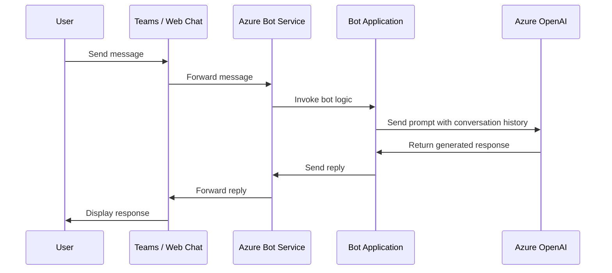

# How to Build a Chatbot with Azure Bot Service and Azure OpenAI

Author: [nawazdhandala](https://www.github.com/nawazdhandala)

Tags: Azure Bot Service, Azure OpenAI, Chatbot, Conversational AI, Bot Framework, GPT, Python

Description: Build a conversational chatbot using Azure Bot Service and Azure OpenAI to deliver intelligent responses powered by GPT models.

---

Building a chatbot that actually understands what users are asking used to require months of work training NLU models and writing dialog trees. With Azure OpenAI and Azure Bot Service together, you can build a genuinely intelligent conversational bot in an afternoon. Azure Bot Service handles the plumbing of receiving messages from channels like Teams, Slack, and web chat, while Azure OpenAI provides the brains through GPT models.

In this guide, I will walk through building a customer support chatbot that uses Azure OpenAI for generating responses and Azure Bot Service for channel connectivity.

## Architecture Overview

The architecture is straightforward. Users send messages through a channel (web chat, Teams, etc.). Azure Bot Service receives those messages and routes them to your bot logic. Your bot logic calls Azure OpenAI to generate a response, then sends it back through the channel.



## Prerequisites

- An Azure subscription
- An Azure OpenAI resource with a GPT model deployed (gpt-4o or gpt-4o-mini work well)
- Python 3.9+ installed
- Bot Framework SDK for Python (`botbuilder-core`)

## Step 1: Create the Azure Bot Service Resource

In the Azure portal, search for "Azure Bot" and create a new bot resource. Choose the "Multi Tenant" type for simplicity. You will need an App Registration - the portal can create one for you automatically.

Note the following values after creation:
- Microsoft App ID
- Microsoft App Password (client secret)
- Bot endpoint URL (you will set this later)

## Step 2: Deploy an Azure OpenAI Model

If you have not already, create an Azure OpenAI resource in the Azure portal. Once provisioned, go to Azure OpenAI Studio and deploy a model. For a chatbot, I recommend deploying `gpt-4o-mini` for cost efficiency or `gpt-4o` for maximum quality.

Note your:
- Azure OpenAI endpoint URL
- API key
- Deployment name

## Step 3: Set Up the Bot Project

Create a new Python project for your bot application.

```bash
# Create project directory and virtual environment
mkdir support-chatbot && cd support-chatbot
python -m venv venv
source venv/bin/activate

# Install required packages
pip install botbuilder-core botbuilder-integration-aiohttp aiohttp openai
```

## Step 4: Write the Bot Logic

The core of the bot is a class that extends `ActivityHandler` from the Bot Framework SDK. It handles incoming messages, maintains conversation history, and calls Azure OpenAI.

```python
# bot.py - Main bot logic with Azure OpenAI integration
from botbuilder.core import ActivityHandler, TurnContext
from openai import AzureOpenAI

class SupportBot(ActivityHandler):
    def __init__(self):
        # Initialize the Azure OpenAI client
        self.client = AzureOpenAI(
            azure_endpoint="https://your-resource.openai.azure.com/",
            api_key="your-api-key",
            api_version="2024-06-01"
        )
        self.deployment_name = "gpt-4o-mini"

        # Store conversation history per conversation ID
        # In production, use a database or Redis for persistence
        self.conversation_histories = {}

        # System prompt that defines the bot's behavior
        self.system_prompt = """You are a helpful customer support agent for a
        software monitoring company called OneUptime. You help users with questions
        about setting up monitors, configuring alerts, understanding incident
        management, and troubleshooting common issues. Be concise, friendly, and
        technical when needed. If you do not know something, say so honestly rather
        than guessing."""

    async def on_message_activity(self, turn_context: TurnContext):
        """Handle incoming messages from users."""
        user_message = turn_context.activity.text
        conversation_id = turn_context.activity.conversation.id

        # Initialize conversation history if this is a new conversation
        if conversation_id not in self.conversation_histories:
            self.conversation_histories[conversation_id] = [
                {"role": "system", "content": self.system_prompt}
            ]

        # Add the user's message to the conversation history
        self.conversation_histories[conversation_id].append(
            {"role": "user", "content": user_message}
        )

        # Keep conversation history manageable (last 20 messages + system prompt)
        history = self.conversation_histories[conversation_id]
        if len(history) > 21:
            history = [history[0]] + history[-20:]
            self.conversation_histories[conversation_id] = history

        # Call Azure OpenAI to generate a response
        try:
            response = self.client.chat.completions.create(
                model=self.deployment_name,
                messages=history,
                max_tokens=800,
                temperature=0.7
            )

            assistant_message = response.choices[0].message.content

            # Add the assistant's response to the conversation history
            self.conversation_histories[conversation_id].append(
                {"role": "assistant", "content": assistant_message}
            )

            # Send the response back to the user
            await turn_context.send_activity(assistant_message)

        except Exception as e:
            error_msg = "I'm sorry, I encountered an error processing your request. Please try again."
            await turn_context.send_activity(error_msg)
            print(f"Error calling Azure OpenAI: {e}")

    async def on_members_added_activity(self, members_added, turn_context: TurnContext):
        """Send a welcome message when the bot joins a conversation."""
        for member in members_added:
            if member.id != turn_context.activity.recipient.id:
                welcome_text = (
                    "Hi there! I'm the OneUptime support bot. "
                    "Ask me anything about monitoring, alerts, or incident management. "
                    "How can I help you today?"
                )
                await turn_context.send_activity(welcome_text)
```

## Step 5: Create the Application Entry Point

The bot needs a web server to receive incoming messages from Azure Bot Service. Use aiohttp with the Bot Framework integration:

```python
# app.py - Web server that receives messages from Azure Bot Service
import sys
import traceback
from aiohttp import web
from aiohttp.web import Request, Response
from botbuilder.core import (
    BotFrameworkAdapterSettings,
    BotFrameworkAdapter,
    TurnContext,
)
from botbuilder.schema import Activity
from bot import SupportBot

# Configuration from environment variables
APP_ID = "your-microsoft-app-id"
APP_PASSWORD = "your-microsoft-app-password"

# Create the adapter with authentication settings
SETTINGS = BotFrameworkAdapterSettings(APP_ID, APP_PASSWORD)
ADAPTER = BotFrameworkAdapter(SETTINGS)

# Error handler that logs exceptions
async def on_error(context: TurnContext, error: Exception):
    print(f"\n [on_turn_error] unhandled error: {error}", file=sys.stderr)
    traceback.print_exc()
    await context.send_activity("Sorry, something went wrong. Please try again.")

ADAPTER.on_turn_error = on_error

# Create the bot instance
BOT = SupportBot()

# Handler for incoming POST requests from the Bot Framework
async def messages(req: Request) -> Response:
    if "application/json" in req.content_type:
        body = await req.json()
    else:
        return Response(status=415)

    activity = Activity().deserialize(body)
    auth_header = req.headers.get("Authorization", "")

    # Process the activity through the adapter and bot
    response = await ADAPTER.process_activity(activity, auth_header, BOT.on_turn)

    if response:
        return Response(body=response.body, status=response.status)
    return Response(status=201)

# Set up the web application with a single route
APP = web.Application()
APP.router.add_post("/api/messages", messages)

if __name__ == "__main__":
    web.run_app(APP, host="0.0.0.0", port=3978)
```

## Step 6: Test Locally with the Bot Framework Emulator

Before deploying, test your bot locally. Start the application:

```bash
python app.py
```

Download and install the Bot Framework Emulator. Open it, click "Open Bot," and enter `http://localhost:3978/api/messages` as the endpoint URL. Enter your App ID and Password. You should now be able to chat with your bot and see responses powered by Azure OpenAI.

## Step 7: Deploy to Azure App Service

For production, deploy the bot to Azure App Service. Create a requirements.txt file:

```
botbuilder-core==4.16.1
botbuilder-integration-aiohttp==4.16.1
aiohttp==3.9.1
openai==1.12.0
```

Deploy using the Azure CLI:

```bash
# Create an App Service plan and web app
az appservice plan create \
    --name support-bot-plan \
    --resource-group rg-chatbot \
    --sku B1 \
    --is-linux

az webapp create \
    --name support-chatbot-app \
    --resource-group rg-chatbot \
    --plan support-bot-plan \
    --runtime "PYTHON:3.11"

# Set environment variables (app settings)
az webapp config appsettings set \
    --name support-chatbot-app \
    --resource-group rg-chatbot \
    --settings \
    MICROSOFT_APP_ID="your-app-id" \
    MICROSOFT_APP_PASSWORD="your-app-password" \
    AZURE_OPENAI_ENDPOINT="https://your-resource.openai.azure.com/" \
    AZURE_OPENAI_KEY="your-key" \
    AZURE_OPENAI_DEPLOYMENT="gpt-4o-mini"

# Deploy the code
az webapp up \
    --name support-chatbot-app \
    --resource-group rg-chatbot
```

## Step 8: Configure the Bot Endpoint

Back in the Azure portal, go to your Azure Bot resource and update the messaging endpoint to point to your deployed App Service:

```
https://support-chatbot-app.azurewebsites.net/api/messages
```

## Adding Conversation Persistence

The in-memory conversation history shown above works for testing but will not survive restarts. For production, use Azure Cosmos DB or Azure Blob Storage with the Bot Framework's state management:

```python
# state_setup.py - Configure persistent state storage using Cosmos DB
from botbuilder.azure import CosmosDbPartitionedStorage, CosmosDbPartitionedConfig
from botbuilder.core import ConversationState, UserState

# Configure Cosmos DB for bot state storage
cosmos_config = CosmosDbPartitionedConfig(
    cosmos_db_endpoint="https://your-cosmos.documents.azure.com:443/",
    auth_key="your-cosmos-key",
    database_id="bot-state",
    container_id="conversations"
)

# Create storage and state objects
storage = CosmosDbPartitionedStorage(cosmos_config)
conversation_state = ConversationState(storage)
user_state = UserState(storage)
```

## Summary

Building a chatbot with Azure Bot Service and Azure OpenAI gives you the best of both worlds: enterprise-grade channel connectivity and state-of-the-art language understanding. The Bot Framework SDK handles the protocol complexities, while GPT models handle the intelligence. From here, you can extend the bot with proactive messaging, adaptive cards for rich UI, and function calling for dynamic tool use. The combination scales well from a simple FAQ bot to a full conversational assistant.
