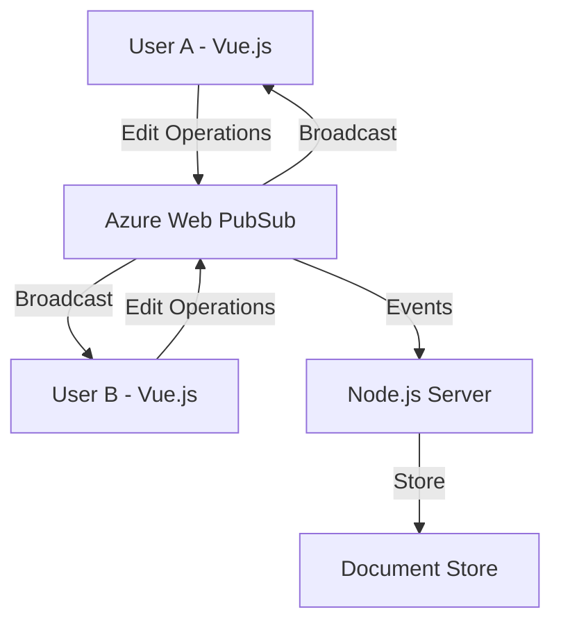

# How to Build a Collaborative Editing Tool with Azure Web PubSub and Vue.js

Author: [nawazdhandala](https://www.github.com/nawazdhandala)

Tags: Azure Web PubSub, Vue.js, Collaborative Editing, WebSocket, Real-Time, CRDT, JavaScript

Description: Build a collaborative text editing tool using Azure Web PubSub for real-time synchronization and Vue.js for the frontend interface.

---

Collaborative editing - where multiple users edit the same document simultaneously - is one of the hardest real-time problems to solve. Google Docs made it look easy, but behind the scenes, there is sophisticated conflict resolution happening with every keystroke. The two main approaches are Operational Transformation (OT) and Conflict-free Replicated Data Types (CRDTs).

In this post, we will build a simplified collaborative editor using Azure Web PubSub for real-time communication and Vue.js for the frontend. We will use a basic operational transform approach to handle concurrent edits.

## Architecture



Each user's edits are sent as operations (insert, delete) to Azure Web PubSub. The service broadcasts them to all other connected users, who apply the operations to their local copy.

## Step 1: Define the Operation Model

Operations are the foundation of collaborative editing. Instead of sending the full document text on every change, we send small operations that describe what changed.

```javascript
// shared/operations.js
// Operation types for the collaborative editor

// An operation represents a single edit action
// type: 'insert' | 'delete' | 'retain'
// position: where in the document the operation applies
// text: the text to insert (for insert operations)
// count: number of characters to delete (for delete operations)

class Operation {
  constructor(type, position, data) {
    this.type = type;       // 'insert', 'delete', or 'cursor'
    this.position = position; // Character position in the document
    this.data = data;       // Text for insert, count for delete
    this.userId = null;     // Set by the server
    this.timestamp = Date.now();
    this.version = 0;       // Document version when this op was created
  }
}

// Transform operation A against operation B
// This is the core of OT - it adjusts positions so concurrent ops work correctly
function transformOperation(opA, opB) {
  // If both are inserts at the same position, the one with the earlier timestamp wins
  if (opA.type === 'insert' && opB.type === 'insert') {
    if (opB.position <= opA.position) {
      // B inserted before A, so shift A's position forward
      return { ...opA, position: opA.position + opB.data.length };
    }
    return opA; // No change needed
  }

  if (opA.type === 'insert' && opB.type === 'delete') {
    if (opB.position < opA.position) {
      // B deleted before A's insert position
      return { ...opA, position: Math.max(opB.position, opA.position - opB.data) };
    }
    return opA;
  }

  if (opA.type === 'delete' && opB.type === 'insert') {
    if (opB.position <= opA.position) {
      return { ...opA, position: opA.position + opB.data.length };
    }
    return opA;
  }

  if (opA.type === 'delete' && opB.type === 'delete') {
    if (opB.position < opA.position) {
      return { ...opA, position: opA.position - Math.min(opB.data, opA.position - opB.position) };
    }
    return opA;
  }

  return opA;
}

module.exports = { Operation, transformOperation };
```

## Step 2: Build the Backend Server

The server manages document state, handles conflict resolution, and relays operations through Azure Web PubSub.

```javascript
// server.js
// Collaborative editing server with Azure Web PubSub
const express = require('express');
const { WebPubSubServiceClient } = require('@azure/web-pubsub');
const { WebPubSubEventHandler } = require('@azure/web-pubsub-express');
const { transformOperation } = require('./shared/operations');

const app = express();
app.use(express.json());

const connectionString = process.env.WEBPUBSUB_CONNECTION_STRING;
const hubName = 'editor';
const serviceClient = new WebPubSubServiceClient(connectionString, hubName);

// Document state management
const documents = new Map();

function getOrCreateDocument(docId) {
  if (!documents.has(docId)) {
    documents.set(docId, {
      id: docId,
      content: '',
      version: 0,
      operations: [],     // Operation history for conflict resolution
      cursors: new Map(),  // userId -> cursor position
    });
  }
  return documents.get(docId);
}

// Apply an operation to the document content
function applyOperation(doc, op) {
  if (op.type === 'insert') {
    // Insert text at the specified position
    doc.content =
      doc.content.slice(0, op.position) +
      op.data +
      doc.content.slice(op.position);
  } else if (op.type === 'delete') {
    // Delete characters starting at the specified position
    doc.content =
      doc.content.slice(0, op.position) +
      doc.content.slice(op.position + op.data);
  }
  doc.version++;
}

const handler = new WebPubSubEventHandler(hubName, {
  path: '/eventhandler',

  handleUserEvent: async (req, res) => {
    const userId = req.context.userId;
    const connectionId = req.context.connectionId;

    try {
      const event = JSON.parse(req.data);

      switch (event.type) {
        case 'join_document': {
          const doc = getOrCreateDocument(event.docId);

          // Add to the document group
          await serviceClient.group(event.docId).addConnection(connectionId);

          // Send the current document state to the joining user
          await serviceClient.sendToConnection(connectionId, JSON.stringify({
            type: 'document_state',
            content: doc.content,
            version: doc.version,
            cursors: Object.fromEntries(doc.cursors),
          }));

          // Notify others that a user joined
          await serviceClient.group(event.docId).sendToAll(JSON.stringify({
            type: 'user_joined',
            userId,
          }), { filter: `connectionId ne '${connectionId}'` });
          break;
        }

        case 'operation': {
          const doc = getOrCreateDocument(event.docId);
          let op = event.operation;
          op.userId = userId;

          // Transform the operation against any operations that happened
          // between the client's version and the current server version
          if (op.version < doc.version) {
            const missedOps = doc.operations.slice(op.version);
            for (const serverOp of missedOps) {
              if (serverOp.userId !== userId) {
                op = transformOperation(op, serverOp);
              }
            }
          }

          // Apply the transformed operation
          op.version = doc.version;
          applyOperation(doc, op);
          doc.operations.push(op);

          // Keep only the last 1000 operations to bound memory
          if (doc.operations.length > 1000) {
            doc.operations = doc.operations.slice(-500);
          }

          // Broadcast the operation to all other users in the document
          await serviceClient.group(event.docId).sendToAll(JSON.stringify({
            type: 'remote_operation',
            operation: op,
            version: doc.version,
          }), { filter: `connectionId ne '${connectionId}'` });

          // Acknowledge the operation to the sender
          await serviceClient.sendToConnection(connectionId, JSON.stringify({
            type: 'ack',
            version: doc.version,
          }));
          break;
        }

        case 'cursor_update': {
          const doc = getOrCreateDocument(event.docId);
          doc.cursors.set(userId, event.position);

          // Broadcast cursor position to others
          await serviceClient.group(event.docId).sendToAll(JSON.stringify({
            type: 'cursor_update',
            userId,
            position: event.position,
          }), { filter: `connectionId ne '${connectionId}'` });
          break;
        }
      }

      res.success();
    } catch (err) {
      console.error('Error:', err);
      res.fail(500, err.message);
    }
  },

  onDisconnected: async (req) => {
    const userId = req.context.userId;
    // Remove cursor for disconnected user from all documents
    for (const [docId, doc] of documents) {
      if (doc.cursors.has(userId)) {
        doc.cursors.delete(userId);
        await serviceClient.group(docId).sendToAll(JSON.stringify({
          type: 'cursor_removed',
          userId,
        }));
      }
    }
  },
});

app.use(handler.getMiddleware());

// Negotiate endpoint for client connection
app.get('/api/negotiate', async (req, res) => {
  const userId = req.query.userId || `user-${Date.now()}`;
  const token = await serviceClient.getClientAccessToken({
    userId,
    roles: ['webpubsub.sendToServerEvent', 'webpubsub.joinLeaveGroup'],
  });
  res.json({ url: token.url, userId });
});

app.listen(3001, () => console.log('Server running on port 3001'));
```

## Step 3: Build the Vue.js Frontend

Create the Vue.js editor component that connects to Web PubSub and handles real-time editing.

```vue
<!-- src/components/CollaborativeEditor.vue -->
<!-- Main editor component with real-time collaboration -->
<template>
  <div class="editor-container">
    <div class="toolbar">
      <span>Document: {{ docId }}</span>
      <span>Version: {{ version }}</span>
      <span v-for="user in remoteUsers" :key="user" class="user-badge">
        {{ user }}
      </span>
    </div>

    <div class="editor-wrapper">
      <textarea
        ref="editor"
        v-model="localContent"
        @input="handleInput"
        @keyup="handleCursorMove"
        @click="handleCursorMove"
        class="editor-textarea"
        placeholder="Start typing..."
      ></textarea>

      <!-- Remote cursor indicators -->
      <div
        v-for="(pos, userId) in remoteCursors"
        :key="userId"
        class="remote-cursor"
        :style="{ left: getCursorX(pos) + 'px', top: getCursorY(pos) + 'px' }"
      >
        <div class="cursor-label">{{ userId }}</div>
      </div>
    </div>
  </div>
</template>

<script>
export default {
  name: 'CollaborativeEditor',
  props: {
    docId: { type: String, default: 'default-doc' },
    userId: { type: String, required: true },
  },

  data() {
    return {
      ws: null,
      localContent: '',
      version: 0,
      remoteCursors: {},
      remoteUsers: [],
      pendingOps: [],       // Operations waiting for server acknowledgment
      lastContent: '',      // Track content to detect changes
    };
  },

  async mounted() {
    await this.connect();
  },

  beforeUnmount() {
    if (this.ws) {
      this.ws.close();
    }
  },

  methods: {
    async connect() {
      // Get the WebSocket URL from the server
      const response = await fetch(
        `http://localhost:3001/api/negotiate?userId=${this.userId}`
      );
      const { url } = await response.json();

      this.ws = new WebSocket(url, 'json.webpubsub.azure.v1');

      this.ws.onopen = () => {
        // Join the document after connecting
        this.sendEvent({
          type: 'join_document',
          docId: this.docId,
        });
      };

      this.ws.onmessage = (event) => {
        const data = JSON.parse(event.data);
        if (data.data) {
          this.handleServerMessage(JSON.parse(data.data));
        }
      };
    },

    handleServerMessage(msg) {
      switch (msg.type) {
        case 'document_state':
          // Initial document load
          this.localContent = msg.content;
          this.lastContent = msg.content;
          this.version = msg.version;
          if (msg.cursors) {
            this.remoteCursors = msg.cursors;
          }
          break;

        case 'remote_operation':
          // Apply a remote user's operation to our local content
          this.applyRemoteOperation(msg.operation);
          this.version = msg.version;
          break;

        case 'ack':
          // Server acknowledged our operation
          this.version = msg.version;
          this.pendingOps.shift();
          break;

        case 'cursor_update':
          this.remoteCursors = {
            ...this.remoteCursors,
            [msg.userId]: msg.position,
          };
          break;

        case 'cursor_removed':
          const cursors = { ...this.remoteCursors };
          delete cursors[msg.userId];
          this.remoteCursors = cursors;
          break;

        case 'user_joined':
          if (!this.remoteUsers.includes(msg.userId)) {
            this.remoteUsers.push(msg.userId);
          }
          break;
      }
    },

    handleInput(event) {
      const newContent = event.target.value;
      const oldContent = this.lastContent;

      // Detect what changed by comparing old and new content
      const op = this.detectOperation(oldContent, newContent);
      if (op) {
        op.version = this.version;
        this.sendEvent({
          type: 'operation',
          docId: this.docId,
          operation: op,
        });
        this.pendingOps.push(op);
      }

      this.lastContent = newContent;
    },

    detectOperation(oldText, newText) {
      // Find the first position where the texts differ
      let start = 0;
      while (start < oldText.length && start < newText.length && oldText[start] === newText[start]) {
        start++;
      }

      if (newText.length > oldText.length) {
        // Text was inserted
        const insertedLength = newText.length - oldText.length;
        return {
          type: 'insert',
          position: start,
          data: newText.slice(start, start + insertedLength),
        };
      } else if (newText.length < oldText.length) {
        // Text was deleted
        const deletedLength = oldText.length - newText.length;
        return {
          type: 'delete',
          position: start,
          data: deletedLength,
        };
      }
      return null;
    },

    applyRemoteOperation(op) {
      const editor = this.$refs.editor;
      const cursorPos = editor.selectionStart;

      if (op.type === 'insert') {
        this.localContent =
          this.localContent.slice(0, op.position) +
          op.data +
          this.localContent.slice(op.position);

        // Adjust local cursor if the insert was before it
        if (op.position <= cursorPos) {
          this.$nextTick(() => {
            editor.selectionStart = cursorPos + op.data.length;
            editor.selectionEnd = cursorPos + op.data.length;
          });
        }
      } else if (op.type === 'delete') {
        this.localContent =
          this.localContent.slice(0, op.position) +
          this.localContent.slice(op.position + op.data);

        if (op.position < cursorPos) {
          this.$nextTick(() => {
            const newPos = Math.max(op.position, cursorPos - op.data);
            editor.selectionStart = newPos;
            editor.selectionEnd = newPos;
          });
        }
      }

      this.lastContent = this.localContent;
    },

    handleCursorMove() {
      const pos = this.$refs.editor.selectionStart;
      this.sendEvent({
        type: 'cursor_update',
        docId: this.docId,
        position: pos,
      });
    },

    sendEvent(eventData) {
      if (this.ws && this.ws.readyState === WebSocket.OPEN) {
        this.ws.send(JSON.stringify({
          type: 'event',
          event: 'message',
          dataType: 'text',
          data: JSON.stringify(eventData),
        }));
      }
    },

    getCursorX(position) {
      // Simplified cursor position calculation
      return (position % 80) * 8;
    },

    getCursorY(position) {
      return Math.floor(position / 80) * 20;
    },
  },
};
</script>
```

## Handling Edge Cases

Collaborative editing has several tricky edge cases:

- **Network partitions**: When a user goes offline and comes back, they need to sync their local changes with the server. Our version tracking helps detect this.
- **Rapid typing**: Debounce operation sending to avoid overwhelming the server. Group keystrokes that happen within 50ms into a single operation.
- **Large documents**: For documents over 100KB, consider sending diffs instead of full operations, or use a more efficient CRDT library like Yjs.

## Summary

We built a collaborative editor using Azure Web PubSub and Vue.js. The key components are the operation model for describing edits, operational transformation for handling concurrent changes, and Azure Web PubSub for real-time message delivery. This implementation covers the fundamentals - for production use, consider using a battle-tested CRDT library like Yjs or Automerge, which handle the conflict resolution in a more robust way. Azure Web PubSub handles the real-time transport layer cleanly, letting you focus on the editing logic rather than WebSocket connection management.
