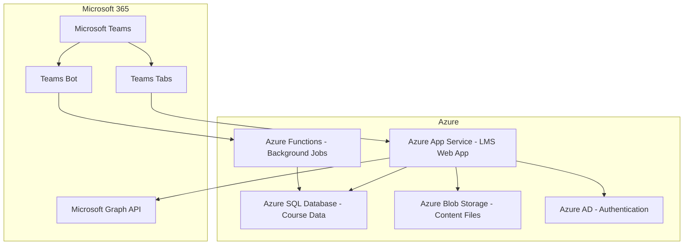

# How to Build a Custom Learning Management System with Azure App Service and Teams Integration

Author: [nawazdhandala](https://www.github.com/nawazdhandala)

Tags: Azure App Service, Microsoft Teams, Learning Management System, Education, LMS, Teams Integration, Web Application

Description: Build a custom learning management system on Azure App Service with Microsoft Teams integration for course delivery and student engagement.

---

Off-the-shelf learning management systems work for many organizations, but sometimes you need something tailored to your specific workflow. Maybe your institution has unique grading criteria, specialized content types, or needs deep integration with Microsoft Teams where students and instructors already spend their time.

Building a custom LMS on Azure App Service gives you full control over the feature set. Adding Teams integration means students can access courses, submit assignments, and receive notifications without leaving the tool they use for everything else. In this guide, I will build the core of an LMS and wire it up to Teams.

## Architecture



The LMS web app runs on App Service and stores course data in Azure SQL and content files in Blob Storage. Azure AD handles authentication. The Teams integration consists of custom tabs for in-Teams access and a bot for notifications and quick actions.

## Step 1 - Set Up the Azure Infrastructure

```bash
# Create the resource group
az group create --name lms-rg --location eastus

# Create the App Service plan
az appservice plan create \
  --name lms-plan \
  --resource-group lms-rg \
  --sku B2 \
  --is-linux

# Create the web app
az webapp create \
  --name custom-lms-app \
  --resource-group lms-rg \
  --plan lms-plan \
  --runtime "NODE:18-lts"

# Create the SQL database
az sql server create \
  --name lms-sql-server \
  --resource-group lms-rg \
  --location eastus \
  --admin-user lmsadmin \
  --admin-password "<strong-password>"

az sql db create \
  --name LmsDatabase \
  --server lms-sql-server \
  --resource-group lms-rg \
  --service-objective S1

# Create blob storage for course content
az storage account create \
  --name lmscontentstorage \
  --resource-group lms-rg \
  --sku Standard_LRS \
  --location eastus

az storage container create \
  --name course-content \
  --account-name lmscontentstorage
```

## Step 2 - Build the Core LMS API

The LMS needs endpoints for courses, lessons, enrollments, assignments, and grades. Here is a Node.js Express API for the core functionality.

```javascript
const express = require('express');
const sql = require('mssql');
const { BlobServiceClient } = require('@azure/storage-blob');

const app = express();
app.use(express.json());

// Database connection pool
const pool = new sql.ConnectionPool({
    server: process.env.SQL_SERVER,
    database: process.env.SQL_DATABASE,
    user: process.env.SQL_USER,
    password: process.env.SQL_PASSWORD,
    options: { encrypt: true }
});

// Course management endpoints
app.get('/api/courses', async (req, res) => {
    // List all courses the authenticated user has access to
    const userId = req.user.id;
    const result = await pool.request()
        .input('userId', sql.NVarChar, userId)
        .query(`
            SELECT c.*, e.role as userRole
            FROM Courses c
            INNER JOIN Enrollments e ON c.id = e.courseId
            WHERE e.userId = @userId AND c.isActive = 1
            ORDER BY c.startDate DESC
        `);
    res.json(result.recordset);
});

app.get('/api/courses/:courseId', async (req, res) => {
    // Get course details with lessons and progress
    const { courseId } = req.params;
    const userId = req.user.id;

    const course = await pool.request()
        .input('courseId', sql.Int, courseId)
        .query('SELECT * FROM Courses WHERE id = @courseId');

    const lessons = await pool.request()
        .input('courseId', sql.Int, courseId)
        .input('userId', sql.NVarChar, userId)
        .query(`
            SELECT l.*,
                CASE WHEN p.completedAt IS NOT NULL THEN 1 ELSE 0 END as isCompleted,
                p.completedAt
            FROM Lessons l
            LEFT JOIN LessonProgress p ON l.id = p.lessonId AND p.userId = @userId
            WHERE l.courseId = @courseId
            ORDER BY l.orderIndex
        `);

    res.json({
        ...course.recordset[0],
        lessons: lessons.recordset,
        completedCount: lessons.recordset.filter(l => l.isCompleted).length,
        totalLessons: lessons.recordset.length
    });
});

// Assignment submission endpoint
app.post('/api/courses/:courseId/assignments/:assignmentId/submit', async (req, res) => {
    const { courseId, assignmentId } = req.params;
    const userId = req.user.id;
    const { content, attachmentUrls } = req.body;

    // Check if assignment is still open
    const assignment = await pool.request()
        .input('assignmentId', sql.Int, assignmentId)
        .query('SELECT * FROM Assignments WHERE id = @assignmentId');

    if (new Date() > new Date(assignment.recordset[0].dueDate)) {
        return res.status(400).json({ error: 'Assignment deadline has passed' });
    }

    // Create or update the submission
    await pool.request()
        .input('assignmentId', sql.Int, assignmentId)
        .input('userId', sql.NVarChar, userId)
        .input('content', sql.NVarChar, content)
        .input('attachments', sql.NVarChar, JSON.stringify(attachmentUrls))
        .input('submittedAt', sql.DateTime, new Date())
        .query(`
            MERGE Submissions AS target
            USING (SELECT @assignmentId as assignmentId, @userId as userId) AS source
            ON target.assignmentId = source.assignmentId AND target.userId = source.userId
            WHEN MATCHED THEN
                UPDATE SET content = @content, attachments = @attachments,
                           submittedAt = @submittedAt, status = 'submitted'
            WHEN NOT MATCHED THEN
                INSERT (assignmentId, userId, content, attachments, submittedAt, status)
                VALUES (@assignmentId, @userId, @content, @attachments, @submittedAt, 'submitted');
        `);

    // Notify the instructor via Teams
    await notifyInstructor(courseId, assignmentId, userId);

    res.json({ success: true, message: 'Assignment submitted' });
});

// Grading endpoint for instructors
app.post('/api/submissions/:submissionId/grade', async (req, res) => {
    const { submissionId } = req.params;
    const { score, maxScore, feedback } = req.body;

    await pool.request()
        .input('submissionId', sql.Int, submissionId)
        .input('score', sql.Int, score)
        .input('maxScore', sql.Int, maxScore)
        .input('feedback', sql.NVarChar, feedback)
        .input('gradedAt', sql.DateTime, new Date())
        .query(`
            UPDATE Submissions
            SET score = @score, maxScore = @maxScore, feedback = @feedback,
                gradedAt = @gradedAt, status = 'graded'
            WHERE id = @submissionId
        `);

    // Get submission details for notification
    const submission = await pool.request()
        .input('submissionId', sql.Int, submissionId)
        .query('SELECT s.*, a.title FROM Submissions s JOIN Assignments a ON s.assignmentId = a.id WHERE s.id = @submissionId');

    // Notify the student that their assignment has been graded
    await notifyStudent(submission.recordset[0].userId, {
        type: 'grade_posted',
        assignmentTitle: submission.recordset[0].title,
        score: score,
        maxScore: maxScore
    });

    res.json({ success: true });
});

app.listen(process.env.PORT || 3000);
```

## Step 3 - Build the Teams Tab Integration

A Teams tab embeds your LMS directly inside a Teams channel. Students can browse courses and view content without leaving Teams.

Create a Teams app manifest that defines the tab.

```json
{
  "$schema": "https://developer.microsoft.com/en-us/json-schemas/teams/v1.16/MicrosoftTeams.schema.json",
  "manifestVersion": "1.16",
  "version": "1.0.0",
  "id": "your-app-guid",
  "name": {
    "short": "LMS",
    "full": "Custom Learning Management System"
  },
  "description": {
    "short": "Access courses and assignments",
    "full": "View course content, submit assignments, and track your learning progress directly in Teams."
  },
  "developer": {
    "name": "Your Organization",
    "websiteUrl": "https://custom-lms-app.azurewebsites.net",
    "privacyUrl": "https://custom-lms-app.azurewebsites.net/privacy",
    "termsOfUseUrl": "https://custom-lms-app.azurewebsites.net/terms"
  },
  "staticTabs": [
    {
      "entityId": "courses",
      "name": "My Courses",
      "contentUrl": "https://custom-lms-app.azurewebsites.net/teams/courses",
      "scopes": ["personal"]
    }
  ],
  "configurableTabs": [
    {
      "configurationUrl": "https://custom-lms-app.azurewebsites.net/teams/configure",
      "canUpdateConfiguration": true,
      "scopes": ["team", "groupchat"]
    }
  ],
  "permissions": ["identity", "messageTeamMembers"],
  "validDomains": ["custom-lms-app.azurewebsites.net"]
}
```

The tab page uses the Teams JavaScript SDK to integrate with the Teams context.

```javascript
// teams-tab.js - Client-side code for the Teams tab
import * as microsoftTeams from '@microsoft/teams-js';

async function initializeTab() {
    // Initialize the Teams SDK
    await microsoftTeams.app.initialize();

    // Get the Teams context (current user, team, channel)
    const context = await microsoftTeams.app.getContext();
    const userPrincipalName = context.user.userPrincipalName;
    const teamId = context.team?.internalId;

    // Authenticate using Teams SSO
    const token = await microsoftTeams.authentication.getAuthToken();

    // Use the token to call your LMS API
    const courses = await fetch('/api/courses', {
        headers: {
            'Authorization': `Bearer ${token}`,
            'Content-Type': 'application/json'
        }
    }).then(r => r.json());

    // Render the courses list
    renderCourses(courses);
}

function renderCourses(courses) {
    const container = document.getElementById('courses-container');
    container.innerHTML = courses.map(course => `
        <div class="course-card" onclick="openCourse('${course.id}')">
            <h3>${course.title}</h3>
            <p>${course.description}</p>
            <div class="progress-bar">
                <div class="progress-fill" style="width: ${course.completionPct}%"></div>
            </div>
            <span>${course.completedCount}/${course.totalLessons} lessons completed</span>
        </div>
    `).join('');
}

function openCourse(courseId) {
    // Open the course in a Teams task module (dialog)
    microsoftTeams.dialog.open({
        title: 'Course Content',
        url: `/teams/course/${courseId}`,
        size: { width: 800, height: 600 }
    });
}

initializeTab();
```

## Step 4 - Build the Notification Bot

A Teams bot can proactively message students about upcoming deadlines, new grades, and course announcements.

```javascript
const { TeamsActivityHandler, TurnContext } = require('botbuilder');
const { Client } = require('@microsoft/microsoft-graph-client');

class LmsBot extends TeamsActivityHandler {
    constructor(conversationReferences) {
        super();
        this.conversationReferences = conversationReferences;

        // Handle incoming messages from students
        this.onMessage(async (context, next) => {
            const text = context.activity.text.trim().toLowerCase();

            if (text === 'my grades') {
                await this.showGrades(context);
            } else if (text === 'upcoming deadlines') {
                await this.showDeadlines(context);
            } else if (text.startsWith('help')) {
                await context.sendActivity(
                    'Available commands:\n' +
                    '- **my grades** - Show your recent grades\n' +
                    '- **upcoming deadlines** - Show assignments due this week'
                );
            }

            await next();
        });

        // Store conversation reference when users interact with the bot
        this.onConversationUpdate(async (context, next) => {
            const ref = TurnContext.getConversationReference(context.activity);
            this.conversationReferences[ref.user.aadObjectId] = ref;
            await next();
        });
    }

    async showGrades(context) {
        const userId = context.activity.from.aadObjectId;
        // Fetch grades from your LMS API
        const grades = await fetchUserGrades(userId);

        let message = '**Your Recent Grades:**\n\n';
        for (const grade of grades) {
            message += `- ${grade.assignmentTitle}: ${grade.score}/${grade.maxScore} `;
            message += `(${Math.round(grade.score/grade.maxScore*100)}%)\n`;
        }

        await context.sendActivity(message);
    }

    async showDeadlines(context) {
        const userId = context.activity.from.aadObjectId;
        const deadlines = await fetchUpcomingDeadlines(userId);

        let message = '**Upcoming Deadlines:**\n\n';
        for (const d of deadlines) {
            const dueDate = new Date(d.dueDate).toLocaleDateString();
            message += `- ${d.title} (${d.courseName}) - Due: ${dueDate}\n`;
        }

        await context.sendActivity(message);
    }
}

module.exports.LmsBot = LmsBot;
```

## Step 5 - Proactive Notifications

The most valuable part of the bot is proactive messaging - reaching out to students without them asking.

```javascript
async function sendDeadlineReminder(adapter, conversationReferences, userId, assignment) {
    // Send a proactive message to a specific student
    const ref = conversationReferences[userId];
    if (!ref) return;  // User has not interacted with the bot yet

    await adapter.continueConversationAsync(
        process.env.BOT_ID,
        ref,
        async (context) => {
            await context.sendActivity({
                type: 'message',
                attachments: [{
                    contentType: 'application/vnd.microsoft.card.adaptive',
                    content: {
                        type: 'AdaptiveCard',
                        version: '1.4',
                        body: [
                            {
                                type: 'TextBlock',
                                text: 'Assignment Reminder',
                                weight: 'Bolder',
                                size: 'Medium'
                            },
                            {
                                type: 'TextBlock',
                                text: `**${assignment.title}** is due in 24 hours.`,
                                wrap: true
                            },
                            {
                                type: 'TextBlock',
                                text: `Course: ${assignment.courseName}`,
                                isSubtle: true
                            }
                        ],
                        actions: [
                            {
                                type: 'Action.OpenUrl',
                                title: 'Submit Assignment',
                                url: `https://custom-lms-app.azurewebsites.net/course/${assignment.courseId}/assignment/${assignment.id}`
                            }
                        ]
                    }
                }]
            });
        }
    );
}
```

Schedule deadline reminders with an Azure Function that runs hourly and checks for assignments due within 24 hours.

## Wrapping Up

A custom LMS on Azure App Service with Teams integration brings learning directly into the tool students already use. The web app handles course content, assignments, and grading. Teams tabs embed the experience inside Teams channels. The bot provides proactive notifications and quick queries. Azure AD ties authentication together across both platforms. Start with the core LMS functionality, add the Teams tab for in-channel access, and layer on the bot for notifications. Each piece adds value independently, so you can roll out incrementally.
