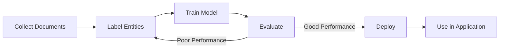

# How to Build a Custom Named Entity Recognition Model with Azure AI Language

Author: [nawazdhandala](https://www.github.com/nawazdhandala)

Tags: Azure AI Language, Named Entity Recognition, NER, Custom Models, Text Analytics, Machine Learning, Python

Description: Train a custom Named Entity Recognition model with Azure AI Language to extract domain-specific entities from text in your applications.

---

The pre-built NER model in Azure AI Language recognizes common entities like people, locations, organizations, and dates. But what if you need to extract entities specific to your domain - things like medication names from clinical notes, part numbers from manufacturing reports, or policy identifiers from insurance documents? That is where custom NER comes in.

Custom Named Entity Recognition lets you train a model on your own labeled data to extract whatever entity types matter to your business. You provide examples of text with the entities labeled, Azure trains a model, and you deploy it as an API endpoint that your applications can call.

## How Custom NER Works

The process follows a standard machine learning workflow:

1. Collect sample documents that contain the entities you want to extract
2. Label the entities in those documents (either manually or with pre-labeling tools)
3. Train a model on the labeled data
4. Evaluate the model's performance
5. Deploy the model to a prediction endpoint
6. Call the endpoint from your application



## Prerequisites

- An Azure AI Language resource (S tier recommended for custom models)
- An Azure Blob Storage account for storing training documents
- At minimum 10 labeled documents (50+ recommended for good accuracy)
- Python 3.9+

## Step 1: Create the Azure AI Language Resource

If you do not already have one, create an Azure AI Language resource in the Azure portal. Select the "S" pricing tier since custom NER is not available on the free tier.

```bash
# Create the Language resource
az cognitiveservices account create \
    --name lang-custom-ner \
    --resource-group rg-ai-language \
    --kind TextAnalytics \
    --sku S \
    --location eastus \
    --yes
```

## Step 2: Prepare Your Training Data

Custom NER training data consists of text documents with labeled entity spans. You can prepare data in two ways: upload documents to blob storage and label them in Language Studio, or prepare the labels programmatically.

For this guide, imagine we are building a NER model for IT incident reports. We want to extract:

- **ServiceName**: The name of the affected service (e.g., "payment API", "auth service")
- **ErrorCode**: Error codes mentioned in the report (e.g., "HTTP 503", "ERR_TIMEOUT")
- **ServerName**: Server identifiers (e.g., "prod-web-01", "db-replica-03")
- **TimeReference**: Specific times mentioned (e.g., "3:45 AM EST", "approximately 2 hours")

First, create a blob container and upload your training documents:

```bash
# Create a storage container for training data
az storage container create \
    --name ner-training-data \
    --account-name yourstorageaccount

# Upload training documents (plain text files)
az storage blob upload-batch \
    --destination ner-training-data \
    --source ./training-documents/ \
    --account-name yourstorageaccount
```

## Step 3: Label Entities in Language Studio

Open Language Studio (https://language.cognitive.azure.com) and create a new Custom NER project. Connect it to your storage account and training data container.

For each document, highlight the entity spans and assign them to the correct entity type. Here is an example of what a labeled incident report looks like:

**Original text:**
"At 3:45 AM EST, the payment API started returning HTTP 503 errors. The issue was traced to prod-web-01 which had exhausted its connection pool. The auth service was also impacted due to its dependency on the payment API. Engineers resolved the issue at approximately 5:15 AM EST after restarting the connection pools on both prod-web-01 and prod-web-02."

**Labels:**
- "3:45 AM EST" -> TimeReference
- "payment API" -> ServiceName
- "HTTP 503" -> ErrorCode
- "prod-web-01" -> ServerName
- "auth service" -> ServiceName
- "5:15 AM EST" -> TimeReference
- "prod-web-01" -> ServerName
- "prod-web-02" -> ServerName

Label at least 10 documents for each entity type. More labeled data generally means better model performance.

## Step 4: Prepare Labels Programmatically (Optional)

If you have many documents to label, you can prepare the labels as a JSON file and upload it instead of labeling manually in Language Studio:

```python
# prepare_labels.py - Generate labels JSON for custom NER training
import json

# Define the labeled data
# Each entry has the document text and the entity labels with character offsets
labeled_data = [
    {
        "document": "incident-001.txt",
        "language": "en",
        "entities": [
            {
                "category": "ServiceName",
                "offset": 18,    # Character position where the entity starts
                "length": 11,    # Number of characters in the entity
                "text": "payment API"
            },
            {
                "category": "ErrorCode",
                "offset": 48,
                "length": 8,
                "text": "HTTP 503"
            },
            {
                "category": "ServerName",
                "offset": 89,
                "length": 11,
                "text": "prod-web-01"
            },
            {
                "category": "TimeReference",
                "offset": 3,
                "length": 12,
                "text": "3:45 AM EST"
            }
        ]
    },
    {
        "document": "incident-002.txt",
        "language": "en",
        "entities": [
            {
                "category": "ServiceName",
                "offset": 0,
                "length": 16,
                "text": "monitoring agent"
            },
            {
                "category": "ServerName",
                "offset": 45,
                "length": 14,
                "text": "db-replica-03"
            },
            {
                "category": "ErrorCode",
                "offset": 78,
                "length": 11,
                "text": "ERR_TIMEOUT"
            }
        ]
    }
]

# Save in the format expected by Language Studio
output = {
    "projectFileVersion": "2022-10-01-preview",
    "stringIndexType": "Utf16CodeUnit",
    "metadata": {
        "projectKind": "CustomEntityRecognition",
        "projectName": "IncidentNER",
        "language": "en",
        "storageInputContainerName": "ner-training-data"
    },
    "assets": {
        "projectKind": "CustomEntityRecognition",
        "entities": [
            {"category": "ServiceName"},
            {"category": "ErrorCode"},
            {"category": "ServerName"},
            {"category": "TimeReference"}
        ],
        "documents": labeled_data
    }
}

with open("labels.json", "w") as f:
    json.dump(output, f, indent=2)

print("Labels file generated successfully")
```

## Step 5: Train the Model

In Language Studio, go to your project and click "Train." Select the training configuration:

- **Training mode**: Standard (uses all labeled data for training)
- **Evaluation**: If you have enough data, split it with an 80/20 train/test ratio

Alternatively, trigger training via the REST API:

```python
# train_model.py - Start model training via the REST API
import requests
import time

endpoint = "https://lang-custom-ner.cognitiveservices.azure.com"
key = "your-api-key"
project_name = "IncidentNER"

# Start training
train_url = f"{endpoint}/language/authoring/analyze-text/projects/{project_name}/:train"
headers = {
    "Ocp-Apim-Subscription-Key": key,
    "Content-Type": "application/json"
}
params = {"api-version": "2023-04-01"}
body = {
    "modelLabel": "v1",
    "trainingConfigVersion": "2022-05-01",
    "evaluationOptions": {
        "kind": "percentage",
        "trainingSplitPercentage": 80,
        "testingSplitPercentage": 20
    }
}

response = requests.post(train_url, headers=headers, params=params, json=body)
operation_url = response.headers.get("operation-location")
print(f"Training started. Operation URL: {operation_url}")

# Poll for training completion
while True:
    status_response = requests.get(operation_url, headers=headers)
    status = status_response.json()["status"]
    print(f"Training status: {status}")

    if status in ("succeeded", "failed", "cancelled"):
        break
    time.sleep(30)  # Check every 30 seconds
```

## Step 6: Evaluate the Model

After training, review the evaluation metrics in Language Studio. You want to see:

- **Precision** above 80%: Of the entities the model extracted, most are correct
- **Recall** above 80%: The model finds most of the entities in the text
- **F1 score** above 80%: The balance between precision and recall is good

If performance is poor for a specific entity type, add more labeled examples for that type and retrain.

## Step 7: Deploy the Model

Deploy the trained model to make it available for predictions:

```python
# deploy_model.py - Deploy the trained model
deploy_url = f"{endpoint}/language/authoring/analyze-text/projects/{project_name}/deployments/production"
headers = {
    "Ocp-Apim-Subscription-Key": key,
    "Content-Type": "application/json"
}
params = {"api-version": "2023-04-01"}
body = {
    "trainedModelLabel": "v1"
}

response = requests.put(deploy_url, headers=headers, params=params, json=body)
print(f"Deployment started: {response.status_code}")
```

## Step 8: Use the Model in Your Application

Once deployed, call the model from your application to extract entities from new text:

```python
# extract_entities.py - Use the deployed custom NER model
from azure.ai.textanalytics import TextAnalyticsClient
from azure.core.credentials import AzureKeyCredential

# Initialize the client
client = TextAnalyticsClient(
    endpoint="https://lang-custom-ner.cognitiveservices.azure.com/",
    credential=AzureKeyCredential("your-api-key")
)

# Sample incident report to analyze
documents = [
    "At 2:30 PM PST, the checkout service began throwing ERR_DB_CONN errors. "
    "Investigation revealed that db-primary-01 was unreachable due to a network "
    "partition. The order service and inventory service were also affected. "
    "The issue was resolved at 3:15 PM PST after failover to db-standby-01."
]

# Call the custom NER model
poller = client.begin_recognize_custom_entities(
    documents,
    project_name="IncidentNER",
    deployment_name="production"
)
result = poller.result()

# Process the extracted entities
for doc_result in result:
    if not doc_result.is_error:
        print("Extracted entities:")
        for entity in doc_result.entities:
            print(f"  [{entity.category}] {entity.text}")
            print(f"    Confidence: {entity.confidence_score:.2f}")
            print(f"    Offset: {entity.offset}, Length: {entity.length}")
    else:
        print(f"Error: {doc_result.error.message}")
```

Expected output:
```
Extracted entities:
  [TimeReference] 2:30 PM PST
    Confidence: 0.95
  [ServiceName] checkout service
    Confidence: 0.92
  [ErrorCode] ERR_DB_CONN
    Confidence: 0.98
  [ServerName] db-primary-01
    Confidence: 0.96
  [ServiceName] order service
    Confidence: 0.91
  [ServiceName] inventory service
    Confidence: 0.89
  [TimeReference] 3:15 PM PST
    Confidence: 0.94
  [ServerName] db-standby-01
    Confidence: 0.97
```

## Tips for Better Model Performance

**Diverse examples**: Include variations in how entities appear. Server names might be formatted as "prod-web-01," "PROD-WEB-01," or "server prod-web-01."

**Negative examples**: Include documents that do not contain certain entity types so the model learns what is not an entity.

**Context matters**: Label entities in their natural context. The same word might be an entity in one context and not in another.

**Iterative improvement**: Start with a small labeled dataset, deploy, analyze errors on real data, and add those error cases to your training data.

## Summary

Custom NER with Azure AI Language lets you teach a model to extract domain-specific entities that pre-built models cannot handle. The workflow is label data, train, evaluate, deploy, and iterate. While it requires an upfront investment in data labeling, the payoff is a reliable extraction model that can process thousands of documents automatically, turning unstructured text into structured data that your systems can act on.
