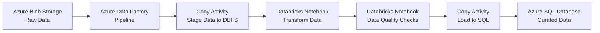

# How to Build a Data Pipeline with Azure Data Factory and Databricks Activities

Author: [nawazdhandala](https://www.github.com/nawazdhandala)

Tags: Azure Data Factory, Azure Databricks, Data Pipeline, ETL, Data Engineering, Spark, Orchestration

Description: Build an end-to-end data pipeline using Azure Data Factory to orchestrate Azure Databricks notebooks for scalable data transformations.

---

Azure Data Factory (ADF) is a cloud-based data orchestration service, and Azure Databricks is a powerful data processing engine built on Apache Spark. Individually, they are useful. Together, they form the backbone of modern data platforms. ADF handles scheduling, dependencies, monitoring, and retry logic, while Databricks handles the heavy lifting of data transformation with Spark.

In this guide, I will build a data pipeline that uses ADF to orchestrate Databricks notebooks. The pipeline ingests raw data from Azure Blob Storage, runs transformation logic in Databricks, and loads the results into Azure SQL Database.

## Architecture Overview



## Prerequisites

- An Azure Data Factory instance
- An Azure Databricks workspace with a running cluster or job cluster configuration
- Azure Blob Storage with raw data files
- Azure SQL Database for the output
- Databricks notebooks with your transformation logic

## Step 1: Create a Databricks Linked Service in ADF

A linked service is ADF's way of connecting to external services. You need one for Databricks.

In ADF Studio, go to "Manage" then "Linked Services" and create a new one of type "Azure Databricks."

Configure the linked service:

- **Databricks workspace URL**: Your Databricks workspace URL (e.g., `https://adb-1234567890.12.azuredatabricks.net`)
- **Authentication**: Choose between access token, managed identity, or service principal
- **Cluster configuration**: Choose between an existing interactive cluster or a new job cluster

For production pipelines, use a job cluster. It spins up when the pipeline runs and terminates when it finishes, saving costs:

```json
{
    "name": "DatabricksLinkedService",
    "properties": {
        "type": "AzureDatabricks",
        "typeProperties": {
            "domain": "https://adb-1234567890.12.azuredatabricks.net",
            "authentication": "MSI",
            "workspaceResourceId": "/subscriptions/{sub}/resourceGroups/rg-data/providers/Microsoft.Databricks/workspaces/dbx-production",
            "newClusterNodeType": "Standard_DS3_v2",
            "newClusterNumOfWorker": "2:8",
            "newClusterSparkEnvVars": {
                "PYSPARK_PYTHON": "/databricks/python3/bin/python3"
            },
            "newClusterVersion": "13.3.x-scala2.12",
            "newClusterInitScripts": [],
            "newClusterDriverNodeType": "Standard_DS3_v2"
        }
    }
}
```

The `"2:8"` for number of workers enables autoscaling between 2 and 8 worker nodes.

## Step 2: Create the Databricks Transformation Notebook

In your Databricks workspace, create a notebook that performs the data transformation:

```python
# Notebook: /Shared/pipelines/transform_sales_data
# This notebook is called by Azure Data Factory to transform raw sales data

# Read the input path from ADF pipeline parameters
# ADF passes parameters through dbutils.widgets
dbutils.widgets.text("input_path", "")
dbutils.widgets.text("output_path", "")
dbutils.widgets.text("processing_date", "")

input_path = dbutils.widgets.get("input_path")
output_path = dbutils.widgets.get("output_path")
processing_date = dbutils.widgets.get("processing_date")

print(f"Processing data for date: {processing_date}")
print(f"Input: {input_path}")
print(f"Output: {output_path}")

# Read the raw sales data from Azure Blob Storage
raw_df = spark.read.format("csv") \
    .option("header", "true") \
    .option("inferSchema", "true") \
    .load(input_path)

print(f"Raw record count: {raw_df.count()}")

# Apply transformations
from pyspark.sql import functions as F

transformed_df = (
    raw_df
    # Remove duplicates based on order ID
    .dropDuplicates(["order_id"])
    # Filter out test orders
    .filter(~F.col("customer_email").endswith("@test.com"))
    # Parse and clean amount fields
    .withColumn("order_amount", F.col("order_amount").cast("decimal(18,2)"))
    # Add calculated fields
    .withColumn("tax_amount", F.col("order_amount") * 0.08)
    .withColumn("total_amount", F.col("order_amount") + F.col("tax_amount"))
    # Standardize country names
    .withColumn("country", F.upper(F.trim(F.col("country"))))
    # Add processing metadata
    .withColumn("processed_date", F.lit(processing_date))
    .withColumn("pipeline_run_id", F.lit(spark.conf.get("spark.databricks.pipelineRunId", "manual")))
)

print(f"Transformed record count: {transformed_df.count()}")

# Write the transformed data as Parquet for the next stage
transformed_df.write \
    .format("parquet") \
    .mode("overwrite") \
    .partitionBy("country") \
    .save(output_path)

print("Transformation complete")

# Return a status value that ADF can capture
dbutils.notebook.exit(f"SUCCESS: {transformed_df.count()} records processed")
```

## Step 3: Create the Data Quality Notebook

Add a second notebook for data quality checks that runs after transformation:

```python
# Notebook: /Shared/pipelines/data_quality_checks
# Validates transformed data before loading to SQL

dbutils.widgets.text("data_path", "")
data_path = dbutils.widgets.get("data_path")

# Read the transformed data
df = spark.read.format("parquet").load(data_path)

# Define quality checks
quality_results = []

# Check 1: No null order IDs
null_order_count = df.filter(F.col("order_id").isNull()).count()
quality_results.append({
    "check": "null_order_ids",
    "passed": null_order_count == 0,
    "details": f"{null_order_count} null order IDs found"
})

# Check 2: No negative amounts
negative_amount_count = df.filter(F.col("order_amount") < 0).count()
quality_results.append({
    "check": "negative_amounts",
    "passed": negative_amount_count == 0,
    "details": f"{negative_amount_count} negative amounts found"
})

# Check 3: Minimum record count threshold
record_count = df.count()
min_threshold = 100
quality_results.append({
    "check": "minimum_records",
    "passed": record_count >= min_threshold,
    "details": f"{record_count} records (minimum: {min_threshold})"
})

# Check 4: No future dates
from datetime import datetime
future_date_count = df.filter(
    F.col("order_date") > F.lit(datetime.now())
).count()
quality_results.append({
    "check": "future_dates",
    "passed": future_date_count == 0,
    "details": f"{future_date_count} future-dated records found"
})

# Print results
all_passed = True
for result in quality_results:
    status = "PASS" if result["passed"] else "FAIL"
    print(f"[{status}] {result['check']}: {result['details']}")
    if not result["passed"]:
        all_passed = False

# Fail the notebook if any check fails (this causes ADF to mark the activity as failed)
if not all_passed:
    dbutils.notebook.exit("FAILED: Data quality checks did not pass")
    raise Exception("Data quality checks failed")

dbutils.notebook.exit(f"SUCCESS: All {len(quality_results)} quality checks passed")
```

## Step 4: Build the ADF Pipeline

Now create the ADF pipeline that orchestrates everything. In ADF Studio, create a new pipeline and add the following activities:

```json
{
    "name": "SalesDataPipeline",
    "properties": {
        "activities": [
            {
                "name": "TransformSalesData",
                "type": "DatabricksNotebook",
                "dependsOn": [],
                "policy": {
                    "timeout": "01:00:00",
                    "retry": 2,
                    "retryIntervalInSeconds": 60
                },
                "typeProperties": {
                    "notebookPath": "/Shared/pipelines/transform_sales_data",
                    "baseParameters": {
                        "input_path": "abfss://raw@storageaccount.dfs.core.windows.net/sales/",
                        "output_path": "abfss://staging@storageaccount.dfs.core.windows.net/sales_transformed/",
                        "processing_date": {
                            "value": "@formatDateTime(pipeline().parameters.processingDate, 'yyyy-MM-dd')",
                            "type": "Expression"
                        }
                    }
                },
                "linkedServiceName": {
                    "referenceName": "DatabricksLinkedService",
                    "type": "LinkedServiceReference"
                }
            },
            {
                "name": "DataQualityChecks",
                "type": "DatabricksNotebook",
                "dependsOn": [
                    {
                        "activity": "TransformSalesData",
                        "dependencyConditions": ["Succeeded"]
                    }
                ],
                "typeProperties": {
                    "notebookPath": "/Shared/pipelines/data_quality_checks",
                    "baseParameters": {
                        "data_path": "abfss://staging@storageaccount.dfs.core.windows.net/sales_transformed/"
                    }
                },
                "linkedServiceName": {
                    "referenceName": "DatabricksLinkedService",
                    "type": "LinkedServiceReference"
                }
            },
            {
                "name": "LoadToSQL",
                "type": "Copy",
                "dependsOn": [
                    {
                        "activity": "DataQualityChecks",
                        "dependencyConditions": ["Succeeded"]
                    }
                ],
                "typeProperties": {
                    "source": {
                        "type": "ParquetSource",
                        "storeSettings": {
                            "type": "AzureBlobFSReadSettings",
                            "recursive": true
                        }
                    },
                    "sink": {
                        "type": "AzureSqlSink",
                        "writeBehavior": "upsert",
                        "upsertSettings": {
                            "useTempDB": true,
                            "keys": ["order_id"]
                        }
                    }
                }
            }
        ],
        "parameters": {
            "processingDate": {
                "type": "string",
                "defaultValue": ""
            }
        }
    }
}
```

## Step 5: Add Error Handling

Add a notification activity that sends an email or Teams message when the pipeline fails:

In ADF Studio, drag a "Web Activity" or "Azure Function" activity and connect it to the failed path of your Databricks activities. Set the dependency condition to "Failed."

You can also use ADF's built-in alerting:

```bash
# Create an alert rule for pipeline failures
az monitor metrics alert create \
    --name "pipeline-failure-alert" \
    --resource-group rg-data \
    --scopes "/subscriptions/{sub}/resourceGroups/rg-data/providers/Microsoft.DataFactory/factories/adf-production" \
    --condition "total PipelineFailedRuns > 0" \
    --window-size 5m \
    --action-group "/subscriptions/{sub}/resourceGroups/rg-data/providers/Microsoft.Insights/actionGroups/data-team-alerts"
```

## Step 6: Schedule the Pipeline

Create a trigger to run the pipeline on a schedule:

```json
{
    "name": "DailyTrigger",
    "properties": {
        "type": "ScheduleTrigger",
        "typeProperties": {
            "recurrence": {
                "frequency": "Day",
                "interval": 1,
                "startTime": "2026-02-16T06:00:00Z",
                "timeZone": "UTC"
            }
        },
        "pipelines": [
            {
                "pipelineReference": {
                    "referenceName": "SalesDataPipeline",
                    "type": "PipelineReference"
                },
                "parameters": {
                    "processingDate": "@trigger().scheduledTime"
                }
            }
        ]
    }
}
```

## Step 7: Monitor Pipeline Runs

ADF provides built-in monitoring through the Monitor hub. You can see:

- Pipeline run history with status and duration
- Activity-level details including Databricks notebook output
- Trigger run history
- Data Factory metrics in Azure Monitor

For the Databricks activities, the notebook output (from `dbutils.notebook.exit()`) is captured and visible in the ADF monitoring view. This is useful for tracking record counts and validation results.

## Optimization Tips

**Use job clusters for production**: Interactive clusters stay running and cost money even when idle. Job clusters spin up for each pipeline run and terminate afterward.

**Pass parameters, not data**: Let Databricks read data directly from storage rather than passing large datasets through ADF. ADF should orchestrate, not move data between Spark and itself.

**Enable cluster pools**: If your pipelines run frequently, create a Databricks cluster pool. It keeps a few VMs warm so job clusters start faster.

**Partition your output**: Writing Parquet with partitioning (as shown above) makes downstream queries faster and allows incremental processing.

## Summary

Azure Data Factory and Databricks complement each other perfectly. ADF provides the orchestration layer - scheduling, dependencies, retries, and monitoring - while Databricks provides the compute layer for complex data transformations using Spark. The pattern of staging data, transforming with notebooks, validating quality, and loading to a serving layer scales from small daily batches to massive data processing workloads. The key is to keep your notebooks focused on transformation logic and let ADF handle the workflow management.
