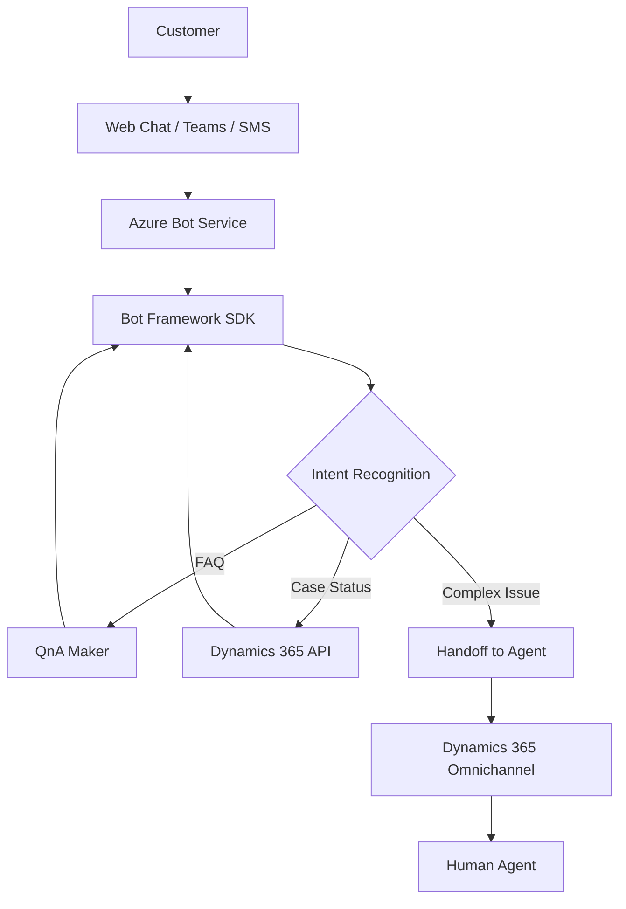

# How to Build a Dynamics 365 Customer Service Bot with Azure Bot Framework and QnA Maker

Author: [nawazdhandala](https://www.github.com/nawazdhandala)

Tags: Dynamics 365, Azure Bot Framework, QnA Maker, Customer Service, Chatbot, AI, Omnichannel

Description: Build a customer service chatbot that integrates with Dynamics 365 Customer Service using Azure Bot Framework and QnA Maker for automated case resolution.

---

Customer service teams deal with the same questions over and over. Password resets, order status checks, return policies, product FAQs - these are all questions that a bot can handle instantly, freeing up human agents for complex issues. When you connect that bot to Dynamics 365 Customer Service, you get the best of both worlds: automated responses for common questions and seamless handoff to a human agent when the bot cannot help.

In this guide, I will build a customer service bot using Azure Bot Framework and QnA Maker that integrates with Dynamics 365 Customer Service through the Omnichannel for Customer Service module.

## Architecture



The bot receives customer messages through various channels, determines the intent, and either answers from the QnA knowledge base, queries Dynamics 365 for case-specific information, or escalates to a human agent.

## Setting Up QnA Maker

Create a QnA Maker knowledge base with your most common customer service questions:

```bash
# Create the QnA Maker resource
az cognitiveservices account create \
  --name qna-customer-service \
  --resource-group rg-d365-bot \
  --kind QnAMaker \
  --sku S0 \
  --location westus \
  --yes

# Create the App Service for QnA Maker runtime
az webapp create \
  --name qna-runtime-d365 \
  --resource-group rg-d365-bot \
  --plan plan-qna-runtime \
  --runtime "DOTNET|6.0"
```

Populate the knowledge base with your FAQ data. You can import from URLs, documents, or define Q&A pairs manually:

```json
{
    "qnaList": [
        {
            "id": 1,
            "answer": "You can reset your password by visiting our account portal at https://account.yourcompany.com/reset. Click 'Forgot Password' and follow the instructions sent to your email.",
            "source": "customer-faq",
            "questions": [
                "How do I reset my password?",
                "I forgot my password",
                "Can't log in to my account",
                "Password reset"
            ],
            "metadata": [
                { "name": "category", "value": "account" }
            ]
        },
        {
            "id": 2,
            "answer": "Our return policy allows returns within 30 days of purchase. Items must be in original condition with all packaging. To start a return, log in to your account and go to Order History, then click 'Return Item' next to the order.",
            "source": "customer-faq",
            "questions": [
                "What is your return policy?",
                "How do I return an item?",
                "Can I return a product?",
                "Return window",
                "How long do I have to return something?"
            ],
            "metadata": [
                { "name": "category", "value": "returns" }
            ]
        },
        {
            "id": 3,
            "answer": "Standard shipping takes 5-7 business days. Express shipping takes 2-3 business days. Overnight shipping is available for orders placed before 2 PM EST. You can check your order status anytime by asking me 'What is my order status?' and providing your order number.",
            "source": "customer-faq",
            "questions": [
                "How long does shipping take?",
                "When will my order arrive?",
                "Shipping times",
                "Express shipping options",
                "How fast is delivery?"
            ],
            "metadata": [
                { "name": "category", "value": "shipping" }
            ]
        }
    ]
}
```

## Building the Bot Application

Here is the bot built with the Bot Framework SDK in C#:

```csharp
// Main bot class that handles customer service interactions
public class CustomerServiceBot : ActivityHandler
{
    private readonly QnAMakerClient _qnaMaker;
    private readonly IDynamics365Client _d365Client;
    private readonly ConversationState _conversationState;
    private readonly ILogger<CustomerServiceBot> _logger;

    public CustomerServiceBot(
        QnAMakerClient qnaMaker,
        IDynamics365Client d365Client,
        ConversationState conversationState,
        ILogger<CustomerServiceBot> logger)
    {
        _qnaMaker = qnaMaker;
        _d365Client = d365Client;
        _conversationState = conversationState;
        _logger = logger;
    }

    protected override async Task OnMessageActivityAsync(
        ITurnContext<IMessageActivity> turnContext,
        CancellationToken cancellationToken)
    {
        var text = turnContext.Activity.Text?.Trim();
        if (string.IsNullOrEmpty(text)) return;

        // Get conversation state to track the dialog flow
        var stateAccessor = _conversationState
            .CreateProperty<ConversationData>("ConversationData");
        var conversationData = await stateAccessor.GetAsync(
            turnContext, () => new ConversationData(), cancellationToken);

        // Check if the user is in the middle of a specific flow
        if (conversationData.CurrentFlow == "case-status")
        {
            await HandleCaseStatusLookupAsync(turnContext, text, conversationData, cancellationToken);
            await _conversationState.SaveChangesAsync(turnContext, false, cancellationToken);
            return;
        }

        // Check for specific intents first
        if (text.Contains("order status", StringComparison.OrdinalIgnoreCase) ||
            text.Contains("case status", StringComparison.OrdinalIgnoreCase) ||
            text.Contains("ticket status", StringComparison.OrdinalIgnoreCase))
        {
            conversationData.CurrentFlow = "case-status";
            await turnContext.SendActivityAsync(
                "I can help you check your case status. Please provide your " +
                "case number (it starts with CAS-).",
                cancellationToken: cancellationToken);
            await _conversationState.SaveChangesAsync(turnContext, false, cancellationToken);
            return;
        }

        if (text.Contains("talk to agent", StringComparison.OrdinalIgnoreCase) ||
            text.Contains("human", StringComparison.OrdinalIgnoreCase) ||
            text.Contains("speak to someone", StringComparison.OrdinalIgnoreCase))
        {
            await InitiateHandoffAsync(turnContext, conversationData, cancellationToken);
            return;
        }

        // Try QnA Maker for FAQ-type questions
        var qnaResult = await _qnaMaker.GetAnswersAsync(turnContext);

        if (qnaResult != null && qnaResult.Length > 0 && qnaResult[0].Score > 0.7)
        {
            // High confidence answer from QnA Maker
            await turnContext.SendActivityAsync(
                qnaResult[0].Answer,
                cancellationToken: cancellationToken);

            // Ask if the answer was helpful
            await turnContext.SendActivityAsync(
                "Was this helpful? If you need more assistance, I can connect " +
                "you with a support agent.",
                cancellationToken: cancellationToken);
        }
        else if (qnaResult != null && qnaResult.Length > 0 && qnaResult[0].Score > 0.4)
        {
            // Medium confidence - provide the answer but offer alternatives
            await turnContext.SendActivityAsync(
                $"I think this might help:\n\n{qnaResult[0].Answer}\n\n" +
                "If this doesn't answer your question, I can connect you " +
                "with a support agent. Just say 'talk to agent'.",
                cancellationToken: cancellationToken);
        }
        else
        {
            // Low confidence - offer to create a case or transfer to agent
            await turnContext.SendActivityAsync(
                "I'm not sure I can answer that. Would you like me to:\n" +
                "1. Create a support case for you\n" +
                "2. Connect you with a support agent\n\n" +
                "Just reply with 1 or 2.",
                cancellationToken: cancellationToken);

            conversationData.CurrentFlow = "escalation-choice";
            await _conversationState.SaveChangesAsync(turnContext, false, cancellationToken);
        }
    }

    private async Task HandleCaseStatusLookupAsync(
        ITurnContext turnContext,
        string caseNumber,
        ConversationData conversationData,
        CancellationToken cancellationToken)
    {
        // Clean up the case number input
        caseNumber = caseNumber.Trim().ToUpper();

        if (!caseNumber.StartsWith("CAS-"))
        {
            await turnContext.SendActivityAsync(
                "That doesn't look like a valid case number. Case numbers " +
                "start with CAS- followed by numbers. Please try again.",
                cancellationToken: cancellationToken);
            return;
        }

        try
        {
            // Query Dynamics 365 for the case
            var caseInfo = await _d365Client.GetCaseByNumberAsync(caseNumber);

            if (caseInfo != null)
            {
                var statusText = caseInfo.StatusCode switch
                {
                    1 => "In Progress",
                    2 => "On Hold",
                    3 => "Waiting for Customer",
                    5 => "Resolved",
                    _ => "Open"
                };

                await turnContext.SendActivityAsync(
                    $"Here's the status of your case:\n\n" +
                    $"**Case Number:** {caseInfo.CaseNumber}\n" +
                    $"**Title:** {caseInfo.Title}\n" +
                    $"**Status:** {statusText}\n" +
                    $"**Priority:** {caseInfo.Priority}\n" +
                    $"**Created:** {caseInfo.CreatedOn:MMMM d, yyyy}\n" +
                    $"**Assigned To:** {caseInfo.AssignedTo}\n\n" +
                    "Is there anything else I can help you with?",
                    cancellationToken: cancellationToken);
            }
            else
            {
                await turnContext.SendActivityAsync(
                    $"I couldn't find a case with number {caseNumber}. " +
                    "Please double-check the number and try again, or I can " +
                    "connect you with an agent.",
                    cancellationToken: cancellationToken);
            }
        }
        catch (Exception ex)
        {
            _logger.LogError(ex, "Failed to look up case: {CaseNumber}", caseNumber);
            await turnContext.SendActivityAsync(
                "Sorry, I'm having trouble looking up that case right now. " +
                "Let me connect you with an agent who can help.",
                cancellationToken: cancellationToken);
        }

        // Reset the conversation flow
        conversationData.CurrentFlow = null;
    }

    private async Task InitiateHandoffAsync(
        ITurnContext turnContext,
        ConversationData conversationData,
        CancellationToken cancellationToken)
    {
        // Build a summary of the conversation for the agent
        var summary = $"Customer requested agent assistance. " +
                      $"Topic: {conversationData.LastTopic ?? "General inquiry"}";

        // Create an event to trigger the Omnichannel handoff
        var handoffEvent = EventFactory.CreateHandoffInitiation(
            turnContext,
            new { summary, customerEmail = conversationData.CustomerEmail });

        await turnContext.SendActivityAsync(handoffEvent, cancellationToken);

        await turnContext.SendActivityAsync(
            "I'm connecting you with a support agent now. Please hold on - " +
            "someone will be with you shortly.",
            cancellationToken: cancellationToken);
    }

    protected override async Task OnMembersAddedAsync(
        IList<ChannelAccount> membersAdded,
        ITurnContext<IConversationUpdateActivity> turnContext,
        CancellationToken cancellationToken)
    {
        foreach (var member in membersAdded)
        {
            if (member.Id != turnContext.Activity.Recipient.Id)
            {
                await turnContext.SendActivityAsync(
                    "Hi! I'm your customer service assistant. I can help with:\n\n" +
                    "- Answering common questions about our products and services\n" +
                    "- Checking the status of your support case\n" +
                    "- Connecting you with a support agent\n\n" +
                    "What can I help you with today?",
                    cancellationToken: cancellationToken);
            }
        }
    }
}
```

## Querying Dynamics 365 for Case Data

The Dynamics 365 client queries Dataverse for case information:

```csharp
// Client for querying Dynamics 365 Customer Service data
public class Dynamics365Client : IDynamics365Client
{
    private readonly HttpClient _httpClient;

    public Dynamics365Client(IHttpClientFactory httpClientFactory)
    {
        _httpClient = httpClientFactory.CreateClient("Dataverse");
    }

    public async Task<CaseInfo> GetCaseByNumberAsync(string caseNumber)
    {
        // Query the incident (case) table by case number
        var query = $"incidents?" +
                    $"$filter=ticketnumber eq '{caseNumber}'&" +
                    $"$select=ticketnumber,title,statuscode,prioritycode,createdon&" +
                    $"$expand=ownerid($select=fullname)";

        var response = await _httpClient.GetAsync($"api/data/v9.2/{query}");
        response.EnsureSuccessStatusCode();

        var data = await response.Content.ReadFromJsonAsync<DataverseResponse>();

        if (data.Value == null || data.Value.Count == 0)
            return null;

        var incident = data.Value[0];

        return new CaseInfo
        {
            CaseNumber = incident["ticketnumber"]?.ToString(),
            Title = incident["title"]?.ToString(),
            StatusCode = Convert.ToInt32(incident["statuscode"]),
            Priority = GetPriorityText(Convert.ToInt32(incident["prioritycode"])),
            CreatedOn = DateTime.Parse(incident["createdon"].ToString()),
            AssignedTo = incident["ownerid"]?["fullname"]?.ToString() ?? "Unassigned"
        };
    }

    // Create a new case in Dynamics 365
    public async Task<string> CreateCaseAsync(
        string title, string description, string customerEmail)
    {
        // Look up the contact by email
        var contactResponse = await _httpClient.GetAsync(
            $"api/data/v9.2/contacts?$filter=emailaddress1 eq '{customerEmail}'&$select=contactid");
        var contactData = await contactResponse.Content.ReadFromJsonAsync<DataverseResponse>();

        var newCase = new Dictionary<string, object>
        {
            ["title"] = title,
            ["description"] = description,
            ["caseorigincode"] = 3, // Chat origin
            ["prioritycode"] = 2    // Normal priority
        };

        // Link to the contact if found
        if (contactData.Value?.Count > 0)
        {
            var contactId = contactData.Value[0]["contactid"].ToString();
            newCase["customerid_contact@odata.bind"] = $"/contacts({contactId})";
        }

        var response = await _httpClient.PostAsJsonAsync(
            "api/data/v9.2/incidents", newCase);
        response.EnsureSuccessStatusCode();

        // Get the case number from the response
        var location = response.Headers.Location.ToString();
        var caseId = location.Split('(')[1].TrimEnd(')');

        var caseResponse = await _httpClient.GetAsync(
            $"api/data/v9.2/incidents({caseId})?$select=ticketnumber");
        var caseData = await caseResponse.Content.ReadFromJsonAsync<Dictionary<string, object>>();

        return caseData["ticketnumber"].ToString();
    }

    private string GetPriorityText(int priorityCode)
    {
        return priorityCode switch
        {
            1 => "High",
            2 => "Normal",
            3 => "Low",
            _ => "Normal"
        };
    }
}
```

## Configuring Omnichannel Integration

To use the bot with Dynamics 365 Omnichannel for Customer Service, register it as a bot user:

1. In the Dynamics 365 Admin Center, navigate to Omnichannel Administration
2. Go to Bots and create a new bot user
3. Provide the bot's Azure AD application ID
4. Configure routing rules to direct conversations to the bot first

The handoff from bot to human agent is handled through the Omnichannel context variables that the bot sets during the conversation.

## Deploying the Bot

Deploy the bot to Azure App Service:

```bash
# Create the Bot Service
az bot create \
  --resource-group rg-d365-bot \
  --name bot-customer-service \
  --kind webapp \
  --sku S1 \
  --appid $APP_ID \
  --password $APP_PASSWORD \
  --endpoint "https://bot-customer-service.azurewebsites.net/api/messages"

# Enable web chat and Teams channels
az bot webchat create --resource-group rg-d365-bot --name bot-customer-service
az bot msteams create --resource-group rg-d365-bot --name bot-customer-service
```

## Wrapping Up

A customer service bot that integrates with Dynamics 365 and QnA Maker handles the routine questions automatically while providing seamless escalation to human agents for complex issues. QnA Maker gives the bot a broad knowledge base without writing code for every answer. The Dynamics 365 integration lets the bot look up real case data and create new cases. And the Omnichannel handoff ensures that when the bot reaches its limits, the customer gets a smooth transition to a human agent who has the full conversation context. Start with your top 50 most common questions in QnA Maker, deploy the bot to one channel, measure the deflection rate, and expand from there.
