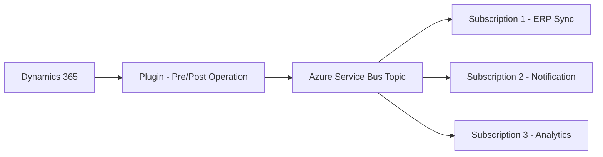

# How to Build a Dynamics 365 Plugin That Writes to Azure Service Bus Topics

Author: [nawazdhandala](https://www.github.com/nawazdhandala)

Tags: Dynamics 365, Azure Service Bus, Plugin Development, CRM, Event-Driven Architecture, Integration, C#

Description: Build a Dynamics 365 plugin that publishes entity change events to Azure Service Bus topics for downstream system integration.

---

Dynamics 365 plugins are the primary way to extend the CRM's behavior when records are created, updated, or deleted. But plugins run inside the Dynamics 365 sandbox, which limits what they can do. You cannot make arbitrary HTTP calls from a plugin, and long-running operations will time out. The solution is to have the plugin publish a message to Azure Service Bus, and then have an external service pick it up and do the heavy lifting.

This pattern is incredibly useful for integrations. When a new opportunity is created in Dynamics 365, you might want to sync it to your ERP system, notify a Slack channel, update a data warehouse, or trigger a custom workflow. By publishing to a Service Bus topic, you decouple the Dynamics 365 event from the downstream processing, making the system more reliable and easier to maintain.

## Architecture



The plugin fires on entity operations, publishes a message to a Service Bus topic, and multiple subscribers process the event independently. If one subscriber fails, the others are unaffected.

## Registering the Service Endpoint

Before building the plugin, register the Azure Service Bus endpoint in Dynamics 365 using the Plugin Registration Tool:

1. Open the Plugin Registration Tool and connect to your Dynamics 365 environment.
2. Click "Register" then "Register New Service Endpoint".
3. Configure the connection:
   - **Connection String**: Your Service Bus namespace connection string
   - **Topic Name**: `dynamics-events`
   - **Message Format**: JSON
   - **Designation Type**: Topic

Alternatively, register it programmatically:

```csharp
// Register the Service Bus endpoint using the Organization Service
var endpoint = new Entity("serviceendpoint")
{
    ["name"] = "Azure Service Bus - Dynamics Events",
    ["connectionmode"] = new OptionSetValue(1), // Normal
    ["contract"] = new OptionSetValue(7), // Topic
    ["url"] = "sb://sb-dynamics-events.servicebus.windows.net/",
    ["saskey"] = "your-sas-key",
    ["saskeyname"] = "RootManageSharedAccessKey",
    ["path"] = "dynamics-events",
    ["messageformat"] = new OptionSetValue(1) // JSON
};

var endpointId = organizationService.Create(endpoint);
```

## Building the Plugin

The plugin runs on entity operations and formats the event data before sending it to Service Bus. Here is a plugin that handles opportunity events:

```csharp
// Dynamics 365 plugin that publishes opportunity events to Azure Service Bus
using Microsoft.Xrm.Sdk;
using System;
using System.Runtime.Serialization.Json;
using System.IO;
using System.Text;

namespace Dynamics365.Plugins
{
    public class OpportunityEventPlugin : IPlugin
    {
        // The Service Bus endpoint ID registered in the Plugin Registration Tool
        private readonly Guid _serviceEndpointId;

        public OpportunityEventPlugin(string unsecure, string secure)
        {
            // The service endpoint ID is passed as the unsecure configuration
            if (!Guid.TryParse(unsecure, out _serviceEndpointId))
            {
                throw new InvalidPluginExecutionException(
                    "Service endpoint ID must be provided as unsecure configuration");
            }
        }

        public void Execute(IServiceProvider serviceProvider)
        {
            // Get the execution context with all the entity data
            var context = (IPluginExecutionContext)serviceProvider
                .GetService(typeof(IPluginExecutionContext));

            var tracingService = (ITracingService)serviceProvider
                .GetService(typeof(ITracingService));

            try
            {
                tracingService.Trace("OpportunityEventPlugin executing...");

                // Build the event payload
                var eventPayload = BuildEventPayload(context);

                tracingService.Trace("Event payload built: {0}", eventPayload.EventType);

                // Get the Service Bus notification service
                var cloudService = (IServiceEndpointNotificationService)serviceProvider
                    .GetService(typeof(IServiceEndpointNotificationService));

                // Post the execution context to the Service Bus
                // Dynamics 365 handles the serialization and Service Bus message creation
                var response = cloudService.Execute(
                    new EntityReference("serviceendpoint", _serviceEndpointId),
                    context);

                tracingService.Trace("Message posted to Service Bus: {0}", response);
            }
            catch (Exception ex)
            {
                tracingService.Trace("Error: {0}", ex.Message);

                // Decide whether to fail silently or throw
                // Throwing will roll back the transaction in pre-operation
                // For post-operation, it depends on the registration mode (async vs sync)

                // For non-critical integrations, log and continue
                // For critical integrations, throw to roll back
                throw new InvalidPluginExecutionException(
                    $"Failed to publish event to Service Bus: {ex.Message}", ex);
            }
        }

        private EventPayload BuildEventPayload(IPluginExecutionContext context)
        {
            var payload = new EventPayload
            {
                EventType = $"{context.PrimaryEntityName}.{context.MessageName}",
                EntityName = context.PrimaryEntityName,
                EntityId = context.PrimaryEntityId.ToString(),
                MessageName = context.MessageName,
                Timestamp = DateTime.UtcNow,
                UserId = context.InitiatingUserId.ToString(),
                OrganizationId = context.OrganizationId.ToString(),
                Depth = context.Depth
            };

            // Include the entity attributes for Create and Update operations
            if (context.InputParameters.Contains("Target") &&
                context.InputParameters["Target"] is Entity target)
            {
                payload.ChangedAttributes = new SerializableDictionary();

                foreach (var attribute in target.Attributes)
                {
                    // Convert attribute values to serializable format
                    payload.ChangedAttributes[attribute.Key] = ConvertAttributeValue(attribute.Value);
                }
            }

            // Include pre-image data for Update and Delete operations
            if (context.PreEntityImages.Contains("PreImage"))
            {
                var preImage = context.PreEntityImages["PreImage"];
                payload.PreviousValues = new SerializableDictionary();

                foreach (var attribute in preImage.Attributes)
                {
                    payload.PreviousValues[attribute.Key] = ConvertAttributeValue(attribute.Value);
                }
            }

            return payload;
        }

        private object ConvertAttributeValue(object value)
        {
            // Convert Dynamics-specific types to standard serializable types
            return value switch
            {
                EntityReference er => new { id = er.Id.ToString(), name = er.Name, logicalName = er.LogicalName },
                OptionSetValue osv => osv.Value,
                Money money => money.Value,
                AliasedValue av => ConvertAttributeValue(av.Value),
                _ => value?.ToString()
            };
        }
    }

    // Serializable event payload class
    [DataContract]
    public class EventPayload
    {
        [DataMember] public string EventType { get; set; }
        [DataMember] public string EntityName { get; set; }
        [DataMember] public string EntityId { get; set; }
        [DataMember] public string MessageName { get; set; }
        [DataMember] public DateTime Timestamp { get; set; }
        [DataMember] public string UserId { get; set; }
        [DataMember] public string OrganizationId { get; set; }
        [DataMember] public int Depth { get; set; }
        [DataMember] public SerializableDictionary ChangedAttributes { get; set; }
        [DataMember] public SerializableDictionary PreviousValues { get; set; }
    }
}
```

## Registering the Plugin Step

Register the plugin step using the Plugin Registration Tool:

- **Message**: Create, Update, Delete (register separate steps for each)
- **Primary Entity**: opportunity
- **Stage**: Post-Operation (so the Dynamics transaction has already committed)
- **Execution Mode**: Asynchronous (recommended - does not block the user)
- **Pre-Entity Image**: Include for Update and Delete operations

For additional entities, register the same plugin with different message/entity combinations:

```
Step 1: opportunity.Create - Post-Operation - Async
Step 2: opportunity.Update - Post-Operation - Async
Step 3: opportunity.Delete - Post-Operation - Async
Step 4: lead.Create - Post-Operation - Async
Step 5: lead.Update - Post-Operation - Async
```

## Setting Up Service Bus Subscriptions

Create the topic and subscriptions for different consumers:

```bash
# Create the Service Bus namespace and topic
az servicebus namespace create \
  --name sb-dynamics-events \
  --resource-group rg-d365-integrations \
  --location eastus \
  --sku Standard

az servicebus topic create \
  --name dynamics-events \
  --namespace-name sb-dynamics-events \
  --resource-group rg-d365-integrations

# Create subscriptions for different consumers
# ERP sync - only cares about opportunity events
az servicebus topic subscription create \
  --name erp-sync \
  --topic-name dynamics-events \
  --namespace-name sb-dynamics-events \
  --resource-group rg-d365-integrations

# Add a filter so ERP sync only gets opportunity messages
az servicebus topic subscription rule create \
  --name opportunity-only \
  --subscription-name erp-sync \
  --topic-name dynamics-events \
  --namespace-name sb-dynamics-events \
  --resource-group rg-d365-integrations \
  --filter-sql-expression "EntityName = 'opportunity'"

# Notification service - gets all events
az servicebus topic subscription create \
  --name notifications \
  --topic-name dynamics-events \
  --namespace-name sb-dynamics-events \
  --resource-group rg-d365-integrations

# Analytics - gets all events for the data warehouse
az servicebus topic subscription create \
  --name analytics-pipeline \
  --topic-name dynamics-events \
  --namespace-name sb-dynamics-events \
  --resource-group rg-d365-integrations
```

## Building a Consumer

Here is an Azure Function that consumes messages from the ERP sync subscription:

```csharp
// Azure Function that syncs opportunity data to the ERP system
public class ErpSyncFunction
{
    private readonly IErpClient _erpClient;

    [FunctionName("SyncOpportunityToErp")]
    public async Task Run(
        [ServiceBusTrigger("dynamics-events", "erp-sync",
            Connection = "ServiceBusConnection")]
        ServiceBusReceivedMessage message,
        ILogger log)
    {
        var body = message.Body.ToString();
        var context = JsonSerializer.Deserialize<RemoteExecutionContext>(body);

        // Extract the opportunity data from the context
        var entityId = context.PrimaryEntityId;
        var messageName = context.MessageName;

        log.LogInformation(
            "Processing {Message} for opportunity {Id}",
            messageName, entityId);

        switch (messageName)
        {
            case "Create":
                await _erpClient.CreateDealAsync(context);
                break;
            case "Update":
                await _erpClient.UpdateDealAsync(context);
                break;
            case "Delete":
                await _erpClient.DeleteDealAsync(entityId);
                break;
        }

        log.LogInformation("ERP sync completed for opportunity {Id}", entityId);
    }
}
```

## Error Handling and Dead Letters

Configure dead letter queues and retry policies to handle failures:

```bash
# Configure the subscription with retry and dead letter settings
az servicebus topic subscription update \
  --name erp-sync \
  --topic-name dynamics-events \
  --namespace-name sb-dynamics-events \
  --resource-group rg-d365-integrations \
  --max-delivery-count 5 \
  --dead-lettering-on-message-expiration true
```

## Wrapping Up

Publishing Dynamics 365 entity events to Azure Service Bus through a plugin creates a clean, decoupled integration architecture. The plugin itself is simple - it just triggers the Service Bus notification. All the complex processing happens outside Dynamics 365 in Azure Functions or other subscribers that can take as long as they need, retry on failure, and scale independently. The topic/subscription model lets you add new consumers without modifying the plugin, and SQL filters on subscriptions ensure each consumer only processes the events it cares about. This pattern is the recommended approach for Dynamics 365 integrations that need reliability and scalability.
