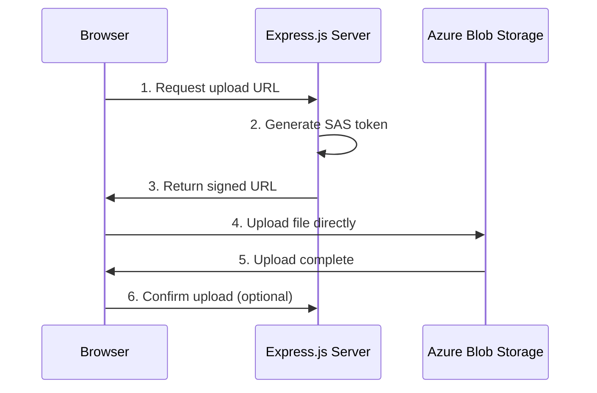

# How to Build a File Upload Service with Azure Blob Storage SAS Tokens in Express.js

Author: [nawazdhandala](https://www.github.com/nawazdhandala)

Tags: Azure Blob Storage, SAS Tokens, Express.js, File Upload, Node.js, Cloud Storage, Security

Description: Build a secure file upload service using Azure Blob Storage SAS tokens with Express.js to enable direct-to-storage uploads from the browser.

---

The naive approach to file uploads is: the browser sends the file to your server, your server receives it, and then your server uploads it to storage. This works, but it means every byte of every file flows through your server. For large files or high traffic, your server becomes a bottleneck. Your bandwidth costs double (client to server, then server to storage), and your server's memory and CPU are consumed handling file I/O.

A better approach is direct upload using SAS (Shared Access Signature) tokens. Your server generates a short-lived, scoped token that allows the browser to upload directly to Azure Blob Storage. The file never touches your server. This post walks through building this pattern with Express.js.

## Architecture



The server only handles the token generation (steps 1-3), which is a lightweight operation. The actual file transfer happens directly between the browser and Azure Blob Storage (step 4).

## Project Setup

```bash
mkdir file-upload-service && cd file-upload-service
npm init -y
npm install express @azure/storage-blob dotenv cors uuid multer
```

## Generate SAS Tokens

The core of this pattern is generating SAS tokens with the right permissions and scope.

```javascript
// src/sas.js
// SAS token generation for Azure Blob Storage
const {
  BlobServiceClient,
  StorageSharedKeyCredential,
  generateBlobSASQueryParameters,
  BlobSASPermissions,
  SASProtocol,
} = require('@azure/storage-blob');
require('dotenv').config();

const accountName = process.env.AZURE_STORAGE_ACCOUNT;
const accountKey = process.env.AZURE_STORAGE_KEY;
const containerName = process.env.AZURE_STORAGE_CONTAINER || 'uploads';

// Create a shared key credential for signing SAS tokens
const sharedKeyCredential = new StorageSharedKeyCredential(accountName, accountKey);

// Create the blob service client
const blobServiceClient = new BlobServiceClient(
  `https://${accountName}.blob.core.windows.net`,
  sharedKeyCredential
);

function generateUploadSAS(blobName, expiresInMinutes = 15) {
  /**
   * Generate a SAS token that allows uploading a single blob.
   * The token is scoped to a specific blob name and expires quickly.
   */
  const containerClient = blobServiceClient.getContainerClient(containerName);
  const blobClient = containerClient.getBlockBlobClient(blobName);

  // Set the start time slightly in the past to account for clock skew
  const startsOn = new Date();
  startsOn.setMinutes(startsOn.getMinutes() - 2);

  // Set expiration
  const expiresOn = new Date();
  expiresOn.setMinutes(expiresOn.getMinutes() + expiresInMinutes);

  // Generate the SAS token with write-only permission
  const sasToken = generateBlobSASQueryParameters(
    {
      containerName,
      blobName,
      permissions: BlobSASPermissions.parse('cw'),  // Create and Write only
      startsOn,
      expiresOn,
      protocol: SASProtocol.Https,  // HTTPS only for security
      // Optionally restrict content type
      contentType: undefined,
    },
    sharedKeyCredential
  ).toString();

  return {
    uploadUrl: `${blobClient.url}?${sasToken}`,
    blobUrl: blobClient.url,
    blobName,
    expiresOn: expiresOn.toISOString(),
  };
}

function generateDownloadSAS(blobName, expiresInMinutes = 60) {
  /**
   * Generate a SAS token that allows reading (downloading) a single blob.
   * Useful for serving private files.
   */
  const containerClient = blobServiceClient.getContainerClient(containerName);
  const blobClient = containerClient.getBlockBlobClient(blobName);

  const expiresOn = new Date();
  expiresOn.setMinutes(expiresOn.getMinutes() + expiresInMinutes);

  const sasToken = generateBlobSASQueryParameters(
    {
      containerName,
      blobName,
      permissions: BlobSASPermissions.parse('r'),  // Read only
      expiresOn,
      protocol: SASProtocol.Https,
    },
    sharedKeyCredential
  ).toString();

  return {
    downloadUrl: `${blobClient.url}?${sasToken}`,
    expiresOn: expiresOn.toISOString(),
  };
}

async function ensureContainer() {
  /**
   * Create the container if it does not exist.
   * Call this once at application startup.
   */
  const containerClient = blobServiceClient.getContainerClient(containerName);
  await containerClient.createIfNotExists({
    access: undefined,  // Private access - no anonymous reads
  });
}

module.exports = {
  generateUploadSAS,
  generateDownloadSAS,
  ensureContainer,
  blobServiceClient,
  containerName,
};
```

## Build the Express API

```javascript
// src/server.js
// Express.js API for file upload management
const express = require('express');
const cors = require('cors');
const { v4: uuidv4 } = require('uuid');
const path = require('path');
const {
  generateUploadSAS,
  generateDownloadSAS,
  ensureContainer,
  blobServiceClient,
  containerName,
} = require('./sas');

const app = express();
app.use(cors());
app.use(express.json());

// In-memory file metadata store - use a database in production
const fileMetadata = new Map();

// Allowed file types and their max sizes
const ALLOWED_TYPES = {
  'image/jpeg': { maxSize: 10 * 1024 * 1024, ext: 'jpg' },     // 10MB
  'image/png': { maxSize: 10 * 1024 * 1024, ext: 'png' },      // 10MB
  'image/webp': { maxSize: 5 * 1024 * 1024, ext: 'webp' },     // 5MB
  'application/pdf': { maxSize: 50 * 1024 * 1024, ext: 'pdf' }, // 50MB
  'video/mp4': { maxSize: 500 * 1024 * 1024, ext: 'mp4' },     // 500MB
};

// Step 1: Client requests an upload URL
app.post('/api/uploads/request', (req, res) => {
  const { fileName, contentType, fileSize } = req.body;

  // Validate content type
  const typeConfig = ALLOWED_TYPES[contentType];
  if (!typeConfig) {
    return res.status(400).json({
      error: `File type ${contentType} is not allowed`,
      allowedTypes: Object.keys(ALLOWED_TYPES),
    });
  }

  // Validate file size
  if (fileSize > typeConfig.maxSize) {
    return res.status(400).json({
      error: `File size exceeds maximum of ${typeConfig.maxSize / (1024 * 1024)}MB for ${contentType}`,
    });
  }

  // Generate a unique blob name to prevent collisions
  const fileId = uuidv4();
  const ext = path.extname(fileName) || `.${typeConfig.ext}`;
  const blobName = `${fileId}${ext}`;

  // Generate the SAS token
  const sasResult = generateUploadSAS(blobName);

  // Store metadata about this pending upload
  fileMetadata.set(fileId, {
    id: fileId,
    originalName: fileName,
    blobName,
    contentType,
    fileSize,
    status: 'pending',
    createdAt: new Date().toISOString(),
  });

  res.json({
    fileId,
    uploadUrl: sasResult.uploadUrl,
    blobName: sasResult.blobName,
    expiresOn: sasResult.expiresOn,
    // Include headers the browser should set on the PUT request
    headers: {
      'x-ms-blob-type': 'BlockBlob',
      'Content-Type': contentType,
    },
  });
});

// Step 2: Client confirms the upload is complete
app.post('/api/uploads/:fileId/confirm', async (req, res) => {
  const { fileId } = req.params;
  const metadata = fileMetadata.get(fileId);

  if (!metadata) {
    return res.status(404).json({ error: 'Upload not found' });
  }

  // Verify the blob actually exists in storage
  const containerClient = blobServiceClient.getContainerClient(containerName);
  const blobClient = containerClient.getBlockBlobClient(metadata.blobName);

  try {
    const properties = await blobClient.getProperties();

    // Update metadata with confirmed status
    metadata.status = 'confirmed';
    metadata.uploadedAt = new Date().toISOString();
    metadata.actualSize = properties.contentLength;

    res.json({
      fileId: metadata.id,
      originalName: metadata.originalName,
      size: properties.contentLength,
      contentType: properties.contentType,
      status: 'confirmed',
    });
  } catch (err) {
    if (err.statusCode === 404) {
      return res.status(400).json({ error: 'File has not been uploaded yet' });
    }
    throw err;
  }
});

// Step 3: Get a download URL for a file
app.get('/api/uploads/:fileId/download', (req, res) => {
  const { fileId } = req.params;
  const metadata = fileMetadata.get(fileId);

  if (!metadata || metadata.status !== 'confirmed') {
    return res.status(404).json({ error: 'File not found or not yet confirmed' });
  }

  const sasResult = generateDownloadSAS(metadata.blobName);

  res.json({
    downloadUrl: sasResult.downloadUrl,
    fileName: metadata.originalName,
    expiresOn: sasResult.expiresOn,
  });
});

// List all uploaded files
app.get('/api/uploads', (req, res) => {
  const files = Array.from(fileMetadata.values())
    .filter((f) => f.status === 'confirmed')
    .sort((a, b) => new Date(b.uploadedAt) - new Date(a.uploadedAt));

  res.json(files);
});

// Delete a file
app.delete('/api/uploads/:fileId', async (req, res) => {
  const { fileId } = req.params;
  const metadata = fileMetadata.get(fileId);

  if (!metadata) {
    return res.status(404).json({ error: 'File not found' });
  }

  // Delete from blob storage
  const containerClient = blobServiceClient.getContainerClient(containerName);
  await containerClient.deleteBlob(metadata.blobName, { deleteSnapshots: 'include' });

  // Remove metadata
  fileMetadata.delete(fileId);

  res.status(204).send();
});

// Health check
app.get('/health', (req, res) => res.json({ status: 'ok' }));

// Start the server
const PORT = process.env.PORT || 3000;
async function start() {
  await ensureContainer();
  app.listen(PORT, () => {
    console.log(`File upload service running on port ${PORT}`);
  });
}

start().catch(console.error);
```

## Browser-Side Upload Code

Here is how the browser uses the SAS URL to upload directly to Blob Storage.

```javascript
// browser/upload.js
// Client-side code for direct-to-storage uploads
async function uploadFile(file) {
  // Step 1: Request an upload URL from our server
  const requestRes = await fetch('/api/uploads/request', {
    method: 'POST',
    headers: { 'Content-Type': 'application/json' },
    body: JSON.stringify({
      fileName: file.name,
      contentType: file.type,
      fileSize: file.size,
    }),
  });

  if (!requestRes.ok) {
    const error = await requestRes.json();
    throw new Error(error.error);
  }

  const { fileId, uploadUrl, headers } = await requestRes.json();

  // Step 2: Upload directly to Azure Blob Storage using the SAS URL
  const uploadRes = await fetch(uploadUrl, {
    method: 'PUT',
    headers: {
      ...headers,
      'Content-Length': file.size,
    },
    body: file,
  });

  if (!uploadRes.ok) {
    throw new Error(`Upload failed: ${uploadRes.statusText}`);
  }

  // Step 3: Confirm the upload with our server
  const confirmRes = await fetch(`/api/uploads/${fileId}/confirm`, {
    method: 'POST',
  });

  return confirmRes.json();
}

// Upload with progress tracking using XMLHttpRequest
function uploadFileWithProgress(file, onProgress) {
  return new Promise(async (resolve, reject) => {
    const requestRes = await fetch('/api/uploads/request', {
      method: 'POST',
      headers: { 'Content-Type': 'application/json' },
      body: JSON.stringify({
        fileName: file.name,
        contentType: file.type,
        fileSize: file.size,
      }),
    });

    const { fileId, uploadUrl, headers } = await requestRes.json();

    // Use XMLHttpRequest for progress events
    const xhr = new XMLHttpRequest();
    xhr.open('PUT', uploadUrl);

    Object.entries(headers).forEach(([key, value]) => {
      xhr.setRequestHeader(key, value);
    });

    xhr.upload.onprogress = (event) => {
      if (event.lengthComputable && onProgress) {
        const percent = Math.round((event.loaded / event.total) * 100);
        onProgress(percent);
      }
    };

    xhr.onload = async () => {
      if (xhr.status >= 200 && xhr.status < 300) {
        const confirmRes = await fetch(`/api/uploads/${fileId}/confirm`, {
          method: 'POST',
        });
        resolve(await confirmRes.json());
      } else {
        reject(new Error(`Upload failed: ${xhr.statusText}`));
      }
    };

    xhr.onerror = () => reject(new Error('Upload failed'));
    xhr.send(file);
  });
}
```

## Security Best Practices

When working with SAS tokens, follow these practices to keep things secure:

- **Short expiration**: Set tokens to expire in 15 minutes or less for uploads. The user can always request a new one.
- **Minimal permissions**: Upload tokens should only have Create and Write permissions. Never include Delete or List.
- **Single blob scope**: Generate tokens for a specific blob name, not the entire container.
- **HTTPS only**: Always set the SAS protocol to HTTPS.
- **Validate on confirm**: When the client confirms an upload, verify the blob actually exists and check its size against what was requested.
- **Server-side content type validation**: Even though the SAS token lets the client set any content type, validate it again on confirmation.

## Cleanup Expired Uploads

Periodically clean up pending uploads that were never confirmed.

```javascript
// Run on a schedule to clean up abandoned uploads
async function cleanupPendingUploads() {
  const oneHourAgo = new Date(Date.now() - 60 * 60 * 1000);

  for (const [fileId, metadata] of fileMetadata) {
    if (metadata.status === 'pending' && new Date(metadata.createdAt) < oneHourAgo) {
      // Try to delete the blob if it was partially uploaded
      try {
        const containerClient = blobServiceClient.getContainerClient(containerName);
        await containerClient.deleteBlob(metadata.blobName);
      } catch (err) {
        // Blob might not exist, that is fine
      }
      fileMetadata.delete(fileId);
    }
  }
}
```

## Summary

Direct-to-storage uploads with SAS tokens offload file transfer from your server to Azure Blob Storage. Your server only handles the lightweight work of generating tokens and tracking metadata. This approach scales much better than proxying uploads through your server, especially for large files. The SAS token mechanism gives you fine-grained control over what the client can do, for how long, and on which specific blob. Combined with the confirmation step, you maintain control over what files end up in your storage while avoiding the bandwidth and compute costs of handling the file data yourself.
