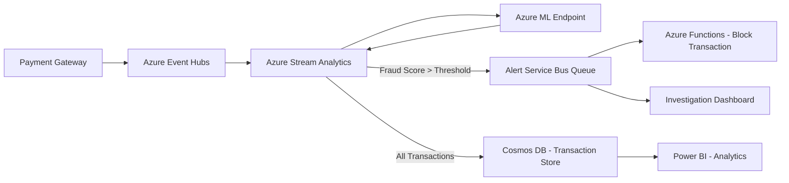

# How to Build a Fraud Detection System with Azure Stream Analytics and Azure Machine Learning

Author: [nawazdhandala](https://www.github.com/nawazdhandala)

Tags: Azure Stream Analytics, Azure Machine Learning, Fraud Detection, Real-Time Analytics, Financial Services, Stream Processing, Security

Description: Build a real-time fraud detection system combining Azure Stream Analytics for event processing with Azure Machine Learning for scoring.

---

Fraud does not wait. When a stolen credit card is used for a purchase, you have seconds to decide whether to approve or block the transaction. Batch processing that runs overnight does not cut it. You need a system that evaluates every transaction in real time and flags suspicious ones before they clear.

Azure Stream Analytics processes millions of events per second with low latency. Combined with an Azure Machine Learning model that scores transactions for fraud probability, you can build a detection system that responds in near real time. Here is how to put it together.

## System Architecture

The fraud detection pipeline has three main stages: ingestion, scoring, and action.



Transactions arrive from the payment gateway into Event Hubs. Stream Analytics reads each event, calls the ML model for a fraud score, and routes the result. High-risk transactions go to a Service Bus queue for immediate action. All transactions go to Cosmos DB for historical analysis.

## Step 1 - Set Up the Ingestion Layer

Event Hubs acts as the buffer between your payment system and the fraud detection pipeline. Transactions arrive at variable rates, with spikes during peak shopping hours.

```bash
# Create the Event Hub for transaction events
az eventhubs namespace create \
  --name fraud-detect-ns \
  --resource-group fraud-rg \
  --sku Standard \
  --location eastus

az eventhubs eventhub create \
  --name transactions \
  --namespace-name fraud-detect-ns \
  --resource-group fraud-rg \
  --partition-count 16 \
  --message-retention 1
```

Each transaction event should include the fields your ML model needs for scoring. Here is an example event schema.

```json
{
  "transactionId": "txn-2026-abc123",
  "cardHash": "sha256-of-card-number",
  "merchantId": "merch-9876",
  "amount": 342.50,
  "currency": "USD",
  "merchantCategory": "electronics",
  "customerLocation": "New York, US",
  "merchantLocation": "Los Angeles, US",
  "timestamp": "2026-02-16T14:23:11.456Z",
  "isOnline": true,
  "deviceFingerprint": "fp-xyz789"
}
```

Notice that we never include the actual card number. We use a hash for identity matching. This is important for PCI compliance since the fraud detection system should not need to see raw card data.

## Step 2 - Train the Fraud Detection Model

Fraud detection is a classic imbalanced classification problem. Legitimate transactions vastly outnumber fraudulent ones. The model needs to catch fraud while keeping false positives low enough that you do not annoy your real customers.

```python
import pandas as pd
import lightgbm as lgb
from sklearn.model_selection import train_test_split
from sklearn.metrics import precision_recall_curve, average_precision_score
import mlflow
import mlflow.lightgbm
import numpy as np

def train_fraud_model(data_path: str):
    """Train a fraud detection model optimized for high recall with acceptable precision."""
    mlflow.lightgbm.autolog()

    # Load historical transaction data with fraud labels
    df = pd.read_csv(data_path)

    # Engineer features that capture fraud patterns
    df["hour_of_day"] = pd.to_datetime(df["timestamp"]).dt.hour
    df["day_of_week"] = pd.to_datetime(df["timestamp"]).dt.dayofweek
    df["is_weekend"] = df["day_of_week"].isin([5, 6]).astype(int)
    df["amount_log"] = np.log1p(df["amount"])

    # Distance between customer and merchant locations (pre-computed)
    # High distance with in-person transactions is suspicious
    df["distance_flag"] = ((df["geo_distance_km"] > 500) & (~df["isOnline"])).astype(int)

    # Features for the model
    feature_cols = [
        "amount_log", "hour_of_day", "day_of_week", "is_weekend",
        "merchantCategory_encoded", "isOnline", "distance_flag",
        "avg_txn_amount_30d", "txn_count_24h", "unique_merchants_7d",
        "time_since_last_txn_minutes", "amount_vs_avg_ratio"
    ]

    X = df[feature_cols]
    y = df["is_fraud"]

    X_train, X_test, y_train, y_test = train_test_split(
        X, y, test_size=0.2, random_state=42, stratify=y
    )

    # LightGBM with scale_pos_weight to handle imbalanced classes
    fraud_ratio = (y_train == 0).sum() / (y_train == 1).sum()
    model = lgb.LGBMClassifier(
        n_estimators=1000,
        learning_rate=0.01,
        num_leaves=63,
        scale_pos_weight=fraud_ratio,
        min_child_samples=50,
        subsample=0.8,
        colsample_bytree=0.8,
        reg_alpha=0.1,
        reg_lambda=0.1,
        random_state=42
    )

    model.fit(
        X_train, y_train,
        eval_set=[(X_test, y_test)],
        callbacks=[lgb.early_stopping(50), lgb.log_evaluation(100)]
    )

    # Evaluate with precision-recall (more meaningful than AUC for imbalanced data)
    y_scores = model.predict_proba(X_test)[:, 1]
    avg_precision = average_precision_score(y_test, y_scores)
    mlflow.log_metric("average_precision", avg_precision)

    # Find the threshold that gives 95% recall
    precision, recall, thresholds = precision_recall_curve(y_test, y_scores)
    target_recall_idx = np.argmin(np.abs(recall - 0.95))
    optimal_threshold = thresholds[target_recall_idx]
    mlflow.log_metric("optimal_threshold", optimal_threshold)

    print(f"Average Precision: {avg_precision:.4f}")
    print(f"Threshold for 95% recall: {optimal_threshold:.4f}")

    return model

train_fraud_model("transaction_history.csv")
```

The key metric here is average precision, not accuracy. With 99.9% legitimate transactions, a model that always predicts "not fraud" gets 99.9% accuracy but catches zero fraud. We optimize for high recall (catching as much fraud as possible) while keeping precision reasonable.

## Step 3 - Deploy the Model as a Real-Time Endpoint

Deploy the trained model to an Azure ML managed online endpoint. Stream Analytics will call this endpoint for every transaction.

```bash
# Register the model
az ml model create \
  --name fraud-detection-model \
  --version 1 \
  --path ./model \
  --resource-group fraud-rg \
  --workspace-name fraud-ml-ws

# Create and deploy the endpoint
az ml online-endpoint create \
  --name fraud-scoring \
  --resource-group fraud-rg \
  --workspace-name fraud-ml-ws

az ml online-deployment create \
  --name fraud-v1 \
  --endpoint-name fraud-scoring \
  --model azureml:fraud-detection-model:1 \
  --instance-type Standard_DS3_v2 \
  --instance-count 3 \
  --resource-group fraud-rg \
  --workspace-name fraud-ml-ws
```

Three instances provide enough capacity for real-time scoring and resilience if one instance fails. Scale this based on your transaction volume.

## Step 4 - Configure Stream Analytics

Stream Analytics ties everything together. It reads from Event Hubs, calls the ML endpoint using a function reference, and writes results to multiple outputs.

Create the Stream Analytics job with the following query. This query reads transactions, scores them, and routes high-risk ones to the alert queue.

```sql
-- Define the ML function reference
-- This is configured in the Stream Analytics portal as an Azure ML function

-- Main scoring query
WITH ScoredTransactions AS (
    SELECT
        t.transactionId,
        t.cardHash,
        t.merchantId,
        t.amount,
        t.timestamp,
        t.isOnline,
        -- Call the ML model to get a fraud score
        udf.ScoreFraud(
            t.amount_log,
            t.hour_of_day,
            t.day_of_week,
            t.is_weekend,
            t.merchantCategory_encoded,
            t.isOnline,
            t.distance_flag,
            t.avg_txn_amount_30d,
            t.txn_count_24h,
            t.unique_merchants_7d,
            t.time_since_last_txn_minutes,
            t.amount_vs_avg_ratio
        ) AS fraudScore
    FROM TransactionInput t
)

-- Output all scored transactions to Cosmos DB
SELECT * INTO CosmosOutput FROM ScoredTransactions

-- Route high-risk transactions to the alert queue
SELECT * INTO AlertOutput
FROM ScoredTransactions
WHERE fraudScore > 0.85

-- Detect velocity anomalies (many transactions in short time)
SELECT
    cardHash,
    COUNT(*) as txnCount,
    SUM(amount) as totalAmount,
    System.Timestamp() as windowEnd
INTO VelocityAlertOutput
FROM TransactionInput
TIMESTAMP BY timestamp
GROUP BY cardHash, TumblingWindow(minute, 5)
HAVING COUNT(*) > 10
```

The velocity check at the bottom is a rule-based detection that complements the ML model. If a card is used more than 10 times in 5 minutes, that is suspicious regardless of what the ML model says.

## Step 5 - Build the Alert and Response Pipeline

When Stream Analytics identifies a high-risk transaction, the alert queue triggers an Azure Function that can block the transaction or flag it for manual review.

```python
import azure.functions as func
import json
import logging
from azure.communication.email import EmailClient

def main(msg: func.ServiceBusMessage):
    """Process fraud alerts from the Service Bus queue."""
    body = json.loads(msg.get_body().decode("utf-8"))
    transaction_id = body["transactionId"]
    fraud_score = body["fraudScore"]
    amount = body["amount"]

    logging.info(f"Fraud alert: {transaction_id}, score: {fraud_score}, amount: {amount}")

    # High confidence fraud - auto-block
    if fraud_score > 0.95:
        block_transaction(transaction_id)
        notify_fraud_team(body, "AUTO-BLOCKED")
    # Medium confidence - flag for review
    elif fraud_score > 0.85:
        hold_transaction(transaction_id)
        notify_fraud_team(body, "HELD FOR REVIEW")

def block_transaction(transaction_id: str):
    """Call the payment gateway API to block the transaction."""
    # Integration with your payment processor goes here
    logging.info(f"Blocked transaction: {transaction_id}")

def hold_transaction(transaction_id: str):
    """Place a hold on the transaction pending review."""
    logging.info(f"Held transaction: {transaction_id}")

def notify_fraud_team(transaction: dict, action: str):
    """Send alert to the fraud investigation team."""
    # Send via email, Teams, or your incident management system
    logging.info(f"Notified fraud team: {action} for {transaction['transactionId']}")
```

## Step 6 - Monitor Model Performance

Fraud patterns change over time. A model trained on last year's data might miss new attack vectors. Set up a monitoring pipeline that compares predicted fraud rates to confirmed fraud rates.

Track these metrics weekly:
- False positive rate: How many legitimate transactions are being flagged
- False negative rate: How many actual fraud cases slip through
- Average fraud score distribution: Shifts can indicate data drift
- Model latency: Scoring should complete in under 100 milliseconds

When model performance drops below acceptable thresholds, trigger a retraining pipeline with the latest labeled data.

## Wrapping Up

A real-time fraud detection system on Azure combines the throughput of Event Hubs and Stream Analytics with the intelligence of a well-trained ML model. The key is keeping latency low enough that you can block or hold a suspicious transaction before it clears. Start with a good feature engineering pipeline, train a model that prioritizes recall, deploy it behind a low-latency endpoint, and let Stream Analytics orchestrate the real-time flow. Layer in rule-based checks for obvious patterns like velocity anomalies. Monitor the model continuously and retrain when performance degrades.
