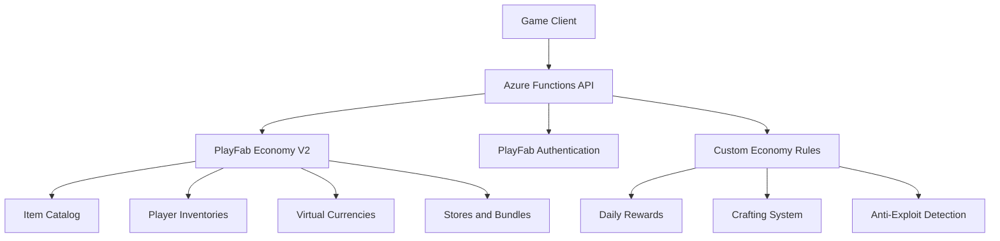

# How to Build a Game Economy Backend with Azure Functions and PlayFab Economy V2

Author: [nawazdhandala](https://www.github.com/nawazdhandala)

Tags: Azure Functions, PlayFab, Game Economy, Virtual Currency, In-App Purchases, Game Development, Economy V2

Description: Build a game economy backend using Azure Functions for custom logic and PlayFab Economy V2 for inventory, currency, and marketplace management.

---

A well-designed game economy keeps players engaged for months or years. It gives them goals to work toward, rewards for their time, and choices about how to progress. Building the backend for that economy - managing virtual currencies, item inventories, stores, bundles, and real-money purchases - is a significant engineering effort.

PlayFab Economy V2 handles the heavy lifting of inventory management, currency systems, and catalog operations. Azure Functions lets you layer custom business logic on top - things like crafting systems, daily reward calculations, and anti-exploitation rules. In this guide, I will build a complete game economy backend.

## Economy Architecture



The game client talks to Azure Functions, which acts as a trusted server layer. Functions validates requests, applies custom rules, and delegates to PlayFab for inventory and currency operations. The client never talks to PlayFab directly for economy operations since that would let players forge requests.

## Step 1 - Set Up the Currency System

Most games have at least two currencies: a soft currency earned through gameplay and a premium currency purchased with real money. PlayFab Economy V2 supports multiple virtual currencies.

Configure currencies in the PlayFab portal or via the API.

```python
import requests
import os

TITLE_ID = os.environ["PLAYFAB_TITLE_ID"]
SECRET_KEY = os.environ["PLAYFAB_SECRET_KEY"]

def create_currency(currency_id: str, name: str, initial_deposit: int):
    """Create a virtual currency in PlayFab Economy V2."""
    url = f"https://{TITLE_ID}.playfabapi.com/Catalog/CreateDraftItem"

    headers = {
        "Content-Type": "application/json",
        "X-SecretKey": SECRET_KEY
    }

    # In Economy V2, currencies are defined as catalog items of type "currency"
    payload = {
        "Item": {
            "Type": "currency",
            "Title": {"NEUTRAL": name},
            "AlternateIds": [
                {"Type": "FriendlyId", "Value": currency_id}
            ],
            "StartDate": "2026-01-01T00:00:00Z",
            "ContentType": "currency"
        },
        "Publish": True
    }

    response = requests.post(url, headers=headers, json=payload)
    return response.json()

# Create soft and premium currencies
create_currency("gold", "Gold Coins", 500)  # Players start with 500 gold
create_currency("gems", "Premium Gems", 0)  # Purchased with real money
create_currency("energy", "Energy", 100)    # Regenerating resource
```

## Step 2 - Create the Item Catalog

Define items that players can own. Economy V2 uses a flexible catalog system where items can have custom properties, price tags, and stacking behavior.

```python
def create_catalog_item(item_id: str, name: str, description: str,
                        prices: dict, properties: dict, stackable: bool = True):
    """Create an item in the PlayFab Economy V2 catalog."""
    url = f"https://{TITLE_ID}.playfabapi.com/Catalog/CreateDraftItem"

    headers = {
        "Content-Type": "application/json",
        "X-SecretKey": SECRET_KEY
    }

    # Build price options - each item can have multiple purchase prices
    price_options = []
    for currency_id, amount in prices.items():
        price_options.append({
            "Amounts": [
                {
                    "ItemId": get_currency_item_id(currency_id),
                    "Amount": amount
                }
            ]
        })

    payload = {
        "Item": {
            "Type": "catalogItem",
            "Title": {"NEUTRAL": name},
            "Description": {"NEUTRAL": description},
            "AlternateIds": [
                {"Type": "FriendlyId", "Value": item_id}
            ],
            "PriceOptions": {
                "Prices": price_options
            },
            "IsStackable": stackable,
            "ContentType": "gameItem",
            "DisplayProperties": properties
        },
        "Publish": True
    }

    response = requests.post(url, headers=headers, json=payload)
    return response.json()

# Create some game items
create_catalog_item(
    "health_potion",
    "Health Potion",
    "Restores 50 HP instantly",
    prices={"gold": 100},
    properties={"hp_restore": 50, "rarity": "common", "category": "consumable"},
    stackable=True
)

create_catalog_item(
    "legendary_sword",
    "Blade of the Ancients",
    "A powerful sword from a forgotten era",
    prices={"gold": 5000, "gems": 50},
    properties={"attack": 150, "rarity": "legendary", "category": "weapon", "level_required": 30},
    stackable=False
)

create_catalog_item(
    "xp_boost",
    "Double XP Boost (1 Hour)",
    "Doubles all experience gained for one hour",
    prices={"gems": 10},
    properties={"duration_minutes": 60, "multiplier": 2.0, "rarity": "rare", "category": "boost"},
    stackable=True
)
```

## Step 3 - Build the Purchase API

The purchase API runs in Azure Functions. It validates the request, checks custom rules, and delegates to PlayFab for the actual transaction.

```python
import azure.functions as func
import json
import os
import requests
from datetime import datetime, timedelta

app = func.FunctionApp()

TITLE_ID = os.environ["PLAYFAB_TITLE_ID"]
SECRET_KEY = os.environ["PLAYFAB_SECRET_KEY"]

@app.route(route="economy/purchase", methods=["POST"])
def purchase_item(req: func.HttpRequest) -> func.HttpResponse:
    """Handle an item purchase with server-side validation."""
    body = req.get_json()
    player_id = body["playerId"]
    entity_token = body["entityToken"]
    item_id = body["itemId"]
    quantity = body.get("quantity", 1)

    # Validate the entity token is real
    player = validate_entity_token(entity_token)
    if not player:
        return func.HttpResponse(
            json.dumps({"error": "Invalid authentication"}),
            status_code=401,
            mimetype="application/json"
        )

    # Apply custom business rules before purchase
    validation = validate_purchase_rules(player_id, item_id, quantity)
    if not validation["allowed"]:
        return func.HttpResponse(
            json.dumps({"error": validation["reason"]}),
            status_code=400,
            mimetype="application/json"
        )

    # Execute the purchase through PlayFab Economy V2
    result = execute_purchase(entity_token, item_id, quantity)

    if result.get("error"):
        return func.HttpResponse(
            json.dumps({"error": result["error"]}),
            status_code=400,
            mimetype="application/json"
        )

    return func.HttpResponse(
        json.dumps({
            "success": True,
            "itemId": item_id,
            "quantity": quantity,
            "remainingBalance": result.get("balance", {})
        }),
        status_code=200,
        mimetype="application/json"
    )

def validate_purchase_rules(player_id: str, item_id: str, quantity: int) -> dict:
    """Apply custom business rules to validate a purchase."""
    # Rule 1: Check daily purchase limits
    today_purchases = get_today_purchase_count(player_id, item_id)
    daily_limit = get_daily_limit(item_id)
    if today_purchases + quantity > daily_limit:
        return {"allowed": False, "reason": f"Daily purchase limit of {daily_limit} reached"}

    # Rule 2: Check level requirements
    item_props = get_item_properties(item_id)
    player_level = get_player_level(player_id)
    required_level = item_props.get("level_required", 0)
    if player_level < required_level:
        return {"allowed": False, "reason": f"Requires level {required_level}"}

    # Rule 3: Check for suspicious purchase patterns (anti-exploit)
    if is_suspicious_activity(player_id):
        return {"allowed": False, "reason": "Purchase temporarily restricted"}

    return {"allowed": True}

def execute_purchase(entity_token: str, item_id: str, quantity: int) -> dict:
    """Execute the purchase through PlayFab Economy V2."""
    url = f"https://{TITLE_ID}.playfabapi.com/Inventory/PurchaseInventoryItems"

    headers = {
        "Content-Type": "application/json",
        "X-EntityToken": entity_token
    }

    payload = {
        "Item": {
            "AlternateId": {
                "Type": "FriendlyId",
                "Value": item_id
            }
        },
        "Amount": quantity,
        "DeleteEmptyStacks": True
    }

    response = requests.post(url, headers=headers, json=payload)
    return response.json().get("data", {})
```

## Step 4 - Implement Daily Rewards

Daily reward systems encourage players to log in every day. Here is a daily reward function that gives escalating rewards for consecutive logins.

```python
@app.route(route="economy/daily-reward", methods=["POST"])
def claim_daily_reward(req: func.HttpRequest) -> func.HttpResponse:
    """Claim the daily login reward with streak bonuses."""
    body = req.get_json()
    player_id = body["playerId"]
    entity_token = body["entityToken"]

    # Get the player's reward streak data
    streak_data = get_player_data(player_id, "daily_reward_streak")

    last_claim = streak_data.get("lastClaimDate", "")
    current_streak = streak_data.get("streak", 0)
    today = datetime.utcnow().strftime("%Y-%m-%d")

    # Check if already claimed today
    if last_claim == today:
        return func.HttpResponse(
            json.dumps({"error": "Already claimed today", "nextClaim": "tomorrow"}),
            status_code=400,
            mimetype="application/json"
        )

    # Check if the streak continues or resets
    yesterday = (datetime.utcnow() - timedelta(days=1)).strftime("%Y-%m-%d")
    if last_claim == yesterday:
        current_streak += 1  # Streak continues
    else:
        current_streak = 1   # Streak resets

    # Define rewards based on streak day (7-day cycle)
    reward_table = {
        1: {"gold": 100, "items": []},
        2: {"gold": 150, "items": []},
        3: {"gold": 200, "items": ["health_potion"]},
        4: {"gold": 250, "items": []},
        5: {"gold": 300, "items": ["health_potion", "health_potion"]},
        6: {"gold": 400, "items": []},
        7: {"gold": 500, "items": ["xp_boost"], "gems": 5}  # Weekly bonus
    }

    streak_day = ((current_streak - 1) % 7) + 1
    reward = reward_table[streak_day]

    # Grant the currency reward
    grant_currency(entity_token, "gold", reward["gold"])
    if "gems" in reward:
        grant_currency(entity_token, "gems", reward["gems"])

    # Grant item rewards
    for item_id in reward.get("items", []):
        grant_item(entity_token, item_id, 1)

    # Update streak data
    update_player_data(player_id, "daily_reward_streak", {
        "lastClaimDate": today,
        "streak": current_streak
    })

    return func.HttpResponse(
        json.dumps({
            "success": True,
            "streakDay": streak_day,
            "totalStreak": current_streak,
            "reward": reward
        }),
        status_code=200,
        mimetype="application/json"
    )

def grant_currency(entity_token: str, currency_id: str, amount: int):
    """Add virtual currency to a player's balance."""
    url = f"https://{TITLE_ID}.playfabapi.com/Inventory/AddInventoryItems"
    headers = {"Content-Type": "application/json", "X-EntityToken": entity_token}
    payload = {
        "Item": {"AlternateId": {"Type": "FriendlyId", "Value": currency_id}},
        "Amount": amount
    }
    requests.post(url, headers=headers, json=payload)

def grant_item(entity_token: str, item_id: str, quantity: int):
    """Add an item to a player's inventory."""
    url = f"https://{TITLE_ID}.playfabapi.com/Inventory/AddInventoryItems"
    headers = {"Content-Type": "application/json", "X-EntityToken": entity_token}
    payload = {
        "Item": {"AlternateId": {"Type": "FriendlyId", "Value": item_id}},
        "Amount": quantity
    }
    requests.post(url, headers=headers, json=payload)
```

## Step 5 - Build a Crafting System

Crafting lets players combine items to create new ones. This is custom logic that lives in Azure Functions on top of PlayFab inventory.

```python
# Define crafting recipes
RECIPES = {
    "super_health_potion": {
        "ingredients": {"health_potion": 3, "magic_herb": 1},
        "result_quantity": 1,
        "gold_cost": 200
    },
    "enchanted_sword": {
        "ingredients": {"iron_sword": 1, "enchantment_stone": 2},
        "result_quantity": 1,
        "gold_cost": 1000
    }
}

@app.route(route="economy/craft", methods=["POST"])
def craft_item(req: func.HttpRequest) -> func.HttpResponse:
    """Craft a new item from ingredients in the player's inventory."""
    body = req.get_json()
    player_id = body["playerId"]
    entity_token = body["entityToken"]
    recipe_id = body["recipeId"]

    if recipe_id not in RECIPES:
        return func.HttpResponse(
            json.dumps({"error": "Unknown recipe"}),
            status_code=400,
            mimetype="application/json"
        )

    recipe = RECIPES[recipe_id]

    # Check if the player has all ingredients
    inventory = get_player_inventory(entity_token)
    for ingredient_id, required_qty in recipe["ingredients"].items():
        owned_qty = get_item_count(inventory, ingredient_id)
        if owned_qty < required_qty:
            return func.HttpResponse(
                json.dumps({
                    "error": f"Not enough {ingredient_id}. Need {required_qty}, have {owned_qty}"
                }),
                status_code=400,
                mimetype="application/json"
            )

    # Check gold cost
    gold_balance = get_currency_balance(inventory, "gold")
    if gold_balance < recipe["gold_cost"]:
        return func.HttpResponse(
            json.dumps({"error": f"Not enough gold. Need {recipe['gold_cost']}, have {gold_balance}"}),
            status_code=400,
            mimetype="application/json"
        )

    # Remove ingredients from inventory
    for ingredient_id, qty in recipe["ingredients"].items():
        subtract_item(entity_token, ingredient_id, qty)

    # Deduct gold cost
    subtract_currency(entity_token, "gold", recipe["gold_cost"])

    # Grant the crafted item
    grant_item(entity_token, recipe_id, recipe["result_quantity"])

    return func.HttpResponse(
        json.dumps({
            "success": True,
            "craftedItem": recipe_id,
            "quantity": recipe["result_quantity"]
        }),
        status_code=200,
        mimetype="application/json"
    )
```

## Economy Monitoring

Track key economy health metrics to catch problems early:

- Currency earn rate vs spend rate per player segment
- Most and least purchased items
- Average time to earn enough for key items
- Premium currency conversion rate

If the earn rate far exceeds the spend rate, you have inflation. If key items take too long to earn, free players will churn.

## Wrapping Up

PlayFab Economy V2 with Azure Functions gives you a game economy backend that handles currencies, inventories, purchases, and stores out of the box. Azure Functions adds the custom business logic layer for crafting, daily rewards, purchase validation, and anti-exploit rules. Keep the client thin and the server authoritative - all economy mutations should go through your server layer where you can validate and audit them. Monitor the health metrics continuously, because a broken economy can ruin player experience faster than almost any other bug.
