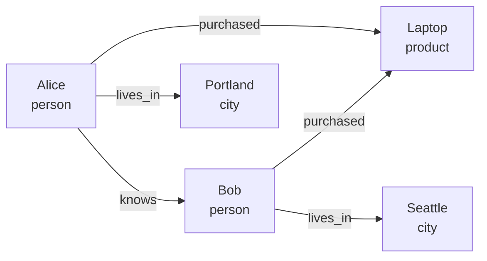

# How to Build a Graph Database Using Azure Cosmos DB Gremlin API

Author: [nawazdhandala](https://www.github.com/nawazdhandala)

Tags: Azure, Cosmos DB, Gremlin API, Graph Database, Data Modeling, Apache TinkerPop

Description: Build a graph database on Azure Cosmos DB using the Gremlin API to model and query complex relationships between entities efficiently.

---

Graph databases excel at modeling relationships. When your data is defined more by how things connect than by the things themselves - social networks, recommendation engines, fraud detection, knowledge graphs - a graph database is the right tool. Azure Cosmos DB Gremlin API gives you a fully managed graph database that speaks the Apache TinkerPop Gremlin query language, with all the Cosmos DB benefits of global distribution, automatic scaling, and guaranteed SLAs.

## Graph Database Concepts

Before diving into the setup, let me cover the basic building blocks:

- **Vertex (Node)**: An entity in the graph. A person, product, city, or any thing.
- **Edge (Relationship)**: A connection between two vertices. "Knows", "purchased", "lives_in".
- **Properties**: Key-value pairs attached to vertices and edges. A person vertex might have name, age, and email properties.
- **Labels**: Categories for vertices and edges. All person vertices share the "person" label.



## Creating a Gremlin API Account

```bash
# Create a Cosmos DB account with Gremlin (Graph) API
az cosmosdb create \
    --name myGraphAccount \
    --resource-group myResourceGroup \
    --capabilities EnableGremlin \
    --locations regionName=eastus failoverPriority=0 \
    --default-consistency-level Session

# Create a graph database
az cosmosdb gremlin database create \
    --account-name myGraphAccount \
    --name socialdb \
    --resource-group myResourceGroup

# Create a graph (container) with a partition key
# The partition key is critical for performance
az cosmosdb gremlin graph create \
    --account-name myGraphAccount \
    --database-name socialdb \
    --name socialgraph \
    --partition-key-path "/partitionKey" \
    --throughput 10000 \
    --resource-group myResourceGroup
```

## Connecting to the Graph

### .NET SDK

```csharp
// Connect to Cosmos DB Gremlin API using the Gremlin.Net driver
using Gremlin.Net.Driver;
using Gremlin.Net.Structure.IO.GraphSON;

// Connection settings from Azure Portal
string hostname = "myGraphAccount.gremlin.cosmos.azure.com";
int port = 443;
string authKey = "YOUR_PRIMARY_KEY";
string database = "socialdb";
string graph = "socialgraph";

// Create the Gremlin client
var server = new GremlinServer(
    hostname, port, enableSsl: true,
    username: $"/dbs/{database}/colls/{graph}",
    password: authKey
);

var client = new GremlinClient(
    server,
    new GraphSON2MessageSerializer(),
    connectionPoolSettings: new ConnectionPoolSettings
    {
        MaxInProcessPerConnection = 32,
        PoolSize = 4,
        ReconnectionAttempts = 4,
        ReconnectionBaseDelay = TimeSpan.FromSeconds(1)
    }
);

Console.WriteLine("Connected to Cosmos DB Gremlin API");
```

### Python

```python
# Connect using the gremlinpython driver
from gremlin_python.driver import client, serializer
import os

# Connection details from Azure Portal
endpoint = "wss://myGraphAccount.gremlin.cosmos.azure.com:443/"
username = "/dbs/socialdb/colls/socialgraph"
password = os.environ["COSMOS_KEY"]

# Create the client
gremlin_client = client.Client(
    endpoint,
    "g",
    username=username,
    password=password,
    message_serializer=serializer.GraphSONSerializersV2d0()
)

print("Connected to Cosmos DB Gremlin API")
```

### Node.js

```javascript
// Connect using the gremlin JavaScript driver
const gremlin = require('gremlin');

const authenticator = new gremlin.driver.auth.PlainTextSaslAuthenticator(
    '/dbs/socialdb/colls/socialgraph',
    process.env.COSMOS_KEY
);

// Create the client connection
const client = new gremlin.driver.Client(
    'wss://myGraphAccount.gremlin.cosmos.azure.com:443/',
    {
        authenticator,
        traversalsource: 'g',
        rejectUnauthorized: true,
        mimeType: 'application/vnd.gremlin-v2.0+json'
    }
);

client.open().then(() => {
    console.log('Connected to Cosmos DB Gremlin API');
});
```

## Adding Vertices (Nodes)

```python
# Add person vertices to the graph
# Each vertex needs a partition key property
queries = [
    # Add Alice
    "g.addV('person')"
    ".property('id', 'alice')"
    ".property('partitionKey', 'person')"
    ".property('name', 'Alice Johnson')"
    ".property('age', 32)"
    ".property('email', 'alice@example.com')",

    # Add Bob
    "g.addV('person')"
    ".property('id', 'bob')"
    ".property('partitionKey', 'person')"
    ".property('name', 'Bob Smith')"
    ".property('age', 28)"
    ".property('email', 'bob@example.com')",

    # Add a product vertex
    "g.addV('product')"
    ".property('id', 'laptop-1')"
    ".property('partitionKey', 'product')"
    ".property('name', 'ProBook Laptop')"
    ".property('price', 1299.99)"
    ".property('category', 'electronics')",

    # Add a city vertex
    "g.addV('city')"
    ".property('id', 'seattle')"
    ".property('partitionKey', 'city')"
    ".property('name', 'Seattle')"
    ".property('state', 'WA')"
]

for query in queries:
    result = gremlin_client.submit(query).all().result()
    print(f"Added vertex: {result}")
```

## Adding Edges (Relationships)

```python
# Add edges to connect vertices
# Edges represent relationships between entities
edge_queries = [
    # Alice knows Bob
    "g.V('alice').addE('knows')"
    ".to(g.V('bob'))"
    ".property('since', '2020-01-15')"
    ".property('strength', 'close')",

    # Alice purchased the laptop
    "g.V('alice').addE('purchased')"
    ".to(g.V('laptop-1'))"
    ".property('date', '2026-01-20')"
    ".property('quantity', 1)",

    # Bob purchased the laptop too
    "g.V('bob').addE('purchased')"
    ".to(g.V('laptop-1'))"
    ".property('date', '2026-02-01')"
    ".property('quantity', 1)",

    # Alice lives in Portland
    "g.V('alice').addE('lives_in')"
    ".to(g.V('portland'))",

    # Bob lives in Seattle
    "g.V('bob').addE('lives_in')"
    ".to(g.V('seattle'))"
]

for query in edge_queries:
    result = gremlin_client.submit(query).all().result()
    print(f"Added edge: {result}")
```

## Querying the Graph

Gremlin queries traverse the graph by following edges from vertex to vertex. Here are common query patterns:

```python
# Find all people that Alice knows
query = "g.V('alice').out('knows').values('name')"
result = gremlin_client.submit(query).all().result()
print(f"Alice knows: {result}")
# Output: ['Bob Smith']

# Find all products purchased by people Alice knows
query = ("g.V('alice').out('knows')"
         ".out('purchased')"
         ".values('name')")
result = gremlin_client.submit(query).all().result()
print(f"Products bought by Alice's friends: {result}")
# Output: ['ProBook Laptop']

# Find people who live in the same city as Alice
query = ("g.V('alice').out('lives_in')"
         ".in('lives_in')"
         ".has('id', neq('alice'))"
         ".values('name')")
result = gremlin_client.submit(query).all().result()
print(f"People in Alice's city: {result}")

# Find the shortest path between Alice and a product
query = ("g.V('alice')"
         ".repeat(out().simplePath())"
         ".until(hasId('laptop-1'))"
         ".path()"
         ".limit(1)")
result = gremlin_client.submit(query).all().result()
print(f"Path: {result}")

# Count connections per person (find influencers)
query = ("g.V().hasLabel('person')"
         ".project('name', 'connections')"
         ".by('name')"
         ".by(both().count())")
result = gremlin_client.submit(query).all().result()
for r in result:
    print(f"{r['name']}: {r['connections']} connections")
```

## Designing the Partition Key for Graphs

The partition key in a graph database affects how vertices and edges are distributed. Since edges are stored with their source vertex, choosing the right partition key impacts cross-partition query performance.

Strategies:

1. **Label-based partitioning**: Use the vertex label as the partition key. All persons in one partition, all products in another. Good when queries usually start from a specific entity type.

2. **Entity-based partitioning**: Use a business key like tenantId. All data for a tenant stays in one partition. Good for multi-tenant applications.

3. **Synthetic key**: Combine entity type and a hash for even distribution.

```python
# Example: Using a synthetic partition key
# Combines the entity type with a hash suffix for distribution
def get_partition_key(entity_type, entity_id):
    bucket = hash(entity_id) % 10
    return f"{entity_type}_{bucket}"

# Vertex with synthetic partition key
query = (
    f"g.addV('person')"
    f".property('id', 'user-12345')"
    f".property('partitionKey', '{get_partition_key('person', 'user-12345')}')"
    f".property('name', 'Jane Doe')"
)
```

## Recommendation Engine Example

Here is a practical example - a simple product recommendation engine:

```python
# Recommend products to Alice based on what similar users purchased
# "Users who bought what you bought also bought..."
query = (
    "g.V('alice')"                          # Start with Alice
    ".out('purchased')"                      # Products Alice bought
    ".in('purchased')"                       # Other users who bought those products
    ".where(neq('alice'))"                   # Exclude Alice herself
    ".out('purchased')"                      # What those users also bought
    ".where(without('already_purchased'))"   # Exclude what Alice already has
    ".groupCount()"                          # Count occurrences
    ".by('name')"                            # Group by product name
    ".order(local)"                          # Sort by count
    ".by(values, desc)"                      # Highest count first
)

# First, store Alice's purchases for the filter
full_query = (
    "g.V('alice').out('purchased').store('already_purchased')."
    "V('alice').out('purchased').in('purchased')"
    ".where(neq('alice'))"
    ".out('purchased')"
    ".where(without('already_purchased'))"
    ".groupCount().by('name')"
)

recommendations = gremlin_client.submit(full_query).all().result()
print(f"Recommended products: {recommendations}")
```

## Performance Tips

1. **Keep traversals short**: Deep traversals (more than 3-4 hops) can be expensive. Consider denormalizing if you frequently need deep paths.

2. **Use filters early**: Apply `has()` filters as early as possible in the traversal to reduce the number of vertices processed.

3. **Limit results**: Always use `.limit()` on queries that might return large result sets.

4. **Partition-aware queries**: When possible, include the partition key in your query to avoid cross-partition fan-out.

5. **Batch vertex creation**: When loading data, batch multiple Gremlin queries together rather than executing them one at a time.

Graph databases with Cosmos DB Gremlin API give you a powerful way to model and query interconnected data. The Gremlin query language takes some getting used to if you come from SQL, but once you think in terms of traversals rather than joins, complex relationship queries become surprisingly intuitive. Start with a small graph, get comfortable with the query patterns, and scale from there.
