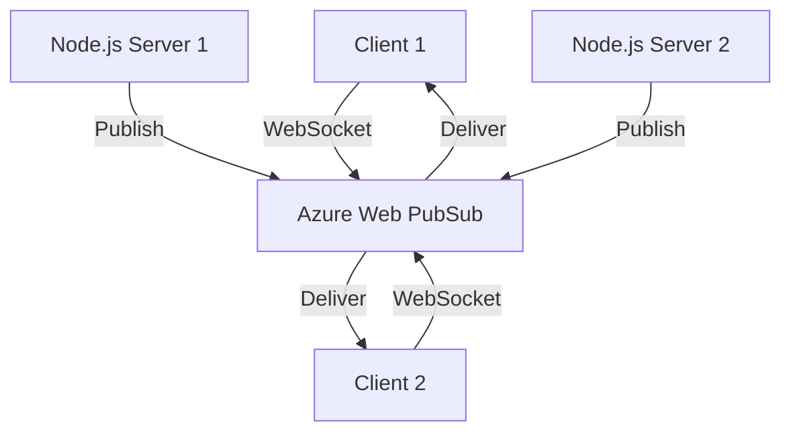

# How to Build a GraphQL Subscription API with Azure Web PubSub and Node.js

Author: [nawazdhandala](https://www.github.com/nawazdhandala)

Tags: GraphQL, Subscriptions, Azure Web PubSub, Node.js, Real-Time, WebSocket, API

Description: Implement GraphQL subscriptions using Azure Web PubSub as the transport layer with a Node.js backend for scalable real-time updates.

---

GraphQL subscriptions let clients receive real-time updates from the server. When something changes on the backend - a new message arrives, a stock price updates, an order status changes - subscriptions push that data to connected clients immediately. The typical implementation uses WebSockets, which works fine for a single server instance. But when you scale out to multiple instances, you need a pub/sub mechanism so that events from one server reach clients connected to another.

That is where Azure Web PubSub comes in. It is a fully managed WebSocket service that handles the connection management and message routing for you. In this post, we will combine GraphQL subscriptions with Azure Web PubSub to build a scalable real-time API.

## Architecture

Here is how the pieces fit together:



Instead of each server managing its own WebSocket connections, Azure Web PubSub handles all the connection state. Your servers just publish messages to the PubSub service, and it delivers them to the right clients.

## Prerequisites

- Node.js 18+
- An Azure account
- Azure CLI installed
- An Azure Web PubSub resource (we will create one below)

## Step 1: Create the Azure Web PubSub Resource

```bash
# Create a resource group
az group create --name pubsub-rg --location eastus

# Create the Web PubSub service
az webpubsub create \
  --name my-graphql-pubsub \
  --resource-group pubsub-rg \
  --sku Free_F1 \
  --location eastus

# Get the connection string - you will need this later
az webpubsub key show \
  --name my-graphql-pubsub \
  --resource-group pubsub-rg \
  --query primaryConnectionString \
  --output tsv
```

## Step 2: Set Up the Project

```bash
# Initialize the project
mkdir graphql-subscriptions && cd graphql-subscriptions
npm init -y

# Install dependencies
npm install @apollo/server graphql ws graphql-ws \
  @azure/web-pubsub @azure/web-pubsub-express express
```

## Step 3: Build the GraphQL Schema

We will create a chat application where users can send messages and subscribe to new messages in real time.

```javascript
// schema.js
// GraphQL type definitions for the chat application
const typeDefs = `#graphql
  type Message {
    id: ID!
    user: String!
    text: String!
    timestamp: String!
    room: String!
  }

  type Query {
    # Get recent messages for a room
    messages(room: String!): [Message!]!
  }

  type Mutation {
    # Send a new message to a room
    sendMessage(room: String!, user: String!, text: String!): Message!
  }

  type Subscription {
    # Subscribe to new messages in a specific room
    messageSent(room: String!): Message!
  }
`;

module.exports = { typeDefs };
```

## Step 4: Implement the PubSub Adapter

Create a custom pub/sub adapter that uses Azure Web PubSub instead of an in-memory event emitter.

```javascript
// azure-pubsub.js
// Custom PubSub adapter backed by Azure Web PubSub
const { WebPubSubServiceClient } = require('@azure/web-pubsub');
const EventEmitter = require('events');

class AzureWebPubSub {
  constructor(connectionString, hubName) {
    // The service client is used to send messages to the hub
    this.serviceClient = new WebPubSubServiceClient(connectionString, hubName);
    this.emitter = new EventEmitter();
    this.subscriptionCounter = 0;
  }

  // Publish an event to Azure Web PubSub
  async publish(triggerName, payload) {
    // Send to the Azure service for cross-instance delivery
    await this.serviceClient.sendToAll({
      trigger: triggerName,
      data: payload,
    });

    // Also emit locally for clients connected to this instance
    this.emitter.emit(triggerName, payload);
  }

  // Subscribe to events from a specific trigger
  subscribe(triggerName, onMessage) {
    this.subscriptionCounter++;
    const subId = this.subscriptionCounter;

    const handler = (payload) => {
      onMessage(payload);
    };

    this.emitter.on(triggerName, handler);

    // Return an ID that can be used to unsubscribe
    return { id: subId, handler, triggerName };
  }

  // Remove a subscription
  unsubscribe(subscription) {
    this.emitter.off(subscription.triggerName, subscription.handler);
  }
}

module.exports = { AzureWebPubSub };
```

## Step 5: Implement the Resolvers

```javascript
// resolvers.js
// GraphQL resolvers for queries, mutations, and subscriptions
const { v4: uuidv4 } = require('uuid');

// In-memory message storage
const messagesStore = {};

function createResolvers(pubsub) {
  return {
    Query: {
      // Return the last 50 messages for a room
      messages: (_, { room }) => {
        return (messagesStore[room] || []).slice(-50);
      },
    },

    Mutation: {
      sendMessage: async (_, { room, user, text }) => {
        const message = {
          id: uuidv4(),
          user,
          text,
          timestamp: new Date().toISOString(),
          room,
        };

        // Store the message
        if (!messagesStore[room]) {
          messagesStore[room] = [];
        }
        messagesStore[room].push(message);

        // Publish the event so subscribers get notified
        await pubsub.publish(`MESSAGE_SENT_${room}`, {
          messageSent: message,
        });

        return message;
      },
    },

    Subscription: {
      messageSent: {
        // The subscribe function returns an async iterator
        subscribe: (_, { room }) => {
          const triggerName = `MESSAGE_SENT_${room}`;
          return createAsyncIterator(pubsub, triggerName);
        },
      },
    },
  };
}

// Helper to create an async iterator from our pubsub
function createAsyncIterator(pubsub, triggerName) {
  const pullQueue = [];
  const pushQueue = [];
  let done = false;

  const subscription = pubsub.subscribe(triggerName, (payload) => {
    if (pullQueue.length > 0) {
      // A consumer is already waiting, resolve immediately
      pullQueue.shift()({ value: payload, done: false });
    } else {
      // No consumer waiting, queue the message
      pushQueue.push(payload);
    }
  });

  return {
    [Symbol.asyncIterator]() {
      return this;
    },
    next() {
      if (pushQueue.length > 0) {
        return Promise.resolve({ value: pushQueue.shift(), done: false });
      }
      if (done) {
        return Promise.resolve({ value: undefined, done: true });
      }
      return new Promise((resolve) => pullQueue.push(resolve));
    },
    return() {
      done = true;
      pubsub.unsubscribe(subscription);
      pullQueue.forEach((resolve) =>
        resolve({ value: undefined, done: true })
      );
      return Promise.resolve({ value: undefined, done: true });
    },
  };
}

module.exports = { createResolvers };
```

## Step 6: Wire Everything Together

```javascript
// server.js
// Main server that ties Apollo Server, Express, and WebSocket together
const { ApolloServer } = require('@apollo/server');
const { expressMiddleware } = require('@apollo/server/express4');
const { createServer } = require('http');
const express = require('express');
const { WebSocketServer } = require('ws');
const { useServer } = require('graphql-ws/lib/use/ws');
const { makeExecutableSchema } = require('@graphql-tools/schema');
const { typeDefs } = require('./schema');
const { createResolvers } = require('./resolvers');
const { AzureWebPubSub } = require('./azure-pubsub');

async function start() {
  // Initialize Azure Web PubSub
  const connectionString = process.env.AZURE_WEBPUBSUB_CONNECTION_STRING;
  const pubsub = new AzureWebPubSub(connectionString, 'graphql-chat');

  const resolvers = createResolvers(pubsub);
  const schema = makeExecutableSchema({ typeDefs, resolvers });

  const app = express();
  const httpServer = createServer(app);

  // Set up WebSocket server for subscriptions
  const wsServer = new WebSocketServer({
    server: httpServer,
    path: '/graphql',
  });

  // Register the graphql-ws handler
  const serverCleanup = useServer({ schema }, wsServer);

  // Create Apollo Server
  const server = new ApolloServer({
    schema,
    plugins: [
      {
        // Proper shutdown for the WebSocket server
        async serverWillStart() {
          return {
            async drainServer() {
              await serverCleanup.dispose();
            },
          };
        },
      },
    ],
  });

  await server.start();

  // Mount the GraphQL HTTP endpoint
  app.use('/graphql', express.json(), expressMiddleware(server));

  // Health check endpoint
  app.get('/health', (req, res) => res.json({ status: 'ok' }));

  const port = process.env.PORT || 4000;
  httpServer.listen(port, () => {
    console.log(`Server running at http://localhost:${port}/graphql`);
    console.log(`Subscriptions at ws://localhost:${port}/graphql`);
  });
}

start().catch(console.error);
```

## Step 7: Test Subscriptions Locally

Open a GraphQL client (like Apollo Sandbox or GraphQL Playground) and set up a subscription.

```graphql
# Subscribe to messages in the "general" room
subscription {
  messageSent(room: "general") {
    id
    user
    text
    timestamp
  }
}
```

In another tab, send a message:

```graphql
mutation {
  sendMessage(room: "general", user: "Alice", text: "Hello everyone!") {
    id
    timestamp
  }
}
```

The subscription tab should immediately show the new message.

## Deploying to Azure

Package the application and deploy it to Azure App Service or Container Apps. Set the connection string as an environment variable.

```bash
# Set the connection string as an app setting
az webapp config appsettings set \
  --name my-graphql-app \
  --resource-group pubsub-rg \
  --settings AZURE_WEBPUBSUB_CONNECTION_STRING="<your-connection-string>"

# Enable WebSockets on the App Service
az webapp config set \
  --name my-graphql-app \
  --resource-group pubsub-rg \
  --web-sockets-enabled true
```

## Scaling Considerations

The big advantage of using Azure Web PubSub is horizontal scaling. Without it, if you have three server instances and a client is connected to instance 1, a message published on instance 2 would never reach that client. Azure Web PubSub solves this by acting as the central message broker.

For high-traffic scenarios, consider using the Standard tier of Azure Web PubSub, which supports up to 100,000 concurrent connections per unit. You can also partition your rooms across multiple hubs to distribute the load.

## Summary

We built a GraphQL subscription API that uses Azure Web PubSub for scalable real-time message delivery. The key benefit is that your Node.js servers do not need to manage WebSocket connections directly - Azure Web PubSub handles the connection state and message routing. This means you can scale your servers horizontally without worrying about sticky sessions or shared state. The combination of GraphQL subscriptions for the API layer and Azure Web PubSub for the transport layer gives you both developer experience and operational scalability.
