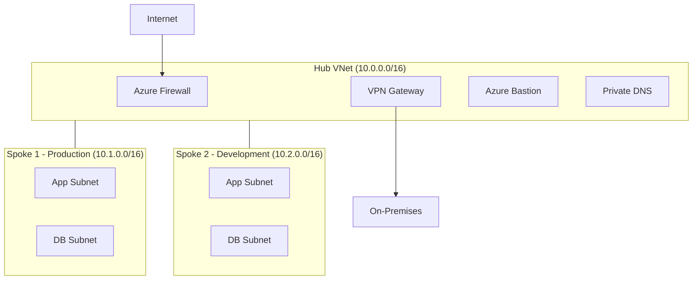

# How to Build a Hub-Spoke Network Topology in Azure Using Terraform Modules

Author: [nawazdhandala](https://www.github.com/nawazdhandala)

Tags: Terraform, Azure, Hub-Spoke, Networking, Virtual Network, Infrastructure as Code, Modules

Description: A practical guide to building a hub-spoke network topology in Azure using reusable Terraform modules for centralized connectivity and security.

---

The hub-spoke topology is the most common network architecture pattern in Azure. Microsoft recommends it, Azure landing zone guidance builds on it, and most enterprises end up adopting it sooner or later. The idea is simple - centralize shared services like firewalls, VPN gateways, and DNS in a hub virtual network, then connect workload-specific spoke networks through peering. All traffic between spokes and to the internet flows through the hub, giving you a single chokepoint for security and routing.

Building this by hand in the portal gets tedious fast, especially when you need to manage dozens of spokes across multiple environments. Terraform modules make this repeatable and consistent.

## The Architecture

Before writing any code, let me outline what we are building:



The hub contains Azure Firewall for traffic inspection, a VPN Gateway for on-premises connectivity, and Azure Bastion for secure VM access. Each spoke is peered to the hub and uses route tables to send traffic through the firewall.

## Project Structure

I organize hub-spoke projects like this:

```
infrastructure/
  modules/
    hub-network/
      main.tf
      variables.tf
      outputs.tf
    spoke-network/
      main.tf
      variables.tf
      outputs.tf
  environments/
    prod/
      main.tf
      terraform.tfvars
    dev/
      main.tf
      terraform.tfvars
```

The key insight is that the spoke module is designed to be called multiple times with different parameters. Write it once, deploy it as many times as you need.

## The Hub Network Module

Here is the hub network module. It creates the virtual network, subnets for shared services, and the Azure Firewall:

```hcl
# modules/hub-network/main.tf - Creates the hub virtual network with shared services

variable "hub_name" {
  description = "Name prefix for hub resources"
  type        = string
}

variable "location" {
  description = "Azure region for all resources"
  type        = string
}

variable "resource_group_name" {
  description = "Name of the resource group"
  type        = string
}

variable "address_space" {
  description = "Address space for the hub virtual network"
  type        = list(string)
  default     = ["10.0.0.0/16"]
}

# Create the hub virtual network
resource "azurerm_virtual_network" "hub" {
  name                = "vnet-${var.hub_name}-hub"
  location            = var.location
  resource_group_name = var.resource_group_name
  address_space       = var.address_space
}

# Azure Firewall requires a dedicated subnet named exactly 'AzureFirewallSubnet'
resource "azurerm_subnet" "firewall" {
  name                 = "AzureFirewallSubnet"
  resource_group_name  = var.resource_group_name
  virtual_network_name = azurerm_virtual_network.hub.name
  address_prefixes     = [cidrsubnet(var.address_space[0], 10, 0)]  # /26 subnet
}

# Gateway subnet for VPN or ExpressRoute gateways
resource "azurerm_subnet" "gateway" {
  name                 = "GatewaySubnet"
  resource_group_name  = var.resource_group_name
  virtual_network_name = azurerm_virtual_network.hub.name
  address_prefixes     = [cidrsubnet(var.address_space[0], 10, 1)]
}

# Bastion subnet for secure remote access
resource "azurerm_subnet" "bastion" {
  name                 = "AzureBastionSubnet"
  resource_group_name  = var.resource_group_name
  virtual_network_name = azurerm_virtual_network.hub.name
  address_prefixes     = [cidrsubnet(var.address_space[0], 10, 2)]
}

# Public IP for Azure Firewall
resource "azurerm_public_ip" "firewall" {
  name                = "pip-${var.hub_name}-fw"
  location            = var.location
  resource_group_name = var.resource_group_name
  allocation_method   = "Static"
  sku                 = "Standard"
}

# Azure Firewall instance in the hub
resource "azurerm_firewall" "hub" {
  name                = "fw-${var.hub_name}"
  location            = var.location
  resource_group_name = var.resource_group_name
  sku_name            = "AZFW_VNet"
  sku_tier            = "Standard"

  ip_configuration {
    name                 = "fw-ipconfig"
    subnet_id            = azurerm_subnet.firewall.id
    public_ip_address_id = azurerm_public_ip.firewall.id
  }
}

# Outputs needed by spoke modules
output "hub_vnet_id" {
  value = azurerm_virtual_network.hub.id
}

output "hub_vnet_name" {
  value = azurerm_virtual_network.hub.name
}

output "firewall_private_ip" {
  value = azurerm_firewall.hub.ip_configuration[0].private_ip_address
}
```

## The Spoke Network Module

The spoke module is where the reusability pays off. Each spoke gets its own virtual network, peering to the hub, subnets, and a route table that sends all traffic through the hub firewall:

```hcl
# modules/spoke-network/main.tf - Creates a spoke virtual network peered to the hub

variable "spoke_name" {
  description = "Name for this spoke"
  type        = string
}

variable "location" {
  description = "Azure region"
  type        = string
}

variable "resource_group_name" {
  description = "Resource group name"
  type        = string
}

variable "address_space" {
  description = "Address space for the spoke"
  type        = list(string)
}

variable "subnets" {
  description = "Map of subnets to create"
  type = map(object({
    address_prefixes = list(string)
  }))
}

variable "hub_vnet_id" {
  description = "Resource ID of the hub virtual network"
  type        = string
}

variable "hub_vnet_name" {
  description = "Name of the hub virtual network"
  type        = string
}

variable "hub_resource_group_name" {
  description = "Resource group of the hub virtual network"
  type        = string
}

variable "firewall_private_ip" {
  description = "Private IP of the hub firewall for routing"
  type        = string
}

# Create the spoke virtual network
resource "azurerm_virtual_network" "spoke" {
  name                = "vnet-${var.spoke_name}"
  location            = var.location
  resource_group_name = var.resource_group_name
  address_space       = var.address_space
}

# Create subnets dynamically based on input map
resource "azurerm_subnet" "spoke" {
  for_each             = var.subnets
  name                 = "snet-${each.key}"
  resource_group_name  = var.resource_group_name
  virtual_network_name = azurerm_virtual_network.spoke.name
  address_prefixes     = each.value.address_prefixes
}

# Peer from spoke to hub - allow forwarded traffic and gateway transit
resource "azurerm_virtual_network_peering" "spoke_to_hub" {
  name                      = "peer-${var.spoke_name}-to-hub"
  resource_group_name       = var.resource_group_name
  virtual_network_name      = azurerm_virtual_network.spoke.name
  remote_virtual_network_id = var.hub_vnet_id
  allow_forwarded_traffic   = true
  use_remote_gateways       = false  # Set to true if hub has VPN gateway
}

# Peer from hub to spoke
resource "azurerm_virtual_network_peering" "hub_to_spoke" {
  name                      = "peer-hub-to-${var.spoke_name}"
  resource_group_name       = var.hub_resource_group_name
  virtual_network_name      = var.hub_vnet_name
  remote_virtual_network_id = azurerm_virtual_network.spoke.id
  allow_forwarded_traffic   = true
  allow_gateway_transit     = false  # Set to true if hub has VPN gateway
}

# Route table to force all traffic through the hub firewall
resource "azurerm_route_table" "spoke" {
  name                = "rt-${var.spoke_name}"
  location            = var.location
  resource_group_name = var.resource_group_name

  # Default route sends everything to the firewall
  route {
    name                   = "default-to-firewall"
    address_prefix         = "0.0.0.0/0"
    next_hop_type          = "VirtualAppliance"
    next_hop_in_ip_address = var.firewall_private_ip
  }
}

# Associate route table with each spoke subnet
resource "azurerm_subnet_route_table_association" "spoke" {
  for_each       = azurerm_subnet.spoke
  subnet_id      = each.value.id
  route_table_id = azurerm_route_table.spoke.id
}
```

## Putting It Together

Now the root configuration calls these modules to build the full topology:

```hcl
# environments/prod/main.tf - Deploy hub-spoke topology for production

provider "azurerm" {
  features {}
}

resource "azurerm_resource_group" "network" {
  name     = "rg-network-prod"
  location = "eastus2"
}

# Deploy the hub network with shared services
module "hub" {
  source              = "../../modules/hub-network"
  hub_name            = "prod"
  location            = azurerm_resource_group.network.location
  resource_group_name = azurerm_resource_group.network.name
  address_space       = ["10.0.0.0/16"]
}

# Production workload spoke
module "spoke_prod_workload" {
  source                  = "../../modules/spoke-network"
  spoke_name              = "prod-workload"
  location                = azurerm_resource_group.network.location
  resource_group_name     = azurerm_resource_group.network.name
  hub_vnet_id             = module.hub.hub_vnet_id
  hub_vnet_name           = module.hub.hub_vnet_name
  hub_resource_group_name = azurerm_resource_group.network.name
  firewall_private_ip     = module.hub.firewall_private_ip
  address_space           = ["10.1.0.0/16"]

  subnets = {
    app = { address_prefixes = ["10.1.1.0/24"] }
    db  = { address_prefixes = ["10.1.2.0/24"] }
    web = { address_prefixes = ["10.1.3.0/24"] }
  }
}

# Data platform spoke
module "spoke_data_platform" {
  source                  = "../../modules/spoke-network"
  spoke_name              = "prod-data"
  location                = azurerm_resource_group.network.location
  resource_group_name     = azurerm_resource_group.network.name
  hub_vnet_id             = module.hub.hub_vnet_id
  hub_vnet_name           = module.hub.hub_vnet_name
  hub_resource_group_name = azurerm_resource_group.network.name
  firewall_private_ip     = module.hub.firewall_private_ip
  address_space           = ["10.2.0.0/16"]

  subnets = {
    databricks = { address_prefixes = ["10.2.1.0/24"] }
    synapse    = { address_prefixes = ["10.2.2.0/24"] }
    storage    = { address_prefixes = ["10.2.3.0/24"] }
  }
}
```

## Handling Spoke-to-Spoke Communication

By default, spoke virtual networks cannot communicate directly with each other because peering is not transitive. Traffic between spokes must go through the hub firewall, which is actually a good thing from a security perspective - you get full visibility and control over east-west traffic.

For this to work, you need firewall rules that allow traffic between spoke address ranges. You also need the route tables we set up earlier, which force all traffic through the firewall.

If you need direct spoke-to-spoke connectivity without going through the firewall, you can add peering between spokes, but I generally advise against it because you lose the security benefits.

## Scaling to Many Spokes

When you have more than a handful of spokes, managing them individually becomes unwieldy. Instead, define your spokes as a map variable and iterate:

```hcl
# Define all spokes in a single variable for easy management
variable "spokes" {
  type = map(object({
    address_space = list(string)
    subnets = map(object({
      address_prefixes = list(string)
    }))
  }))
}

# Create all spokes from the map
module "spokes" {
  source                  = "../../modules/spoke-network"
  for_each                = var.spokes
  spoke_name              = each.key
  location                = azurerm_resource_group.network.location
  resource_group_name     = azurerm_resource_group.network.name
  hub_vnet_id             = module.hub.hub_vnet_id
  hub_vnet_name           = module.hub.hub_vnet_name
  hub_resource_group_name = azurerm_resource_group.network.name
  firewall_private_ip     = module.hub.firewall_private_ip
  address_space           = each.value.address_space
  subnets                 = each.value.subnets
}
```

Then in your tfvars:

```hcl
spokes = {
  prod-app = {
    address_space = ["10.1.0.0/16"]
    subnets = {
      app = { address_prefixes = ["10.1.1.0/24"] }
      db  = { address_prefixes = ["10.1.2.0/24"] }
    }
  }
  prod-data = {
    address_space = ["10.2.0.0/16"]
    subnets = {
      analytics = { address_prefixes = ["10.2.1.0/24"] }
      storage   = { address_prefixes = ["10.2.2.0/24"] }
    }
  }
}
```

## IP Address Planning

Get your IP address planning right before you start deploying. Here is a convention that scales well:

- Hub: `10.0.0.0/16`
- Spoke 1: `10.1.0.0/16`
- Spoke 2: `10.2.0.0/16`
- And so on...

Each /16 gives you 65,536 addresses per network, which is more than enough for most workloads. If you need to peer with on-premises networks, make sure there is no address overlap.

## Lessons Learned

After building hub-spoke topologies for several organizations, here are the things that trip people up:

- Azure Firewall takes 10-15 minutes to deploy. Plan your pipeline timeouts accordingly.
- Peering must be established from both sides. If you forget the hub-to-spoke peering, the spoke-to-hub peering alone will not work.
- Route tables must be associated with subnets, not the virtual network. This is a common source of confusion.
- NSGs and route tables are complementary. NSGs filter traffic, route tables direct it. You almost always need both.

The hub-spoke model with Terraform modules gives you a clean, repeatable way to scale your Azure network. Start with a hub and one spoke, validate the connectivity, then add spokes as needed. The module approach means each new spoke is just a few lines of configuration.
