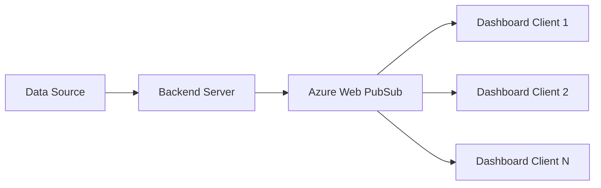

# How to Build a Live Dashboard with Azure Web PubSub and JavaScript

Author: [nawazdhandala](https://www.github.com/nawazdhandala)

Tags: Azure, Web PubSub, JavaScript, Dashboard, Real-Time, WebSocket, Frontend

Description: Build a real-time live dashboard using Azure Web PubSub and vanilla JavaScript that updates instantly as new data arrives.

---

Live dashboards are everywhere. From monitoring server health to tracking sales metrics, the need to display data that updates in real time is a common requirement. Traditionally, you would poll your API every few seconds, but that approach wastes bandwidth and introduces unnecessary latency. A better option is to use WebSocket connections so the server can push updates to the dashboard the moment new data is available.

In this post, I will show you how to build a live dashboard using Azure Web PubSub and plain JavaScript. No frameworks required. The dashboard will display real-time metrics that update as the server pushes new data.

## Architecture Overview

The system has three parts:

1. A **backend server** that generates or fetches metrics and publishes them to Azure Web PubSub.
2. **Azure Web PubSub** as the message broker that maintains WebSocket connections and delivers messages.
3. A **browser-based dashboard** that connects via WebSocket and renders metrics as they arrive.



This architecture means your backend never has to manage WebSocket connections directly. It just publishes data to Web PubSub, and the service handles the fan-out to all connected dashboards.

## Setting Up the Backend

First, create the Azure Web PubSub resource if you have not already. Then install the dependencies for the backend.

```bash
# Initialize a new Node.js project
npm init -y

# Install the Web PubSub server SDK and Express for the token endpoint
npm install @azure/web-pubsub express cors
```

The backend has two responsibilities: serving an endpoint that provides client access tokens, and periodically publishing dashboard data.

```javascript
// server.js - Backend that serves tokens and publishes dashboard metrics
const express = require('express');
const cors = require('cors');
const { WebPubSubServiceClient } = require('@azure/web-pubsub');

const app = express();
app.use(cors());

const connectionString = process.env.WEBPUBSUB_CONNECTION_STRING;
const hubName = 'dashboard';
const serviceClient = new WebPubSubServiceClient(connectionString, hubName);

// Endpoint that returns a WebSocket URL with an embedded access token
app.get('/api/token', async (req, res) => {
  const token = await serviceClient.getClientAccessUrl({
    roles: ['webpubsub.joinLeaveGroup', 'webpubsub.sendToGroup']
  });
  res.json({ url: token.url });
});

// Simulate publishing metrics every 2 seconds
setInterval(async () => {
  const metrics = {
    timestamp: new Date().toISOString(),
    cpu: Math.random() * 100,
    memory: 40 + Math.random() * 40,
    requests: Math.floor(Math.random() * 500),
    errorRate: Math.random() * 5,
    responseTime: 50 + Math.random() * 200
  };

  // Send the metrics to all connected clients in the dashboard hub
  await serviceClient.sendToAll(JSON.stringify(metrics), {
    contentType: 'application/json'
  });
}, 2000);

app.listen(3000, () => {
  console.log('Server running on http://localhost:3000');
});
```

In a real application, you would replace the random data generation with actual metric collection from your systems. The important thing is the pattern: collect data and publish it to the hub.

## Building the Dashboard Frontend

Create an HTML file that connects to Azure Web PubSub and renders the incoming data. I am keeping this with vanilla JavaScript to focus on the Web PubSub integration rather than framework specifics.

```html
<!-- dashboard.html - Live dashboard that displays real-time metrics -->
<!DOCTYPE html>
<html lang="en">
<head>
  <meta charset="UTF-8">
  <title>Live Dashboard</title>
  <style>
    body {
      font-family: -apple-system, BlinkMacSystemFont, sans-serif;
      background: #1a1a2e;
      color: #eee;
      margin: 0;
      padding: 20px;
    }
    .grid {
      display: grid;
      grid-template-columns: repeat(auto-fit, minmax(250px, 1fr));
      gap: 20px;
      max-width: 1200px;
      margin: 0 auto;
    }
    .card {
      background: #16213e;
      border-radius: 12px;
      padding: 24px;
      text-align: center;
    }
    .card h3 { color: #a8a8b3; font-size: 14px; margin: 0 0 12px; }
    .card .value { font-size: 48px; font-weight: bold; }
    .card .unit { font-size: 16px; color: #a8a8b3; }
    .status { text-align: center; padding: 10px; margin-bottom: 20px; }
    .connected { color: #4ecca3; }
    .disconnected { color: #e74c3c; }
    h1 { text-align: center; margin-bottom: 10px; }
  </style>
</head>
<body>
  <h1>Live System Dashboard</h1>
  <div class="status" id="status">Connecting...</div>
  <div class="grid">
    <div class="card">
      <h3>CPU Usage</h3>
      <div class="value" id="cpu">--</div>
      <div class="unit">%</div>
    </div>
    <div class="card">
      <h3>Memory Usage</h3>
      <div class="value" id="memory">--</div>
      <div class="unit">%</div>
    </div>
    <div class="card">
      <h3>Requests / sec</h3>
      <div class="value" id="requests">--</div>
      <div class="unit">req/s</div>
    </div>
    <div class="card">
      <h3>Error Rate</h3>
      <div class="value" id="errorRate">--</div>
      <div class="unit">%</div>
    </div>
    <div class="card">
      <h3>Avg Response Time</h3>
      <div class="value" id="responseTime">--</div>
      <div class="unit">ms</div>
    </div>
  </div>

  <script>
    // Fetch the access token from our backend and connect via WebSocket
    async function connect() {
      const statusEl = document.getElementById('status');

      try {
        // Request a WebSocket URL with an embedded access token
        const res = await fetch('http://localhost:3000/api/token');
        const { url } = await res.json();

        const ws = new WebSocket(url);

        ws.onopen = () => {
          statusEl.textContent = 'Connected';
          statusEl.className = 'status connected';
        };

        ws.onmessage = (event) => {
          // Parse the incoming metrics and update the dashboard
          const data = JSON.parse(event.data);
          document.getElementById('cpu').textContent = data.cpu.toFixed(1);
          document.getElementById('memory').textContent = data.memory.toFixed(1);
          document.getElementById('requests').textContent = data.requests;
          document.getElementById('errorRate').textContent = data.errorRate.toFixed(2);
          document.getElementById('responseTime').textContent = data.responseTime.toFixed(0);
        };

        ws.onclose = () => {
          statusEl.textContent = 'Disconnected - Reconnecting...';
          statusEl.className = 'status disconnected';
          // Attempt to reconnect after 3 seconds
          setTimeout(connect, 3000);
        };

        ws.onerror = () => {
          ws.close();
        };
      } catch (err) {
        statusEl.textContent = 'Failed to connect';
        statusEl.className = 'status disconnected';
        setTimeout(connect, 3000);
      }
    }

    // Start the connection when the page loads
    connect();
  </script>
</body>
</html>
```

## Adding Historical Data with a Rolling Chart

A dashboard is more useful when you can see trends over time. Let us add a simple rolling line chart using the Canvas API. No external charting libraries needed for a basic implementation.

```javascript
// chart.js - Simple rolling chart for dashboard metrics
class RollingChart {
  constructor(canvasId, maxPoints, color) {
    this.canvas = document.getElementById(canvasId);
    this.ctx = this.canvas.getContext('2d');
    this.maxPoints = maxPoints || 60;
    this.color = color || '#4ecca3';
    this.data = [];
  }

  // Add a new data point and redraw the chart
  addPoint(value) {
    this.data.push(value);
    if (this.data.length > this.maxPoints) {
      this.data.shift(); // Remove the oldest point to maintain the rolling window
    }
    this.draw();
  }

  draw() {
    const { canvas, ctx, data, color } = this;
    const w = canvas.width;
    const h = canvas.height;
    const max = Math.max(...data, 1);
    const stepX = w / (this.maxPoints - 1);

    // Clear the canvas
    ctx.clearRect(0, 0, w, h);

    // Draw the line
    ctx.beginPath();
    ctx.strokeStyle = color;
    ctx.lineWidth = 2;

    data.forEach((val, i) => {
      const x = i * stepX;
      const y = h - (val / max) * (h - 10);
      if (i === 0) ctx.moveTo(x, y);
      else ctx.lineTo(x, y);
    });

    ctx.stroke();
  }
}
```

You would include a canvas element in each card and instantiate a `RollingChart` for each metric. Every time a WebSocket message arrives, call `chart.addPoint(value)` to update the visualization.

## Handling Multiple Dashboard Views with Groups

If your dashboard serves different teams, you might not want everyone to see the same data. Web PubSub groups let you segment the data streams.

```javascript
// On the server side, publish metrics to specific groups
async function publishTeamMetrics(team, metrics) {
  // Only clients subscribed to this team's group will receive the message
  await serviceClient.group(team).sendToAll(JSON.stringify(metrics), {
    contentType: 'application/json'
  });
}

// Publish different metrics to different teams
publishTeamMetrics('engineering', engineeringMetrics);
publishTeamMetrics('sales', salesMetrics);
```

On the client side, when using the `json.webpubsub.azure.v1` subprotocol, you can join groups directly from the client.

## Reconnection Strategy

WebSocket connections drop. It happens due to network changes, idle timeouts, or service maintenance. A production dashboard needs a solid reconnection strategy.

The basic approach shown in the HTML above - reconnecting after a fixed delay - works but can be improved. Use exponential backoff to avoid hammering the server when it is having issues.

```javascript
// reconnect.js - Exponential backoff reconnection logic
let reconnectAttempts = 0;
const maxDelay = 30000; // Cap the delay at 30 seconds

function getReconnectDelay() {
  // Exponential backoff: 1s, 2s, 4s, 8s, 16s, 30s, 30s...
  const delay = Math.min(1000 * Math.pow(2, reconnectAttempts), maxDelay);
  reconnectAttempts++;
  return delay;
}

function onConnected() {
  // Reset the counter when we successfully connect
  reconnectAttempts = 0;
}
```

## Performance Tips

When building a live dashboard that handles frequent updates, keep these things in mind:

- **Batch updates on the server.** Instead of publishing every individual metric change, collect metrics over a short window (1-2 seconds) and publish them as a single message. This reduces the number of WebSocket messages and makes the dashboard smoother.
- **Throttle DOM updates on the client.** If metrics arrive faster than the screen can render, use `requestAnimationFrame` to batch visual updates.
- **Use JSON payloads wisely.** Keep your message payloads small. Only send the data that changed, or use a compact format.
- **Monitor your connection count.** The Azure portal shows active connections. Keep an eye on this, especially if each dashboard tab opens a new connection.

## Wrapping Up

Building a live dashboard with Azure Web PubSub and JavaScript is surprisingly simple once you understand the pattern. The server publishes data to a hub, Web PubSub fans it out to all connected clients, and the browser updates the UI as messages arrive. You get real-time updates without polling, and you do not have to manage WebSocket infrastructure yourself.

The combination of a lightweight frontend and a managed WebSocket service gives you a dashboard that is easy to build, easy to scale, and responsive enough for production monitoring. Start with the basic setup shown here, and layer on features like groups, historical charts, and alerting as your needs grow.
