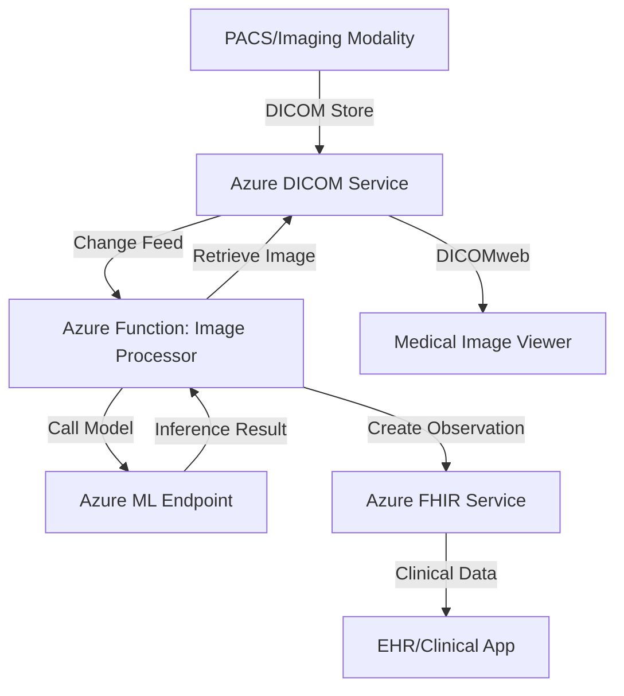

# How to Build a Medical Imaging Analysis Pipeline with Azure Health Data Services and DICOM

Author: [nawazdhandala](https://www.github.com/nawazdhandala)

Tags: Azure Health Data Services, DICOM, Medical Imaging, Healthcare, Azure, FHIR, Machine Learning

Description: Build a medical imaging analysis pipeline using Azure Health Data Services DICOM service to store, retrieve, and analyze medical images at scale.

---

Medical imaging generates massive volumes of data. A single CT scan can produce hundreds of DICOM (Digital Imaging and Communications in Medicine) files, and hospitals process thousands of studies daily. Azure Health Data Services includes a managed DICOM service that stores, indexes, and serves medical images through standard DICOMweb APIs. Combined with Azure's compute and AI services, you can build end-to-end imaging analysis pipelines.

This guide covers deploying the DICOM service, uploading imaging studies, building analysis pipelines with Azure Functions and Azure Machine Learning, and integrating results back into clinical workflows through FHIR.

## Architecture



## Step 1: Deploy Azure Health Data Services

### Create a Workspace

Azure Health Data Services groups FHIR, DICOM, and MedTech IoT services under a single workspace.

1. In the Azure portal, search for "Azure Health Data Services".
2. Click Create a workspace.
3. Enter a name, resource group, and region.
4. Click Create.

### Add a DICOM Service

1. Go to the workspace.
2. Click Deploy DICOM service.
3. Enter a name for the DICOM service.
4. Click Create.

The DICOM service endpoint will be: `https://{workspace-name}-{dicom-name}.dicom.azurehealthcareapis.com`

### Add a FHIR Service (for Clinical Integration)

1. In the same workspace, click Deploy FHIR service.
2. Configure with FHIR version R4.
3. Create.

### Configure Access Control

Assign roles to your application and users:

- **DICOM Data Owner**: Full read/write access to DICOM data.
- **DICOM Data Reader**: Read-only access to DICOM data.
- **FHIR Data Contributor**: Read/write access to FHIR resources.

```bash
# Assign the DICOM Data Owner role to your application
az role assignment create \
    --assignee {app-client-id} \
    --role "DICOM Data Owner" \
    --scope "/subscriptions/{sub}/resourceGroups/{rg}/providers/Microsoft.HealthcareApis/workspaces/{workspace}/dicomservices/{dicom-service}"
```

## Step 2: Upload DICOM Images

### Upload Using DICOMweb STOW-RS

The DICOM service supports the DICOMweb standard. Upload images using the STOW-RS (Store Over the Web) endpoint:

```python
# Upload DICOM files to Azure DICOM service using DICOMweb STOW-RS
# Handles authentication and multipart DICOM upload
import requests
from azure.identity import ClientSecretCredential
from pathlib import Path

class DicomClient:
    def __init__(self, dicom_url, tenant_id, client_id, client_secret):
        self.dicom_url = dicom_url
        self.credential = ClientSecretCredential(
            tenant_id=tenant_id,
            client_id=client_id,
            client_secret=client_secret
        )

    def _get_token(self):
        """Get an access token for the DICOM API."""
        token = self.credential.get_token(
            "https://dicom.healthcareapis.azure.com/.default"
        )
        return token.token

    def upload_study(self, dicom_files):
        """Upload one or more DICOM files as a study."""
        # Build multipart request body
        boundary = "----DicomBoundary"
        body = b""

        for file_path in dicom_files:
            with open(file_path, "rb") as f:
                dicom_data = f.read()

            body += f"--{boundary}\r\n".encode()
            body += b"Content-Type: application/dicom\r\n\r\n"
            body += dicom_data
            body += b"\r\n"

        body += f"--{boundary}--\r\n".encode()

        # Send the STOW-RS request
        response = requests.post(
            f"{self.dicom_url}/v1/studies",
            headers={
                "Authorization": f"Bearer {self._get_token()}",
                "Content-Type": f"multipart/related; type=application/dicom; boundary={boundary}",
                "Accept": "application/dicom+json"
            },
            data=body
        )

        response.raise_for_status()
        return response.json()

    def query_studies(self, patient_id=None, modality=None):
        """Query for imaging studies using QIDO-RS."""
        params = {}
        if patient_id:
            params["PatientID"] = patient_id
        if modality:
            params["ModalitiesInStudy"] = modality

        response = requests.get(
            f"{self.dicom_url}/v1/studies",
            params=params,
            headers={
                "Authorization": f"Bearer {self._get_token()}",
                "Accept": "application/dicom+json"
            }
        )

        response.raise_for_status()
        return response.json()

    def retrieve_instance(self, study_uid, series_uid, instance_uid):
        """Retrieve a specific DICOM instance using WADO-RS."""
        response = requests.get(
            f"{self.dicom_url}/v1/studies/{study_uid}/series/{series_uid}/instances/{instance_uid}",
            headers={
                "Authorization": f"Bearer {self._get_token()}",
                "Accept": "application/dicom"
            }
        )

        response.raise_for_status()
        return response.content
```

### Bulk Upload from PACS

For migrating large volumes of data from an existing PACS (Picture Archiving and Communication System), use the Azure DICOM service's bulk import feature:

1. Export DICOM files from your PACS to Azure Blob Storage.
2. Use the DICOM service's import endpoint to bulk ingest.

```bash
# Trigger a bulk import from Blob Storage
curl -X POST \
    "https://{workspace}-{dicom}.dicom.azurehealthcareapis.com/v1/$import" \
    -H "Authorization: Bearer $TOKEN" \
    -H "Content-Type: application/json" \
    -d '{
        "input": [{
            "type": "application/dicom",
            "url": "https://storageaccount.blob.core.windows.net/dicom-import/"
        }]
    }'
```

## Step 3: Build the Analysis Pipeline

### Monitor for New Studies Using Change Feed

The DICOM service has a change feed that emits events when studies are added or updated.

```csharp
// Azure Function that monitors the DICOM change feed for new studies
// Triggers image analysis when a new study is uploaded
using Microsoft.Azure.WebJobs;
using Microsoft.Extensions.Logging;
using System.Net.Http;
using System.Threading.Tasks;

public class DicomChangeFeedProcessor
{
    private readonly HttpClient _httpClient;

    [FunctionName("ProcessDicomChangeFeed")]
    public async Task Run(
        [TimerTrigger("0 */2 * * * *")] TimerInfo timer,
        ILogger log)
    {
        // Poll the DICOM change feed for new events
        var response = await _httpClient.GetAsync(
            $"{dicomUrl}/v1/changefeed?offset={lastOffset}&limit=100"
        );

        var changes = await response.Content.ReadAsAsync<List<ChangeEvent>>();

        foreach (var change in changes)
        {
            if (change.Action == "Create" && change.State == "Current")
            {
                log.LogInformation(
                    $"New study detected: {change.StudyInstanceUid}"
                );

                // Trigger the analysis pipeline
                await TriggerAnalysis(change.StudyInstanceUid, log);
            }
        }
    }
}
```

### Retrieve and Preprocess Images

```python
# Retrieve DICOM images and convert to formats suitable for ML models
# Uses pydicom for DICOM processing and numpy for array operations
import pydicom
import numpy as np
from io import BytesIO

def retrieve_and_preprocess(dicom_client, study_uid, series_uid, instance_uid):
    """Retrieve a DICOM instance and prepare it for ML inference."""

    # Get the raw DICOM bytes from the DICOM service
    dicom_bytes = dicom_client.retrieve_instance(
        study_uid, series_uid, instance_uid
    )

    # Parse the DICOM file
    ds = pydicom.dcmread(BytesIO(dicom_bytes))

    # Extract pixel data as a numpy array
    pixel_array = ds.pixel_array.astype(np.float32)

    # Apply windowing for consistent contrast
    # Window center and width define the visible range
    window_center = ds.WindowCenter if hasattr(ds, 'WindowCenter') else 40
    window_width = ds.WindowWidth if hasattr(ds, 'WindowWidth') else 400

    # Handle cases where these are stored as lists
    if isinstance(window_center, pydicom.multival.MultiValue):
        window_center = window_center[0]
    if isinstance(window_width, pydicom.multival.MultiValue):
        window_width = window_width[0]

    # Apply the windowing function
    min_val = window_center - window_width / 2
    max_val = window_center + window_width / 2
    pixel_array = np.clip(pixel_array, min_val, max_val)

    # Normalize to 0-1 range for the ML model
    pixel_array = (pixel_array - min_val) / (max_val - min_val)

    # Resize to model's expected input size (e.g., 224x224)
    from PIL import Image
    image = Image.fromarray((pixel_array * 255).astype(np.uint8))
    image = image.resize((224, 224))

    return np.array(image) / 255.0, ds
```

### Run Inference with Azure ML

```python
# Call an Azure ML endpoint for medical image analysis
# The model might detect anomalies, classify findings, or segment structures
import json
import requests

def analyze_image(image_array, ml_endpoint_url, ml_api_key):
    """Send a preprocessed image to the Azure ML endpoint for analysis."""

    # Prepare the request payload
    payload = {
        "data": image_array.tolist(),
        "parameters": {
            "threshold": 0.5,
            "return_heatmap": True
        }
    }

    response = requests.post(
        ml_endpoint_url,
        headers={
            "Authorization": f"Bearer {ml_api_key}",
            "Content-Type": "application/json"
        },
        json=payload,
        timeout=60
    )

    response.raise_for_status()
    result = response.json()

    return {
        "findings": result.get("findings", []),
        "confidence": result.get("confidence", 0),
        "classification": result.get("classification", "unknown"),
        "heatmap": result.get("heatmap", None)
    }
```

## Step 4: Store Results in FHIR

Convert analysis results into FHIR resources and store them alongside the patient's clinical data:

```python
# Create a FHIR DiagnosticReport and Observation from the ML analysis results
# Links the results to the original imaging study and patient
def create_fhir_results(fhir_client, patient_id, study_uid, analysis_result):
    """Store ML analysis results as FHIR resources."""

    # Create an Observation for each finding
    observation_ids = []
    for finding in analysis_result["findings"]:
        observation = {
            "resourceType": "Observation",
            "status": "preliminary",
            "category": [{
                "coding": [{
                    "system": "http://terminology.hl7.org/CodeSystem/observation-category",
                    "code": "imaging",
                    "display": "Imaging"
                }]
            }],
            "code": {
                "coding": [{
                    "system": "http://example.org/fhir/CodeSystem/imaging-findings",
                    "code": finding["code"],
                    "display": finding["description"]
                }]
            },
            "subject": {
                "reference": f"Patient/{patient_id}"
            },
            "valueQuantity": {
                "value": finding["confidence"],
                "unit": "probability",
                "system": "http://unitsofmeasure.org"
            },
            "interpretation": [{
                "coding": [{
                    "system": "http://terminology.hl7.org/CodeSystem/v3-ObservationInterpretation",
                    "code": "A" if finding["confidence"] > 0.7 else "N",
                    "display": "Abnormal" if finding["confidence"] > 0.7 else "Normal"
                }]
            }]
        }

        # POST the observation to the FHIR server
        result = fhir_client.create_resource("Observation", observation)
        observation_ids.append(result["id"])

    # Create a DiagnosticReport linking all observations
    report = {
        "resourceType": "DiagnosticReport",
        "status": "preliminary",
        "category": [{
            "coding": [{
                "system": "http://terminology.hl7.org/CodeSystem/v2-0074",
                "code": "RAD",
                "display": "Radiology"
            }]
        }],
        "code": {
            "coding": [{
                "system": "http://loinc.org",
                "code": "18748-4",
                "display": "Diagnostic Imaging Study"
            }]
        },
        "subject": {
            "reference": f"Patient/{patient_id}"
        },
        "result": [
            {"reference": f"Observation/{obs_id}"}
            for obs_id in observation_ids
        ],
        "imagingStudy": [{
            "reference": f"ImagingStudy?identifier={study_uid}"
        }],
        "conclusion": analysis_result["classification"]
    }

    return fhir_client.create_resource("DiagnosticReport", report)
```

## Step 5: Build a Viewer Integration

Connect a medical image viewer (like OHIF Viewer) to the DICOM service for clinicians to review images alongside AI results:

1. Deploy OHIF Viewer as a web application (Azure App Service or Static Web Apps).
2. Configure the DICOMweb data source to point to your Azure DICOM service.
3. Implement Azure AD authentication in the viewer for secure access.
4. Display FHIR-based analysis results alongside the images.

The viewer connects using standard DICOMweb URLs:

- WADO-RS for image retrieval: `{dicom-url}/v1/studies/{studyUID}/series/{seriesUID}/instances/{instanceUID}`
- QIDO-RS for study queries: `{dicom-url}/v1/studies?PatientID={id}`

## Monitoring and Compliance

### Monitor the Pipeline

Track these metrics:

- DICOM upload latency and success rate.
- Change feed processing lag.
- ML inference latency and accuracy.
- FHIR resource creation success rate.

### Compliance Requirements

Medical imaging pipelines must comply with HIPAA and potentially other regulations:

- All data in transit must use TLS 1.2+.
- Data at rest is encrypted (Azure handles this by default).
- Access logs must be retained for audit purposes.
- PHI (Protected Health Information) must be handled according to your BAA with Microsoft.
- ML model decisions should be logged for clinical accountability.

## Wrapping Up

Building a medical imaging analysis pipeline with Azure Health Data Services combines the managed DICOM service for image storage, Azure ML for inference, and FHIR for clinical data integration. The DICOM change feed triggers analysis when new studies arrive, the ML model processes the images, and the results flow back into the FHIR server as structured clinical data. This pattern enables AI-assisted radiology workflows while maintaining standards compliance through DICOMweb and FHIR interoperability.
