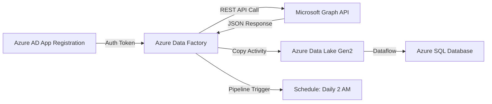

# How to Build a Microsoft Graph API Data Pipeline with Azure Data Factory

Author: [nawazdhandala](https://www.github.com/nawazdhandala)

Tags: Microsoft Graph API, Azure Data Factory, Data Pipeline, ETL, Microsoft 365, Azure, Data Integration

Description: Build Azure Data Factory pipelines that extract data from Microsoft Graph API to load Microsoft 365 organizational data into your data warehouse.

---

Azure Data Factory (ADF) is Microsoft's cloud ETL service for building data pipelines. While it has hundreds of built-in connectors for databases, SaaS apps, and file systems, it does not have a native Microsoft Graph API connector. But you can use ADF's REST connector and Web Activity to call Graph API endpoints, extract Microsoft 365 data, and load it into your data warehouse.

This guide covers building a data pipeline that extracts user profiles, group memberships, and audit logs from Graph API and loads them into Azure SQL Database for organizational analytics.

## Use Cases

Organizations build Graph API data pipelines for:

- HR analytics: employee profiles, reporting structures, department distributions.
- Security reporting: audit logs, sign-in logs, risky users.
- License management: tracking Microsoft 365 license assignments.
- Collaboration analytics: Teams usage, SharePoint activity, mail flow.
- Compliance: maintaining a copy of directory data in a governed data warehouse.

## Architecture



## Step 1: Set Up Authentication

### Register an Azure AD Application

1. Create an app registration in Azure AD.
2. Add Application permissions:
   - `User.Read.All` - for user profiles
   - `Group.Read.All` - for group data
   - `AuditLog.Read.All` - for audit and sign-in logs
   - `Directory.Read.All` - for organizational data
3. Grant admin consent.
4. Create a client secret.

### Store Credentials in Key Vault

Never put credentials directly in ADF pipelines. Use Azure Key Vault:

1. Create (or use an existing) Key Vault.
2. Add secrets:
   - `graph-client-id`: Your app's client ID
   - `graph-client-secret`: Your app's client secret
   - `graph-tenant-id`: Your Azure AD tenant ID
3. Grant ADF's managed identity access to the Key Vault:
   - Go to Key Vault > Access policies.
   - Add a policy with Get secret permission for the ADF managed identity.

### Create a Key Vault Linked Service in ADF

1. In ADF, go to Manage > Linked services > New.
2. Select Azure Key Vault.
3. Choose your Key Vault.
4. Test the connection and create.

## Step 2: Build the Token Acquisition Pipeline

Graph API requires an OAuth 2.0 token. Use a Web Activity to acquire it.

### Create a Pipeline: GetGraphToken

This pipeline acquires an access token using the client credentials flow:

1. Add a Web Activity named "GetAccessToken".
2. Configure it:
   - URL: `https://login.microsoftonline.com/@{pipeline().parameters.TenantId}/oauth2/v2.0/token`
   - Method: POST
   - Headers: Content-Type: `application/x-www-form-urlencoded`
   - Body:

```
client_id=@{pipeline().parameters.ClientId}&scope=https://graph.microsoft.com/.default&client_secret=@{pipeline().parameters.ClientSecret}&grant_type=client_credentials
```

3. Add pipeline parameters that pull values from Key Vault:
   - TenantId: `@linkedService('AzureKeyVault').getSecret('graph-tenant-id')`
   - ClientId: `@linkedService('AzureKeyVault').getSecret('graph-client-id')`
   - ClientSecret: `@linkedService('AzureKeyVault').getSecret('graph-client-secret')`

The Web Activity response contains the access token at `@activity('GetAccessToken').output.access_token`.

## Step 3: Build the User Profile Extraction Pipeline

### Create a REST Linked Service

1. In ADF, create a new linked service of type REST.
2. Base URL: `https://graph.microsoft.com/v1.0`
3. Authentication type: Anonymous (we will pass the token in headers).
4. Create.

### Create the Pipeline: ExtractUsers

This pipeline extracts all user profiles and saves them to Data Lake:

1. **Web Activity: Get Token** - Acquire the access token (or call the GetGraphToken pipeline).

2. **Copy Activity: Extract Users**
   - Source: REST connector
     - Linked service: Your Graph REST service
     - Relative URL: `/users?$select=id,displayName,mail,jobTitle,department,officeLocation,city,country,employeeId,accountEnabled&$top=999`
     - Request method: GET
     - Additional headers: `Authorization: Bearer @{activity('GetToken').output.access_token}`
     - Pagination rules: Configure to follow `@odata.nextLink`
   - Sink: Azure Data Lake Storage Gen2
     - File path: `raw/users/users_@{formatDateTime(utcNow(),'yyyyMMdd')}.json`
     - Format: JSON

### Handle Pagination

Graph API returns paginated results. ADF's Copy Activity supports pagination through REST connector rules:

In the Copy Activity source settings, add pagination rules:

- Rule Type: `AbsoluteUrl`
- Value: `@odata.nextLink` in the response body

This tells ADF to keep making requests using the `@odata.nextLink` URL until there are no more pages.

Alternatively, use the pagination support in the REST connector:

```json
{
    "paginationRules": {
        "AbsoluteUrl": "$.@odata\\.nextLink"
    }
}
```

## Step 4: Build the Group Extraction Pipeline

### Pipeline: ExtractGroups

Similar to users, extract groups and their memberships:

1. **Copy Activity: Extract Groups**
   - Source URL: `/groups?$select=id,displayName,description,groupTypes,membershipRule&$top=999`
   - Sink: Data Lake at `raw/groups/groups_@{formatDateTime(utcNow(),'yyyyMMdd')}.json`

2. **ForEach Activity: Extract Group Members**
   - Items: The list of group IDs from step 1
   - Inside the loop:
     - Copy Activity to extract members: `/groups/@{item().id}/members?$select=id,displayName,mail`
     - Sink: Data Lake at `raw/group-members/@{item().id}_@{formatDateTime(utcNow(),'yyyyMMdd')}.json`

For large tenants with many groups, this ForEach can take hours. Set the batch count to 10 to process groups in parallel while staying within Graph API rate limits.

## Step 5: Build the Audit Log Extraction Pipeline

### Pipeline: ExtractAuditLogs

Sign-in and audit logs are useful for security analytics:

```
Source URL: /auditLogs/signIns?$filter=createdDateTime ge @{addDays(utcNow(),-1)}
```

This extracts sign-in logs from the last 24 hours.

For directory audit logs:

```
Source URL: /auditLogs/directoryAudits?$filter=activityDateTime ge @{addDays(utcNow(),-1)}
```

Save both to Data Lake in separate folders.

## Step 6: Transform and Load with Data Flows

Use ADF Data Flows to transform the raw JSON data and load it into Azure SQL Database.

### Data Flow: TransformUsers

1. **Source**: Read from the JSON files in Data Lake (`raw/users/`).
2. **Flatten**: Flatten any nested JSON structures.
3. **Derived Column**: Add computed columns:
   - `syncDate`: Current date
   - `isActive`: Map `accountEnabled` to a boolean
   - `fullLocation`: Concatenate city and country
4. **Select**: Choose only the columns needed for the target table.
5. **Alter Row**: Set the upsert condition (match on `id`).
6. **Sink**: Azure SQL Database table `dbo.Users`.

### Target SQL Table

```sql
-- Target table for user profile data from Graph API
-- Uses the Azure AD object ID as the primary key
CREATE TABLE dbo.Users (
    AzureAdId NVARCHAR(100) PRIMARY KEY,
    DisplayName NVARCHAR(200),
    Email NVARCHAR(200),
    JobTitle NVARCHAR(200),
    Department NVARCHAR(200),
    OfficeLocation NVARCHAR(200),
    City NVARCHAR(100),
    Country NVARCHAR(100),
    EmployeeId NVARCHAR(100),
    IsActive BIT,
    SyncDate DATE,
    LastUpdated DATETIME2 DEFAULT GETUTCDATE()
);

-- Index for common queries
CREATE INDEX IX_Users_Department ON dbo.Users(Department);
CREATE INDEX IX_Users_Email ON dbo.Users(Email);
```

## Step 7: Orchestrate with a Master Pipeline

Create a master pipeline that runs all extraction and transformation steps in order:

1. **Execute Pipeline: GetGraphToken** - Acquire the token.
2. **Execute Pipeline: ExtractUsers** - Extract user data (pass token as parameter).
3. **Execute Pipeline: ExtractGroups** - Extract group data (can run in parallel with users).
4. **Execute Pipeline: ExtractAuditLogs** - Extract audit data (can run in parallel).
5. **Data Flow: TransformUsers** - Transform and load users after extraction completes.
6. **Data Flow: TransformGroups** - Transform and load groups.
7. **Web Activity: SendNotification** - Send a Teams notification or email on completion.

### Schedule the Pipeline

1. Go to the master pipeline > Add trigger > New/Edit.
2. Create a Schedule trigger.
3. Set it to run daily at 2 AM (after business hours when Graph API load is lower).
4. Activate the trigger.

## Step 8: Monitor and Handle Errors

### Pipeline Monitoring

ADF provides built-in monitoring:

1. Go to ADF > Monitor > Pipeline runs.
2. Check the status of each run.
3. Click into failed runs to see which activity failed and why.

### Common Graph API Errors

**401 Unauthorized**: The token expired (tokens last about 1 hour). If your pipeline takes longer than an hour, add a token refresh step before each extraction activity.

**403 Forbidden**: The app does not have the required permissions. Check the app registration permissions and ensure admin consent was granted.

**429 Too Many Requests**: Rate limiting. Add a Wait Activity between iterations in ForEach loops. Reduce the batch count.

**504 Gateway Timeout**: Graph API timeout for large queries. Add `$top` parameters to reduce page size. Break large queries into smaller date ranges.

### Error Handling Pattern

For each critical activity, add an "On Failure" path:

1. Web Activity to log the error to a database table.
2. Web Activity to send an alert email.
3. Set the pipeline to continue on failure if downstream steps are independent.

## Wrapping Up

Building a Microsoft Graph API data pipeline with Azure Data Factory gives you a managed, schedulable way to extract Microsoft 365 organizational data into your data warehouse. The key components are OAuth 2.0 token acquisition via Web Activity, REST connector for Graph API calls with pagination support, Data Lake Gen2 as the raw landing zone, and Data Flows for transformation and loading. Handle Graph API rate limits by controlling parallelism, refresh tokens for long-running pipelines, and set up monitoring with alerts for failed runs.
