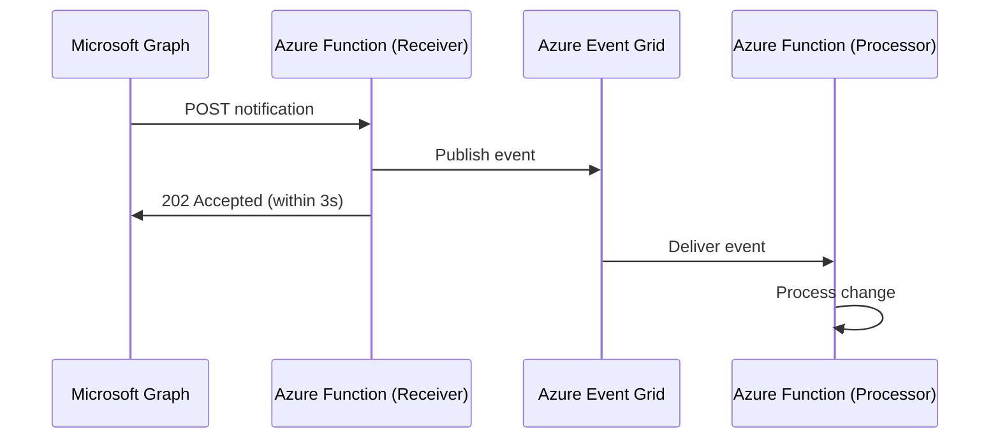

# How to Build a Microsoft Graph API Webhook Listener with Azure Event Grid

Author: [nawazdhandala](https://www.github.com/nawazdhandala)

Tags: Microsoft Graph API, Webhooks, Azure Event Grid, Change Notifications, Azure Functions, Microsoft 365, Serverless

Description: Build a webhook listener using Azure Event Grid and Azure Functions to receive real-time change notifications from Microsoft Graph API resources.

---

Microsoft Graph API supports change notifications (webhooks) that alert your application when data changes in Microsoft 365 - new emails, calendar events, user profile updates, team messages, and more. Instead of polling the API repeatedly, you register a subscription and Graph pushes changes to your endpoint.

Azure Event Grid and Azure Functions make a solid foundation for this listener. Event Grid handles reliable delivery with retries, and Functions provide serverless compute that scales with the notification volume. This guide walks through the full implementation.

## How Graph Change Notifications Work

1. Your application creates a subscription via the Graph API, specifying:
   - The resource to watch (e.g., `/users` or `/me/messages`)
   - The type of changes to watch (created, updated, deleted)
   - A notification URL (your webhook endpoint)
   - An expiration time (max 3 days for most resources)
2. Graph validates your endpoint by sending a validation request.
3. When a matching change occurs, Graph sends a POST request to your endpoint with notification data.
4. Your endpoint processes the notification and returns 202 Accepted within 3 seconds.

The 3-second response time requirement is critical. If your processing takes longer than that, Graph marks the delivery as failed. This is why decoupling with Event Grid is valuable - receive the notification quickly, push it to Event Grid, and process it asynchronously.



## Step 1: Register the Azure AD Application

Create an app registration with the permissions needed for your subscription:

1. Go to Azure portal > Azure AD > App registrations > New registration.
2. Name it "Graph Webhook Listener".
3. Add API permissions based on what you are monitoring:
   - `Mail.Read` - for mail notifications
   - `Calendars.Read` - for calendar notifications
   - `User.Read.All` - for user change notifications
   - `ChatMessage.Read.All` - for Teams message notifications
4. Grant admin consent.
5. Create a client secret and note the app details.

## Step 2: Create the Event Grid Topic

Create a custom Event Grid topic to receive notifications:

1. In the Azure portal, search for "Event Grid Topics".
2. Click Create.
3. Enter a name (e.g., `graph-notifications`).
4. Select your resource group and region.
5. Click Create.

After creation, note the Topic Endpoint URL and access key.

## Step 3: Build the Webhook Receiver Function

This function receives notifications from Graph API and forwards them to Event Grid.

```csharp
// Webhook receiver function that handles Graph API change notifications
// Validates subscription requests and forwards notifications to Event Grid
using Microsoft.AspNetCore.Mvc;
using Microsoft.Azure.WebJobs;
using Microsoft.Azure.WebJobs.Extensions.Http;
using Microsoft.AspNetCore.Http;
using Microsoft.Extensions.Logging;
using Azure.Messaging.EventGrid;
using Azure;
using System.Text.Json;
using System.IO;
using System.Threading.Tasks;

public static class GraphWebhookReceiver
{
    // Event Grid client for publishing events
    private static readonly EventGridPublisherClient _eventGridClient = new(
        new Uri(Environment.GetEnvironmentVariable("EventGridTopicEndpoint")),
        new AzureKeyCredential(Environment.GetEnvironmentVariable("EventGridTopicKey"))
    );

    [FunctionName("GraphWebhookReceiver")]
    public static async Task<IActionResult> Run(
        [HttpTrigger(AuthorizationLevel.Anonymous, "post")] HttpRequest req,
        ILogger log)
    {
        // Step 1: Handle subscription validation
        // When you create a subscription, Graph sends a validation token
        string validationToken = req.Query["validationToken"];
        if (!string.IsNullOrEmpty(validationToken))
        {
            log.LogInformation("Responding to validation request");
            // Must return the token as plain text with 200 OK
            return new ContentResult
            {
                Content = validationToken,
                ContentType = "text/plain",
                StatusCode = 200
            };
        }

        // Step 2: Process the notification
        string body = await new StreamReader(req.Body).ReadToEndAsync();
        var notifications = JsonSerializer.Deserialize<GraphNotificationPayload>(body);

        log.LogInformation($"Received {notifications.Value.Count} notifications");

        // Step 3: Forward each notification to Event Grid
        var events = new List<EventGridEvent>();
        foreach (var notification in notifications.Value)
        {
            events.Add(new EventGridEvent(
                subject: notification.Resource,
                eventType: $"Graph.{notification.ChangeType}",
                dataVersion: "1.0",
                data: new
                {
                    notification.SubscriptionId,
                    notification.ChangeType,
                    notification.Resource,
                    notification.ResourceData,
                    notification.ClientState,
                    ReceivedAt = DateTime.UtcNow
                }
            ));
        }

        // Publish to Event Grid asynchronously
        await _eventGridClient.SendEventsAsync(events);

        // Return 202 quickly to satisfy Graph's 3-second requirement
        return new AcceptedResult();
    }
}

// Models for deserializing Graph notification payloads
public class GraphNotificationPayload
{
    public List<GraphNotification> Value { get; set; }
}

public class GraphNotification
{
    public string SubscriptionId { get; set; }
    public string ChangeType { get; set; }
    public string Resource { get; set; }
    public JsonElement ResourceData { get; set; }
    public string ClientState { get; set; }
}
```

## Step 4: Build the Notification Processor Function

This function subscribes to Event Grid and processes notifications asynchronously.

```csharp
// Event Grid triggered function that processes Graph notifications
// Runs asynchronously so it does not block the webhook receiver
using Microsoft.Azure.WebJobs;
using Microsoft.Azure.WebJobs.Extensions.EventGrid;
using Azure.Messaging.EventGrid;
using Microsoft.Extensions.Logging;
using System.Text.Json;
using System.Threading.Tasks;

public static class NotificationProcessor
{
    [FunctionName("ProcessGraphNotification")]
    public static async Task Run(
        [EventGridTrigger] EventGridEvent eventGridEvent,
        ILogger log)
    {
        log.LogInformation(
            $"Processing {eventGridEvent.EventType} for {eventGridEvent.Subject}"
        );

        // Parse the notification data
        var data = eventGridEvent.Data.ToObjectFromJson<NotificationData>();

        // Route processing based on the change type
        switch (data.ChangeType)
        {
            case "created":
                await HandleCreated(data, log);
                break;
            case "updated":
                await HandleUpdated(data, log);
                break;
            case "deleted":
                await HandleDeleted(data, log);
                break;
        }
    }

    private static async Task HandleCreated(NotificationData data, ILogger log)
    {
        // Fetch the full resource details from Graph API
        // The notification only contains the resource ID, not the full data
        var graphClient = GraphClientFactory.GetClient();

        log.LogInformation($"New resource created: {data.Resource}");

        // Example: fetch the full user profile for a user change notification
        // var user = await graphClient.Users[data.ResourceData.Id].GetAsync();

        // Process the data (save to database, trigger workflow, etc.)
        await Task.CompletedTask;
    }

    private static async Task HandleUpdated(NotificationData data, ILogger log)
    {
        log.LogInformation($"Resource updated: {data.Resource}");
        await Task.CompletedTask;
    }

    private static async Task HandleDeleted(NotificationData data, ILogger log)
    {
        log.LogInformation($"Resource deleted: {data.Resource}");
        await Task.CompletedTask;
    }
}
```

## Step 5: Create and Manage Subscriptions

### Create a Subscription

```csharp
// Function that creates a Graph API subscription for change notifications
// Must be called initially and then periodically to renew
[FunctionName("CreateSubscription")]
public static async Task<IActionResult> Run(
    [HttpTrigger(AuthorizationLevel.Function, "post")] HttpRequest req,
    ILogger log)
{
    var graphClient = GraphClientFactory.GetClient();

    var subscription = new Subscription
    {
        // What to watch - user changes in this example
        Resource = "/users",
        ChangeType = "created,updated,deleted",

        // Where to send notifications
        NotificationUrl = Environment.GetEnvironmentVariable("WebhookUrl"),

        // Client state for validation (should be a secret)
        ClientState = Environment.GetEnvironmentVariable("WebhookClientState"),

        // Expiration - max 3 days for most resources
        // You need to renew before expiration
        ExpirationDateTime = DateTimeOffset.UtcNow.AddDays(2)
    };

    var created = await graphClient.Subscriptions.PostAsync(subscription);

    log.LogInformation(
        $"Subscription created: {created.Id}, expires: {created.ExpirationDateTime}"
    );

    return new OkObjectResult(new
    {
        SubscriptionId = created.Id,
        ExpiresAt = created.ExpirationDateTime
    });
}
```

### Renew Subscriptions Automatically

Subscriptions expire. Create a timer-triggered function that renews them:

```csharp
// Timer function that renews Graph API subscriptions before they expire
// Runs every 12 hours to ensure subscriptions stay active
[FunctionName("RenewSubscriptions")]
public static async Task Run(
    [TimerTrigger("0 0 */12 * * *")] TimerInfo timer,
    ILogger log)
{
    var graphClient = GraphClientFactory.GetClient();

    // List all active subscriptions
    var subscriptions = await graphClient.Subscriptions.GetAsync();

    foreach (var sub in subscriptions.Value)
    {
        // Renew if expiring within the next 24 hours
        if (sub.ExpirationDateTime < DateTimeOffset.UtcNow.AddHours(24))
        {
            var update = new Subscription
            {
                ExpirationDateTime = DateTimeOffset.UtcNow.AddDays(2)
            };

            await graphClient.Subscriptions[sub.Id].PatchAsync(update);
            log.LogInformation($"Renewed subscription {sub.Id}");
        }
    }
}
```

## Step 6: Validate Notifications

Graph sends a `clientState` value with each notification that matches what you set when creating the subscription. Always validate it:

```csharp
// Validation logic for the webhook receiver
// Ensures notifications are genuinely from Microsoft Graph
string expectedClientState = Environment.GetEnvironmentVariable("WebhookClientState");

foreach (var notification in notifications.Value)
{
    if (notification.ClientState != expectedClientState)
    {
        log.LogWarning(
            $"Invalid clientState in notification for {notification.Resource}"
        );
        continue; // Skip this notification
    }

    // Process valid notification
}
```

## Step 7: Handle Rich Notifications

By default, Graph sends minimal notification data (just the resource ID). You must call Graph API again to get the full resource. But for some resources, you can request rich notifications that include the changed data.

When creating the subscription, add:

```csharp
var subscription = new Subscription
{
    Resource = "/users",
    ChangeType = "updated",
    NotificationUrl = webhookUrl,
    ClientState = clientState,
    ExpirationDateTime = DateTimeOffset.UtcNow.AddDays(2),
    // Include the changed resource data in the notification
    IncludeResourceData = true,
    // Encryption certificate is required for rich notifications
    EncryptionCertificate = Convert.ToBase64String(cert.Export(X509ContentType.Cert)),
    EncryptionCertificateId = cert.Thumbprint
};
```

Rich notifications include the resource data encrypted with your certificate. This avoids the extra Graph API call to fetch the resource, which is important for high-volume scenarios.

## Monitoring and Troubleshooting

### Track Notification Delivery

Create a Dataverse table or Azure Table Storage entity for each notification received. Track:

- Notification ID
- Resource type
- Change type
- Received timestamp
- Processing status
- Error details (if processing failed)

### Common Issues

**Subscription validation fails**: Make sure your function URL is publicly accessible and returns the validation token as plain text (not JSON).

**Notifications stop arriving**: The subscription expired. Check your renewal function logs. Set up an alert if the renewal function fails.

**Duplicate notifications**: Graph guarantees at-least-once delivery. Implement idempotency by tracking processed notification IDs.

**Notification delay**: Graph does not guarantee real-time delivery. During high-load periods, notifications can be delayed by minutes. Design your system to tolerate this.

## Wrapping Up

Building a Microsoft Graph API webhook listener with Azure Event Grid provides a scalable, reliable way to react to changes in Microsoft 365 data. The webhook receiver function handles validation and quickly forwards notifications to Event Grid, while processor functions handle the actual business logic asynchronously. The key challenges are keeping subscriptions renewed, validating notification authenticity, handling duplicate deliveries, and managing the Graph API call to fetch full resource data. For high-volume scenarios, use rich notifications with encrypted payloads to avoid the extra API calls.
