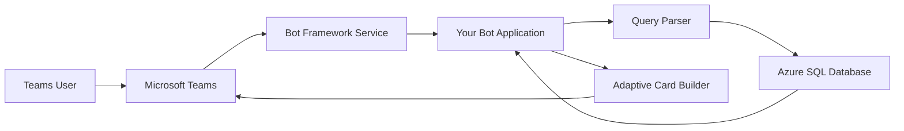

# How to Build a Microsoft Teams Bot That Queries Azure SQL Database for Business Insights

Author: [nawazdhandala](https://www.github.com/nawazdhandala)

Tags: Microsoft Teams, Bot Framework, Azure SQL, Business Intelligence, Chatbot, Azure, Node.js

Description: Build a Microsoft Teams bot that allows users to query Azure SQL Database for real-time business insights directly from their chat interface.

---

Business intelligence dashboards are great, but they require people to leave what they are doing and open a separate application. What if your team could ask questions about sales numbers, inventory levels, or customer metrics right from Microsoft Teams? A Teams bot that talks to your Azure SQL Database makes that possible.

In this guide, I will walk you through building a Teams bot that accepts natural language queries, translates them into SQL, runs them against your Azure SQL Database, and returns formatted results right in the Teams conversation. We will use the Bot Framework SDK, adaptive cards for rich formatting, and parameterized queries to keep things secure.

## Architecture



The user sends a message in Teams, the Bot Framework routes it to your application, the query parser figures out what data to fetch, the SQL query runs, and the results come back as a formatted adaptive card.

## Setting Up the Bot Project

Start with a new Node.js project using the Bot Framework SDK:

```bash
# Create the bot project
mkdir teams-insights-bot && cd teams-insights-bot
npm init -y

# Install dependencies
npm install botbuilder botbuilder-dialogs mssql dotenv
npm install --save-dev typescript @types/node ts-node
```

## Bot Registration and Teams Configuration

Register your bot in the Azure portal and configure it for Teams:

```bash
# Create the bot registration
az bot create \
  --resource-group rg-teams-bot \
  --name bot-business-insights \
  --kind registration \
  --endpoint "https://your-bot-app.azurewebsites.net/api/messages" \
  --appid $APP_ID \
  --password $APP_PASSWORD

# Enable the Teams channel
az bot msteams create \
  --resource-group rg-teams-bot \
  --name bot-business-insights
```

## Building the Bot Application

Here is the core bot that handles incoming messages and routes them to the appropriate query handler:

```typescript
// src/bot.ts - Main bot class that handles Teams messages
import { ActivityHandler, TurnContext, CardFactory } from 'botbuilder';
import { QueryService } from './queryService';
import { CardBuilder } from './cardBuilder';

export class InsightsBot extends ActivityHandler {
    private queryService: QueryService;
    private cardBuilder: CardBuilder;

    constructor(queryService: QueryService, cardBuilder: CardBuilder) {
        super();
        this.queryService = queryService;
        this.cardBuilder = cardBuilder;

        // Handle incoming messages
        this.onMessage(async (context: TurnContext, next) => {
            const text = context.activity.text?.trim().toLowerCase();

            if (!text) {
                await next();
                return;
            }

            // Show typing indicator while processing
            await context.sendActivity({ type: 'typing' });

            try {
                // Parse the user's query intent
                const intent = this.parseIntent(text);

                if (!intent) {
                    await context.sendActivity(
                        'I can help with sales, orders, customers, and inventory data. ' +
                        'Try asking something like "show me this week\'s sales" or ' +
                        '"top 10 customers by revenue".'
                    );
                    await next();
                    return;
                }

                // Execute the query
                const results = await this.queryService.execute(intent);

                // Build and send an adaptive card with the results
                const card = this.cardBuilder.buildResultsCard(intent, results);
                await context.sendActivity({
                    attachments: [CardFactory.adaptiveCard(card)]
                });
            } catch (error) {
                console.error('Query error:', error);
                await context.sendActivity(
                    'Sorry, I ran into an error fetching that data. Please try again.'
                );
            }

            await next();
        });

        // Welcome new users
        this.onMembersAdded(async (context, next) => {
            for (const member of context.activity.membersAdded || []) {
                if (member.id !== context.activity.recipient.id) {
                    await context.sendActivity(
                        'Hi! I am the Business Insights Bot. Ask me about sales, ' +
                        'orders, customers, or inventory and I will fetch the latest ' +
                        'data for you.'
                    );
                }
            }
            await next();
        });
    }

    // Parse the user message into a structured query intent
    private parseIntent(text: string): QueryIntent | null {
        // Match common business query patterns
        const patterns: Array<{ regex: RegExp; type: string; params: (m: RegExpMatchArray) => Record<string, string> }> = [
            {
                regex: /(?:show|get|what are)\s+(?:this week'?s?|weekly)\s+sales/i,
                type: 'weekly-sales',
                params: () => ({})
            },
            {
                regex: /top\s+(\d+)\s+customers?\s+(?:by\s+)?revenue/i,
                type: 'top-customers',
                params: (m) => ({ limit: m[1] })
            },
            {
                regex: /(?:show|get)\s+orders?\s+(?:for|from)\s+(\w+)/i,
                type: 'orders-by-customer',
                params: (m) => ({ customer: m[1] })
            },
            {
                regex: /inventory\s+(?:status|levels?|summary)/i,
                type: 'inventory-summary',
                params: () => ({})
            },
            {
                regex: /(?:monthly|month)\s+revenue\s+(?:for\s+)?(\d{4})?/i,
                type: 'monthly-revenue',
                params: (m) => ({ year: m[1] || new Date().getFullYear().toString() })
            }
        ];

        for (const pattern of patterns) {
            const match = text.match(pattern.regex);
            if (match) {
                return {
                    type: pattern.type,
                    params: pattern.params(match),
                    originalText: text
                };
            }
        }

        return null;
    }
}

interface QueryIntent {
    type: string;
    params: Record<string, string>;
    originalText: string;
}
```

## Building the Query Service

The query service maps intents to parameterized SQL queries:

```typescript
// src/queryService.ts - Translates query intents into SQL and executes them
import * as sql from 'mssql';

export class QueryService {
    private pool: sql.ConnectionPool;

    constructor(connectionString: string) {
        this.pool = new sql.ConnectionPool(connectionString);
    }

    async initialize(): Promise<void> {
        await this.pool.connect();
    }

    async execute(intent: QueryIntent): Promise<QueryResult> {
        // Map each intent type to a parameterized SQL query
        switch (intent.type) {
            case 'weekly-sales':
                return this.getWeeklySales();
            case 'top-customers':
                return this.getTopCustomers(parseInt(intent.params.limit || '10'));
            case 'orders-by-customer':
                return this.getOrdersByCustomer(intent.params.customer);
            case 'inventory-summary':
                return this.getInventorySummary();
            case 'monthly-revenue':
                return this.getMonthlyRevenue(parseInt(intent.params.year));
            default:
                throw new Error(`Unknown query type: ${intent.type}`);
        }
    }

    private async getWeeklySales(): Promise<QueryResult> {
        // Query for sales in the current week, grouped by day
        const result = await this.pool.request().query(`
            SELECT
                CAST(OrderDate AS DATE) as SaleDate,
                COUNT(*) as OrderCount,
                SUM(TotalAmount) as Revenue
            FROM dbo.Orders
            WHERE OrderDate >= DATEADD(DAY, -7, GETUTCDATE())
            GROUP BY CAST(OrderDate AS DATE)
            ORDER BY SaleDate DESC
        `);

        return {
            title: 'This Week\'s Sales',
            columns: ['Date', 'Orders', 'Revenue'],
            rows: result.recordset.map(r => [
                new Date(r.SaleDate).toLocaleDateString(),
                r.OrderCount.toString(),
                `$${r.Revenue.toFixed(2)}`
            ]),
            summary: {
                totalOrders: result.recordset.reduce((sum, r) => sum + r.OrderCount, 0),
                totalRevenue: result.recordset.reduce((sum, r) => sum + r.Revenue, 0)
            }
        };
    }

    private async getTopCustomers(limit: number): Promise<QueryResult> {
        // Use parameterized query to prevent SQL injection
        const result = await this.pool.request()
            .input('limit', sql.Int, Math.min(limit, 50))
            .query(`
                SELECT TOP (@limit)
                    c.CustomerName,
                    COUNT(o.OrderId) as OrderCount,
                    SUM(o.TotalAmount) as TotalRevenue
                FROM dbo.Customers c
                JOIN dbo.Orders o ON c.CustomerId = o.CustomerId
                GROUP BY c.CustomerName
                ORDER BY TotalRevenue DESC
            `);

        return {
            title: `Top ${limit} Customers by Revenue`,
            columns: ['Customer', 'Orders', 'Total Revenue'],
            rows: result.recordset.map(r => [
                r.CustomerName,
                r.OrderCount.toString(),
                `$${r.TotalRevenue.toFixed(2)}`
            ])
        };
    }

    private async getOrdersByCustomer(customer: string): Promise<QueryResult> {
        // Parameterized query with LIKE for partial matching
        const result = await this.pool.request()
            .input('customer', sql.NVarChar(256), `%${customer}%`)
            .query(`
                SELECT TOP 20
                    o.OrderId,
                    c.CustomerName,
                    o.OrderDate,
                    o.TotalAmount,
                    o.Status
                FROM dbo.Orders o
                JOIN dbo.Customers c ON o.CustomerId = c.CustomerId
                WHERE c.CustomerName LIKE @customer
                ORDER BY o.OrderDate DESC
            `);

        return {
            title: `Recent Orders for "${customer}"`,
            columns: ['Order ID', 'Customer', 'Date', 'Amount', 'Status'],
            rows: result.recordset.map(r => [
                r.OrderId.toString(),
                r.CustomerName,
                new Date(r.OrderDate).toLocaleDateString(),
                `$${r.TotalAmount.toFixed(2)}`,
                r.Status
            ])
        };
    }

    private async getInventorySummary(): Promise<QueryResult> {
        const result = await this.pool.request().query(`
            SELECT
                Category,
                COUNT(*) as ProductCount,
                SUM(StockQuantity) as TotalStock,
                SUM(CASE WHEN StockQuantity < ReorderLevel THEN 1 ELSE 0 END) as LowStockItems
            FROM dbo.Products
            GROUP BY Category
            ORDER BY Category
        `);

        return {
            title: 'Inventory Summary by Category',
            columns: ['Category', 'Products', 'Total Stock', 'Low Stock Items'],
            rows: result.recordset.map(r => [
                r.Category,
                r.ProductCount.toString(),
                r.TotalStock.toString(),
                r.LowStockItems.toString()
            ])
        };
    }

    private async getMonthlyRevenue(year: number): Promise<QueryResult> {
        const result = await this.pool.request()
            .input('year', sql.Int, year)
            .query(`
                SELECT
                    MONTH(OrderDate) as Month,
                    COUNT(*) as OrderCount,
                    SUM(TotalAmount) as Revenue
                FROM dbo.Orders
                WHERE YEAR(OrderDate) = @year
                GROUP BY MONTH(OrderDate)
                ORDER BY Month
            `);

        const monthNames = ['Jan', 'Feb', 'Mar', 'Apr', 'May', 'Jun',
                           'Jul', 'Aug', 'Sep', 'Oct', 'Nov', 'Dec'];

        return {
            title: `Monthly Revenue for ${year}`,
            columns: ['Month', 'Orders', 'Revenue'],
            rows: result.recordset.map(r => [
                monthNames[r.Month - 1],
                r.OrderCount.toString(),
                `$${r.Revenue.toFixed(2)}`
            ])
        };
    }
}
```

## Building Adaptive Cards for Rich Results

Adaptive cards make the bot responses look professional in Teams:

```typescript
// src/cardBuilder.ts - Builds adaptive cards for query results
export class CardBuilder {
    buildResultsCard(intent: QueryIntent, results: QueryResult): any {
        const card: any = {
            type: 'AdaptiveCard',
            version: '1.4',
            body: [
                {
                    type: 'TextBlock',
                    text: results.title,
                    size: 'Large',
                    weight: 'Bolder',
                    wrap: true
                }
            ]
        };

        // Add summary facts if available
        if (results.summary) {
            card.body.push({
                type: 'FactSet',
                facts: Object.entries(results.summary).map(([key, value]) => ({
                    title: this.formatLabel(key),
                    value: typeof value === 'number' ?
                        (key.includes('revenue') ? `$${value.toFixed(2)}` : value.toString()) :
                        value.toString()
                }))
            });

            card.body.push({
                type: 'TextBlock',
                text: ' ',
                separator: true
            });
        }

        // Build the results table using column sets
        if (results.rows.length > 0) {
            // Header row
            card.body.push({
                type: 'ColumnSet',
                columns: results.columns.map(col => ({
                    type: 'Column',
                    width: 'stretch',
                    items: [{
                        type: 'TextBlock',
                        text: col,
                        weight: 'Bolder',
                        size: 'Small'
                    }]
                }))
            });

            // Data rows (limit to 15 to keep the card readable)
            const displayRows = results.rows.slice(0, 15);
            for (const row of displayRows) {
                card.body.push({
                    type: 'ColumnSet',
                    columns: row.map(cell => ({
                        type: 'Column',
                        width: 'stretch',
                        items: [{
                            type: 'TextBlock',
                            text: cell,
                            size: 'Small',
                            wrap: true
                        }]
                    }))
                });
            }

            // Show count if results were truncated
            if (results.rows.length > 15) {
                card.body.push({
                    type: 'TextBlock',
                    text: `Showing 15 of ${results.rows.length} results`,
                    size: 'Small',
                    isSubtle: true
                });
            }
        } else {
            card.body.push({
                type: 'TextBlock',
                text: 'No results found for this query.',
                isSubtle: true
            });
        }

        // Add timestamp
        card.body.push({
            type: 'TextBlock',
            text: `Data as of ${new Date().toLocaleString()}`,
            size: 'Small',
            isSubtle: true,
            separator: true
        });

        return card;
    }

    private formatLabel(key: string): string {
        // Convert camelCase to Title Case
        return key.replace(/([A-Z])/g, ' $1')
            .replace(/^./, s => s.toUpperCase())
            .trim();
    }
}
```

## Security Considerations

Never let raw user input directly into SQL queries. The parameterized queries above prevent SQL injection, but there are other security measures to consider:

- Restrict the bot to read-only database access using a dedicated SQL user with only SELECT permissions.
- Limit which tables the bot can query by using views that expose only safe columns.
- Log all queries for audit purposes.
- Rate limit queries per user to prevent abuse.

```sql
-- Create a read-only user specifically for the Teams bot
CREATE USER [teams-bot-reader] WITH PASSWORD = 'strong-password-here';

-- Grant only SELECT permission on specific views
GRANT SELECT ON dbo.vw_SalesSummary TO [teams-bot-reader];
GRANT SELECT ON dbo.vw_CustomerOverview TO [teams-bot-reader];
GRANT SELECT ON dbo.vw_InventoryStatus TO [teams-bot-reader];
```

## Deploying to Azure App Service

Deploy the bot to Azure App Service and configure the Teams app manifest:

```bash
# Deploy the bot application
az webapp up \
  --name bot-business-insights-app \
  --resource-group rg-teams-bot \
  --runtime "NODE:18-lts" \
  --plan plan-teams-bot

# Configure the SQL connection string as an app setting
az webapp config appsettings set \
  --name bot-business-insights-app \
  --resource-group rg-teams-bot \
  --settings SQL_CONNECTION_STRING="Server=tcp:sql-insights.database.windows.net;Database=BusinessDB;User ID=teams-bot-reader;Encrypt=True;"
```

## Wrapping Up

A Microsoft Teams bot that queries Azure SQL Database puts business data right where your team already communicates. The combination of the Bot Framework SDK for handling Teams interactions, parameterized SQL queries for safe data access, and adaptive cards for polished presentation creates a useful tool that saves people the context switch of opening a separate BI dashboard. Start with a few common queries that your team asks frequently, and expand the bot's vocabulary over time based on what people actually need.
