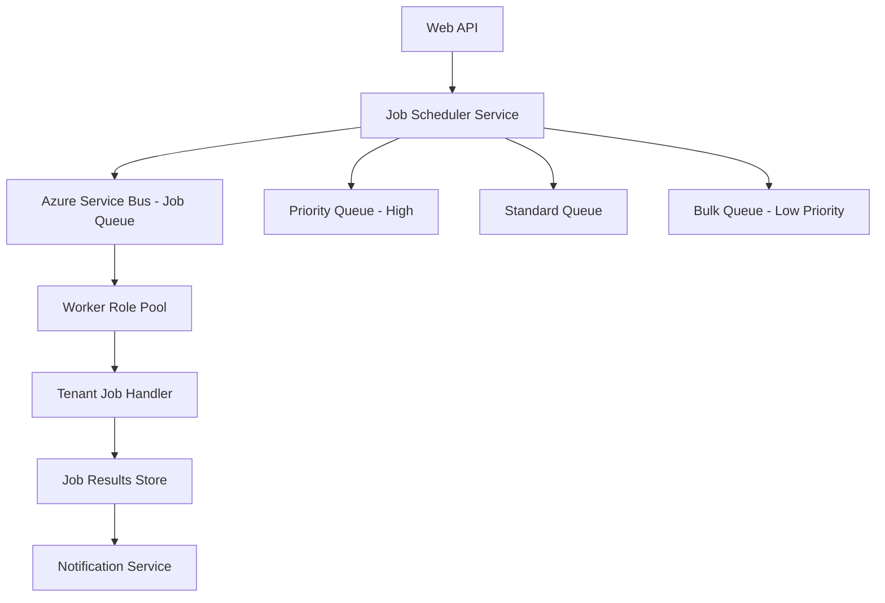

# How to Build a Multi-Tenant Background Job Processor with Azure Service Bus and Worker Roles

Author: [nawazdhandala](https://www.github.com/nawazdhandala)

Tags: Azure Service Bus, Worker Roles, Multi-Tenant, SaaS, Background Jobs, Message Queue, Cloud Architecture

Description: Build a multi-tenant background job processor using Azure Service Bus queues with tenant isolation, priority handling, and fair scheduling.

---

Every SaaS application eventually needs background processing. Report generation, data imports, email campaigns, scheduled billing runs - these are all tasks that should not block the user's HTTP request. In a multi-tenant environment, background jobs introduce a unique challenge: how do you prevent one tenant's heavy workload from starving other tenants of processing time?

Azure Service Bus provides the messaging backbone, and Azure Worker Roles (or container-based workers) provide the compute. In this guide, I will show you how to build a multi-tenant job processor that handles tenant isolation, fair scheduling, and priority queues.

## Architecture Overview



The architecture uses multiple queues for different priority levels. Each message contains the tenant ID and job payload, and workers pull messages from queues in priority order while ensuring fair distribution across tenants.

## Setting Up Service Bus Queues

Create the Service Bus namespace and queues with appropriate settings:

```bash
# Create the Service Bus namespace
az servicebus namespace create \
  --name sb-saas-jobs \
  --resource-group rg-saas-app \
  --location eastus \
  --sku Standard

# Create the high-priority queue with short lock duration
az servicebus queue create \
  --name jobs-high-priority \
  --namespace-name sb-saas-jobs \
  --resource-group rg-saas-app \
  --lock-duration PT1M \
  --max-delivery-count 5 \
  --dead-lettering-on-message-expiration true

# Create the standard queue
az servicebus queue create \
  --name jobs-standard \
  --namespace-name sb-saas-jobs \
  --resource-group rg-saas-app \
  --lock-duration PT5M \
  --max-delivery-count 3 \
  --dead-lettering-on-message-expiration true

# Create the bulk/low-priority queue with longer timeouts
az servicebus queue create \
  --name jobs-bulk \
  --namespace-name sb-saas-jobs \
  --resource-group rg-saas-app \
  --lock-duration PT10M \
  --max-delivery-count 3 \
  --dead-lettering-on-message-expiration true
```

The lock durations differ because high-priority jobs should be quick (if they fail, release them fast), while bulk jobs might take longer to process.

## Defining the Job Message Contract

Create a clear contract for job messages that includes tenant context:

```csharp
// Job message that gets sent to Service Bus
public class JobMessage
{
    // Unique identifier for this job instance
    public string JobId { get; set; } = Guid.NewGuid().ToString();

    // The tenant that owns this job
    public string TenantId { get; set; }

    // Type of job to execute (e.g., "generate-report", "import-data")
    public string JobType { get; set; }

    // Priority level determines which queue the job goes to
    public JobPriority Priority { get; set; } = JobPriority.Standard;

    // Serialized job parameters
    public string Payload { get; set; }

    // When the job was submitted
    public DateTime SubmittedAt { get; set; } = DateTime.UtcNow;

    // Optional: schedule the job for later execution
    public DateTime? ScheduledFor { get; set; }

    // Maximum time the job is allowed to run before being cancelled
    public TimeSpan MaxExecutionTime { get; set; } = TimeSpan.FromMinutes(30);
}

public enum JobPriority
{
    High,
    Standard,
    Bulk
}
```

## Submitting Jobs to Service Bus

The job scheduler service accepts job requests and routes them to the appropriate queue:

```csharp
// Service that submits jobs to the appropriate Service Bus queue
public class JobSchedulerService
{
    private readonly ServiceBusClient _client;
    private readonly Dictionary<JobPriority, ServiceBusSender> _senders;
    private readonly IJobRepository _jobRepo;
    private readonly ILogger<JobSchedulerService> _logger;

    public JobSchedulerService(
        ServiceBusClient client,
        IJobRepository jobRepo,
        ILogger<JobSchedulerService> logger)
    {
        _client = client;
        _jobRepo = jobRepo;
        _logger = logger;

        // Create senders for each priority queue
        _senders = new Dictionary<JobPriority, ServiceBusSender>
        {
            [JobPriority.High] = client.CreateSender("jobs-high-priority"),
            [JobPriority.Standard] = client.CreateSender("jobs-standard"),
            [JobPriority.Bulk] = client.CreateSender("jobs-bulk")
        };
    }

    public async Task<string> SubmitJobAsync(JobMessage job)
    {
        // Store the job record in the database for tracking
        await _jobRepo.CreateAsync(new JobRecord
        {
            JobId = job.JobId,
            TenantId = job.TenantId,
            JobType = job.JobType,
            Status = "Queued",
            SubmittedAt = job.SubmittedAt
        });

        // Build the Service Bus message
        var message = new ServiceBusMessage(JsonSerializer.Serialize(job))
        {
            MessageId = job.JobId,
            SessionId = job.TenantId, // Group messages by tenant for ordered processing
            ContentType = "application/json",
            Subject = job.JobType
        };

        // Add tenant metadata as application properties
        message.ApplicationProperties["tenantId"] = job.TenantId;
        message.ApplicationProperties["jobType"] = job.JobType;

        // Schedule the message if it has a future execution time
        if (job.ScheduledFor.HasValue && job.ScheduledFor > DateTime.UtcNow)
        {
            message.ScheduledEnqueueTime = job.ScheduledFor.Value;
        }

        // Send to the appropriate priority queue
        var sender = _senders[job.Priority];
        await sender.SendMessageAsync(message);

        _logger.LogInformation(
            "Job {JobId} submitted to {Priority} queue for tenant {TenantId}",
            job.JobId, job.Priority, job.TenantId);

        return job.JobId;
    }
}
```

Notice the `SessionId` is set to the tenant ID. Service Bus sessions group messages by a key, which lets you process all jobs for a tenant in order if needed.

## Building the Worker Role

The worker processes jobs from all three queues, prioritizing high-priority messages:

```csharp
// Background worker that processes jobs from Service Bus queues
public class JobProcessorWorker : BackgroundService
{
    private readonly ServiceBusClient _client;
    private readonly IServiceProvider _serviceProvider;
    private readonly ILogger<JobProcessorWorker> _logger;
    private readonly ConcurrentDictionary<string, int> _activeTenantJobs;

    // Maximum concurrent jobs per tenant to ensure fairness
    private const int MaxConcurrentJobsPerTenant = 3;
    private const int MaxTotalConcurrentJobs = 20;

    public JobProcessorWorker(
        ServiceBusClient client,
        IServiceProvider serviceProvider,
        ILogger<JobProcessorWorker> logger)
    {
        _client = client;
        _serviceProvider = serviceProvider;
        _logger = logger;
        _activeTenantJobs = new ConcurrentDictionary<string, int>();
    }

    protected override async Task ExecuteAsync(CancellationToken stoppingToken)
    {
        // Create processors for each priority queue
        var processors = new[]
        {
            CreateProcessor("jobs-high-priority", 8),   // More capacity for high priority
            CreateProcessor("jobs-standard", 8),
            CreateProcessor("jobs-bulk", 4)              // Less capacity for bulk
        };

        // Start all processors
        foreach (var processor in processors)
        {
            processor.ProcessMessageAsync += HandleMessageAsync;
            processor.ProcessErrorAsync += HandleErrorAsync;
            await processor.StartProcessingAsync(stoppingToken);
        }

        // Keep running until cancellation is requested
        await Task.Delay(Timeout.Infinite, stoppingToken);

        // Graceful shutdown
        foreach (var processor in processors)
        {
            await processor.StopProcessingAsync();
        }
    }

    private ServiceBusProcessor CreateProcessor(string queueName, int maxConcurrent)
    {
        return _client.CreateProcessor(queueName, new ServiceBusProcessorOptions
        {
            MaxConcurrentCalls = maxConcurrent,
            AutoCompleteMessages = false,
            PrefetchCount = maxConcurrent * 2
        });
    }

    private async Task HandleMessageAsync(ProcessMessageEventArgs args)
    {
        var job = JsonSerializer.Deserialize<JobMessage>(args.Message.Body.ToString());
        var tenantId = job.TenantId;

        // Check per-tenant concurrency limit
        var currentCount = _activeTenantJobs.GetOrAdd(tenantId, 0);
        if (currentCount >= MaxConcurrentJobsPerTenant)
        {
            // Release the message back to the queue for later processing
            await args.AbandonMessageAsync(args.Message);
            _logger.LogInformation(
                "Tenant {TenantId} at concurrency limit, deferring job {JobId}",
                tenantId, job.JobId);
            return;
        }

        _activeTenantJobs.AddOrUpdate(tenantId, 1, (_, count) => count + 1);

        try
        {
            // Resolve the appropriate job handler from DI
            using var scope = _serviceProvider.CreateScope();
            var handler = ResolveHandler(scope, job.JobType);

            // Execute the job with a timeout
            using var cts = CancellationTokenSource
                .CreateLinkedTokenSource(args.CancellationToken);
            cts.CancelAfter(job.MaxExecutionTime);

            await handler.ExecuteAsync(job, cts.Token);

            // Mark the message as completed
            await args.CompleteMessageAsync(args.Message);

            _logger.LogInformation(
                "Job {JobId} completed for tenant {TenantId}",
                job.JobId, tenantId);
        }
        catch (OperationCanceledException)
        {
            _logger.LogWarning(
                "Job {JobId} timed out for tenant {TenantId}",
                job.JobId, tenantId);
            await args.AbandonMessageAsync(args.Message);
        }
        catch (Exception ex)
        {
            _logger.LogError(ex,
                "Job {JobId} failed for tenant {TenantId}",
                job.JobId, tenantId);
            await args.AbandonMessageAsync(args.Message);
        }
        finally
        {
            _activeTenantJobs.AddOrUpdate(tenantId, 0, (_, count) => Math.Max(0, count - 1));
        }
    }

    private IJobHandler ResolveHandler(IServiceScope scope, string jobType)
    {
        // Map job types to their handler implementations
        return jobType switch
        {
            "generate-report" => scope.ServiceProvider
                .GetRequiredService<ReportGenerationHandler>(),
            "import-data" => scope.ServiceProvider
                .GetRequiredService<DataImportHandler>(),
            "send-emails" => scope.ServiceProvider
                .GetRequiredService<EmailCampaignHandler>(),
            _ => throw new InvalidOperationException($"Unknown job type: {jobType}")
        };
    }

    private Task HandleErrorAsync(ProcessErrorEventArgs args)
    {
        _logger.LogError(args.Exception,
            "Service Bus error on {Source}: {Message}",
            args.ErrorSource, args.Exception.Message);
        return Task.CompletedTask;
    }
}
```

The key fairness mechanism here is the `MaxConcurrentJobsPerTenant` limit. Even if Tenant A has 1,000 jobs queued, they can only run 3 at a time. This ensures Tenant B's jobs get processed promptly.

## Implementing a Job Handler

Each job type has its own handler. Here is an example for report generation:

```csharp
// Handler for report generation jobs
public class ReportGenerationHandler : IJobHandler
{
    private readonly IReportService _reportService;
    private readonly IJobRepository _jobRepo;
    private readonly INotificationService _notifications;

    public ReportGenerationHandler(
        IReportService reportService,
        IJobRepository jobRepo,
        INotificationService notifications)
    {
        _reportService = reportService;
        _jobRepo = jobRepo;
        _notifications = notifications;
    }

    public async Task ExecuteAsync(JobMessage job, CancellationToken cancellationToken)
    {
        // Update job status to Processing
        await _jobRepo.UpdateStatusAsync(job.JobId, "Processing");

        // Deserialize the job-specific parameters
        var parameters = JsonSerializer.Deserialize<ReportParameters>(job.Payload);

        // Generate the report
        var reportUrl = await _reportService.GenerateAsync(
            job.TenantId, parameters, cancellationToken);

        // Update job status with the result
        await _jobRepo.UpdateStatusAsync(job.JobId, "Completed", reportUrl);

        // Notify the tenant that their report is ready
        await _notifications.SendAsync(job.TenantId,
            $"Your report '{parameters.ReportName}' is ready for download.");
    }
}
```

## Dead Letter Queue Handling

Jobs that fail repeatedly end up in the dead letter queue. You need a process to handle these:

```csharp
// Background service that processes dead letter messages
public class DeadLetterProcessor : BackgroundService
{
    private readonly ServiceBusClient _client;
    private readonly IJobRepository _jobRepo;
    private readonly ILogger<DeadLetterProcessor> _logger;

    protected override async Task ExecuteAsync(CancellationToken stoppingToken)
    {
        var queues = new[] { "jobs-high-priority", "jobs-standard", "jobs-bulk" };

        foreach (var queue in queues)
        {
            // Create a receiver for the dead letter sub-queue
            var receiver = _client.CreateReceiver(queue,
                new ServiceBusReceiverOptions
                {
                    SubQueue = SubQueue.DeadLetter
                });

            _ = ProcessDeadLettersAsync(receiver, stoppingToken);
        }

        await Task.Delay(Timeout.Infinite, stoppingToken);
    }

    private async Task ProcessDeadLettersAsync(
        ServiceBusReceiver receiver, CancellationToken ct)
    {
        while (!ct.IsCancellationRequested)
        {
            var message = await receiver.ReceiveMessageAsync(
                TimeSpan.FromSeconds(30), ct);

            if (message == null) continue;

            var job = JsonSerializer.Deserialize<JobMessage>(
                message.Body.ToString());

            // Mark the job as permanently failed
            await _jobRepo.UpdateStatusAsync(job.JobId, "Failed",
                message.DeadLetterReason);

            _logger.LogError(
                "Job {JobId} permanently failed for tenant {TenantId}: {Reason}",
                job.JobId, job.TenantId, message.DeadLetterReason);

            await receiver.CompleteMessageAsync(message, ct);
        }
    }
}
```

## Job Status API

Tenants need to check the status of their jobs. Expose a simple API:

```csharp
// API endpoint for checking job status
[HttpGet("api/jobs/{jobId}")]
public async Task<IActionResult> GetJobStatus(string jobId)
{
    var tenantId = HttpContext.Items["TenantId"] as string;
    var job = await _jobRepo.GetByIdAsync(jobId);

    // Verify the job belongs to the requesting tenant
    if (job == null || job.TenantId != tenantId)
        return NotFound();

    return Ok(new
    {
        job.JobId,
        job.JobType,
        job.Status,
        job.SubmittedAt,
        job.CompletedAt,
        job.ResultUrl,
        job.ErrorMessage
    });
}
```

## Wrapping Up

Building a multi-tenant background job processor requires careful attention to fairness and isolation. Azure Service Bus gives you the reliable messaging layer with built-in features like dead letter queues, scheduled messages, and sessions. By combining multiple priority queues with per-tenant concurrency limits, you ensure that no single tenant can monopolize your processing resources. The pattern of separating job submission, processing, and status tracking into distinct components keeps the system maintainable and easy to scale independently.
