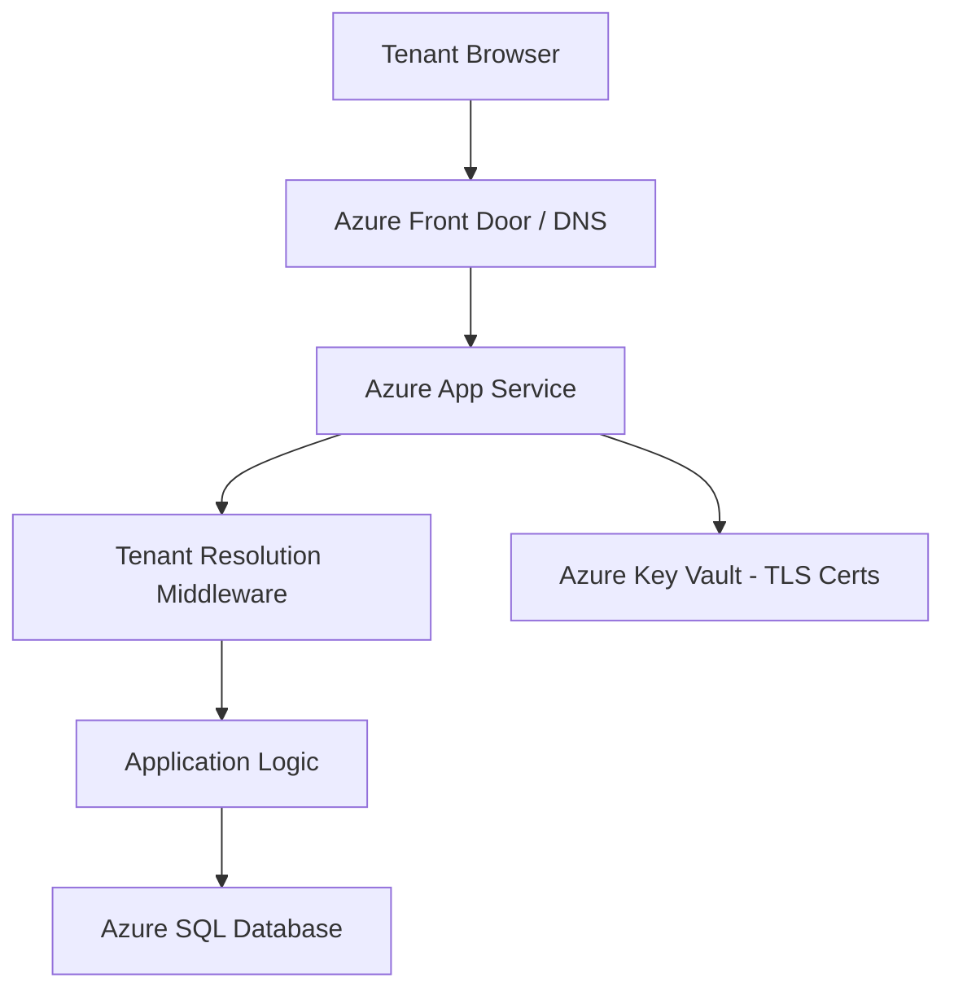
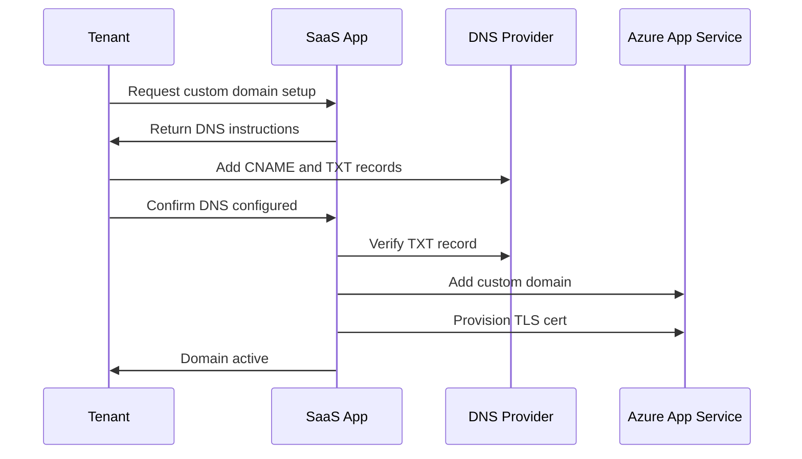

# How to Build a Multi-Tenant SaaS Application with Azure App Service and Tenant-Specific Custom Domains

Author: [nawazdhandala](https://www.github.com/nawazdhandala)

Tags: Azure App Service, Multi-Tenant, SaaS, Custom Domains, Cloud Architecture, TLS, DNS

Description: A practical guide to building a multi-tenant SaaS application on Azure App Service with tenant-specific custom domains and automated TLS certificates.

---

One of the features that separates a basic SaaS product from a polished one is custom domain support. Your tenants do not want to access their instance at `tenant-123.yoursaas.com`. They want `app.theircompany.com`. It feels more professional, it builds trust, and it keeps your branding out of their URL bar.

Azure App Service supports custom domains natively, and with a bit of automation, you can let tenants bring their own domains without any manual intervention. In this guide, I will walk through the architecture and implementation of a multi-tenant SaaS application on Azure App Service that supports tenant-specific custom domains with automated TLS certificate provisioning.

## Architecture Overview

The high-level architecture looks like this:



Each tenant gets a custom domain that points to your Azure App Service. The application uses middleware to resolve which tenant is making the request based on the incoming hostname. All tenants share the same App Service instance (or scale set), keeping costs manageable.

## Setting Up the Base App Service

Start by creating an App Service plan and web app. For multi-tenant SaaS, you want at least a Standard tier plan because custom domains with TLS require it:

```bash
# Create a resource group for the SaaS application
az group create --name rg-saas-app --location eastus

# Create an App Service plan with Standard S1 tier for custom domain support
az appservice plan create \
  --name plan-saas-app \
  --resource-group rg-saas-app \
  --sku S1 \
  --is-linux

# Create the web app
az webapp create \
  --name my-saas-app \
  --resource-group rg-saas-app \
  --plan plan-saas-app \
  --runtime "DOTNET|8.0"
```

## Tenant Resolution Middleware

The core of a multi-tenant application is the tenant resolution layer. When a request comes in, you need to figure out which tenant it belongs to. With custom domains, the easiest approach is to look at the `Host` header:

```csharp
// Middleware that resolves the tenant based on the incoming request hostname
public class TenantResolutionMiddleware
{
    private readonly RequestDelegate _next;

    public TenantResolutionMiddleware(RequestDelegate next)
    {
        _next = next;
    }

    public async Task InvokeAsync(HttpContext context, ITenantRepository tenantRepo)
    {
        // Get the hostname from the request
        var hostname = context.Request.Host.Host.ToLowerInvariant();

        // Look up the tenant by their custom domain
        var tenant = await tenantRepo.GetByDomainAsync(hostname);

        if (tenant == null)
        {
            // Fall back to subdomain-based resolution
            // e.g., acme.yoursaas.com -> tenant = "acme"
            var subdomain = hostname.Split('.')[0];
            tenant = await tenantRepo.GetBySubdomainAsync(subdomain);
        }

        if (tenant == null)
        {
            context.Response.StatusCode = 404;
            await context.Response.WriteAsync("Tenant not found for this domain.");
            return;
        }

        // Store tenant info in the request context for downstream use
        context.Items["TenantId"] = tenant.Id;
        context.Items["Tenant"] = tenant;

        await _next(context);
    }
}
```

This middleware checks custom domains first, then falls back to subdomain-based resolution. This means tenants can use either approach, and you can offer custom domains as a premium feature.

## Storing Tenant Domain Mappings

You need a table to store the mapping between domains and tenants:

```sql
-- Table to store tenant information and their domain mappings
CREATE TABLE dbo.Tenants (
    Id UNIQUEIDENTIFIER PRIMARY KEY DEFAULT NEWID(),
    Name NVARCHAR(256) NOT NULL,
    Subdomain NVARCHAR(63) NOT NULL UNIQUE,
    CustomDomain NVARCHAR(256) NULL,
    DomainVerified BIT NOT NULL DEFAULT 0,
    TlsCertificateThumbprint NVARCHAR(128) NULL,
    CreatedAt DATETIME2 NOT NULL DEFAULT GETUTCDATE(),
    Plan NVARCHAR(50) NOT NULL DEFAULT 'free'
);

-- Index for fast domain lookups
CREATE NONCLUSTERED INDEX IX_Tenants_CustomDomain
ON dbo.Tenants (CustomDomain) WHERE CustomDomain IS NOT NULL;

CREATE NONCLUSTERED INDEX IX_Tenants_Subdomain
ON dbo.Tenants (Subdomain);
```

## Adding Custom Domains to App Service

When a tenant configures a custom domain, your application needs to add it to the App Service. This requires two things: a DNS record pointing to your app, and the domain added to the App Service configuration.

Here is the API endpoint that handles the domain setup:

```csharp
// API controller for managing tenant custom domains
[ApiController]
[Route("api/tenants/{tenantId}/domain")]
public class TenantDomainController : ControllerBase
{
    private readonly ITenantRepository _tenantRepo;
    private readonly IAzureAppServiceManager _appServiceManager;
    private readonly ICertificateManager _certManager;

    public TenantDomainController(
        ITenantRepository tenantRepo,
        IAzureAppServiceManager appServiceManager,
        ICertificateManager certManager)
    {
        _tenantRepo = tenantRepo;
        _appServiceManager = appServiceManager;
        _certManager = certManager;
    }

    [HttpPost]
    public async Task<IActionResult> SetCustomDomain(
        Guid tenantId,
        [FromBody] SetDomainRequest request)
    {
        var tenant = await _tenantRepo.GetByIdAsync(tenantId);
        if (tenant == null) return NotFound();

        // Step 1: Verify DNS ownership via TXT record
        var verified = await VerifyDnsOwnership(request.Domain, tenantId);
        if (!verified)
        {
            return BadRequest(new {
                error = "DNS verification failed",
                instruction = $"Add a TXT record: _verify.{request.Domain} -> {tenantId}"
            });
        }

        // Step 2: Add the custom domain to App Service
        await _appServiceManager.AddCustomDomainAsync(request.Domain);

        // Step 3: Provision a TLS certificate
        var thumbprint = await _certManager.ProvisionCertificateAsync(request.Domain);

        // Step 4: Bind the certificate to the domain
        await _appServiceManager.BindCertificateAsync(request.Domain, thumbprint);

        // Step 5: Update tenant record
        tenant.CustomDomain = request.Domain;
        tenant.DomainVerified = true;
        tenant.TlsCertificateThumbprint = thumbprint;
        await _tenantRepo.UpdateAsync(tenant);

        return Ok(new { message = "Custom domain configured successfully" });
    }

    private async Task<bool> VerifyDnsOwnership(string domain, Guid tenantId)
    {
        // Check for a TXT record that proves domain ownership
        var resolver = new LookupClient();
        var result = await resolver.QueryAsync($"_verify.{domain}", QueryType.TXT);

        return result.Answers
            .OfType<TxtRecord>()
            .Any(txt => txt.Text.Contains(tenantId.ToString()));
    }
}
```

## Automating TLS Certificate Provisioning

Azure App Service supports free managed certificates for custom domains. You can automate this using the Azure Management SDK:

```csharp
// Service that manages TLS certificates for custom domains
public class AzureCertificateManager : ICertificateManager
{
    private readonly ArmClient _armClient;
    private readonly string _resourceGroupName;
    private readonly string _appServiceName;

    public AzureCertificateManager(ArmClient armClient, IConfiguration config)
    {
        _armClient = armClient;
        _resourceGroupName = config["Azure:ResourceGroup"];
        _appServiceName = config["Azure:AppServiceName"];
    }

    public async Task<string> ProvisionCertificateAsync(string domain)
    {
        var subscription = await _armClient.GetDefaultSubscriptionAsync();
        var resourceGroup = await subscription
            .GetResourceGroupAsync(_resourceGroupName);

        // Create a managed certificate for the domain
        var certCollection = resourceGroup.Value.GetAppCertificates();

        var certData = new AppCertificateData(new AzureLocation("eastus"))
        {
            CanonicalName = domain,
            HostNames = { domain },
            ServerFarmId = new ResourceIdentifier(
                $"/subscriptions/{subscription.Id}/resourceGroups/{_resourceGroupName}" +
                $"/providers/Microsoft.Web/serverfarms/plan-saas-app"
            )
        };

        var result = await certCollection
            .CreateOrUpdateAsync(WaitUntil.Completed, $"cert-{domain}", certData);

        return result.Value.Data.Thumbprint;
    }
}
```

## DNS Configuration Instructions for Tenants

When a tenant wants to use a custom domain, they need to configure two DNS records. Your application should display clear instructions:

1. A CNAME record pointing their domain to your App Service default hostname
2. A TXT record for domain ownership verification

Here is what the instruction flow looks like:



## Handling Scale with Azure Front Door

If you have hundreds or thousands of tenants with custom domains, Azure App Service alone has a limit on custom domains per app (typically 500 for Standard tier). For larger scale, put Azure Front Door in front of your App Service:

```bash
# Create an Azure Front Door profile for handling many custom domains
az afd profile create \
  --profile-name fd-saas-app \
  --resource-group rg-saas-app \
  --sku Premium_AzureFrontDoor

# Add an endpoint
az afd endpoint create \
  --endpoint-name saas-endpoint \
  --profile-name fd-saas-app \
  --resource-group rg-saas-app

# Add a custom domain (repeat for each tenant)
az afd custom-domain create \
  --custom-domain-name tenant-acme \
  --profile-name fd-saas-app \
  --resource-group rg-saas-app \
  --host-name app.acmecorp.com \
  --certificate-type ManagedCertificate
```

Azure Front Door supports thousands of custom domains, handles TLS termination, provides a CDN layer, and gives you WAF capabilities. It is more expensive than App Service alone, but for a SaaS product at scale, the investment pays off.

## Wildcard Subdomains as the Default

For tenants who do not need custom domains, wildcard subdomains are the simplest approach. Configure a wildcard DNS record (`*.yoursaas.com`) and a wildcard TLS certificate:

```bash
# Add a wildcard custom domain to App Service
az webapp config hostname add \
  --webapp-name my-saas-app \
  --resource-group rg-saas-app \
  --hostname "*.yoursaas.com"
```

This way, when a new tenant signs up and chooses the subdomain "acme", they immediately get `acme.yoursaas.com` working without any DNS provisioning.

## Monitoring and Health Checks

With multiple custom domains, you need to monitor that they all resolve correctly and that TLS certificates are valid. Set up a periodic health check:

```csharp
// Background service that checks custom domain health
public class DomainHealthCheckService : BackgroundService
{
    private readonly ITenantRepository _tenantRepo;
    private readonly ILogger<DomainHealthCheckService> _logger;
    private readonly HttpClient _httpClient;

    public DomainHealthCheckService(
        ITenantRepository tenantRepo,
        ILogger<DomainHealthCheckService> logger,
        IHttpClientFactory httpClientFactory)
    {
        _tenantRepo = tenantRepo;
        _logger = logger;
        _httpClient = httpClientFactory.CreateClient("HealthCheck");
    }

    protected override async Task ExecuteAsync(CancellationToken stoppingToken)
    {
        while (!stoppingToken.IsCancellationRequested)
        {
            var tenants = await _tenantRepo.GetTenantsWithCustomDomainsAsync();

            foreach (var tenant in tenants)
            {
                try
                {
                    // Check that the domain resolves and returns 200
                    var response = await _httpClient.GetAsync(
                        $"https://{tenant.CustomDomain}/health",
                        stoppingToken);

                    if (!response.IsSuccessStatusCode)
                    {
                        _logger.LogWarning(
                            "Domain health check failed for {Domain} (Tenant: {TenantId})",
                            tenant.CustomDomain, tenant.Id);
                    }
                }
                catch (Exception ex)
                {
                    _logger.LogError(ex,
                        "Domain unreachable: {Domain} (Tenant: {TenantId})",
                        tenant.CustomDomain, tenant.Id);
                }
            }

            // Run health checks every hour
            await Task.Delay(TimeSpan.FromHours(1), stoppingToken);
        }
    }
}
```

## Wrapping Up

Building a multi-tenant SaaS application with custom domain support on Azure App Service is very achievable once you break it into the right pieces: tenant resolution middleware, domain verification, automated TLS provisioning, and health monitoring. The combination of App Service for hosting, wildcard subdomains for the default experience, and custom domains for premium tenants gives you a flexible architecture that scales from your first tenant to thousands. For very high scale, Azure Front Door steps in to handle the domain management and TLS termination at the edge, keeping your App Service focused on running application code.
