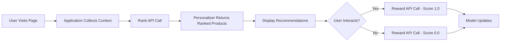

# How to Build a Product Recommendation Engine with Azure Personalizer for Retail Applications

Author: [nawazdhandala](https://www.github.com/nawazdhandala)

Tags: Azure Personalizer, Recommendation Engine, Retail, Machine Learning, Personalization, E-Commerce, Azure Cognitive Services

Description: Build a product recommendation engine using Azure Personalizer for real-time personalized shopping experiences in retail applications.

---

Product recommendations drive a significant chunk of e-commerce revenue. When customers see products that actually match their interests, they buy more. The challenge is that building a recommendation engine from scratch requires serious machine learning expertise and infrastructure. Azure Personalizer simplifies this by providing a reinforcement learning service that learns from user behavior in real time.

Unlike traditional collaborative filtering that needs large datasets before it becomes useful, Personalizer starts working immediately. It uses contextual bandits to learn from each interaction, getting better with every click and purchase. In this guide, I will show you how to integrate Personalizer into a retail application.

## How Azure Personalizer Works

Personalizer uses reinforcement learning, which is different from typical recommendation systems. Instead of training a model on historical data and deploying it, Personalizer learns continuously. Here is the flow:

1. Your application sends a Rank request with the current context (who the user is, what page they are on, time of day) and a list of candidate products.
2. Personalizer returns the ranked list, with the best predicted match at the top.
3. Your application shows the recommendations and observes what happens.
4. When the user interacts (clicks, adds to cart, buys), you send a Reward signal back to Personalizer.
5. Personalizer uses the reward to update its model.



The beauty of this approach is that the model adapts to changing preferences and seasonal trends automatically. You do not need to retrain and redeploy a model every time customer behavior shifts.

## Step 1 - Create the Personalizer Resource

```bash
# Create a Personalizer resource
az cognitiveservices account create \
  --name retail-personalizer \
  --resource-group retail-rg \
  --kind Personalizer \
  --sku S0 \
  --location eastus \
  --yes

# Get the endpoint and key
az cognitiveservices account show \
  --name retail-personalizer \
  --resource-group retail-rg \
  --query "properties.endpoint" -o tsv

az cognitiveservices account keys list \
  --name retail-personalizer \
  --resource-group retail-rg \
  --query "key1" -o tsv
```

After creation, configure the Personalizer settings in the Azure portal:
- Set the reward wait time to 15 minutes (how long Personalizer waits for a reward before recording zero)
- Set the model update frequency to 5 minutes
- Set the exploration percentage to 20% (this means 20% of requests will explore new options rather than exploit the best known option)

The exploration rate is important. Too low and the model never discovers better options. Too high and too many users see suboptimal recommendations. Start at 20% and reduce it as the model stabilizes.

## Step 2 - Define Context Features

The quality of Personalizer's recommendations depends heavily on the context features you provide. Think about what information helps predict whether a user will be interested in a product.

Good context features for retail include:

- User demographics (age range, location)
- Current session behavior (categories browsed, items viewed)
- Time features (time of day, day of week, season)
- Device type (mobile, desktop)
- Referral source (search, social media, email campaign)

Here is how to structure context features in your application.

```python
def build_user_context(user: dict, session: dict) -> list:
    """Build context features for a Personalizer Rank request."""
    context = [
        {
            # User profile features
            "userProfile": {
                "ageGroup": user.get("age_group", "unknown"),
                "loyaltyTier": user.get("loyalty_tier", "none"),
                "preferredCategories": user.get("preferred_categories", []),
                "avgOrderValue": categorize_spend(user.get("avg_order_value", 0)),
                "purchaseFrequency": user.get("purchase_frequency", "occasional")
            }
        },
        {
            # Current session features
            "session": {
                "deviceType": session.get("device_type", "desktop"),
                "referralSource": session.get("referral_source", "direct"),
                "categoriesBrowsed": session.get("categories_browsed", []),
                "itemsViewed": len(session.get("items_viewed", [])),
                "cartValue": categorize_spend(session.get("cart_value", 0))
            }
        },
        {
            # Time features
            "timeContext": {
                "hourOfDay": get_time_bucket(),
                "dayOfWeek": get_day_category(),
                "season": get_current_season(),
                "isHolidaySeason": is_holiday_season()
            }
        }
    ]
    return context

def categorize_spend(amount: float) -> str:
    """Bucket spending amounts into categories for better generalization."""
    if amount < 25:
        return "low"
    elif amount < 75:
        return "medium"
    elif amount < 200:
        return "high"
    return "premium"
```

Categorizing numeric values into buckets helps Personalizer generalize better. It does not need to learn that $47.23 and $48.10 are functionally the same - just tell it both are "medium" spend.

## Step 3 - Define Product Actions

Actions are the candidate products you want Personalizer to rank. Each action has features that describe the product.

```python
def build_product_actions(products: list) -> list:
    """Convert product catalog items to Personalizer actions with features."""
    actions = []
    for product in products:
        action = {
            "id": product["id"],
            "features": [
                {
                    "productInfo": {
                        "category": product["category"],
                        "brand": product["brand"],
                        "priceRange": categorize_price(product["price"]),
                        "rating": round(product["rating"], 1),
                        "isOnSale": product.get("sale_price") is not None,
                        "isNewArrival": product.get("is_new", False),
                        "popularity": product.get("popularity_score", "medium")
                    }
                }
            ]
        }
        actions.append(action)
    return actions

def categorize_price(price: float) -> str:
    """Bucket prices for Personalizer features."""
    if price < 20:
        return "budget"
    elif price < 50:
        return "affordable"
    elif price < 100:
        return "mid-range"
    elif price < 250:
        return "premium"
    return "luxury"
```

## Step 4 - Implement the Rank and Reward Loop

This is the core integration. When a user visits a page where recommendations are shown, call the Rank API. When the user interacts with a recommendation, call the Reward API.

```python
from azure.cognitiveservices.personalizer import PersonalizerClient
from azure.cognitiveservices.personalizer.models import (
    RankRequest, RankableAction, RewardRequest
)
from msrest.authentication import CognitiveServicesCredentials
import uuid

# Initialize the Personalizer client
personalizer_client = PersonalizerClient(
    endpoint="https://retail-personalizer.cognitiveservices.azure.com/",
    credentials=CognitiveServicesCredentials(os.environ["PERSONALIZER_KEY"])
)

def get_recommendations(user: dict, session: dict, candidate_products: list) -> dict:
    """Get personalized product recommendations for a user."""
    # Build context and actions
    context_features = build_user_context(user, session)
    actions = build_product_actions(candidate_products)

    # Generate a unique event ID for tracking this recommendation
    event_id = str(uuid.uuid4())

    # Call the Rank API
    rank_request = RankRequest(
        context_features=context_features,
        actions=[RankableAction(id=a["id"], features=a["features"]) for a in actions],
        event_id=event_id
    )

    rank_response = personalizer_client.rank(rank_request)

    # Return the ranked product IDs and the event ID for reward tracking
    return {
        "eventId": event_id,
        "topRecommendation": rank_response.reward_action_id,
        "ranking": [
            {"productId": r.id, "probability": r.probability}
            for r in rank_response.ranking
        ]
    }

def send_reward(event_id: str, reward_value: float):
    """Send a reward signal when the user interacts with a recommendation."""
    # reward_value: 1.0 for purchase, 0.5 for add-to-cart, 0.1 for click, 0.0 for ignore
    reward_request = RewardRequest(value=reward_value)
    personalizer_client.events.reward(event_id=event_id, value=reward_request)
```

The reward values should reflect the business value of different actions. A purchase is worth more than a click. Here is a reward scheme that works well for most retail scenarios:

- Purchase: 1.0
- Add to cart: 0.5
- Product detail view (click): 0.2
- No interaction within reward window: 0.0

## Step 5 - Integrate with Your Storefront

Here is how the recommendation component fits into a typical product page.

```python
from flask import Flask, request, jsonify, session

app = Flask(__name__)

@app.route("/api/recommendations", methods=["GET"])
def recommendations_endpoint():
    """API endpoint that powers the recommendation widget on product pages."""
    user_id = session.get("user_id")
    current_category = request.args.get("category")
    page_type = request.args.get("page_type", "product")

    # Load user profile from your database
    user = get_user_profile(user_id)

    # Get candidate products (pre-filtered by business rules)
    candidates = get_candidate_products(
        category=current_category,
        exclude_ids=session.get("items_viewed", []),
        limit=25  # Send 25 candidates, Personalizer ranks them
    )

    # Get session context
    session_context = {
        "device_type": request.headers.get("X-Device-Type", "desktop"),
        "referral_source": request.args.get("ref", "direct"),
        "categories_browsed": session.get("categories_browsed", []),
        "items_viewed": session.get("items_viewed", []),
        "cart_value": get_cart_value(user_id)
    }

    # Get personalized recommendations
    result = get_recommendations(user, session_context, candidates)

    # Store event ID in session for reward tracking
    session.setdefault("recommendation_events", {})[result["eventId"]] = {
        "timestamp": datetime.utcnow().isoformat(),
        "products": [r["productId"] for r in result["ranking"][:5]]
    }

    # Return top 5 recommendations
    top_products = get_product_details([r["productId"] for r in result["ranking"][:5]])

    return jsonify({
        "recommendations": top_products,
        "eventId": result["eventId"]
    })

@app.route("/api/recommendations/reward", methods=["POST"])
def reward_endpoint():
    """Track user interaction with a recommendation."""
    data = request.get_json()
    event_id = data["eventId"]
    action = data["action"]  # "click", "add_to_cart", "purchase"

    # Map action to reward value
    reward_map = {
        "click": 0.2,
        "add_to_cart": 0.5,
        "purchase": 1.0
    }

    reward_value = reward_map.get(action, 0.0)
    send_reward(event_id, reward_value)

    return jsonify({"status": "ok"})
```

## Step 6 - Monitor and Optimize

Personalizer provides built-in evaluation tools. Run offline evaluations to compare Personalizer's performance against baseline policies like "show most popular items" or "show random items."

In the Azure portal, go to your Personalizer resource and check the Evaluations tab. Key metrics to watch:

- Average reward: Should increase over time as the model learns
- Exploration vs exploitation ratio: Make sure both are working
- Feature importance: Shows which context features matter most

If the average reward plateaus, try adding new context features. If it drops, check whether your product catalog or user behavior has changed significantly.

## Wrapping Up

Azure Personalizer takes the heavy lifting out of building a recommendation engine. Instead of building and maintaining a collaborative filtering system with offline training pipelines, you get a service that learns from every interaction in real time. The key to good results is thoughtful feature engineering - give Personalizer rich context about your users and products. Start with a reasonable reward scheme, monitor the average reward trend, and iterate on your features. The model will continuously adapt to changing customer preferences and seasonal patterns without manual retraining.
