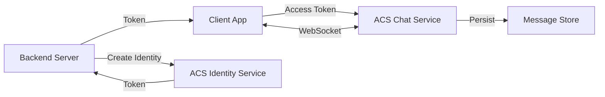

# How to Build a Real-Time Chat Application with Azure Communication Services Chat SDK

Author: [nawazdhandala](https://www.github.com/nawazdhandala)

Tags: Azure Communication Services, Chat SDK, Real-Time Messaging, WebSocket, Chat Application, JavaScript, Cloud Communication

Description: A step-by-step guide to building a real-time chat application using the Azure Communication Services Chat SDK with thread management and message handling.

---

Building a real-time chat system from scratch means dealing with WebSocket connections, message persistence, presence tracking, typing indicators, read receipts, and scaling to handle concurrent users. Azure Communication Services (ACS) Chat SDK handles all of this infrastructure so you can focus on the user experience. The SDK provides thread-based conversations, real-time message delivery, typing notifications, and read receipts out of the box.

This guide walks through building a functional chat application using the ACS Chat SDK for JavaScript, covering user identity creation, thread management, sending and receiving messages, and handling real-time events.

## Architecture Overview

The ACS Chat architecture has three layers:

1. **Identity and token management** (server-side) - Your backend creates ACS user identities and issues access tokens
2. **Chat operations** (server or client-side) - Creating threads, adding participants, sending messages
3. **Real-time events** (client-side) - Receiving messages, typing indicators, and read receipts via WebSocket



## Step 1: Set Up the Backend for Identity and Tokens

The backend is responsible for creating ACS user identities and issuing chat tokens. Never do this on the client side - the connection string must stay on the server.

```javascript
// server.js - Backend identity and token management
const express = require('express');
const { CommunicationIdentityClient } = require('@azure/communication-identity');

const app = express();
app.use(express.json());

const connectionString = 'endpoint=https://my-acs-resource.communication.azure.com/;accesskey=...';
const identityClient = new CommunicationIdentityClient(connectionString);

// Store user mappings (use a database in production)
const userMappings = new Map();

// Create a new ACS identity for a user and return a chat token
app.post('/api/token', async (req, res) => {
    const { userId } = req.body;

    let acsUser;

    if (userMappings.has(userId)) {
        // Existing user - refresh the token
        acsUser = userMappings.get(userId);
        const tokenResponse = await identityClient.getToken(
            { communicationUserId: acsUser.communicationUserId },
            ['chat']
        );
        return res.json({
            token: tokenResponse.token,
            expiresOn: tokenResponse.expiresOn,
            userId: acsUser.communicationUserId
        });
    }

    // New user - create an identity and token
    const userAndToken = await identityClient.createUserAndToken(['chat']);
    acsUser = userAndToken.user;

    // Save the mapping
    userMappings.set(userId, acsUser);

    res.json({
        token: userAndToken.token,
        expiresOn: userAndToken.expiresOn,
        userId: acsUser.communicationUserId
    });
});

app.listen(3001, () => {
    console.log('Token server running on port 3001');
});
```

Install the required packages.

```bash
npm install express @azure/communication-identity @azure/communication-chat
```

## Step 2: Initialize the Chat Client on the Frontend

The frontend uses the ACS user token to create a ChatClient instance.

```javascript
// chat-app.js - Frontend chat client initialization
const { ChatClient } = require('@azure/communication-chat');
const { AzureCommunicationTokenCredential } = require('@azure/communication-common');

const ACS_ENDPOINT = 'https://my-acs-resource.communication.azure.com';

let chatClient = null;
let chatThreadClient = null;
let currentUserId = null;

async function initializeChat(userName) {
    // Get a token from your backend
    const response = await fetch('/api/token', {
        method: 'POST',
        headers: { 'Content-Type': 'application/json' },
        body: JSON.stringify({ userId: userName })
    });

    const { token, userId } = await response.json();
    currentUserId = userId;

    // Create the chat client with the token
    const tokenCredential = new AzureCommunicationTokenCredential(token);
    chatClient = new ChatClient(ACS_ENDPOINT, tokenCredential);

    console.log('Chat client initialized');

    // Start listening for real-time events
    await chatClient.startRealtimeNotifications();
    setupEventListeners();

    return chatClient;
}
```

## Step 3: Create and Manage Chat Threads

A chat thread is a conversation. It can have two or more participants.

```javascript
async function createThread(topic, participantIds) {
    // Build the participant list
    // Each participant needs their ACS communication user ID
    const participants = participantIds.map(function (id) {
        return {
            id: { communicationUserId: id },
            displayName: id.split('-').pop() // Use last part of ID as display name
        };
    });

    // Create the thread
    const createThreadRequest = {
        topic: topic
    };

    const createThreadOptions = {
        participants: participants
    };

    const result = await chatClient.createChatThread(
        createThreadRequest,
        createThreadOptions
    );

    const threadId = result.chatThread.id;
    console.log(`Thread created: ${threadId} (topic: ${topic})`);

    // Get a ChatThreadClient for this thread
    chatThreadClient = chatClient.getChatThreadClient(threadId);

    return threadId;
}

async function listThreads() {
    // List all threads the current user is a participant in
    const threads = [];
    const threadIterator = chatClient.listChatThreads();

    for await (const thread of threadIterator) {
        threads.push({
            id: thread.id,
            topic: thread.topic,
            lastMessageReceivedOn: thread.lastMessageReceivedOn
        });
    }

    return threads;
}

async function joinThread(threadId) {
    // Get a ChatThreadClient for an existing thread
    chatThreadClient = chatClient.getChatThreadClient(threadId);
    return chatThreadClient;
}
```

## Step 4: Send and Receive Messages

```javascript
async function sendMessage(content, type = 'text') {
    if (!chatThreadClient) {
        throw new Error('Not connected to a chat thread');
    }

    // Send a message to the thread
    const sendMessageRequest = {
        content: content
    };

    const sendMessageOptions = {
        senderDisplayName: 'User',
        type: type  // 'text' or 'html'
    };

    const result = await chatThreadClient.sendMessage(
        sendMessageRequest,
        sendMessageOptions
    );

    console.log(`Message sent. ID: ${result.id}`);
    return result.id;
}

async function loadMessageHistory(maxMessages = 50) {
    if (!chatThreadClient) return [];

    const messages = [];
    const messageIterator = chatThreadClient.listMessages({
        maxPageSize: maxMessages
    });

    for await (const message of messageIterator) {
        // Filter to only chat messages (exclude system messages)
        if (message.type === 'text' || message.type === 'html') {
            messages.push({
                id: message.id,
                content: message.content.message,
                sender: message.senderDisplayName,
                senderId: message.sender?.communicationUserId,
                createdOn: message.createdOn,
                editedOn: message.editedOn
            });
        }
    }

    // Reverse to get chronological order
    return messages.reverse();
}
```

## Step 5: Handle Real-Time Events

The ChatClient uses WebSocket connections to deliver real-time events. Set up listeners for messages, typing indicators, and read receipts.

```javascript
function setupEventListeners() {
    // New message received
    chatClient.on('chatMessageReceived', function (event) {
        console.log('New message received:');
        console.log(`  From: ${event.senderDisplayName}`);
        console.log(`  Content: ${event.message}`);
        console.log(`  Thread: ${event.threadId}`);
        console.log(`  Time: ${event.createdOn}`);

        // Update the UI with the new message
        displayMessage({
            content: event.message,
            sender: event.senderDisplayName,
            senderId: event.sender?.communicationUserId,
            createdOn: event.createdOn
        });
    });

    // Message edited
    chatClient.on('chatMessageEdited', function (event) {
        console.log(`Message ${event.id} edited by ${event.senderDisplayName}`);
        console.log(`  New content: ${event.message}`);

        // Update the message in the UI
        updateMessage(event.id, event.message);
    });

    // Message deleted
    chatClient.on('chatMessageDeleted', function (event) {
        console.log(`Message ${event.id} deleted by ${event.senderDisplayName}`);
        removeMessage(event.id);
    });

    // Typing indicator received
    chatClient.on('typingIndicatorReceived', function (event) {
        if (event.sender?.communicationUserId !== currentUserId) {
            console.log(`${event.senderDisplayName} is typing...`);
            showTypingIndicator(event.senderDisplayName);
        }
    });

    // Read receipt received
    chatClient.on('readReceiptReceived', function (event) {
        console.log(`${event.sender?.communicationUserId} read up to message ${event.chatMessageId}`);
        updateReadReceipts(event.chatMessageId, event.sender);
    });

    // Participant added to thread
    chatClient.on('participantsAdded', function (event) {
        for (const participant of event.participantsAdded) {
            console.log(`${participant.displayName} joined the thread`);
        }
    });

    // Participant removed from thread
    chatClient.on('participantsRemoved', function (event) {
        for (const participant of event.participantsRemoved) {
            console.log(`${participant.displayName} left the thread`);
        }
    });
}
```

## Step 6: Send Typing Indicators and Read Receipts

```javascript
// Send a typing indicator to other participants
async function sendTypingIndicator() {
    if (chatThreadClient) {
        await chatThreadClient.sendTypingNotification();
    }
}

// Send a read receipt for a message
async function sendReadReceipt(messageId) {
    if (chatThreadClient) {
        await chatThreadClient.sendReadReceipt({ chatMessageId: messageId });
    }
}

// Throttle typing indicators - send at most once every 8 seconds
let lastTypingNotification = 0;
function onUserTyping() {
    const now = Date.now();
    if (now - lastTypingNotification > 8000) {
        sendTypingIndicator();
        lastTypingNotification = now;
    }
}
```

## Step 7: Edit and Delete Messages

```javascript
async function editMessage(messageId, newContent) {
    if (!chatThreadClient) return;

    await chatThreadClient.updateMessage(messageId, {
        content: newContent
    });

    console.log(`Message ${messageId} updated`);
}

async function deleteMessage(messageId) {
    if (!chatThreadClient) return;

    await chatThreadClient.deleteMessage(messageId);
    console.log(`Message ${messageId} deleted`);
}
```

## Step 8: Manage Participants

```javascript
async function addParticipant(communicationUserId, displayName) {
    if (!chatThreadClient) return;

    await chatThreadClient.addParticipants({
        participants: [{
            id: { communicationUserId: communicationUserId },
            displayName: displayName
        }]
    });

    console.log(`Added ${displayName} to the thread`);
}

async function removeParticipant(communicationUserId) {
    if (!chatThreadClient) return;

    await chatThreadClient.removeParticipant({
        communicationUserId: communicationUserId
    });

    console.log(`Removed participant ${communicationUserId}`);
}

async function listParticipants() {
    if (!chatThreadClient) return [];

    const participants = [];
    const iterator = chatThreadClient.listParticipants();

    for await (const participant of iterator) {
        participants.push({
            id: participant.id?.communicationUserId,
            displayName: participant.displayName
        });
    }

    return participants;
}
```

## Message Persistence

ACS stores all chat messages in the cloud. When a user opens a chat thread, you can load the full message history using `listMessages()`. Messages are retained for the lifetime of the thread. This means you do not need to build your own message storage - ACS is the source of truth.

However, if you need to integrate chat data with your own analytics or search system, you can set up Event Grid subscriptions on your ACS resource to get notified of every message and store copies in your own database.

## Token Refresh Strategy

ACS access tokens expire after 24 hours. Your application needs to handle token refresh before expiration to avoid disconnecting the user.

```javascript
// Token refresh handler
async function refreshToken() {
    const response = await fetch('/api/token', {
        method: 'POST',
        headers: { 'Content-Type': 'application/json' },
        body: JSON.stringify({ userId: currentUserName })
    });

    const { token } = await response.json();
    return token;
}

// Use the auto-refresh credential
const { CommunicationTokenRefreshOptions } = require('@azure/communication-common');

const tokenCredential = new AzureCommunicationTokenCredential({
    tokenRefresher: refreshToken,
    refreshProactively: true,  // Refresh before expiry
    token: initialToken
});
```

## Wrapping Up

The Azure Communication Services Chat SDK gives you a production-ready chat infrastructure without the complexity of building WebSocket servers, message queues, and presence systems from scratch. The thread-based model, combined with real-time events for messages, typing indicators, and read receipts, covers the features users expect in a modern chat experience. Start with the basic message send and receive flow, add real-time events for responsiveness, and layer in typing indicators and read receipts to make the experience feel polished.
