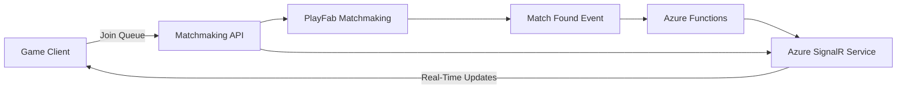

# How to Build a Real-Time Matchmaking Service with Azure SignalR and PlayFab

Author: [nawazdhandala](https://www.github.com/nawazdhandala)

Tags: Azure SignalR, PlayFab, Matchmaking, Real-Time Communication, Game Development, Multiplayer, WebSocket

Description: Build a real-time matchmaking service using Azure SignalR for live status updates and PlayFab for matchmaking queue management.

---

Matchmaking is one of those features that seems simple on the surface but gets complicated fast. Players want to be matched with opponents of similar skill, with low wait times, in a region close to them. They also want to see real-time updates while they wait - estimated time, queue position, and instant notification when a match is found.

PlayFab provides the matchmaking queue logic. Azure SignalR provides the real-time communication channel to push updates to waiting players. Together they create a matchmaking experience that feels responsive and keeps players engaged during the wait.

## Architecture



The game client calls the matchmaking API to join a queue. The API submits a ticket to PlayFab Matchmaking. Meanwhile, the client connects to Azure SignalR to receive real-time updates. When PlayFab finds a match, an Azure Function picks up the event and pushes the match details to all players in the group through SignalR.

## Step 1 - Set Up Azure SignalR Service

SignalR Service handles the WebSocket connections to your game clients. For matchmaking, you typically have thousands of concurrent players waiting in queues, each needing a persistent connection for updates.

```bash
# Create the SignalR Service
az signalr create \
  --name game-matchmaking-signalr \
  --resource-group gaming-rg \
  --sku Standard_S1 \
  --unit-count 1 \
  --service-mode Serverless \
  --location eastus
```

Serverless mode is the right choice here because Azure Functions will send messages to clients. You do not need a persistent server-side hub connection.

## Step 2 - Configure PlayFab Matchmaking Queues

PlayFab Matchmaking uses queues with configurable rules. Each queue defines how players are matched based on skill, latency, team size, and other criteria.

Configure the matchmaking queue in the PlayFab portal or via API.

```python
import requests

TITLE_ID = "YOUR_TITLE_ID"
SECRET_KEY = "YOUR_SECRET_KEY"

def create_matchmaking_queue():
    """Create a matchmaking queue with skill-based rules."""
    url = f"https://{TITLE_ID}.playfabapi.com/Match/SetMatchmakingQueue"

    headers = {
        "Content-Type": "application/json",
        "X-SecretKey": SECRET_KEY
    }

    payload = {
        "MatchmakingQueue": {
            "Name": "ranked_1v1",
            "MinMatchSize": 2,
            "MaxMatchSize": 2,
            "MaxTicketSize": 1,  # Solo queue, one player per ticket
            "ServerAllocationEnabled": True,
            "BuildId": "<your-build-id>",
            "RegionSelectionRule": {
                "Name": "region_rule",
                "MaxLatency": 150,  # Maximum acceptable latency in ms
                "Weight": 1.0
            },
            "DifferenceRule": [
                {
                    "Name": "skill_rule",
                    "Attribute": {
                        "Path": "skill_rating",
                        "Source": "User"
                    },
                    "Weight": 2.0,
                    "MergeFunction": "Average",
                    "DefaultAttributeValue": 1000,
                    "Expansion": {
                        "Type": "Linear",
                        "MaxDifference": 500,
                        "Delta": 50,
                        "SecondsBetweenExpansions": 10
                    }
                }
            ]
        }
    }

    response = requests.post(url, headers=headers, json=payload)
    print(f"Queue created: {response.json()}")

create_matchmaking_queue()
```

The skill rule is the most important part. It starts by trying to match players within a narrow skill range and gradually expands the acceptable difference every 10 seconds. After 100 seconds (10 expansions at 50 each), the maximum skill difference reaches 500. This balances match quality with wait times.

## Step 3 - Build the Matchmaking API

The matchmaking API handles ticket creation, status polling, and cancellation. It also negotiates the SignalR connection for real-time updates.

```python
import azure.functions as func
import json
import os
import requests
from azure.functions import SignalRConnectionInfo

app = func.FunctionApp()

TITLE_ID = os.environ["PLAYFAB_TITLE_ID"]

@app.function_name("negotiate")
@app.route(route="negotiate", methods=["POST"])
@app.generic_output_binding(
    arg_name="connectionInfo",
    type="signalRConnectionInfo",
    hub_name="matchmaking",
    connection_string_setting="AzureSignalRConnectionString",
    user_id="{headers.x-player-id}"
)
def negotiate(req: func.HttpRequest, connectionInfo: str) -> func.HttpResponse:
    """SignalR negotiation endpoint - provides connection info to clients."""
    return func.HttpResponse(connectionInfo)

@app.function_name("createTicket")
@app.route(route="matchmaking/join", methods=["POST"])
@app.generic_output_binding(
    arg_name="signalRMessages",
    type="signalR",
    hub_name="matchmaking",
    connection_string_setting="AzureSignalRConnectionString"
)
def create_ticket(req: func.HttpRequest, signalRMessages: func.Out[str]) -> func.HttpResponse:
    """Create a matchmaking ticket for a player."""
    body = req.get_json()
    player_id = body["playerId"]
    entity_token = body["entityToken"]
    skill_rating = body.get("skillRating", 1000)
    preferred_regions = body.get("regions", ["EastUs"])

    # Submit ticket to PlayFab Matchmaking
    ticket = create_playfab_ticket(
        entity_token=entity_token,
        queue_name="ranked_1v1",
        skill_rating=skill_rating,
        preferred_regions=preferred_regions
    )

    if not ticket:
        return func.HttpResponse(
            json.dumps({"error": "Failed to create matchmaking ticket"}),
            status_code=500,
            mimetype="application/json"
        )

    # Send initial status update via SignalR
    message = {
        "userId": player_id,
        "target": "matchmakingStatus",
        "arguments": [{
            "status": "searching",
            "ticketId": ticket["TicketId"],
            "estimatedWait": "30-60 seconds",
            "message": "Looking for an opponent..."
        }]
    }
    signalRMessages.set(json.dumps(message))

    return func.HttpResponse(
        json.dumps({"ticketId": ticket["TicketId"], "status": "searching"}),
        status_code=200,
        mimetype="application/json"
    )

def create_playfab_ticket(entity_token: str, queue_name: str, skill_rating: int, preferred_regions: list) -> dict:
    """Submit a matchmaking ticket to PlayFab."""
    url = f"https://{TITLE_ID}.playfabapi.com/Match/CreateMatchmakingTicket"

    headers = {
        "Content-Type": "application/json",
        "X-EntityToken": entity_token
    }

    payload = {
        "Creator": {
            "Entity": {
                "Id": "",  # Filled from entity token
                "Type": "title_player_account"
            },
            "Attributes": {
                "DataObject": {
                    "skill_rating": skill_rating
                }
            }
        },
        "GiveUpAfterSeconds": 120,
        "QueueName": queue_name
    }

    response = requests.post(url, headers=headers, json=payload)
    if response.status_code == 200:
        return response.json().get("data", {})
    return None
```

## Step 4 - Poll and Push Match Status

PlayFab Matchmaking does not push events. You need to poll for ticket status. Use a timer-triggered Azure Function that checks active tickets and pushes updates to players through SignalR.

```python
@app.function_name("pollMatchStatus")
@app.timer_trigger(schedule="*/5 * * * * *", arg_name="timer")  # Every 5 seconds
@app.generic_output_binding(
    arg_name="signalRMessages",
    type="signalR",
    hub_name="matchmaking",
    connection_string_setting="AzureSignalRConnectionString"
)
def poll_match_status(timer: func.TimerRequest, signalRMessages: func.Out[str]):
    """Poll PlayFab for matchmaking ticket updates and push via SignalR."""
    # Get all active tickets from our tracking store
    active_tickets = get_active_tickets_from_store()
    messages = []

    for ticket_info in active_tickets:
        ticket_id = ticket_info["ticketId"]
        player_id = ticket_info["playerId"]
        entity_token = ticket_info["entityToken"]
        queue_name = ticket_info["queueName"]

        # Check ticket status with PlayFab
        status = check_ticket_status(entity_token, queue_name, ticket_id)

        if status["Status"] == "Matched":
            # Match found - send connection details to the player
            match_id = status.get("MatchId")
            server_info = get_match_details(entity_token, queue_name, match_id)

            messages.append({
                "userId": player_id,
                "target": "matchFound",
                "arguments": [{
                    "matchId": match_id,
                    "serverIp": server_info.get("ServerDetails", {}).get("IPV4Address"),
                    "serverPort": server_info.get("ServerDetails", {}).get("Ports", [{}])[0].get("Num"),
                    "opponents": server_info.get("Members", []),
                    "message": "Match found! Connecting..."
                }]
            })

            # Remove from active tickets
            remove_ticket_from_store(ticket_id)

        elif status["Status"] == "Canceled":
            messages.append({
                "userId": player_id,
                "target": "matchmakingStatus",
                "arguments": [{
                    "status": "canceled",
                    "message": "Matchmaking canceled or timed out."
                }]
            })
            remove_ticket_from_store(ticket_id)

        elif status["Status"] == "WaitingForMatch":
            # Still searching - send a heartbeat update
            wait_time = ticket_info.get("elapsed_seconds", 0) + 5
            messages.append({
                "userId": player_id,
                "target": "matchmakingStatus",
                "arguments": [{
                    "status": "searching",
                    "waitTime": wait_time,
                    "message": f"Searching for {wait_time}s..."
                }]
            })

    if messages:
        signalRMessages.set(json.dumps(messages))

def check_ticket_status(entity_token: str, queue_name: str, ticket_id: str) -> dict:
    """Check the status of a matchmaking ticket in PlayFab."""
    url = f"https://{TITLE_ID}.playfabapi.com/Match/GetMatchmakingTicket"
    headers = {
        "Content-Type": "application/json",
        "X-EntityToken": entity_token
    }
    payload = {
        "TicketId": ticket_id,
        "QueueName": queue_name
    }
    response = requests.post(url, headers=headers, json=payload)
    return response.json().get("data", {})
```

## Step 5 - Client-Side Integration

On the game client side, connect to SignalR and listen for matchmaking events.

```csharp
using Microsoft.AspNetCore.SignalR.Client;
using System;
using System.Threading.Tasks;

public class MatchmakingClient
{
    private HubConnection connection;

    public async Task ConnectToMatchmaking(string playerId)
    {
        // Build the SignalR connection using the negotiate endpoint
        connection = new HubConnectionBuilder()
            .WithUrl("https://your-function-app.azurewebsites.net/api",
                options =>
                {
                    options.Headers.Add("x-player-id", playerId);
                })
            .WithAutomaticReconnect()
            .Build();

        // Listen for matchmaking status updates
        connection.On<MatchmakingUpdate>("matchmakingStatus", update =>
        {
            Console.WriteLine($"Status: {update.Status} - {update.Message}");
            UpdateMatchmakingUI(update);
        });

        // Listen for match found events
        connection.On<MatchFoundData>("matchFound", match =>
        {
            Console.WriteLine($"Match found! Server: {match.ServerIp}:{match.ServerPort}");
            ConnectToGameServer(match.ServerIp, match.ServerPort);
        });

        await connection.StartAsync();
        Console.WriteLine("Connected to matchmaking service");
    }

    private void UpdateMatchmakingUI(MatchmakingUpdate update)
    {
        // Update the waiting screen with current status
    }

    private void ConnectToGameServer(string ip, int port)
    {
        // Transition from matchmaking to the game
    }
}
```

## Handling Edge Cases

Players cancel matchmaking, disconnect, or close the game while waiting. Handle these gracefully:

- When a player cancels, call PlayFab's CancelMatchmakingTicket API and remove their SignalR connection.
- When a player disconnects from SignalR, set a grace period (30 seconds) before canceling their ticket. They might just be switching networks.
- When a match is found but a player does not connect to the game server within 60 seconds, cancel the match and return the other players to the queue.

## Wrapping Up

Real-time matchmaking requires two things working together: a smart queue system that finds fair matches, and a fast communication channel that keeps players informed. PlayFab provides the matchmaking intelligence with skill-based rules, expansion logic, and server allocation. Azure SignalR provides the real-time push channel so players see updates instantly without polling from the client. The polling happens server-side in Azure Functions, which keeps the client simple and responsive. The result is a matchmaking experience where players feel informed and engaged, even during the wait.
