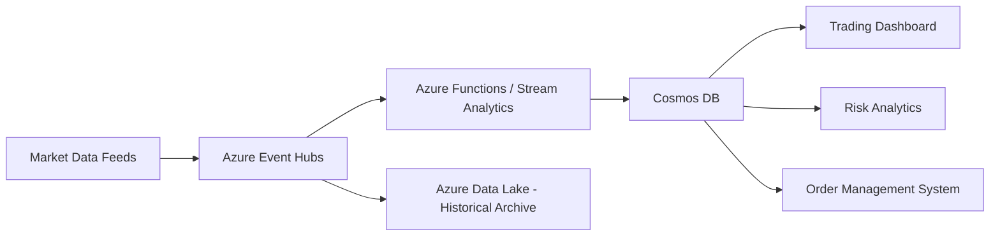

# How to Build a Real-Time Trading Data Platform with Azure Event Hubs and Cosmos DB

Author: [nawazdhandala](https://www.github.com/nawazdhandala)

Tags: Azure Event Hubs, Cosmos DB, Trading Platform, Real-Time Data, Financial Services, Stream Processing, Event Streaming

Description: Build a real-time trading data platform using Azure Event Hubs for ingestion and Cosmos DB for low-latency storage and querying.

---

Trading platforms generate enormous volumes of data. Stock prices change multiple times per second, order books update constantly, and traders need to see current information with minimal delay. Building a platform that handles this requires a fast ingestion layer paired with a database designed for low-latency reads.

Azure Event Hubs can ingest millions of events per second. Cosmos DB offers single-digit millisecond response times at any scale. Together, they form a solid foundation for a real-time trading data platform. In this guide, I will show you how to wire them together.

## Architecture Overview

Before writing any code, let's look at the architecture. Market data feeds push price updates into Event Hubs. A stream processor reads from Event Hubs, enriches the data, and writes it to Cosmos DB. Client applications query Cosmos DB for the latest prices and historical data.



The key design decision is separating hot and cold paths. Event Hubs feeds the hot path for real-time processing. A parallel capture path archives raw data to Azure Data Lake for historical analysis.

## Step 1 - Create the Event Hubs Namespace

Event Hubs uses a namespace as a container for one or more event hubs (similar to how Kafka uses a cluster for topics). For trading workloads, you want a dedicated namespace on the Premium or Dedicated tier to get predictable latency.

```bash
# Create a resource group for the trading platform
az group create --name trading-platform-rg --location eastus

# Create an Event Hubs namespace with Premium tier for low latency
az eventhubs namespace create \
  --name trading-events-ns \
  --resource-group trading-platform-rg \
  --sku Premium \
  --capacity 1 \
  --location eastus
```

Now create an event hub for market data. Partition count matters a lot here. More partitions mean more parallel consumers, but each partition maintains ordering. For trading data, partition by symbol so that all updates for a given stock arrive in order.

```bash
# Create an event hub with 32 partitions for parallel processing
az eventhubs eventhub create \
  --name market-data \
  --namespace-name trading-events-ns \
  --resource-group trading-platform-rg \
  --partition-count 32 \
  --message-retention 7
```

## Step 2 - Set Up Cosmos DB

For a trading platform, you want Cosmos DB configured for the lowest possible latency. Use the SQL API (now called NoSQL API) since it provides the most flexibility for querying. Enable multi-region writes if your traders are spread across geographies.

```bash
# Create a Cosmos DB account with session consistency
az cosmosdb create \
  --name trading-data-db \
  --resource-group trading-platform-rg \
  --kind GlobalDocumentDB \
  --default-consistency-level Session \
  --locations regionName=eastus failoverPriority=0 isZoneRedundant=true \
  --enable-automatic-failover true

# Create a database with shared throughput
az cosmosdb sql database create \
  --account-name trading-data-db \
  --resource-group trading-platform-rg \
  --name TradingDB

# Create a container for real-time price data, partitioned by symbol
az cosmosdb sql container create \
  --account-name trading-data-db \
  --resource-group trading-platform-rg \
  --database-name TradingDB \
  --name PriceData \
  --partition-key-path "/symbol" \
  --throughput 10000 \
  --idx @indexing-policy.json
```

Partitioning by `/symbol` means all price updates for AAPL go to the same logical partition. This keeps queries for a single stock fast since they hit a single partition.

## Step 3 - Build the Ingestion Producer

Trading data typically arrives from market data providers via WebSocket or FIX protocol. Here is a Python producer that takes price updates and sends them to Event Hubs.

```python
import json
import asyncio
from azure.eventhub.aio import EventHubProducerClient
from azure.eventhub import EventData

# Connection string from the Event Hubs namespace shared access policy
CONNECTION_STR = "Endpoint=sb://trading-events-ns.servicebus.windows.net/;SharedAccessKeyName=RootManageSharedAccessKey;SharedAccessKey=<key>"
EVENTHUB_NAME = "market-data"

async def send_price_update(symbol: str, price: float, volume: int, timestamp: str):
    """Send a single price update to Event Hubs, partitioned by symbol."""
    producer = EventHubProducerClient.from_connection_string(
        conn_str=CONNECTION_STR,
        eventhub_name=EVENTHUB_NAME
    )
    async with producer:
        # Create a batch for the specific partition key (symbol)
        event_data_batch = await producer.create_batch(partition_key=symbol)

        # Build the price update event
        price_event = {
            "symbol": symbol,
            "price": price,
            "volume": volume,
            "timestamp": timestamp,
            "eventType": "priceUpdate"
        }

        # Add the event to the batch
        event_data_batch.add(EventData(json.dumps(price_event)))
        await producer.send_batch(event_data_batch)

# Example usage - simulate sending a price update
asyncio.run(send_price_update("AAPL", 187.52, 15000, "2026-02-16T14:30:00.123Z"))
```

Using `partition_key=symbol` ensures all events for the same stock are routed to the same partition. This preserves ordering per symbol, which is critical for trading applications where you need to process price updates in sequence.

## Step 4 - Build the Stream Processor

The stream processor reads events from Event Hubs, applies any transformations, and writes to Cosmos DB. Azure Functions with the Event Hubs trigger is the simplest approach.

```python
import json
import logging
import azure.functions as func
from azure.cosmos import CosmosClient, PartitionKey
from datetime import datetime

# Initialize Cosmos DB client (use managed identity in production)
cosmos_client = CosmosClient(
    "https://trading-data-db.documents.azure.com:443/",
    credential="<cosmos-key>"
)
database = cosmos_client.get_database_client("TradingDB")
container = database.get_container_client("PriceData")

def main(events: func.EventHubEvent):
    """Process incoming market data events and write to Cosmos DB."""
    for event in events:
        try:
            # Parse the incoming event
            body = event.get_body().decode("utf-8")
            price_data = json.loads(body)

            # Enrich the event with processing metadata
            price_data["id"] = f"{price_data['symbol']}-{price_data['timestamp']}"
            price_data["processedAt"] = datetime.utcnow().isoformat()

            # Calculate a simple moving indicator (for demonstration)
            price_data["priceCategory"] = categorize_price_movement(price_data)

            # Upsert to Cosmos DB - idempotent write
            container.upsert_item(price_data)

            logging.info(f"Processed: {price_data['symbol']} at {price_data['price']}")
        except Exception as e:
            logging.error(f"Error processing event: {e}")

def categorize_price_movement(data):
    """Simple categorization for demonstration purposes."""
    price = data.get("price", 0)
    if price > 500:
        return "high"
    elif price > 100:
        return "mid"
    else:
        return "low"
```

The function binding configuration in `function.json` connects this to your Event Hub.

```json
{
  "bindings": [
    {
      "type": "eventHubTrigger",
      "name": "events",
      "direction": "in",
      "eventHubName": "market-data",
      "connection": "EventHubConnection",
      "cardinality": "many",
      "consumerGroup": "$Default",
      "dataType": "binary"
    }
  ]
}
```

Setting `cardinality` to "many" means the function receives events in batches, which is much more efficient for high-throughput scenarios.

## Step 5 - Enable Event Hubs Capture for Historical Data

You want to keep a copy of every raw event for historical analysis, backtesting, and regulatory record-keeping. Event Hubs Capture automatically writes events to Azure Blob Storage or Data Lake in Avro format.

```bash
# Enable capture on the event hub
az eventhubs eventhub update \
  --name market-data \
  --namespace-name trading-events-ns \
  --resource-group trading-platform-rg \
  --capture-enabled true \
  --capture-encoding Avro \
  --capture-interval 60 \
  --capture-size-limit 314572800 \
  --destination-name "EventHubArchive.AzureBlockBlob" \
  --storage-account "/subscriptions/<sub-id>/resourceGroups/trading-platform-rg/providers/Microsoft.Storage/storageAccounts/tradingarchive" \
  --blob-container "market-data-archive"
```

This captures data every 60 seconds or when the buffer reaches 300 MB, whichever comes first. The Avro files land in blob storage organized by date and time, making it easy to run batch analytics later with Spark or Synapse.

## Step 6 - Query Real-Time Data from Cosmos DB

With data flowing in, your trading dashboards can query Cosmos DB for the latest prices. Here is how to get the most recent price for a specific symbol.

```python
from azure.cosmos import CosmosClient

client = CosmosClient("https://trading-data-db.documents.azure.com:443/", "<key>")
container = client.get_database_client("TradingDB").get_container_client("PriceData")

def get_latest_price(symbol: str):
    """Fetch the most recent price update for a given stock symbol."""
    query = """
        SELECT TOP 1 *
        FROM c
        WHERE c.symbol = @symbol
        ORDER BY c.timestamp DESC
    """
    # Partition key specified for efficient single-partition query
    items = list(container.query_items(
        query=query,
        parameters=[{"name": "@symbol", "value": symbol}],
        partition_key=symbol
    ))
    return items[0] if items else None

# Get the latest AAPL price
latest = get_latest_price("AAPL")
print(f"AAPL: ${latest['price']} at {latest['timestamp']}")
```

This query is efficient because it targets a single partition (the symbol). Cosmos DB can serve this in under 5 milliseconds even with millions of documents.

## Performance Tuning Tips

For throughput, use autoscale on your Cosmos DB container instead of fixed throughput. Trading volumes spike during market hours and drop to near zero overnight. Autoscale adjusts RU/s between 10% of the max and the full max, saving money during off-hours.

For Event Hubs, monitor the checkpoint lag. If your consumer is falling behind, increase the partition count or scale out your Azure Functions plan. The Premium tier gives you more predictable latency compared to Standard.

For Cosmos DB indexing, exclude paths you never query on. The default policy indexes everything, which consumes extra RUs on writes. For a trading platform where writes are constant, trimming the index policy can reduce RU consumption significantly.

## Monitoring and Alerting

Set up Azure Monitor alerts for two critical metrics: Event Hubs incoming messages rate and Cosmos DB RU consumption. If incoming messages spike beyond your capacity, you will start losing data. If RU consumption hits the limit, your writes will get throttled.

```bash
# Create an alert rule for Event Hubs throttled requests
az monitor metrics alert create \
  --name "eventhub-throttle-alert" \
  --resource-group trading-platform-rg \
  --scopes "/subscriptions/<sub-id>/resourceGroups/trading-platform-rg/providers/Microsoft.EventHub/namespaces/trading-events-ns" \
  --condition "total ThrottledRequests > 0" \
  --window-size 5m \
  --evaluation-frequency 1m \
  --action "/subscriptions/<sub-id>/resourceGroups/trading-platform-rg/providers/Microsoft.Insights/actionGroups/trading-ops"
```

## Wrapping Up

Azure Event Hubs and Cosmos DB give you the building blocks for a trading data platform that can handle serious throughput with low latency. Event Hubs handles the firehose of market data, the stream processor enriches and routes it, and Cosmos DB serves it to your applications with single-digit millisecond response times. Add Event Hubs Capture for the historical archive, and you have both real-time and batch analytics covered. Start with the core pipeline, measure your latency and throughput, and scale the components as your data volumes grow.
