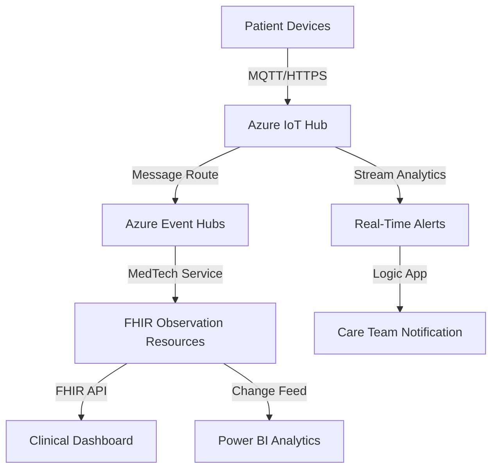

# How to Build a Remote Patient Monitoring Dashboard with Azure IoT Hub and FHIR

Author: [nawazdhandala](https://www.github.com/nawazdhandala)

Tags: Azure IoT Hub, FHIR, Remote Patient Monitoring, Healthcare, IoT, Azure Health Data Services, Telemedicine

Description: Build a remote patient monitoring solution that collects device data through Azure IoT Hub and stores clinical observations in a FHIR server for care teams.

---

Remote patient monitoring (RPM) allows healthcare providers to track patients' vital signs and symptoms from their homes. Wearable devices and home health monitors generate continuous streams of data - heart rate, blood pressure, blood glucose, oxygen saturation, weight, and more. Azure IoT Hub ingests this device telemetry at scale, and Azure Health Data Services transforms it into FHIR-compliant clinical observations that integrate with existing EHR workflows.

This guide covers building the full RPM pipeline from device to dashboard.

## Architecture



## Step 1: Set Up Azure IoT Hub

### Create the IoT Hub

1. In the Azure portal, search for "IoT Hub" and click Create.
2. Configure:
   - Name: `rpm-iot-hub`
   - Region: Same as your Health Data Services workspace
   - Tier: S1 Standard (B1 Basic does not support message routing)
   - Daily message limit: Based on your patient count (S1 supports 400,000 messages/day)
3. Click Create.

### Register Devices

Each patient's monitoring device needs to be registered. Here is how to register devices programmatically:

```python
# Register patient monitoring devices in Azure IoT Hub
# Each device represents a physical monitoring device assigned to a patient
from azure.iot.hub import IoTHubRegistryManager

connection_string = "YOUR_IOT_HUB_CONNECTION_STRING"
registry = IoTHubRegistryManager(connection_string)

def register_device(device_id, patient_id, device_type):
    """Register a monitoring device and tag it with patient metadata."""
    # Create the device identity
    device = registry.create_device_with_sas(
        device_id=device_id,
        primary_key=None,  # Auto-generate
        secondary_key=None,  # Auto-generate
        status="enabled"
    )

    # Update the device twin with patient metadata
    twin = registry.get_twin(device_id)
    twin_patch = {
        "tags": {
            "patientId": patient_id,
            "deviceType": device_type,
            "enrollmentDate": "2026-02-16",
            "status": "active"
        },
        "properties": {
            "desired": {
                "reportingInterval": 60,  # seconds between readings
                "alertThresholds": {
                    "heartRateHigh": 120,
                    "heartRateLow": 50,
                    "systolicHigh": 180,
                    "oxygenLow": 90
                }
            }
        }
    }
    registry.update_twin(device_id, twin_patch, twin.etag)

    return device

# Register devices for a patient
register_device("bp-monitor-P001", "patient-001", "blood-pressure")
register_device("pulse-ox-P001", "patient-001", "pulse-oximeter")
register_device("scale-P001", "patient-001", "weight-scale")
```

### Simulate Device Telemetry

For development and testing, simulate device data:

```python
# Simulate a blood pressure monitor sending readings to IoT Hub
# In production, this code runs on the actual medical device
import asyncio
import json
import random
from datetime import datetime
from azure.iot.device.aio import IoTHubDeviceClient

async def simulate_bp_monitor(connection_string, patient_id):
    """Simulate a blood pressure monitor sending periodic readings."""
    client = IoTHubDeviceClient.create_from_connection_string(connection_string)
    await client.connect()

    while True:
        # Generate realistic blood pressure readings
        systolic = random.gauss(125, 10)
        diastolic = random.gauss(82, 8)
        heart_rate = random.gauss(75, 12)

        # Build the telemetry message
        # Use a standardized format that the MedTech service can map
        telemetry = {
            "deviceId": "bp-monitor-P001",
            "patientId": patient_id,
            "timestamp": datetime.utcnow().isoformat() + "Z",
            "measurements": {
                "systolic": {
                    "value": round(systolic, 1),
                    "unit": "mmHg"
                },
                "diastolic": {
                    "value": round(diastolic, 1),
                    "unit": "mmHg"
                },
                "heartRate": {
                    "value": round(heart_rate),
                    "unit": "bpm"
                }
            }
        }

        message = json.dumps(telemetry)
        await client.send_message(message)
        print(f"Sent: BP {systolic:.0f}/{diastolic:.0f}, HR {heart_rate:.0f}")

        # Wait for the next reading interval
        await asyncio.sleep(60)

    await client.disconnect()

# Run the simulator
asyncio.run(simulate_bp_monitor(
    "YOUR_DEVICE_CONNECTION_STRING",
    "patient-001"
))
```

## Step 2: Configure IoT Hub Message Routing

Route messages from IoT Hub to the processing pipeline:

1. Go to IoT Hub > Message routing.
2. Add a route:
   - Name: `vitals-to-eventhub`
   - Endpoint: Create a new Event Hub endpoint pointing to your Event Hub
   - Data source: Device Telemetry Messages
   - Routing query: `true` (route all messages, or use a filter)
3. Save.

For selective routing, use a query to filter by device type:

```sql
-- Route only vital sign messages to the clinical pipeline
-- Other device types might go to different endpoints
$body.measurements.systolic IS NOT NULL
OR $body.measurements.heartRate IS NOT NULL
OR $body.measurements.oxygenSaturation IS NOT NULL
```

## Step 3: Set Up the MedTech Service

The MedTech service (formerly IoT Connector) in Azure Health Data Services transforms device telemetry into FHIR Observation resources automatically.

### Deploy MedTech Service

1. In your Azure Health Data Services workspace, click Deploy MedTech service.
2. Enter a name.
3. Configure the Event Hub connection (the Event Hub that receives routed IoT messages).
4. Set the consumer group.
5. Link to your FHIR service.

### Configure Device Mapping

The device mapping tells MedTech how to parse your device telemetry format:

```json
{
    "templateType": "CollectionContent",
    "template": [
        {
            "templateType": "JsonPathContent",
            "template": {
                "typeName": "bloodpressure",
                "typeMatchExpression": "$..[?(@measurements.systolic)]",
                "patientIdExpression": "$.patientId",
                "deviceIdExpression": "$.deviceId",
                "timestampExpression": "$.timestamp",
                "values": [
                    {
                        "required": true,
                        "valueExpression": "$.measurements.systolic.value",
                        "valueName": "systolic"
                    },
                    {
                        "required": true,
                        "valueExpression": "$.measurements.diastolic.value",
                        "valueName": "diastolic"
                    },
                    {
                        "required": false,
                        "valueExpression": "$.measurements.heartRate.value",
                        "valueName": "heartRate"
                    }
                ]
            }
        },
        {
            "templateType": "JsonPathContent",
            "template": {
                "typeName": "oxygensaturation",
                "typeMatchExpression": "$..[?(@measurements.oxygenSaturation)]",
                "patientIdExpression": "$.patientId",
                "deviceIdExpression": "$.deviceId",
                "timestampExpression": "$.timestamp",
                "values": [
                    {
                        "required": true,
                        "valueExpression": "$.measurements.oxygenSaturation.value",
                        "valueName": "spo2"
                    }
                ]
            }
        }
    ]
}
```

### Configure FHIR Mapping

The FHIR mapping tells MedTech how to create FHIR Observation resources:

```json
{
    "templateType": "CollectionFhirTemplate",
    "template": [
        {
            "templateType": "CodeValueFhir",
            "template": {
                "codes": [
                    {
                        "code": "85354-9",
                        "system": "http://loinc.org",
                        "display": "Blood Pressure"
                    }
                ],
                "typeName": "bloodpressure",
                "value": {
                    "defaultPeriod": 5000,
                    "valueName": "systolic",
                    "valueType": "component"
                },
                "components": [
                    {
                        "codes": [
                            {
                                "code": "8480-6",
                                "system": "http://loinc.org",
                                "display": "Systolic Blood Pressure"
                            }
                        ],
                        "value": {
                            "valueName": "systolic",
                            "valueType": "quantity",
                            "unit": "mmHg",
                            "system": "http://unitsofmeasure.org",
                            "code": "mm[Hg]"
                        }
                    },
                    {
                        "codes": [
                            {
                                "code": "8462-4",
                                "system": "http://loinc.org",
                                "display": "Diastolic Blood Pressure"
                            }
                        ],
                        "value": {
                            "valueName": "diastolic",
                            "valueType": "quantity",
                            "unit": "mmHg",
                            "system": "http://unitsofmeasure.org",
                            "code": "mm[Hg]"
                        }
                    },
                    {
                        "codes": [
                            {
                                "code": "8867-4",
                                "system": "http://loinc.org",
                                "display": "Heart Rate"
                            }
                        ],
                        "value": {
                            "valueName": "heartRate",
                            "valueType": "quantity",
                            "unit": "bpm",
                            "system": "http://unitsofmeasure.org",
                            "code": "/min"
                        }
                    }
                ]
            }
        }
    ]
}
```

## Step 4: Set Up Real-Time Alerts

Use Azure Stream Analytics to detect dangerous vital sign readings and alert care teams immediately.

### Stream Analytics Query for Alerts

```sql
-- Detect critical vital sign readings that need immediate attention
-- Outputs to a Service Bus queue for alert processing
SELECT
    deviceId,
    patientId,
    timestamp,
    measurements.systolic.value AS systolicBP,
    measurements.diastolic.value AS diastolicBP,
    measurements.heartRate.value AS heartRate,
    CASE
        WHEN measurements.systolic.value > 180 THEN 'Critical High BP'
        WHEN measurements.systolic.value < 90 THEN 'Critical Low BP'
        WHEN measurements.heartRate.value > 150 THEN 'Tachycardia'
        WHEN measurements.heartRate.value < 40 THEN 'Bradycardia'
    END AS alertType,
    System.Timestamp() AS alertTime
INTO
    [alert-output]
FROM
    [iot-input]
WHERE
    measurements.systolic.value > 180
    OR measurements.systolic.value < 90
    OR measurements.heartRate.value > 150
    OR measurements.heartRate.value < 40

-- Detect trends: BP increasing over 3 consecutive readings
SELECT
    deviceId,
    patientId,
    'Rising BP Trend' AS alertType,
    AVG(measurements.systolic.value) AS avgSystolic,
    System.Timestamp() AS alertTime
INTO
    [trend-alert-output]
FROM
    [iot-input]
GROUP BY
    deviceId,
    patientId,
    SlidingWindow(minute, 30)
HAVING
    AVG(measurements.systolic.value) > 160
    AND COUNT(*) >= 3
```

### Alert Notification via Logic App

Create a Logic App that sends alerts to care teams:

1. Trigger: When a message arrives in the Service Bus queue.
2. Parse the alert JSON.
3. Look up the patient's care team from FHIR.
4. Send a Teams message or page to the on-call provider.

## Step 5: Build the Clinical Dashboard

### FHIR-Based Dashboard API

Build an API that queries the FHIR server for patient monitoring data:

```python
# Dashboard API that retrieves patient monitoring data from FHIR
# Returns structured data for the frontend dashboard
from flask import Flask, jsonify, request

app = Flask(__name__)

@app.route('/api/patient/<patient_id>/vitals')
def get_patient_vitals(patient_id):
    """Get recent vital signs for a patient from FHIR."""

    # Query FHIR for recent blood pressure observations
    bp_observations = fhir_client.search(
        "Observation",
        params={
            "patient": patient_id,
            "code": "85354-9",  # LOINC code for blood pressure
            "_sort": "-date",
            "_count": 100
        }
    )

    # Transform FHIR observations into dashboard-friendly format
    vitals = []
    for entry in bp_observations.get("entry", []):
        obs = entry["resource"]
        reading = {
            "timestamp": obs.get("effectiveDateTime"),
            "components": {}
        }

        # Extract component values (systolic, diastolic, heart rate)
        for component in obs.get("component", []):
            code = component["code"]["coding"][0]["code"]
            value = component.get("valueQuantity", {})

            if code == "8480-6":  # Systolic
                reading["components"]["systolic"] = value.get("value")
            elif code == "8462-4":  # Diastolic
                reading["components"]["diastolic"] = value.get("value")
            elif code == "8867-4":  # Heart rate
                reading["components"]["heartRate"] = value.get("value")

        vitals.append(reading)

    return jsonify({
        "patientId": patient_id,
        "vitals": vitals,
        "count": len(vitals)
    })

@app.route('/api/patient/<patient_id>/alerts')
def get_patient_alerts(patient_id):
    """Get active alerts for a patient."""
    # Query FHIR for flags or detected issues
    flags = fhir_client.search(
        "Flag",
        params={
            "patient": patient_id,
            "status": "active",
            "_sort": "-date"
        }
    )

    alerts = []
    for entry in flags.get("entry", []):
        flag = entry["resource"]
        alerts.append({
            "id": flag["id"],
            "code": flag["code"]["text"],
            "period": flag.get("period", {}),
            "status": flag["status"]
        })

    return jsonify({"alerts": alerts})
```

### Frontend Dashboard

Build the dashboard UI that clinicians use to monitor patients. The dashboard should show:

- A patient list with color-coded status indicators (green, yellow, red).
- Trend charts for each vital sign over time.
- Alert banners for critical readings.
- Device connectivity status.
- A button to contact the patient or schedule a telehealth visit.

For the vital signs trend chart, use the data from the FHIR API to render time-series visualizations. Care teams can see at a glance which patients need attention.

## Step 6: Monitor the Pipeline

### IoT Hub Metrics

- Connected devices: How many devices are actively sending data.
- Messages sent: Telemetry volume.
- Throttled messages: If you are hitting IoT Hub limits.

### MedTech Service Metrics

- Messages received: Events from Event Hub.
- Messages normalized: Successfully parsed by device mapping.
- FHIR resources created: Observations written to FHIR.
- Errors: Mapping failures or FHIR write errors.

### Clinical Metrics

- Average time from device reading to FHIR observation (end-to-end latency).
- Alert response time (time from alert to care team acknowledgment).
- Percentage of patients with recent readings (device adherence).

## Wrapping Up

A remote patient monitoring solution on Azure combines IoT Hub for device management and telemetry ingestion, the MedTech service for transforming device data into FHIR clinical observations, Stream Analytics for real-time alerting, and a clinical dashboard for care team visibility. The key integration point is the MedTech service, which bridges the gap between IoT telemetry formats and the FHIR clinical data model. This means the monitoring data flows directly into the patient's clinical record and is available to any FHIR-connected system, including the EHR.
