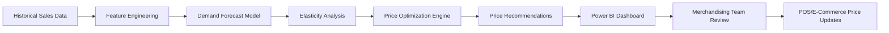

# How to Build a Retail Price Optimization System with Azure Machine Learning and Power BI

Author: [nawazdhandala](https://www.github.com/nawazdhandala)

Tags: Azure Machine Learning, Power BI, Price Optimization, Retail, Data Science, Dynamic Pricing, Revenue Optimization

Description: Build a retail price optimization system using Azure Machine Learning for demand modeling and Power BI for pricing analytics dashboards.

---

Pricing is one of the biggest levers retailers have for increasing revenue. Set prices too high and you lose customers. Set them too low and you leave money on the table. The sweet spot depends on demand elasticity, competitor pricing, seasonality, inventory levels, and a dozen other factors that change constantly.

Machine learning can analyze these factors and recommend optimal prices. Azure Machine Learning provides the platform to build and deploy pricing models. Power BI gives your merchandising team a dashboard where they can see recommendations, understand the reasoning, and approve or adjust prices. In this guide, I will build both pieces.

## How Price Optimization Works

Price optimization uses demand forecasting combined with elasticity modeling. First, you build a model that predicts demand for a product at different price points. Then, you find the price that maximizes your objective - whether that is revenue, profit, or units sold.



The pipeline starts with historical data, runs through ML models, produces recommendations, and feeds them into a dashboard for human review before anything goes live. Automated pricing without human oversight is risky - there are always edge cases and brand considerations that models miss.

## Step 1 - Prepare the Training Data

Price optimization models need rich historical data. At minimum, you need sales transactions with the product, price, quantity sold, date, and any promotions that were active.

```python
import pandas as pd
import numpy as np
from datetime import datetime, timedelta

def prepare_pricing_data(transactions_path: str, products_path: str) -> pd.DataFrame:
    """Combine transaction and product data for pricing analysis."""
    # Load transaction history
    txns = pd.read_csv(transactions_path)
    products = pd.read_csv(products_path)

    # Merge product attributes with transactions
    df = txns.merge(products, on="sku", how="left")

    # Parse dates and create time features
    df["date"] = pd.to_datetime(df["date"])
    df["day_of_week"] = df["date"].dt.dayofweek
    df["month"] = df["date"].dt.month
    df["is_weekend"] = df["day_of_week"].isin([5, 6]).astype(int)
    df["week_of_year"] = df["date"].dt.isocalendar().week.astype(int)

    # Create seasonal indicators
    df["season"] = df["month"].map({
        1: "winter", 2: "winter", 3: "spring",
        4: "spring", 5: "spring", 6: "summer",
        7: "summer", 8: "summer", 9: "fall",
        10: "fall", 11: "fall", 12: "winter"
    })

    # Calculate relative price metrics
    df["price_vs_avg"] = df.groupby("sku")["price"].transform(
        lambda x: x / x.mean()
    )

    # Aggregate to daily level per SKU
    daily = df.groupby(["sku", "date", "category", "brand"]).agg({
        "quantity": "sum",
        "price": "mean",
        "revenue": "sum",
        "cost": "mean",
        "is_promotion": "max",
        "day_of_week": "first",
        "month": "first",
        "is_weekend": "first",
        "season": "first",
        "price_vs_avg": "mean"
    }).reset_index()

    # Add competitor price data if available
    daily["competitor_price_ratio"] = daily.apply(
        lambda row: get_competitor_ratio(row["sku"], row["date"]), axis=1
    )

    return daily

def get_competitor_ratio(sku: str, date) -> float:
    """Look up competitor pricing ratio from a pre-built reference table."""
    # In production, this queries a competitor price database
    # Returns the ratio of our price to the average competitor price
    return 1.0  # Placeholder
```

## Step 2 - Build the Demand Forecasting Model

The demand model predicts how many units you will sell at a given price point, accounting for seasonality, promotions, and other factors.

```python
import lightgbm as lgb
from sklearn.model_selection import TimeSeriesSplit
from sklearn.metrics import mean_absolute_error, mean_squared_error
import mlflow

def train_demand_model(data: pd.DataFrame):
    """Train a demand forecasting model for price optimization."""
    mlflow.lightgbm.autolog()

    # Features that influence demand
    feature_cols = [
        "price", "is_promotion", "day_of_week", "month",
        "is_weekend", "price_vs_avg", "competitor_price_ratio",
        "category_encoded", "brand_encoded"
    ]

    # Encode categorical variables
    from sklearn.preprocessing import LabelEncoder
    for col in ["category", "brand", "season"]:
        le = LabelEncoder()
        data[f"{col}_encoded"] = le.fit_transform(data[col])
        if f"{col}_encoded" not in feature_cols:
            feature_cols.append(f"{col}_encoded")

    X = data[feature_cols]
    y = data["quantity"]

    # Use time series cross-validation to prevent data leakage
    tscv = TimeSeriesSplit(n_splits=5)

    # Train the model
    model = lgb.LGBMRegressor(
        n_estimators=500,
        learning_rate=0.05,
        num_leaves=31,
        min_child_samples=20,
        subsample=0.8,
        colsample_bytree=0.8,
        reg_alpha=0.1,
        reg_lambda=0.1,
        random_state=42
    )

    # Evaluate with cross-validation
    cv_scores = []
    for train_idx, val_idx in tscv.split(X):
        X_train, X_val = X.iloc[train_idx], X.iloc[val_idx]
        y_train, y_val = y.iloc[train_idx], y.iloc[val_idx]

        model.fit(
            X_train, y_train,
            eval_set=[(X_val, y_val)],
            callbacks=[lgb.early_stopping(50), lgb.log_evaluation(0)]
        )

        y_pred = model.predict(X_val)
        mae = mean_absolute_error(y_val, y_pred)
        cv_scores.append(mae)

    avg_mae = np.mean(cv_scores)
    mlflow.log_metric("cv_mae", avg_mae)

    # Train final model on all data
    model.fit(X, y)

    # Log feature importance
    importance = pd.DataFrame({
        "feature": feature_cols,
        "importance": model.feature_importances_
    }).sort_values("importance", ascending=False)

    print(f"Cross-validation MAE: {avg_mae:.2f}")
    print(f"\nFeature Importance:\n{importance.to_string()}")

    return model

```

Time series cross-validation is important here. Standard cross-validation would let the model see future data during training, which inflates performance metrics. TimeSeriesSplit ensures we always train on past data and validate on future data.

## Step 3 - Calculate Price Elasticity

Price elasticity tells you how sensitive demand is to price changes. An elasticity of -2.0 means a 1% price increase leads to a 2% decrease in demand. Products with high elasticity need more careful pricing.

```python
def calculate_elasticity(model, product_data: pd.DataFrame, price_range: tuple) -> dict:
    """Calculate price elasticity for a product across a price range."""
    base_price = product_data["price"].mean()
    base_features = product_data[feature_cols].median().to_frame().T

    # Simulate demand at different price points
    price_points = np.linspace(price_range[0], price_range[1], 50)
    predictions = []

    for price in price_points:
        features = base_features.copy()
        features["price"] = price
        features["price_vs_avg"] = price / base_price

        predicted_demand = model.predict(features)[0]
        predictions.append({
            "price": price,
            "predicted_demand": max(0, predicted_demand),
            "predicted_revenue": price * max(0, predicted_demand)
        })

    results = pd.DataFrame(predictions)

    # Calculate point elasticity at the current price
    current_idx = np.argmin(np.abs(results["price"] - base_price))
    if current_idx > 0 and current_idx < len(results) - 1:
        dq = results.iloc[current_idx + 1]["predicted_demand"] - results.iloc[current_idx - 1]["predicted_demand"]
        dp = results.iloc[current_idx + 1]["price"] - results.iloc[current_idx - 1]["price"]
        q = results.iloc[current_idx]["predicted_demand"]
        p = results.iloc[current_idx]["price"]
        elasticity = (dq / q) / (dp / p)
    else:
        elasticity = None

    return {
        "sku": product_data["sku"].iloc[0],
        "current_price": base_price,
        "elasticity": elasticity,
        "demand_curve": results,
        "revenue_maximizing_price": results.loc[results["predicted_revenue"].idxmax(), "price"],
        "max_predicted_revenue": results["predicted_revenue"].max()
    }
```

## Step 4 - Build the Price Optimization Engine

The optimization engine finds the price that maximizes your chosen objective, subject to constraints like minimum margin and maximum price change percentage.

```python
from scipy.optimize import minimize_scalar

def optimize_price(model, product_data: pd.DataFrame, cost: float, constraints: dict) -> dict:
    """Find the optimal price for a product given constraints."""
    base_features = product_data[feature_cols].median().to_frame().T
    current_price = product_data["price"].mean()

    # Define constraints
    min_margin = constraints.get("min_margin_pct", 0.15)  # 15% minimum margin
    max_change = constraints.get("max_price_change_pct", 0.20)  # 20% max change
    min_price = max(cost * (1 + min_margin), current_price * (1 - max_change))
    max_price = current_price * (1 + max_change)

    def negative_profit(price):
        """Objective function: maximize profit (minimize negative profit)."""
        features = base_features.copy()
        features["price"] = price
        features["price_vs_avg"] = price / current_price

        demand = max(0, model.predict(features)[0])
        profit = (price - cost) * demand
        return -profit  # Negative because we minimize

    # Find the optimal price within bounds
    result = minimize_scalar(
        negative_profit,
        bounds=(min_price, max_price),
        method="bounded"
    )

    optimal_price = result.x
    optimal_demand = max(0, model.predict(
        base_features.assign(price=optimal_price, price_vs_avg=optimal_price / current_price)
    )[0])

    return {
        "sku": product_data["sku"].iloc[0],
        "current_price": round(current_price, 2),
        "recommended_price": round(optimal_price, 2),
        "price_change_pct": round((optimal_price - current_price) / current_price * 100, 1),
        "expected_demand": round(optimal_demand, 0),
        "expected_revenue": round(optimal_price * optimal_demand, 2),
        "expected_profit": round((optimal_price - cost) * optimal_demand, 2),
        "margin_pct": round((optimal_price - cost) / optimal_price * 100, 1)
    }
```

The constraints are important for practical reasons. A 15% minimum margin prevents the model from recommending prices below cost. A 20% maximum change prevents jarring price swings that confuse customers.

## Step 5 - Build the Power BI Dashboard

The pricing dashboard should help merchandisers quickly identify opportunities and make decisions. Key views include:

A summary table showing all products with current price, recommended price, expected revenue impact, and a confidence indicator. Sort by revenue impact so the biggest opportunities surface first.

A demand curve chart for individual products showing predicted demand at different price points. This helps merchandisers understand the shape of the demand response.

Create a DAX measure for the revenue impact of accepting all recommendations:

```
Total Revenue Impact =
SUMX(
    PriceRecommendations,
    [Expected Revenue] - [Current Revenue]
)
```

And a measure for the percentage of recommendations within safe bounds:

```
Safe Recommendations Pct =
DIVIDE(
    COUNTROWS(FILTER(PriceRecommendations, ABS([Price Change Pct]) <= 10)),
    COUNTROWS(PriceRecommendations)
)
```

Connect Power BI to the Azure SQL database where your optimization pipeline writes its recommendations. Schedule the pipeline to run nightly and the dashboard to refresh each morning before the merchandising team starts their day.

## Step 6 - Implement a Feedback Loop

Price optimization should be iterative. After price changes are made, measure the actual impact and feed it back into the model.

Track the actual demand at the new price and compare it to the model's prediction. If the model consistently overestimates or underestimates demand after price changes, that is a signal to retrain with the new data. Run A/B tests where feasible - show the new price to a subset of customers and compare conversion and revenue to the control group.

## Wrapping Up

Price optimization with Azure ML and Power BI turns pricing from a gut-feel exercise into a data-driven process. The demand forecasting model captures the complex relationships between price, seasonality, competition, and demand. The optimization engine finds the sweet spot within practical constraints. Power BI puts the recommendations in front of the people who make pricing decisions, giving them the context they need to act confidently. Start with a few product categories, validate the model against actual results, and expand as you build trust in the system.
