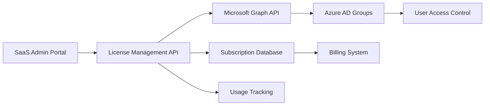

# How to Build a SaaS License Management System with Azure AD Groups and Graph API

Author: [nawazdhandala](https://www.github.com/nawazdhandala)

Tags: Azure AD, Graph API, SaaS, License Management, Group Management, Microsoft Graph, Subscription Management

Description: Build a SaaS license management system using Azure AD groups for access control and Microsoft Graph API for automated user and license management.

---

SaaS applications need a way to manage who has access and what features they can use. A customer buys 50 seats on your Professional plan. Their IT admin needs to assign those seats to specific employees. When someone leaves the company, that seat should be freed up. When the customer upgrades to Enterprise, everyone should get the new features immediately.

Azure AD groups provide a natural mechanism for this. Each license tier maps to a group. Membership in the group grants access to the corresponding features. Microsoft Graph API lets you manage these groups programmatically. In this guide, I will build a complete license management system on top of this foundation.

## Architecture



The admin portal is where customers manage their licenses. The license management API handles business logic and communicates with Azure AD through Graph API. Azure AD groups control access in your application. A subscription database tracks plans, seat counts, and billing information.

## Step 1 - Design the Group Structure

Map your SaaS tiers to Azure AD groups. When a customer subscribes, your system creates groups in their tenant (or yours, depending on your architecture).

For a multi-tenant SaaS, create groups in your own tenant and add external users.

```python
import requests
import os

GRAPH_API_URL = "https://graph.microsoft.com/v1.0"

def get_graph_token():
    """Get an access token for Microsoft Graph using client credentials."""
    url = f"https://login.microsoftonline.com/{os.environ['TENANT_ID']}/oauth2/v2.0/token"
    payload = {
        "client_id": os.environ["CLIENT_ID"],
        "client_secret": os.environ["CLIENT_SECRET"],
        "scope": "https://graph.microsoft.com/.default",
        "grant_type": "client_credentials"
    }
    response = requests.post(url, data=payload)
    return response.json()["access_token"]

def create_license_groups(customer_id: str, customer_name: str) -> dict:
    """Create Azure AD groups for a new customer's license tiers."""
    token = get_graph_token()
    headers = {
        "Authorization": f"Bearer {token}",
        "Content-Type": "application/json"
    }

    groups = {}
    tiers = ["free", "professional", "enterprise"]

    for tier in tiers:
        group_payload = {
            "displayName": f"{customer_name} - {tier.capitalize()} License",
            "description": f"{tier.capitalize()} tier access for {customer_name}",
            "mailEnabled": False,
            "mailNickname": f"{customer_id}-{tier}",
            "securityEnabled": True,
            "groupTypes": []
        }

        response = requests.post(
            f"{GRAPH_API_URL}/groups",
            headers=headers,
            json=group_payload
        )

        if response.status_code == 201:
            group = response.json()
            groups[tier] = {
                "groupId": group["id"],
                "displayName": group["displayName"]
            }
            print(f"Created group: {group['displayName']} ({group['id']})")

    return groups
```

## Step 2 - Build the License Assignment API

The license API handles seat assignment, removal, and validation. It checks seat limits before adding users and updates the subscription database.

```python
import azure.functions as func
import json
from datetime import datetime

app = func.FunctionApp()

@app.route(route="licenses/assign", methods=["POST"])
def assign_license(req: func.HttpRequest) -> func.HttpResponse:
    """Assign a license seat to a user."""
    body = req.get_json()
    customer_id = body["customerId"]
    user_email = body["userEmail"]
    tier = body["tier"]

    # Verify the customer has available seats
    subscription = get_subscription(customer_id)
    if not subscription:
        return error_response("Customer not found", 404)

    current_seats = count_assigned_seats(customer_id, tier)
    max_seats = subscription["tiers"][tier]["maxSeats"]

    if current_seats >= max_seats:
        return error_response(
            f"No available seats. {current_seats}/{max_seats} seats assigned. "
            f"Purchase additional seats to add more users.",
            400
        )

    # Look up the user in Azure AD
    token = get_graph_token()
    user = find_user_by_email(token, user_email)

    if not user:
        # If the user does not exist in your tenant, invite them as a guest
        user = invite_guest_user(token, user_email)

    # Add the user to the license group
    group_id = subscription["tiers"][tier]["groupId"]
    success = add_user_to_group(token, group_id, user["id"])

    if not success:
        return error_response("Failed to assign license", 500)

    # Record the assignment in your database
    record_license_assignment(customer_id, user["id"], user_email, tier)

    return func.HttpResponse(
        json.dumps({
            "success": True,
            "userEmail": user_email,
            "tier": tier,
            "seatsUsed": current_seats + 1,
            "seatsTotal": max_seats
        }),
        status_code=200,
        mimetype="application/json"
    )

@app.route(route="licenses/revoke", methods=["POST"])
def revoke_license(req: func.HttpRequest) -> func.HttpResponse:
    """Remove a license seat from a user."""
    body = req.get_json()
    customer_id = body["customerId"]
    user_email = body["userEmail"]
    tier = body["tier"]

    subscription = get_subscription(customer_id)
    if not subscription:
        return error_response("Customer not found", 404)

    # Find the user
    token = get_graph_token()
    user = find_user_by_email(token, user_email)

    if not user:
        return error_response("User not found", 404)

    # Remove from the license group
    group_id = subscription["tiers"][tier]["groupId"]
    remove_user_from_group(token, group_id, user["id"])

    # Update the database
    remove_license_assignment(customer_id, user["id"], tier)

    return func.HttpResponse(
        json.dumps({
            "success": True,
            "userEmail": user_email,
            "tier": tier,
            "seatsUsed": count_assigned_seats(customer_id, tier),
            "seatsTotal": subscription["tiers"][tier]["maxSeats"]
        }),
        status_code=200,
        mimetype="application/json"
    )

def error_response(message: str, status: int) -> func.HttpResponse:
    return func.HttpResponse(
        json.dumps({"error": message}),
        status_code=status,
        mimetype="application/json"
    )
```

## Step 3 - Implement Graph API Operations

Here are the Graph API wrapper functions for managing group membership.

```python
def find_user_by_email(token: str, email: str) -> dict:
    """Find a user in Azure AD by their email address."""
    headers = {"Authorization": f"Bearer {token}"}

    # Search in both regular users and guest users
    response = requests.get(
        f"{GRAPH_API_URL}/users?$filter=mail eq '{email}' or "
        f"userPrincipalName eq '{email}' or "
        f"otherMails/any(m:m eq '{email}')",
        headers=headers
    )

    users = response.json().get("value", [])
    return users[0] if users else None

def invite_guest_user(token: str, email: str) -> dict:
    """Invite an external user as a guest in your Azure AD tenant."""
    headers = {
        "Authorization": f"Bearer {token}",
        "Content-Type": "application/json"
    }

    payload = {
        "invitedUserEmailAddress": email,
        "inviteRedirectUrl": "https://app.mysaas.com/welcome",
        "sendInvitationMessage": True,
        "invitedUserMessageInfo": {
            "customizedMessageBody": "You have been granted access to our SaaS platform. Click the link below to get started."
        }
    }

    response = requests.post(
        f"{GRAPH_API_URL}/invitations",
        headers=headers,
        json=payload
    )

    if response.status_code == 201:
        invitation = response.json()
        return {
            "id": invitation["invitedUser"]["id"],
            "email": email,
            "status": "invited"
        }
    return None

def add_user_to_group(token: str, group_id: str, user_id: str) -> bool:
    """Add a user to an Azure AD group."""
    headers = {
        "Authorization": f"Bearer {token}",
        "Content-Type": "application/json"
    }

    payload = {
        "@odata.id": f"{GRAPH_API_URL}/directoryObjects/{user_id}"
    }

    response = requests.post(
        f"{GRAPH_API_URL}/groups/{group_id}/members/$ref",
        headers=headers,
        json=payload
    )

    # 204 = success, 400 with "already exists" = also fine
    return response.status_code in [204, 400]

def remove_user_from_group(token: str, group_id: str, user_id: str) -> bool:
    """Remove a user from an Azure AD group."""
    headers = {"Authorization": f"Bearer {token}"}

    response = requests.delete(
        f"{GRAPH_API_URL}/groups/{group_id}/members/{user_id}/$ref",
        headers=headers
    )

    return response.status_code == 204

def get_group_members(token: str, group_id: str) -> list:
    """List all members of an Azure AD group."""
    headers = {"Authorization": f"Bearer {token}"}
    members = []
    url = f"{GRAPH_API_URL}/groups/{group_id}/members?$select=id,displayName,mail,userPrincipalName"

    while url:
        response = requests.get(url, headers=headers)
        data = response.json()
        members.extend(data.get("value", []))
        url = data.get("@odata.nextLink")  # Handle pagination

    return members
```

## Step 4 - Check Licenses in Your Application

When a user authenticates and accesses your SaaS application, check their group membership to determine their license tier.

```python
def get_user_license_tier(token: str, user_id: str, customer_id: str) -> str:
    """Determine the user's license tier based on group membership."""
    headers = {"Authorization": f"Bearer {token}"}

    # Get all groups the user belongs to
    response = requests.get(
        f"{GRAPH_API_URL}/users/{user_id}/memberOf?$select=id,displayName",
        headers=headers
    )

    user_groups = {g["id"] for g in response.json().get("value", [])}

    # Check against the customer's license groups (highest tier wins)
    subscription = get_subscription(customer_id)
    tier_priority = ["enterprise", "professional", "free"]

    for tier in tier_priority:
        group_id = subscription["tiers"].get(tier, {}).get("groupId")
        if group_id and group_id in user_groups:
            return tier

    return "none"  # User has no license

# Middleware for your web application
def require_license(min_tier: str):
    """Middleware that checks if the user has the required license tier."""
    tier_levels = {"none": 0, "free": 1, "professional": 2, "enterprise": 3}

    def decorator(f):
        def wrapper(req, *args, **kwargs):
            user = req.session.get("user")
            if not user:
                return redirect("/auth/login")

            user_tier = get_user_license_tier(
                get_graph_token(),
                user["id"],
                user["customerId"]
            )

            if tier_levels.get(user_tier, 0) < tier_levels.get(min_tier, 0):
                return error_response(
                    f"This feature requires a {min_tier} license or higher",
                    403
                )

            req.user_tier = user_tier
            return f(req, *args, **kwargs)
        return wrapper
    return decorator
```

## Step 5 - Build the Admin Dashboard

The customer admin portal shows seat usage and allows seat assignment.

```python
@app.route(route="licenses/dashboard/{customer_id}", methods=["GET"])
def license_dashboard(req: func.HttpRequest) -> func.HttpResponse:
    """Get license usage dashboard data for a customer."""
    customer_id = req.route_params.get("customer_id")
    subscription = get_subscription(customer_id)
    token = get_graph_token()

    dashboard = {
        "customerId": customer_id,
        "plan": subscription["planName"],
        "tiers": {}
    }

    for tier, config in subscription["tiers"].items():
        members = get_group_members(token, config["groupId"])
        dashboard["tiers"][tier] = {
            "maxSeats": config["maxSeats"],
            "usedSeats": len(members),
            "availableSeats": config["maxSeats"] - len(members),
            "users": [
                {
                    "id": m["id"],
                    "name": m.get("displayName", ""),
                    "email": m.get("mail") or m.get("userPrincipalName", "")
                }
                for m in members
            ]
        }

    return func.HttpResponse(
        json.dumps(dashboard),
        status_code=200,
        mimetype="application/json"
    )
```

## Handling Plan Changes

When a customer upgrades or downgrades their plan, you need to adjust the seat counts and potentially migrate users between groups.

```python
def handle_plan_change(customer_id: str, new_plan: str):
    """Process a plan change for a customer."""
    subscription = get_subscription(customer_id)
    new_plan_config = get_plan_config(new_plan)

    # Update seat limits
    for tier, config in new_plan_config["tiers"].items():
        current_seats = count_assigned_seats(customer_id, tier)
        new_max = config["maxSeats"]

        if current_seats > new_max:
            # Downgrade: need to remove excess users
            # Notify the admin to choose which users to remove
            notify_admin_seat_reduction(customer_id, tier, current_seats, new_max)

    # Update the subscription in the database
    update_subscription(customer_id, new_plan, new_plan_config)
```

## Wrapping Up

Azure AD groups combined with Microsoft Graph API provide a robust foundation for SaaS license management. Groups handle the access control natively - your application just needs to check group membership. Graph API gives you full programmatic control over user and group operations. The subscription database tracks business logic like seat limits and plan details. This approach integrates naturally with Azure AD's identity ecosystem, so customers who already manage their users through Azure AD get a seamless experience. Their IT admin assigns licenses through your portal, and Azure AD handles the rest.
