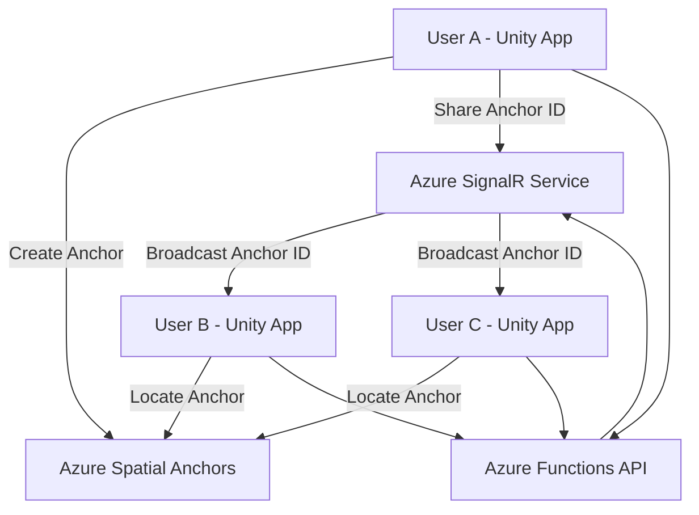

# How to Build a Shared Augmented Reality Experience with Azure Spatial Anchors and Unity

Author: [nawazdhandala](https://www.github.com/nawazdhandala)

Tags: Azure, Spatial Anchors, Unity, Augmented Reality, Mixed Reality, Multiplayer, HoloLens

Description: Build a shared augmented reality experience where multiple users see the same virtual objects using Azure Spatial Anchors and Unity.

---

Individual augmented reality is impressive, but shared AR is where things get genuinely useful. Imagine two engineers looking at the same piece of equipment, both seeing the same holographic annotations in the same positions. Or a group of architects walking through a building site, all viewing the same 3D model overlaid on the physical space. Azure Spatial Anchors combined with Unity makes this possible without building a spatial computing system from scratch.

This guide walks through building a shared AR experience where one user places virtual objects in the real world and other users see those objects in the exact same positions.

## Architecture Overview

A shared AR experience has three main components:

1. **Azure Spatial Anchors** - Stores spatial reference points in the cloud with environmental data.
2. **A shared backend** - Coordinates anchor IDs and application state between users (we will use Azure SignalR for real-time messaging).
3. **Unity client app** - Runs on each user's device, handles AR rendering and spatial anchor operations.



## Prerequisites

- Unity 2020.3 LTS or later.
- AR Foundation 4.x package installed in Unity.
- Azure Spatial Anchors Unity SDK packages.
- An Azure Spatial Anchors account.
- An Azure SignalR Service instance (free tier works for development).
- An Azure Functions app for the API backend.
- Physical AR-capable devices (two or more for testing shared experiences).

## Step 1: Set Up the Azure Backend

Before writing Unity code, set up the services that coordinate the shared experience.

### Create the SignalR Service

```bash
# Create a SignalR Service for real-time communication between clients
az signalr create \
  --resource-group myResourceGroup \
  --name mySharedArSignalR \
  --sku Free_F1 \
  --service-mode Serverless \
  --location eastus
```

The serverless mode is important here - it lets Azure Functions act as the hub, which simplifies the architecture.

### Create the API Functions

Create an Azure Functions project that serves as the coordination layer. You need two functions: one for clients to post anchor information and one for SignalR negotiation.

```javascript
// api/negotiate/index.js
// Returns SignalR connection info for clients to establish real-time connections
module.exports = async function (context, req, connectionInfo) {
  context.res = {
    body: connectionInfo
  };
};
```

The negotiate function's `function.json` binds to SignalR.

```json
{
  "bindings": [
    {
      "authLevel": "anonymous",
      "type": "httpTrigger",
      "direction": "in",
      "name": "req",
      "methods": ["post"]
    },
    {
      "type": "signalRConnectionInfo",
      "name": "connectionInfo",
      "hubName": "sharedAr",
      "direction": "in"
    },
    {
      "type": "http",
      "direction": "out",
      "name": "res"
    }
  ]
}
```

Next, create a function that broadcasts anchor information to all connected clients.

```javascript
// api/share-anchor/index.js
// Receives an anchor ID from one client and broadcasts it to all other clients
module.exports = async function (context, req) {
  const { anchorId, objectType, userId } = req.body;

  if (!anchorId || !objectType) {
    context.res = { status: 400, body: 'Missing anchorId or objectType' };
    return;
  }

  // Send the anchor info to all connected SignalR clients
  context.bindings.signalRMessages = [{
    target: 'anchorShared',
    arguments: [{
      anchorId: anchorId,
      objectType: objectType,
      sharedBy: userId,
      timestamp: new Date().toISOString()
    }]
  }];

  context.res = { status: 200, body: { success: true } };
};
```

## Step 2: Build the Unity Shared Session Manager

Create a Unity script that manages the shared AR session. This script handles both creating anchors (for the host) and locating anchors (for guests).

```csharp
// SharedArManager.cs
// Coordinates shared AR experiences between multiple devices
using Microsoft.Azure.SpatialAnchors;
using Microsoft.Azure.SpatialAnchors.Unity;
using Microsoft.AspNetCore.SignalR.Client;
using UnityEngine;
using System.Threading.Tasks;
using System.Collections.Generic;

public class SharedArManager : MonoBehaviour
{
    // Prefabs for different virtual objects that can be placed
    public GameObject cubePrefab;
    public GameObject arrowPrefab;
    public GameObject infoPanelPrefab;

    // Azure configuration
    private string spatialAnchorsAccountId = "your-account-id";
    private string spatialAnchorsAccountKey = "your-account-key";
    private string spatialAnchorsAccountDomain = "your-domain.mixedreality.azure.com";
    private string apiBaseUrl = "https://your-functions-app.azurewebsites.net/api";

    private CloudSpatialAnchorSession cloudSession;
    private HubConnection signalRConnection;
    private Dictionary<string, GameObject> placedObjects = new Dictionary<string, GameObject>();

    async void Start()
    {
        InitializeSpatialAnchorsSession();
        await ConnectToSignalR();
    }

    // Set up the Azure Spatial Anchors cloud session
    private void InitializeSpatialAnchorsSession()
    {
        cloudSession = new CloudSpatialAnchorSession();
        cloudSession.Configuration.AccountId = spatialAnchorsAccountId;
        cloudSession.Configuration.AccountKey = spatialAnchorsAccountKey;
        cloudSession.Configuration.AccountDomain = spatialAnchorsAccountDomain;

        cloudSession.AnchorLocated += OnAnchorLocated;
        cloudSession.SessionUpdated += OnSessionUpdated;
        cloudSession.Error += (sender, args) =>
            Debug.LogError($"Spatial Anchors error: {args.ErrorMessage}");

        cloudSession.Start();
        Debug.Log("Spatial Anchors session initialized.");
    }

    // Connect to SignalR for real-time anchor sharing
    private async Task ConnectToSignalR()
    {
        signalRConnection = new HubConnectionBuilder()
            .WithUrl($"{apiBaseUrl}/negotiate")
            .Build();

        // Listen for anchors shared by other users
        signalRConnection.On<AnchorMessage>("anchorShared", (message) =>
        {
            Debug.Log($"Received shared anchor: {message.anchorId} ({message.objectType})");
            LocateSharedAnchor(message.anchorId, message.objectType);
        });

        await signalRConnection.StartAsync();
        Debug.Log("Connected to SignalR hub.");
    }

    private void OnSessionUpdated(object sender, SessionUpdatedEventArgs args)
    {
        float progress = args.Status.ReadyForCreateProgress;
        // Update UI to show scanning progress
    }

    void OnDestroy()
    {
        cloudSession?.Stop();
        cloudSession?.Dispose();
        signalRConnection?.DisposeAsync();
    }
}
```

## Step 3: Implement Anchor Placement

When a user taps to place an object, create a spatial anchor at that position and share it.

```csharp
// Called when the user taps to place a virtual object in the scene
public async void PlaceObject(Vector3 position, Quaternion rotation, string objectType)
{
    // Select the correct prefab based on the object type
    GameObject prefab = objectType switch
    {
        "cube" => cubePrefab,
        "arrow" => arrowPrefab,
        "info" => infoPanelPrefab,
        _ => cubePrefab
    };

    // Instantiate the visual object at the tapped location
    GameObject placedObject = Instantiate(prefab, position, rotation);

    // Add a native AR anchor to the object
    placedObject.AddARAnchor();

    // Create a cloud anchor wrapping the native one
    CloudSpatialAnchor cloudAnchor = new CloudSpatialAnchor();
    cloudAnchor.LocalAnchor = placedObject.FindNativeAnchor().GetPointer();
    cloudAnchor.AppProperties["objectType"] = objectType;
    cloudAnchor.Expiration = System.DateTimeOffset.Now.AddHours(24);

    // Wait for sufficient spatial data
    Debug.Log("Scanning environment for anchor creation...");
    while (true)
    {
        var status = await cloudSession.GetSessionStatusAsync();
        if (status.ReadyForCreateProgress >= 1.0f) break;
        await Task.Delay(300);
    }

    // Save to the cloud
    await cloudSession.CreateAnchorAsync(cloudAnchor);
    string anchorId = cloudAnchor.Identifier;
    Debug.Log($"Anchor created: {anchorId}");

    // Track locally
    placedObjects[anchorId] = placedObject;

    // Share with other users through the API
    await ShareAnchor(anchorId, objectType);
}

// Sends the anchor ID to the backend for broadcasting to other clients
private async Task ShareAnchor(string anchorId, string objectType)
{
    var payload = new
    {
        anchorId = anchorId,
        objectType = objectType,
        userId = SystemInfo.deviceUniqueIdentifier
    };

    string json = JsonUtility.ToJson(payload);
    using var client = new System.Net.Http.HttpClient();
    var content = new System.Net.Http.StringContent(
        json,
        System.Text.Encoding.UTF8,
        "application/json"
    );

    await client.PostAsync($"{apiBaseUrl}/share-anchor", content);
    Debug.Log("Anchor shared with other users.");
}
```

## Step 4: Implement Anchor Discovery

When a user receives a shared anchor ID, they need to locate it in their own physical space.

```csharp
// Searches for a shared anchor in the local environment
private void LocateSharedAnchor(string anchorId, string objectType)
{
    // Store the object type so we know what to render when found
    pendingAnchors[anchorId] = objectType;

    AnchorLocateCriteria criteria = new AnchorLocateCriteria();
    criteria.Identifiers = new string[] { anchorId };
    criteria.Strategy = LocateStrategy.AnyStrategy;

    cloudSession.CreateWatcher(criteria);
}

private Dictionary<string, string> pendingAnchors = new Dictionary<string, string>();

// Called by the SDK when a shared anchor is located in the local environment
private void OnAnchorLocated(object sender, AnchorLocatedEventArgs args)
{
    if (args.Status != LocateAnchorStatus.Located) return;

    CloudSpatialAnchor anchor = args.Anchor;
    string objectType = anchor.AppProperties.ContainsKey("objectType")
        ? anchor.AppProperties["objectType"]
        : "cube";

    // Must run on the Unity main thread for rendering
    UnityDispatcher.InvokeOnAppThread(() =>
    {
        Pose pose = anchor.GetPose();

        // Select the right prefab
        GameObject prefab = objectType switch
        {
            "cube" => cubePrefab,
            "arrow" => arrowPrefab,
            "info" => infoPanelPrefab,
            _ => cubePrefab
        };

        // Place the object at the anchor's location
        GameObject obj = Instantiate(prefab, pose.position, pose.rotation);
        placedObjects[anchor.Identifier] = obj;

        Debug.Log($"Shared anchor located and rendered: {anchor.Identifier}");
    });
}
```

## Step 5: Handle Session Lifecycle

In a real application, you need to manage what happens when users join or leave the session.

```csharp
// Loads all existing anchors when a new user joins the session
public async void OnUserJoinedSession()
{
    // Fetch all active anchor IDs from the backend
    using var client = new System.Net.Http.HttpClient();
    var response = await client.GetAsync($"{apiBaseUrl}/get-active-anchors");
    var json = await response.Content.ReadAsStringAsync();
    var anchors = JsonUtility.FromJson<AnchorList>(json);

    // Locate each anchor in the physical space
    if (anchors.items.Length > 0)
    {
        AnchorLocateCriteria criteria = new AnchorLocateCriteria();
        criteria.Identifiers = anchors.items;
        criteria.Strategy = LocateStrategy.AnyStrategy;

        cloudSession.CreateWatcher(criteria);
        Debug.Log($"Searching for {anchors.items.Length} existing anchors...");
    }
}
```

## Tips for a Good Shared Experience

**Visual scanning feedback**: Show users a scanning animation or progress indicator while the device collects spatial data. People need to understand why they should look around.

**Network latency**: Anchor creation and localization are not instant. Show loading states so users know something is happening.

**Physical proximity**: All users must be in the same physical space for shared anchors to work. The SDK cannot teleport spatial data across different locations.

**Lighting consistency**: Anchor localization works best when lighting conditions are similar to when the anchor was created. Dramatic lighting changes can cause localization failures.

**Error recovery**: If anchor localization fails, prompt users to move closer to where the anchor should be and scan more of the environment. Sometimes a slightly different angle provides the visual features the SDK needs.

## Summary

Building a shared AR experience with Azure Spatial Anchors and Unity involves three layers: the spatial anchor service for persistent 3D reference points, a real-time messaging layer for coordinating between devices, and the Unity client that handles rendering and user interaction. The pattern is consistent - one device creates and shares, others discover and render. With the infrastructure handling the hard parts of spatial computing, you can focus on building experiences that actually matter to your users.
